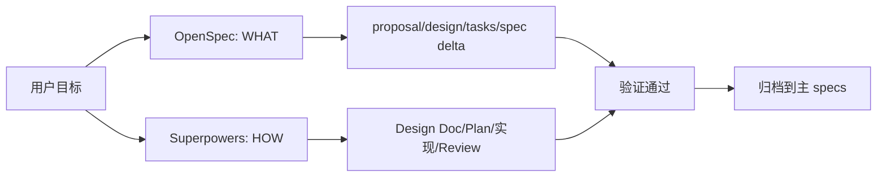
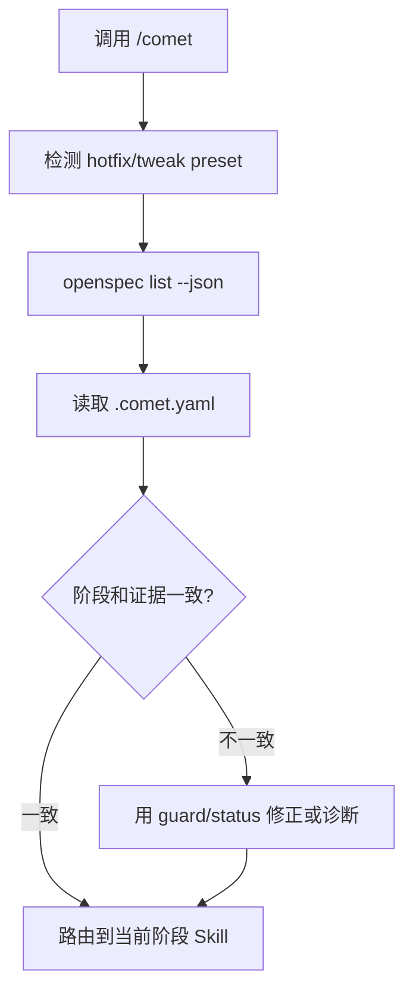

`/comet` 是 Comet 的经典 Spec 模式入口。它把一次变更拆成五个阶段：open、design、build、verify、archive。

## 双星模型

OpenSpec 记录需求和规格。Superpowers 组织设计、计划、执行和验证。Comet 负责阶段判定、状态守卫和恢复。

## 五个阶段

| 阶段 | 目标 | 主要产物 |
| --- | --- | --- |
| open | 把想法变成 OpenSpec change | `proposal.md`、`design.md`、`tasks.md`、delta spec |
| design | 做深度技术设计 | `docs/superpowers/specs/...-design.md` |
| build | 写计划并执行 | `docs/superpowers/plans/...md`、代码改动、测试证据 |
| verify | 验证实现符合设计和 spec | 验证报告、分支处理结果 |
| archive | 合并 delta spec 并归档 | `openspec/changes/archive/YYYY-MM-DD-name/` |

## 自动检测怎么工作

每次调用 `/comet`，Comet 都会重新读取活跃 change 和 `.comet.yaml`，而不是依赖聊天历史。

## 用户会在哪些地方参与

Comet 会自动推进无歧义阶段，但不会替你做产品或风险决策。常见阻塞点包括：

- open 阶段确认 proposal、design 和 tasks。
- design 阶段确认方案。
- build 阶段选择隔离方式和执行方式。
- verify 失败后选择修复或接受偏差。
- archive 前做最终确认。
- hotfix/tweak 命中升级信号时选择继续轻量路径或升级 full。

## 轻量预设

`/comet-hotfix` 和 `/comet-tweak` 跳过完整 brainstorming，但仍保留 OpenSpec 状态、验证和归档。它们适合范围明确的小改动。出现跨模块协调、新 public API、schema 变更或深层架构问题时，应升级到 full。
