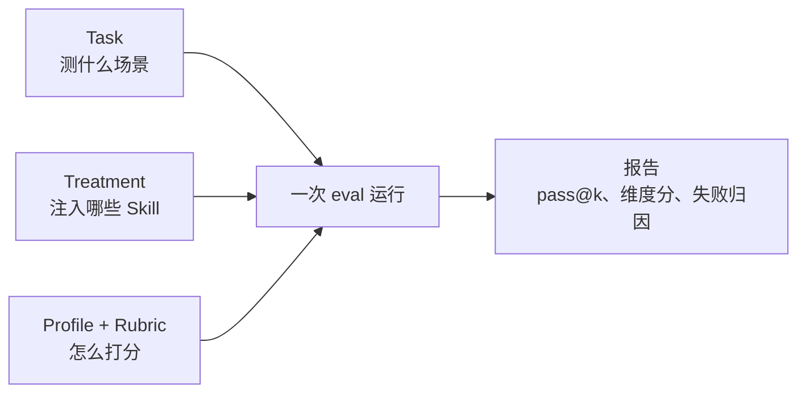
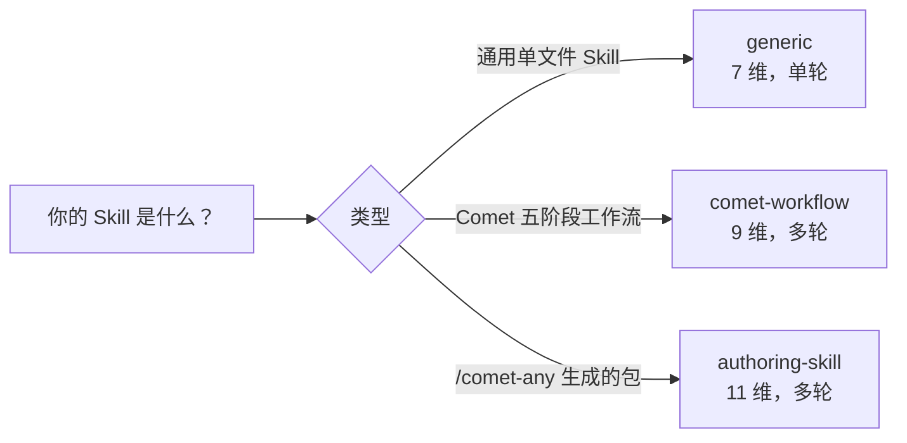
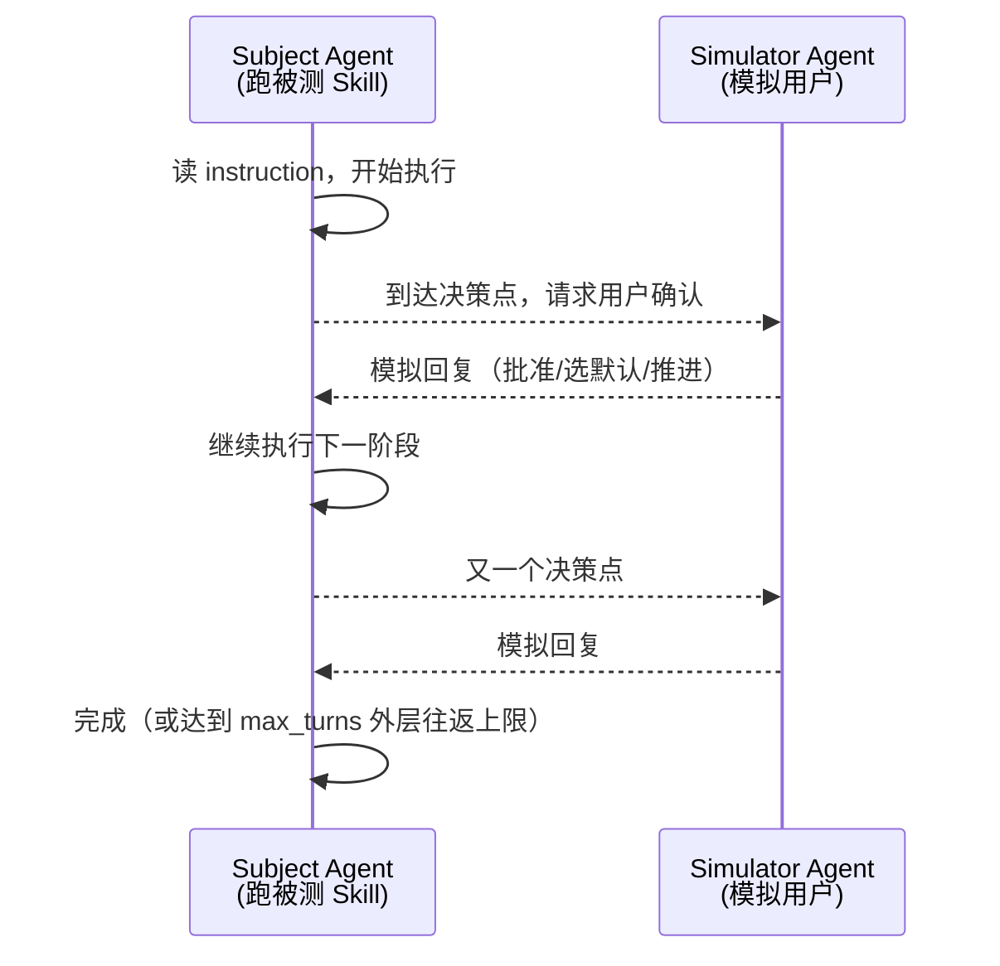

`comet eval` 开箱即用就能评测内置任务和任意本地 Skill——评估自己的 Skill 只需要 `comet eval ./your-skill --html` 一条命令（见[快速上手](/zh/eval/quickstart)）。但当你想评测**自己的 Skill 在自己的场景下表现如何**时，就需要自定义 task 了。这篇文章手把手带你走完一遍：从定义一个 task，到配置评估 profile，再到跑出报告。

<Info>
  本文是进阶自定义内容。如果你只是想评估一个已有的 Skill，不需要读本文——直接用 <code>comet eval ./your-skill --html</code> 即可。本文假设你已经能跑通 <code>comet eval ./your-skill --collect</code>。
</Info>

## 本页怎么读

自定义 eval 可以分三层理解。大多数场景先完成 Task，再按需要调整 Profile 或 Treatment。

| 层级 | 你要决定什么 | 必读程度 |
| --- | --- | --- |
| **Task** | 测什么、给 Agent 什么指令、用什么脚本判定通过 | 必读 |
| **Profile** | 用 generic、comet-workflow 还是 authoring-skill 评分 | 常用 |
| **Treatment** | 是否做 A/B 对比、是否加入无 Skill 基线 | 进阶 |

最短路径是：写一个 task 目录，注册到 `index.yaml`，先跑 `--collect`，再跑 `--html`。Profile、Treatment 和 `auto_user` 都可以在第一版 task 跑通后再调整。

## eval 配置的全景

一个完整的 eval 由三部分拼起来，理解它们的分工是自定义的基础：

<p align="center">
  
</p>

<p align="center">Task 决定测什么，Treatment 决定注入什么，Profile 和 Rubric 决定怎么打分</p>



| 配置 | 回答的问题 | 位置 |
| --- | --- | --- |
| **Task** | 测什么场景？要产出什么？怎么验证对了没？ | `local/tasks/<name>/` |
| **Treatment** | 这次跑注入哪些 Skill（含无 Skill 基线）？ | `local/treatments/` |
| **Profile + Rubric** | 按什么维度打分？ | task.toml 的 `[evaluation]` |

下面分别讲清楚。

## 定义一个 Task

每个 task 是 `local/tasks/` 下的一个目录，包含四个文件：

<Tree>
  <Tree.Folder name="local/tasks/my-task/" defaultOpen>
    <Tree.File name="task.toml" />
    <Tree.File name="instruction.md" />
    <Tree.Folder name="environment/" defaultOpen>
      <Tree.File name="Dockerfile" />
    </Tree.Folder>
    <Tree.Folder name="validation/" defaultOpen>
      <Tree.File name="test_my_task.py" />
    </Tree.Folder>
  </Tree.Folder>
</Tree>

<Note>
  Task 目录约定来自 eval harness（<code>eval/</code>），不是你的业务仓库。自定义 task 放在 Comet 仓库的 <code>eval/local/tasks/</code> 下，注册到 <code>eval/local/tasks/index.yaml</code>。
</Note>

### 1. 编写 `task.toml`

`task.toml` 是 task 的核心配置，分四块：

```toml
[metadata]
name = "my-task"
description = "创建一个 markdown 结果文件"
difficulty = "medium"           # easy / medium / hard
category = "generic"            # generic 或 comet
default_treatments = ["CONTROL"]

[environment]
description = "验证环境"
dockerfile = "environment/Dockerfile"
timeout_sec = 600               # Docker 执行超时（秒）

[validation]
test_scripts = ["test_my_task.py"]   # Docker 内运行的验证脚本
target_artifacts = ["result.md"]     # 预期产物（存在性检查）
timeout = 120                        # 验证脚本超时（秒）

[evaluation]
profile = "generic"                       # 评估 profile
expected_artifacts = ["result.md"]        # rubric 检查的产物
required_skills = ["my-skill"]            # 必须调用的 Skill
require_skill_invocation = true           # 未调用时产生硬失败

# 自定义 rubric 标准（传给 LLM judge，可选）
rubric_criteria = [
    "输出包含错误处理",
    "代码遵循项目命名规范",
]

[interaction]
mode = "none"                   # none（单轮）或 auto_user（多轮模拟）
max_turns = 12                  # auto_user 下 subject/simulator 外层往返上限
```

各块的作用：

| 块 | 作用 |
| --- | --- |
| `[metadata]` | task 的身份信息。`category = "comet"` 或名字以 `comet-` 开头会自动推断为 `comet-workflow` profile |
| `[environment]` | 验证跑在什么 Docker 环境里，超时多久 |
| `[validation]` | 用哪些脚本验证、预期哪些产物 |
| `[evaluation]` | 用哪个 profile 打分、必须调用哪些 Skill、自定义评判标准 |
| `[interaction]` | 单轮还是多轮模拟交互 |

#### `[evaluation]` 的关键字段

这几个字段直接决定打分结果，值得单独说明：

| 字段 | 作用 |
| --- | --- |
| `profile` | 选 rubric：`generic`（7 维）/ `comet-workflow`（9 维）/ `authoring-skill`（11 维）。维度细节见[评分指标与双 Agent 评测](/zh/eval/scoring) |
| `expected_artifacts` | rubric 的 `artifact_presence` 维度会检查这些产物是否存在（支持 glob） |
| `required_skills` | 列出必须调用的 Skill；`skill_invocation` 维度据此打分 |
| `require_skill_invocation` | 设为 `true` 时，必需 Skill 未被调用会产生**硬失败**（直接判这次运行不通过） |
| `rubric_criteria` | 自定义评判标准，传给 LLM judge 作为额外维度（`custom_0`、`custom_1`……） |

<Warning>
  <code>require_skill_invocation: true</code> 很有用但要慎用：它要求 agent <strong>真实调用了</strong>指定 Skill（从 Claude Code 事件里读，不是从产物反推）。如果你的 Skill 名写错了或没注入，每次运行都会硬失败。
</Warning>

### 2. 编写 `instruction.md`

这是给 agent 的任务指令，支持 `{run_id}` 等模板变量：

```markdown
在当前工作区创建一个文件 `result.md`。

要求：
- 包含标题 `# My Task Result`
- 描述你的实现思路
- 包含至少三个要点
```

### 3. 编写验证脚本

验证脚本在 Docker 内运行，结果写入 `_test_results.json`。这是"这次运行到底做对没"的判定来源：

```python
from pathlib import Path
from scaffold.python.validation.core import write_test_results

def main():
    passed = []
    failed = []

    # 检查产物是否存在
    result = Path("result.md")
    if not result.exists():
        write_test_results({"passed": [], "failed": ["result.md missing"]})
        return

    text = result.read_text(encoding="utf-8")

    # 检查内容
    if "# My Task Result" in text:
        passed.append("heading present")
    else:
        failed.append("heading missing")

    write_test_results({"passed": passed, "failed": failed})

if __name__ == "__main__":
    main()
```

一次运行"通过"的定义很明确：验证脚本报告的 `failed` 列表为空。`pass@k` 和 `pass^k` 都基于这个判定。

### 4. 编写 Dockerfile

Dockerfile 提供验证所需的运行时和依赖。一个最小例子：

```dockerfile
FROM python:3.11-slim

WORKDIR /workspace
# 安装验证脚本需要的依赖（如果有）
# COPY requirements.txt .
# RUN pip install -r requirements.txt
```

agent 产出的代码和你的验证脚本会在构建好的镜像里运行。

### 5. 注册 task

最后在 `local/tasks/index.yaml` 里登记：

```yaml
tasks:
  - name: my-task
    category: generic
    default_treatments:
      - CONTROL
    description: 我的自定义任务
```

注册后就能用 `--task my-task` 跑它了。

## 配置 Treatment

Treatment 回答"这次跑注入哪些 Skill"。位于 `local/treatments/`：

```yaml
# local/treatments/common/control.yaml
CONTROL:
  description: "无 Skill 基线"
  skills: []

# local/treatments/comet/comet_full_040_beta.yaml
COMET_FULL_040_BETA:
  description: "完整 Comet 工作流"
  skills:
    - name: comet
      skill: 040-beta/comet
      variant: all
      base: benchmarks
```

| Treatment | 含义 |
| --- | --- |
| `CONTROL` | **无 Skill 基线**——不注入任何 Skill，测的是 agent 裸跑的能力下限 |
| `COMET_FULL_040_BETA` | 注入完整 Comet 工作流 Skill 包 |
| 自定义 | 注入你自己的 Skill，用来对比"有 Skill vs 无 Skill" |

<Tip>
  对比实验的标准做法是 <code>CONTROL</code>（无 Skill）vs 你的 Skill treatment。两者的差值就是你的 Skill 带来的增益。
</Tip>

## 选择 Profile

Profile 决定用哪套 rubric 打分。选错了 profile，维度分就没有参考价值：



| Profile | 适合 | 维度数 | 交互模式 |
| --- | --- | --- | --- |
| `generic` | 任意通用 Skill 冒烟 | 7 | `none`（单轮） |
| `comet-workflow` | 经典 `/comet` 五阶段 | 9 | `auto_user`（多轮） |
| `authoring-skill` | `/comet-any` 生成物 | 11 | `auto_user`（多轮） |

<Note>
  Profile 解析优先级：<code>--profile</code> 覆盖 &gt; manifest 的 <code>skill.profile</code> &gt; task 的 <code>evaluation.profile</code> &gt; <code>generic</code>。Comet 类任务（<code>category = "comet"</code>）会自动推断为 <code>comet-workflow</code>。
</Note>

三套 rubric 的维度、权重和检查逻辑见[评分指标与双 Agent 评测](/zh/eval/scoring)。

## 配置 LLM-as-judge

LLM-as-judge 是可选的质量覆盖层。它不会替代规则型 `[RUBRIC]` 分，也不会直接改变 `weighted_score`。它会让一个独立的裁判模型读取本次运行产物，追加 `[RUBRIC-JUDGE]` 分数，帮助你判断规则分没有覆盖到的"产物是否有实质内容"。

适合在这些场景启用：

- 你要评估文档、方案、代码解释、设计稿等难以用脚本完全判断的产物。
- 你已经有基础校验脚本，但想知道产物是不是只有空壳或模板化内容。
- 你要在对比报告里查看规则分和 judge 分之间的差异。

<Info>
  judge 配置和被测 Agent 配置是隔离的。被测 Agent 可以继续使用 <code>ANTHROPIC_MODEL</code>、<code>ANTHROPIC_BASE_URL</code> 和自己的 token；judge 必须显式配置 <code>BENCH_JUDGE_MODEL</code>，避免同一个配置同时扮演"选手"和"裁判"。
</Info>

### 1. 在 `eval/.env` 启用 judge

把 judge 变量写进 Comet 仓库的 `eval/.env`：

```bash
# eval/.env
BENCH_LLM_JUDGE=1
BENCH_JUDGE_MODEL=your-judge-model
```

`BENCH_LLM_JUDGE=1` 是开关；`BENCH_JUDGE_MODEL` 是必填项。只打开开关但不设置模型时，报告会写入 skipped 状态：

```text
[RUBRIC-JUDGE] status: skipped - BENCH_JUDGE_MODEL is required when BENCH_LLM_JUDGE=1
```

### 2. 选择 judge 的认证方式

如果你的本机 `claude` CLI 已经能在宿主机上认证，可以只设置 `BENCH_JUDGE_MODEL`。harness 会在宿主机上调用 `claude` CLI 运行 judge。

如果你想让 judge 使用独立的 Anthropic 兼容代理，配置专用 endpoint 和 token：

```bash
# eval/.env
BENCH_LLM_JUDGE=1
BENCH_JUDGE_MODEL=your-judge-model
BENCH_JUDGE_BASE_URL=https://your-anthropic-compatible-endpoint
BENCH_JUDGE_AUTH_TOKEN=your-judge-token
```

也可以用 API key：

```bash
# eval/.env
BENCH_LLM_JUDGE=1
BENCH_JUDGE_MODEL=your-judge-model
BENCH_JUDGE_BASE_URL=https://your-anthropic-compatible-endpoint
BENCH_JUDGE_API_KEY=your-judge-api-key
```

优先级是：

| 配置 | 行为 |
| --- | --- |
| `BENCH_JUDGE_BASE_URL` + `BENCH_JUDGE_AUTH_TOKEN` | 优先走 Anthropic Messages HTTP；HTTP header 使用 bearer token |
| `BENCH_JUDGE_BASE_URL` + `BENCH_JUDGE_API_KEY` | 优先走 Anthropic Messages HTTP；HTTP header 使用 API key |
| 只设置 `BENCH_JUDGE_MODEL` | 回退到宿主机 `claude` CLI |

<Note>
  如果同时设置 `BENCH_JUDGE_AUTH_TOKEN` 和 `BENCH_JUDGE_API_KEY`，auth token 优先。judge 子进程会清除继承来的主 `ANTHROPIC_*` provider 变量，再映射 `BENCH_JUDGE_*`，所以不要指望它自动复用被测 Agent 的 provider 配置。
</Note>

### 3. 给 generic task 添加自定义 judge 标准

通用 Skill（`generic` / `authoring-skill`）默认会让 judge 输出三个维度：

| 维度 | 判断什么 |
| --- | --- |
| `task_completion` | 是否满足任务要求、产物是否存在且正确、基础校验是否通过 |
| `output_quality` | 产物是否完整、有结构、有实质内容 |
| `instruction_adherence` | 是否遵守指令、约束和工具使用边界 |

如果你的 task 还有特定质量标准，把它们写进 `task.toml` 的 `[evaluation]`：

```toml
[evaluation]
profile = "generic"
expected_artifacts = ["result.md"]
required_skills = ["my-skill"]
require_skill_invocation = true
rubric_criteria = [
  "输出解释了关键取舍，而不是只列步骤",
  "错误处理覆盖输入为空和外部命令失败两种情况",
]
```

这些标准会作为额外 judge 维度输出，名称是 `custom_0`、`custom_1`。它们只影响 `[RUBRIC-JUDGE]` 覆盖层，不替代你的验证脚本。

`comet-workflow` profile 使用另一套 judge 维度：`artifact_quality`、`spec_drift`、`main_flow`。它们用于复核工作流产物深度、spec 是否漂移、五阶段主流程是否完整。

### 4. 运行并确认 judge 生效

先用 `--collect` 确认 task、manifest 和路径都能发现：

```bash
comet eval ./generated-skill/comet/eval.yaml --collect
```

再跑真实评估：

```bash
comet eval ./generated-skill/comet/eval.yaml --html
```

打开 `Report path` 指向的报告，在每次运行的 checks 里查找 `[RUBRIC-JUDGE]` 行。成功时会看到类似：

```text
[RUBRIC-JUDGE] output_quality: 0.75 - cites concrete artifact content
[RUBRIC-JUDGE] instruction_adherence: 1.00 - follows stated constraints
[RUBRIC-JUDGE] status: enabled_and_successful
```

如果只看到 skipped 或 failed，按下面排查：

| 现象 | 常见原因 | 处理 |
| --- | --- | --- |
| `BENCH_JUDGE_MODEL is required` | 开了 `BENCH_LLM_JUDGE=1`，但没设 `BENCH_JUDGE_MODEL` | 补上 `BENCH_JUDGE_MODEL` |
| `(judge error: HTTP ...)` | judge endpoint、token 或模型名不匹配 | 检查 `BENCH_JUDGE_BASE_URL`、token、模型名 |
| 没有 `[RUBRIC-JUDGE]` 行 | 没有启用 `BENCH_LLM_JUDGE=1`，或这次没有跑到 profile rubric | 确认 `eval/.env` 被加载，并先解决前面的 harness/task 失败 |

## 多轮交互：`auto_user` 模式

单轮 task（`mode: none`）只跑一次，适合"给个指令看结果"的简单场景。但工作流类 Skill 需要在**决策点暂停、问用户、拿到回复后继续**——单轮测不了。

`auto_user` 模式解决这个问题：它用**两个 Agent 自动交互**——一个跑被测 Skill（subject），另一个模拟用户在决策点回复（simulator）。



模拟器的行为由提示词文件控制。默认读 `eval/simulator-instruction.md`，你可以用 `BENCH_SIMULATOR_PROMPT_FILE` 指向自己的版本，模拟"更挑剔的用户"或"会要求澄清的用户"：

```bash
export BENCH_SIMULATOR_PROMPT_FILE=my-simulator-prompt.md
```

`max_turns` 控制循环上限（`comet-workflow` 通常 12 次外层往返，`authoring-skill` 通常 8 次外层往返）。它不是被测 Agent 内部消息数或工具调用数；一次外层往返指被测 Agent 到达决策点、用户模拟器回复、被测 Agent 用 `--resume` 继续。命中"完成"信号（如 `archive complete`）会提前结束。

## 一次完整的自定义评估

把上面几步串起来，从零评测自己的 Skill：

```bash
# 1. 定义 task（按上面四文件 + 注册 index.yaml）

# 2. 先 collect 排错，不消耗 token
comet eval --task my-task --collect

# 3. 真正跑（注入你的 Skill treatment）
comet eval --task my-task --treatment MY_SKILL --html

# 4. 看报告
# eval/local/logs/experiments/<experiment-id>/summary.html
```

报告里重点看三件事：

1. **`pass@1` 和 `pass^k`**：能力上限 vs 可靠性下限。详见[评分指标](/zh/eval/scoring#核心指标passk--passk)。
2. **rubric 各维度分**：哪个维度拖了后腿？
3. **失败归因**（`harness`/`workflow`/`task`/`model`）：失败是 Skill 的问题，还是 task/环境的问题？

## 评测 `/comet-any` 生成的包

`/comet-any` 生成的 Skill 包自带 `comet/eval.yaml` manifest，不需要你手写 task.toml。直接用 manifest 跑：

```bash
# 发现预检查
comet eval ./generated-skill/comet/eval.yaml --collect

# 真正评估
comet eval ./generated-skill/comet/eval.yaml --html
```

manifest 会自动选 `authoring-skill` profile、注入推荐任务和质量门禁。manifest 的完整格式见[评估系统概览](/zh/eval/overview#eval-manifest)。

## 下一步

- [评分指标与双 Agent 评测](/zh/eval/scoring) — 三套 rubric 的维度、权重和 pass@k/pass^k
- [评估系统概览](/zh/eval/overview) — manifest 格式、profile 体系和 task 系统
- [comet eval 命令](/zh/cli/eval) — 命令行参数完整参考
