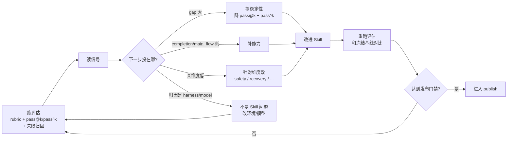

<Info>
  这一页面向希望把评估用起来、并推进到企业生产环境的团队。如果只需跑一次评估，看[快速上手](/zh/eval/quickstart)；想理解评估为什么重要，看[评估：Skill 演进的罗盘](/zh/eval/why-eval)。这一页说明 Comet 如何用评估驱动 Skill 演进，以及"评估模型"和"评估 Skill"的区别。
</Info>

<Warning>
  本页是面向团队和源码维护者的 Eval 进阶内容。复现其中的 harness、追踪和实验流程需要
  拉取 Comet 源码；普通用户不需要了解这些内部细节，请直接看[快速上手](/zh/eval/quickstart)。
</Warning>

## Comet 怎么把评估接入演进闭环

评估只有接入"造 → 评 → 发布"闭环，才能驱动演进。Comet 的做法是把 eval 结果设为发布门禁：没有当前 draft 的 eval 证据、eval 失败、或 eval 证据对应旧 hash，Skill 都不能 publish。

修改 Skill 后，使用同一任务集重新运行评估，并根据以下信号决定下一步：

循环中每个分叉点都由评估信号决定。其中失败归因把每次失败分到四个类别，指明是否应改 Skill：

| 归因 | 含义 | 该改什么 |
| --- | --- | --- |
| `harness` | 评估环境、Docker、路径问题 | 改环境，不是 Skill |
| `workflow` | Skill 执行流程未达预期 | 改 Skill |
| `task` | 任务定义、验证条件问题 | 改任务，不是 Skill |
| `model` | 模型行为、工具使用不稳定 | 换模型或调 prompt |

没有归因机制，团队容易把模型或环境的问题误判为 Skill 问题反复修改。归因让反馈精确指向正确的改进对象。

## 为什么评估 Spec Coding 类 Skill 是新问题

Comet 评估一个多阶段、会在决策点暂停问用户的工作流 Skill，关注它在反复运行中的表现。这个范围超过了“模型会不会写代码”的单项能力评测。这类 Skill 有几个特点，使其与传统纯模型评测不同。

### 多轮交互：Skill 在决策点暂停等用户

五阶段工作流 Skill（`/comet`）不是单轮任务。它会在阶段边界和需要确认的决策点暂停，等待用户输入——方案是否可行、选哪个默认、是否走 hotfix。这带来两个评测约束：

- 单轮评测无法跑完。如果只给任务 prompt 就执行，Skill 会停在第一个决策点，评测无法进入后续阶段。
- 决策点需要应答。决策点依赖用户输入，但人工介入会让评测无法自动化、无法重复。

这是 Spec Coding 类 Skill 评测与传统代码评测的主要区别：评测需要能自动跑完整个多轮交互过程。

### 评测的"成功"包含状态机推进，不只是产物正确

纯模型评测的"成功"通常是代码通过测试。工作流 Skill 的成功还包括：是否按 `open → design → build → verify → archive` 顺序走过阶段、是否在决策点暂停并等待用户、是否保留可恢复状态。这些是流程证据，不能仅从产物文件判断。

### 可靠性比单次能力更重要

工作流 Skill 是用户反复使用的工具。对这类工具，"每次都能做对"（高可靠性）比"偶尔能做对"（高能力上限）重要。Comet 同时使用 `pass@k`（能力上限）和 `pass^k`（可靠性下限），两个指标分别回答不同问题。

## 和 SWE-bench / SWE-bench-Pro 的区别

SWE-bench 家族是代码智能评测的事实标准：给定真实 GitHub issue，看模型能否生成通过测试的 patch。它评测的对象与 Comet eval 评测的对象不同。

| 维度 | SWE-bench / SWE-bench-Pro | Comet eval（评估 Skill） |
| --- | --- | --- |
| 评测对象 | 模型/harness 的代码能力 | Skill 的增量价值（加了 Skill 是否改善） |
| 交互形态 | 单 Agent + 沙箱环境，跑到提交答案 | 多轮交互，Skill 在决策点暂停，需用户（或模拟用户）回复 |
| "成功"的定义 | patch 通过测试 | 产物正确 + 流程证据（阶段顺序、决策点、可恢复状态）|
| 是否关注 Skill 被调用 | 不涉及 | 核心关注：Skill 必须被真实调用并留下证据 |
| 能力 vs 可靠性 | 主要看通过率 | 显式区分 `pass@k`（能力）和 `pass^k`（可靠性）|
| 对比方式 | 绝对通过率 | 有/无 Skill 的增量对比（treatment 体系）|

核心区别在于：SWE-bench 将模型、harness 和增强（augmentation）的效果合并到一个通过率中；而评估 Skill 要回答的是一个对照问题——在同一任务、同一模型上，加上这个 Skill，表现会改善还是下降、幅度多大。这个问题无法用纯模型评测回答。

Comet 用 treatment 体系做有/无 Skill 对照：`CONTROL`（无 Skill 基线）对比 `COMET_FULL`（注入完整 Skill 栈），同一任务、同一隔离环境，唯一变量是 Skill。这样可以单独测量 Skill 的边际效果，避免将模型自身能力计入 Skill 收益。

## 绑定 Skill 的评测，目前还没有金标准

评测模型能力的基准（SWE-bench、HumanEval）已较成熟。但评估"绑定到 Agent 上的 Skill 是否有效"，业界还没有公认的金标准。

学术论文 SkillsBench[1] 针对这个空白，把 Skill 作为直接评测对象，用配对实验（paired evaluation）测量"加 Skill vs 不加 Skill"的增量，并指出：传统的 agent benchmark "measure raw capability in isolation... do not answer the deployment question: will adding this Skill help my agent on this task, and by how much?"

SkillsBench 自身也列出多项未解决问题：仅覆盖终端式、容器化任务；Skill 注入会增加上下文长度，增益可能部分来自更多上下文而非程序性知识；容器化提供状态隔离但并非完全确定；且它没有模拟用户交互、没有使用 pass@k、未采用 LLM-as-judge 打分（坚持确定性测试）。

这个方向目前还处于早期阶段。下面是 Comet 在设计和落地 eval 时面对的具体问题及当前做法。

## Comet eval 面对的开放难题

### 难题一：如何让 Agent 自动模拟用户选择

工作流 Skill 在决策点会暂停等待用户。要让评测无人值守地跑完整条工作流，需要机制来模拟用户应答。

Comet 的做法是双 Agent 自动交互，由两个独立 Agent 角色协作：

| 角色 | 职责 | 会话形态 |
| --- | --- | --- |
| 被测 Agent（subject） | 跑被测 Skill（如 `/comet` 五阶段） | 单一连续会话，每轮用 `--resume` 续接 |
| 用户模拟 Agent（simulator） | 在决策点模拟用户回复 | 每个决策点一次性的无状态调用 |

交互流程为：被测 Agent 跑到决策点 → harness 检测到决策信号（输出中出现 `?`、`confirm`、`choose`、`approve` 等）→ 用户模拟 Agent 读取被测 Agent 的最后一条消息并生成回复（批准合理方案、选择合理默认、仅在有真实歧义时要求澄清）→ 被测 Agent 用 `--resume` 续接 → 继续，直到工作流完成（`archive complete`）或达到往返上限。

用户模拟 Agent 的指令有明确约束：不拒绝、推动工作流前进、不写代码或文件。这使得评测能自动跑完多阶段流程，同时决策点的用户输入保持合理且一致。

源码位置：驱动脚本 `eval/scaffold/shell/run-claude-loop.sh`，模拟器提示词 `eval/simulator-instruction.md` 与 `scaffold/python/profiles.py` 中的 `COMET_SIMULATOR_PROMPT` / `GENERIC_SIMULATOR_PROMPT`。模拟器可自定义（`BENCH_SIMULATOR_PROMPT_FILE`），例如切换为更严格的用户画像做压力测试。

### 难题二：如何用 Agent 做评测（LLM-as-judge）

规则型 rubric 能检测结构性信号（文件是否存在、命令是否执行、Skill 是否被调用），但无法判断产物是否有实质内容——agent 是否做了有意义的设计，还是只生成了占位内容。

Comet 的做法是可选的 LLM-as-judge：由裁判模型读取 workspace 产物后打分。关键在于将主观判断限制在可审计范围内：

- **维度固定**。comet-workflow 的 judge 仅评三个规则较弱的维度（`artifact_quality`、`spec_drift`、`main_flow`），generic/authoring 评 `task_completion` / `output_quality` / `instruction_adherence`。
- **锚定评分标准**。prompt 为每个维度提供明确的 1.0 / 0.5 / 0.0 锚点定义，而非让模型凭印象给分。
- **要求引用证据**。输出格式为 `[RUBRIC-JUDGE] <维度>: <分数> - <原因>`，原因不超过 25 词且需引用具体产物内容。
- **补充而非替代**。judge 分以 `[RUBRIC-JUDGE]` 标识，与规则分的 `[RUBRIC]` 区分，只补充不替代规则分，也不构成硬失败。

SkillsBench 出于确定性，未采用 LLM-as-judge 打分。Comet 的取舍是：确定性测试承担"是否正确"的硬性判定，LLM judge 补充"是否深入"的定性判断，两者分工互补。

源码位置：`eval/scaffold/python/llm_judge.py`（comet-workflow）、`generic_llm_judge.py`（通用）。judge 复用被测 Agent 相同的 `claude` CLI，不引入额外依赖。

### 难题三：如何设计指标

"Skill 是否合格"是模糊问题。指标设计的目标是把模糊分解为可测量、可对比、可归因的信号。Comet 的指标分三层：

| 指标层 | 回答的问题 | 类型 |
| --- | --- | --- |
| 任务校验器（产物存在 + 验证脚本零失败） | 这次是否正确 | 硬性判定（决定 pass/fail）|
| rubric 多维分（7/9/11 维，加权汇总） | 哪里强、哪里弱、差距多少 | 信息性（诊断）|
| pass@k / pass^k | 能否做到 / 能否每次做到 | 信息性（分布）|

分层的理由是：把"是否正确"和"质量高低"分开。一个产出了所有正确文件但包含 `rm -rf` 的 Skill，任务校验器会判通过，但 `safety_boundary` 维度会标低——前者说明能否交付，后者说明能否安全交付。rubric 采用二元检查项而非 0–100 评分（与 SWE-bench、τ-bench 等一致），使分数可复现、可解释。

源码位置：pass@k/pass^k 在 `eval/scaffold/python/pass_at_k.py`，rubric 加权在 `validation/rubric.py`，失败归因在 `attribution.py`。

### 难题四：如何保证实验环境干净

Agent 的行为受初始环境影响：它会探索目录、读取文件，之前留下的状态会改变后续行为。如果每次实验的环境不干净、状态泄漏，评测结果不可复现。

Comet 的做法是为每个任务提供独立的隔离 Docker 容器：

- **每任务独立容器**。每个 task 有自己的 `Dockerfile`，容器以 `--rm` 销毁，宿主机临时目录挂载到容器的 `/workspace`。
- **只读挂载关键脚本**。循环驱动脚本以只读方式挂载（`/opt/scaffold-shell:ro`），Agent 无法修改评测逻辑。
- **非 root 用户**。容器创建专门的 `agent` 用户运行，限制权限。
- **密钥白名单**。仅转发 eval 显式授予的密钥，宿主机其他环境变量不会进入容器。
- **镜像按 hash 缓存**。按 `Dockerfile` + 依赖文件的 hash 缓存镜像，相同环境只构建一次。

源码位置：隔离与挂载逻辑在 `eval/scaffold/shell/docker.sh`，宿主-容器数据通过 `_test_context.json`（入）和 `_test_results.json`（出）两个保留 JSON 文件交换。

### 难题五：如何提高 Skill 被触发的概率

如果模型未调用 Skill，评测的实际上是裸模型而非 Skill。LangChain 的实践文章[2] 指出了这个问题：即使加入提示词要求模型调用 Skill，调用率也仅约 70%。

Comet 通过多层机制确保模型实际使用 Skill：

1. **写入 `CLAUDE.md` 契约**。评测 comet-workflow 时，在容器 workspace 写入强制 `CLAUDE.md`，要求"先调用 `/comet` Skill""用 Skill 工具调用嵌套阶段 Skill""不用纯文字模拟工作流"。`CLAUDE.md` 是始终加载的上下文。
2. **契约同时注入任务 prompt**。触发指令同时出现在系统上下文（CLAUDE.md）和第一条用户消息中。
3. **PreToolUse hook 守护**。将 Skill 自带的 `comet-hook-guard.mjs` 注册为 `Write|Edit|MultiEdit` 前置 hook，每次写文件前运行阶段守卫，使模型持续按 Skill 的阶段逻辑执行。
4. **Skill 调用证据作为硬门禁**。评测从 `stream-json` 输出中解析真实的 `Skill` tool_use 事件来验证调用（不从产物文件名反推）。如果 comet 入口、至少一个嵌套阶段 Skill、OpenSpec 和 Superpowers 依赖 Skill 未全部作为真实工具调用出现，运行判定失败。

这些机制检查 Skill 是否被调用并留下可解析的调用轨迹；缺少调用证据时，评估判定失败。

源码位置：CLAUDE.md 契约在 `eval/local/skills/benchmarks/dependency/claude-md/comet-workflow/CLAUDE.md`，调用证据解析在 `scaffold/python/logging.py` 的 `extract_events`，硬门禁在 `validation/rubric.py` 的 `_score_skill_invocation`。

## 让评估进入企业生产环境

Comet eval 的评估理念参考自 LangChain 的 Evaluating Skills[2]：把 skill 当作 prompt 来测试，用有/无对照、隔离环境、可复现的量化指标和全程可观测来做评估。但要在企业落地，仅本地评估不够。

LangChain 的文章强调，skill 评估需配合 LangSmith 这类可观测与实验平台：既能为每次运行打分，又能捕获 Agent 的每个动作（读取的文件、创建的脚本、调用的 Skill）用于诊断。这是 Comet eval 设计 LangSmith 集成的原因。

Comet 的 LangSmith 集成复用同一套本地任务套件，把评估跑进真实的 LangSmith 环境：

- **复用本地任务**。LangSmith 套件直接复用本地 `local/tasks/` 的任务语料，仅开启 tracing（`LANGSMITH_TRACING=true`、`TRACE_TO_LANGSMITH=true`）。相同的 runner 代码和判定逻辑，运行在企业级可观测平台上。
- **凭证门控**。仅在设置了 `LANGSMITH_API_KEY` 时启用，本地单元测试不受影响。
- **分布式追踪上下文传播**。通过 W3C 风格的 tracing header（`CC_LS_TRACE_ID`、`BENCH_EVAL_BAGGAGE` 等），把 Claude Code 容器内的 LLM 调用、test-script 的 LLM 调用都嵌套到实验的 LangSmith run 之下，形成可下钻的追踪链。
- **双向校验**。除上传数据外，还会校验 Agent 生成的代码是否正确使用 LangSmith 的 `@traceable` / `wrap_openai`，并通过 `client.read_run(trace_id)` 和 `/runs/rules` API 确认 trace 和 evaluator 真实存在。

这使得评估具备进入生产的两项能力：横向对比（在 LangSmith 实验门户中对比多次运行和多个版本）和纵向下钻（查看每次工具调用和 Skill 触发的完整轨迹，定位失败发生的步骤）。

源码位置：LangSmith 套件在 `eval/langsmith/`，tracing 上下文在 `scaffold/python/validation/runner.py`，客户端在 `scaffold/python/utils.py` 的 `get_langsmith_client`。

## 小结

评测模型能力已有较成熟的金标准；评估"绑定到 Agent 上的 Skill 是否有效"目前仍是开放问题。Comet eval 的做法是：

- 把 Skill 评测作为多轮交互问题处理，用双 Agent 自动交互跑完整条工作流，而非单轮执行；
- 把确定性测试和定性判断分工，任务校验器承担硬性判定，LLM judge 补充深度评估；
- 用 pass@k/pass^k 区分能力与可靠性，使演进有明确方向；
- 用 Docker 隔离、只读挂载、密钥白名单保证环境可复现；
- 用 CLAUDE.md 契约和调用证据硬门禁确保 Skill 被真实调用；
- 用 LangSmith 集成把评估接入企业级可观测平台。

这些问题目前都没有被完全解决，SkillsBench 的开放问题清单也说明了这一点。Comet eval 为评估的每个环节提供了可解释、可审计、可复现的工程实现，让评估可以持续运行并驱动 Skill 演进。

## 参考文献

1. Li, X., et al. *SkillsBench: Benchmarking How Well Agent Skills Work Across Diverse Tasks*. arXiv preprint arXiv:2602.12670, 2026. \[[论文链接](https://arxiv.org/abs/2602.12670)\]

2. Xu, R. *Evaluating Skills*. LangChain Blog, 2026-03-05. \[[原文链接](https://www.langchain.com/blog/evaluating-skills)\]

## 下一步

- [评估：Skill 演进的罗盘](/zh/eval/why-eval) — 为什么评估是最优先建立的能力，rubric、pass@k、pass^k 的依据
- [评分指标与双 Agent 评测](/zh/eval/scoring) — rubric 维度细则、双 Agent 交互循环的完整机制
- [Eval harness](/zh/eval/harness) — collect/run 内部机制、环境变量、LangSmith 集成
- [快速上手](/zh/eval/quickstart) — 跑一次评估，看这些指标如何产生
