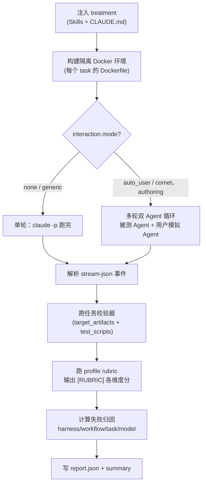

<Tip>
  这是进阶内容。日常评估只需要[快速上手](/zh/eval/quickstart)里的一条命令。这里讲的是
  harness 内部机制，适合排查问题或理解 profile/task 选择。
</Tip>

<Warning>
  本页是 Eval 源码/维护者进阶内容。普通用户不需要 clone Comet 源码、进入 `eval/` 目录或手工
  运行 pytest；直接使用已安装的 `comet eval` 和用户级 `%USERPROFILE%\.comet\eval\\.env` /
  `~/.comet/eval/.env` 即可。只有修改内置 harness、使用 `--project` 或复现底层任务时，才需要拉取源码。
</Warning>

Comet 的 eval harness 随 npm 包按版本分发。直接运行 `comet eval` 时，CLI 默认使用当前 `@rpamis/comet` 包中的 `eval/`。在 Comet 源码仓库开发或需要自定义 harness 时，可以用 `--project <repository-root>` 显式选择该仓库的 `eval/`。`comet eval` 负责启动路径、任务发现、profile、report config 和 quick smoke，无需手工切换目录或组合 pytest 参数。

## harness 定位与故障边界

CLI 会先确认 eval 根目录包含 `pyproject.toml` 和任务入口，再检查 `uv`。哪一步失败就可以直接定位问题：

| 错误                                 | 说明                                                         | 处理                                         |
| ------------------------------------ | ------------------------------------------------------------ | -------------------------------------------- |
| `Eval harness is missing at ...`     | 当前 npm 包不完整，或 `--project` 指向的仓库没有有效 `eval/` | 重新安装 `@rpamis/comet`，或修正 `--project` |
| `uv is not installed or not in PATH` | harness 已找到，但本机缺少 Python 启动工具                   | 安装 `uv` 并确认 PATH                        |

npm 用户不需要另外 clone Comet 仓库来获得 harness；包版本与 harness 版本保持一致。

## harness 目录结构

```text
eval/
├── pyproject.toml          # Python 依赖（pytest、pyyaml、pydantic 等）
├── uv.lock
├── .env / .env.example
├── scaffold/               # 共享 harness 代码
│   ├── python/
│   │   ├── attribution.py      # 失败归因
│   │   ├── logging.py          # ExperimentLogger，summary.md 生成
│   │   ├── manifests.py        # comet/eval.yaml 解析
│   │   ├── profiles.py         # profile 注册表
│   │   ├── report_outputs.py   # 报告配置 + HTML 渲染
│   │   ├── tasks.py            # task.toml 加载
│   │   ├── treatments.py       # treatments YAML 加载
│   │   └── validation/         # rubric 和 Docker 校验器
│   └── shell/
│       ├── docker.sh           # Docker 运行 Claude 的封装
│       └── run-claude-loop.sh  # 多轮 auto_user 驱动
├── local/                  # 本地 suite（不需要 LangSmith 凭证）
│   ├── tasks/              # 任务定义
│   ├── treatments/         # 对照组 / 实验组
│   ├── tests/
│   │   └── tasks/test_tasks.py   # CLI 实际调用的参数化测试
│   └── logs/experiments/   # 内置任务的 harness 日志
├── langsmith/             # LangSmith suite（复用 local 的任务）
└── langfuse/              # Langfuse suite（复用 local 的任务）
```

## 它封装了什么

`comet eval` 在内部做这几件事：

- 固定从 `<project>/eval` 根目录启动 harness（用 `uv run`）
- 把 `--manifest` 或 `--skill-path` 转换成 pytest 参数
- 选择默认 profile（`generic`）和 task；没有 manifest 时按 Skill 快照自动生成并缓存受限任务
- 按需生成临时 report config（`--html` 时）
- 打印一组执行信息，便于定位报告

最终它会根据 `--suite` 调用：

```bash
uv run pytest <suite>/tests/tasks/test_tasks.py [参数]
```

你不需要记住这条命令，`comet eval` 会替你组装。

## collect 和 run

`comet eval` 是单入口命令，通过 `--collect` 区分两个阶段：

| 命令                            | 是否执行模型任务 | 底层差异                      | 用途                                            |
| ------------------------------- | ---------------- | ----------------------------- | ----------------------------------------------- |
| `comet eval <target> --collect` | 否               | 给 pytest 加 `--collect-only` | 验证 manifest、task、profile 和路径，低成本排错 |
| `comet eval <target> --html`    | 是               | 给 pytest 加 `-v`             | 执行真实评估并生成报告                          |

两者共用同一套参数构建逻辑，唯一区别是 collect 加 `--collect-only`，普通执行加 `-v`。`--suite local|langsmith|langfuse` 选择入口；`--report-config`、`--html`、`--quick` 用于真实评估路径。

## skill-path 模式（默认入口）

传一个本地 Skill 目录或 `SKILL.md` 时，`comet eval` 走 skill-path，不需要 `comet/eval.yaml`：

```bash
comet eval ./my-skill --html
```

这是评估任意本地 Skill 的默认入口。传目录时会自动发现 manifest；没有 manifest 时普通运行会从 Skill 快照生成并缓存 2–4 个受限任务，`--quick` 则明确选择 `generic-skill-smoke` 冒烟任务。`--skill-name` 会从目录名自动推断，你也可以用 `--task` 显式指定任务，或用 `--profile` 覆盖 profile。

| 模式                            | 默认 profile                            | 默认 task             | 适合场景                                      |
| ------------------------------- | --------------------------------------- | --------------------- | --------------------------------------------- |
| `--skill-path`（普通运行）      | `generic`                               | 自动生成 2–4 个任务   | 评估自己的 Skill，获得与 Skill 内容相关的任务 |
| `--skill-path --quick`          | `generic`                               | `generic-skill-smoke` | 低成本冒烟                                    |
| `--skill-path`（显式 `--task`） | `generic`                               | 你指定的 task         | 手动指定任务时                                |
| `--manifest`                    | manifest 自带（通常 `authoring-skill`） | `recommended`         | 评估 `/comet-any` 完整包，作发布证据          |

## manifest 模式（评估 /comet-any 完整包）

`--manifest` 适合 `/comet-any` 生成物，或任何带 `comet/eval.yaml` 的 Skill 包：

```bash
comet eval ./generated-skill/comet/eval.yaml --collect
comet eval ./generated-skill/comet/eval.yaml --html
```

manifest 通常由 `/comet-any` 自动生成（不是手写），包含目标 Skill、profile、推荐任务、预期产物和交互配置。Engine-enabled 生成物默认使用 `authoring-skill` profile 和 `authoring-skill-smoke` quick eval。这条路径的结果才是发布 readiness 的有效证据；skill-path 的 `generic-skill-smoke` 只是早期验证，不作为发布证据。

### generated manifest 的 draft hash

manifest 的 `metadata.draftHash` 为 `<current-bundle-hash>` 时，CLI 会定位上层 `bundle.yaml`、计算当前 draft hash，并在系统临时目录写入一份运行时 manifest。Skill source 会解析为稳定绝对路径；评估结束后临时目录会被清理。

原 manifest 和 Bundle 不会被修改。占位值只适用于仍位于 Bundle draft 内的 generated manifest；离开 Bundle 后应使用具体、可验证的 draft hash。

## 执行信息

`comet eval` 在运行前会先打印一组执行信息，让你能定位报告和排查问题：

- `Eval root`：实际从哪个 `eval/` 根目录启动
- `Mode`：`collect` 或 `run`
- `Target`：当前评估的是 manifest 还是本地 Skill 目录
- `Experiment`：本次实验 id
- `Profile`：本次评估使用的 profile
- `Task`：本次评估任务
- `Report path`：报告位置
- `Report config`：启用 `--html` 时使用的临时报告配置

`run` 模式还会额外提示：失败归因会被记录到生成的 eval summary 里，按 harness、workflow、task、model 四个桶分类。

## 报告在哪里、长什么样

### Experiment ID

实际落盘的 experiment id 格式是 `<experiment_name>_<YYYYMMDD_HHMMSS>`，例如 `comet_fix_median_20260620_143000`。experiment name 来自第一个参数化测试的 task name（`-` 转 `_`）。

报告目录：

```text
.comet/eval/runs/<experiment-id>/
  ├── summary.md            # 主报告（总是生成）
  ├── summary.html          # HTML 版（--html 时）
  ├── metadata.json         # experiment 元数据
  ├── events/               # 每次运行的 stream-json 事件
  ├── raw/                  # 原始 stdout/stderr
  ├── reports/              # 每次运行的 report.json
  └── artifacts/            # Agent 产出的文件
```

### summary.md 包含

1. 头部：Experiment ID、开始/完成时间。
2. **Results 表**：每个 treatment 一行，列含 Checks、Turns、Duration、Tools、Tokens、Cost、RubricAvg。
3. **Summary**：总运行数、checks 通过 X/Y（百分比）。
4. **Treatment Details**：每个 treatment 每次运行的详细 metrics、skills invoked、scripts used、通过和失败的 check 列表。

### 每次运行的 report.json

字段包括：`passed`、`checks_passed[]`、`checks_failed[]`、`events_summary`（duration、turns、tool_calls、tokens、cost、files_created、skills_invoked、failure_attribution）。

## 一次评估内部：Docker 隔离 + 双 Agent + rubric

理解这一段能帮你判断评估结果是否可信。`comet eval ... --html` 内部按 `treatment × task × reps` 跑，每次运行：



<p align="center">
  
</p>

<p align="center">
  一次真实评估会在隔离环境里运行 Agent 互动，再用校验器和 rubric 记录证据
</p>

关键点：

- 模型在 **Docker 容器**里运行，和你的工作目录隔离。
- **双 Agent 循环**（`auto_user` 模式）：被测 Agent 跑被测 Skill，每个决策点由**用户模拟 Agent**回复（批准合理方案、选默认、推动前进，永不拒绝、不写代码）。被测 Agent 用 `--resume` 续接同一会话，最多 `max_turns` 次外层往返（comet-workflow 通常 12 次、authoring-skill 通常 8 次），命中"完成"提前结束。这里的 `max_turns` 不是被测 Agent 内部消息数或工具调用数。这让多阶段工作流能**自动跑完整条链**。完整循环和决策点检测见[评分指标与双 Agent 评测](/zh/eval/scoring)。
- **rubric 评分**在校验器之后跑，把结果作为 `[RUBRIC]` 信息性检查追加（comet-workflow rubric 永不产生硬失败；generic/authoring 对特定缺失项产生硬失败）。
- 真正的**通过/失败**由任务校验器（expected artifacts 存在 + test_scripts 通过）决定，rubric 分和 pass@k 是诊断信息。

## 报告输出配置

报告输出由 `ReportOutputConfig` 控制，优先级：

1. `--report-config <path>`（JSON 或 YAML）
2. `COMET_EVAL_REPORT_CONFIG` 环境变量
3. 默认（只 markdown）

配置格式（顶层或嵌套都接受）：

```json
{ "report_outputs": { "markdown": true, "html": false } }
```

`--html` 等价于 `{"markdown": true, "html": true}`，会写一个临时文件传给 pytest。

## 失败归因

报告会帮助区分失败来源。归因逻辑（`attribution.py`）按这个顺序判断每个失败的 check：

| 归因       | 判断条件                                                                               | 下一步                           |
| ---------- | -------------------------------------------------------------------------------------- | -------------------------------- |
| `harness`  | required skill 完全没被调用；或 generic profile 且没 skill 运行                        | 检查依赖、Docker、网络或本地环境 |
| `task`     | check 涉及 artifact path / validator / task directory                                  | 检查 eval 任务定义和 fixture     |
| `workflow` | check 涉及 `.comet.yaml` / guard / state / transition / archive；或 skill 调用契约失败 | 回到 `/comet-any` 优化 Skill     |
| `model`    | 其他默认兜底（任务在可观察的工作流执行后失败）                                         | 重跑或降低对非确定行为的依赖     |

这个归因用于判断下一步应该修 Skill、修 eval 配置，还是重跑环境。详见[读取评估报告](/zh/eval/reports)。

## 环境变量参考

| 变量                                                                                                    | 作用                                                                                                                                   |
| ------------------------------------------------------------------------------------------------------- | -------------------------------------------------------------------------------------------------------------------------------------- |
| `ANTHROPIC_API_KEY` / `ANTHROPIC_AUTH_TOKEN`                                                            | **必需**，两者都没有时 suite 跳过                                                                                                      |
| `BENCH_CC_MODEL`                                                                                        | 覆盖 Claude 模型                                                                                                                       |
| `BENCH_CC_VERSION`                                                                                      | Docker 镜像里的 Claude Code 版本（默认 `latest`）                                                                                      |
| `BENCH_SIMULATOR_PROMPT_FILE`                                                                           | 自定义用户模拟器提示词文件（默认 `eval/simulator-instruction.md`，相对路径从 `eval/` 解析）。`--simulator-prompt` 命令行参数优先级更高 |
| `BENCH_LLM_JUDGE=1`                                                                                     | 启用可选的 LLM-as-judge 覆盖评分                                                                                                       |
| `COMET_EVAL_REPORT_CONFIG`                                                                              | 报告输出配置路径                                                                                                                       |
| `BENCH_SUITE_ROOT` / `BENCH_TASKS_DIR` / `BENCH_TREATMENTS_DIR` / `BENCH_SKILLS_DIR` / `BENCH_LOGS_DIR` | 路径覆盖                                                                                                                               |
| `BENCH_TEST_CONTEXT` / `BENCH_TEST_RESULTS`                                                             | 覆盖 host↔Docker 传输文件名                                                                                                            |

LangSmith suite 额外需要 `LANGSMITH_API_KEY`、`LANGSMITH_TRACING=true`、`TRACE_TO_LANGSMITH=true`。用户入口是 `comet eval <target> --suite langsmith`；不需要手工进入 `eval/langsmith/` 执行 pytest。

Langfuse suite 需要 `LANGFUSE_PUBLIC_KEY` 和 `LANGFUSE_SECRET_KEY`。用户入口是 `comet eval <target> --suite langfuse`；`--collect --suite langfuse` 不初始化 SDK、不联网，也不会下载插件。

### 用 Anthropic 兼容代理认证

当 `ANTHROPIC_API_KEY` 未设置时，Docker 内的 `claude` 改用 **Anthropic 兼容代理**（BigModel / mimo / OpenRouter 等）认证。需要的变量：

| 变量                                                                                                | 作用                      |
| --------------------------------------------------------------------------------------------------- | ------------------------- |
| `ANTHROPIC_AUTH_TOKEN`                                                                              | 代理型认证 token          |
| `ANTHROPIC_BASE_URL`                                                                                | 代理的 Anthropic 兼容端点 |
| `ANTHROPIC_MODEL`                                                                                   | 默认模型                  |
| `ANTHROPIC_DEFAULT_HAIKU_MODEL` / `ANTHROPIC_DEFAULT_SONNET_MODEL` / `ANTHROPIC_DEFAULT_OPUS_MODEL` | 各档位模型映射            |
| `ANTHROPIC_DEFAULT_SONNET_MODEL_NAME` / `ANTHROPIC_DEFAULT_OPUS_MODEL_NAME`                         | 各档位模型显示名          |
| `CLAUDE_CODE_SUBAGENT_MODEL`                                                                        | 子 agent 模型             |

这些变量在自动生成的用户级 `.env` 模板里都有占位项。普通用户编辑
`%USERPROFILE%\.comet\eval\\.env` / `~/.comet/eval/.env` 即可；源码维护者使用
`--project` 时，才需要在对应源码 checkout 中调试 harness 的 `eval/.env`。

### 自定义用户模拟器提示词

`auto_user` 模式评测里，用户模拟 Agent 的指令由一个提示词文件驱动。默认读 `eval/simulator-instruction.md`：

```text
You are simulating a developer user in an automated eval. ...
- Approves the proposed approach / name / plan when asked to confirm
- Picks the most reasonable default option when asked to choose
- Asks for clarification only if the question is truly ambiguous ...
Never refuse; always let the workflow move forward. Do not write code or files.
```

如果你想换一套用户行为（比如更挑剔、会要求澄清更多），把你的版本写到一个文件，再用 `BENCH_SIMULATOR_PROMPT_FILE` 指向它：

```bash
# 用户级 ~/.comet/eval/.env
BENCH_SIMULATOR_PROMPT_FILE=my-simulator-prompt.md
```

相对路径从 `eval/` 解析；文件存在才会被读取。命令行 `--simulator-prompt "..."` 的优先级最高，会覆盖文件内容。详见[评分指标与双 Agent 评测 · 用户模拟 Agent 的指令](/zh/eval/scoring#用户模拟-agent-的指令)。

## 不要把 harness 和 runtime check 混淆

`comet eval` 和 `comet skill check` 名字接近，但用途不同：

- `comet eval`：评估一个 Skill 包或 `comet/eval.yaml`，回答"这个 Skill 作为产品能力能不能通过评估"。
- `comet skill check`：检查某次 Skill 运行是否缺 artifact 或状态，回答"这次运行是否完整"。

详见 [Runtime check](/zh/eval/runtime)。

## 下一步

- [评分指标与双 Agent 评测](/zh/eval/scoring) — rubric 维度细则、pass@k/pass^k、双 Agent 交互循环
- [读取评估报告](/zh/eval/reports) — 学会看懂报告信号和失败归因
- [comet eval 命令](/zh/cli/eval) — 完整选项和子命令参考
- [评估系统概览](/zh/eval/overview) — eval 在流程中的位置和 eval.yaml 格式
