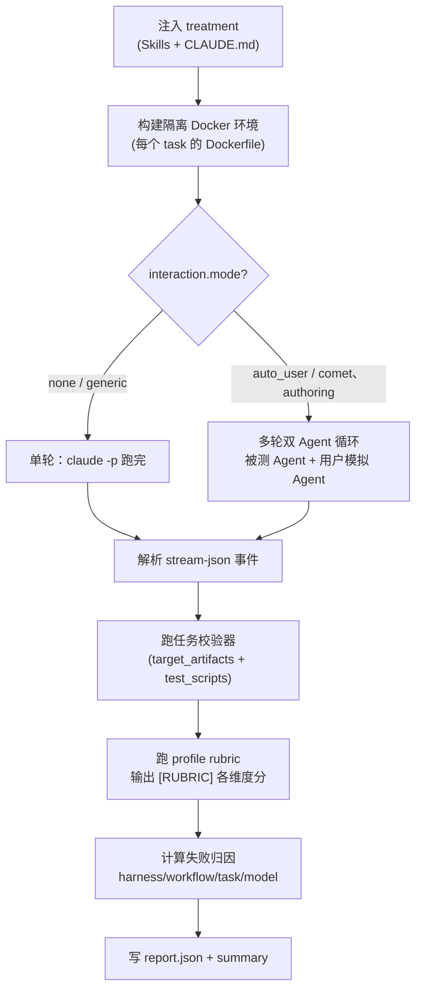

<Info>
  这是进阶内容。日常评估只需要[快速上手](/zh/eval/quickstart)里的两条命令。这里讲的是 harness 内部机制，适合排查问题或理解 profile/task 选择。
</Info>

Comet 的 eval harness 真实位于 Comet 仓库的 `eval/` 目录。`comet eval` 封装了启动路径、任务发现、profile、report config 和 quick smoke，让你不需要手工切目录或拼 pytest 参数。

## harness 目录结构

```text
eval/
├── pyproject.toml          # Python 依赖（pytest、pyyaml、pydantic 等）
├── uv.lock
├── .env / .env.example
├── scaffold/               # 共享 harness 代码
│   ├── python/
│   │   ├── attribution.py      # 失败归因
│   │   ├── logging.py          # ExperimentLogger，summary.md 生成
│   │   ├── manifests.py        # comet/eval.yaml 解析
│   │   ├── profiles.py         # profile 注册表
│   │   ├── report_outputs.py   # 报告配置 + HTML 渲染
│   │   ├── tasks.py            # task.toml 加载
│   │   ├── treatments.py       # treatments YAML 加载
│   │   └── validation/         # rubric 和 Docker 校验器
│   └── shell/
│       ├── docker.sh           # Docker 运行 Claude 的封装
│       └── run-claude-loop.sh  # 多轮 auto_user 驱动
├── local/                  # 本地 suite（不需要 LangSmith 凭证）
│   ├── tasks/              # 任务定义
│   ├── treatments/         # 对照组 / 实验组
│   ├── tests/
│   │   └── tasks/test_tasks.py   # CLI 实际调用的参数化测试
│   └── logs/experiments/   # 输出：报告 + 每次运行的 artifact
└── langsmith/             # LangSmith suite（复用 local 的任务）
```

## 它封装了什么

`comet eval` 在内部做这几件事：

- 固定从 `<project>/eval` 根目录启动 harness（用 `uv run`）
- 把 `--manifest` 或 `--skill-path` 转换成 pytest 参数
- 选择默认 profile（`generic`）或 task（`recommended`、`generic-skill-smoke`）
- 按需生成临时 report config（`--html` 时）
- 打印一组执行信息，便于定位报告

最终它调用的是：

```bash
uv run pytest local/tests/tasks/test_tasks.py [参数]
```

你不需要记住这条命令，`comet eval` 会替你组装。

## collect 和 run

`comet eval` 只有两个子命令，分别对应两个阶段：

| 命令 | 是否执行模型任务 | 底层差异 | 用途 |
| --- | --- | --- | --- |
| `collect` | 否 | 给 pytest 加 `--collect-only` | 验证 manifest、task、profile 和路径，低成本排错 |
| `run` | 是 | 给 pytest 加 `-v` | 执行真实评估并生成报告 |

两者共用同一套参数构建逻辑（`buildEvalArgs`），唯一区别是 collect 加 `--collect-only`，run 加 `-v`。`--report-config`、`--html`、`--quick` 只在 `run` 上暴露。

## manifest 模式

`--manifest` 适合 `/comet-any` 生成物，或任何带 `comet/eval.yaml` 的 Skill 包：

```bash
comet eval collect --manifest ./generated-skill/comet/eval.yaml
comet eval run --manifest ./generated-skill/comet/eval.yaml --html
```

manifest 通常由 `/comet-any` 生成，包含目标 Skill、profile、推荐任务、预期产物和交互配置。Engine-enabled 生成物默认使用 `authoring-skill` profile 和 `authoring-skill-smoke` quick eval。

## skill-path 模式

`--skill-path` 适合还没有 `comet/eval.yaml` 的本地 Skill 目录：

```bash
comet eval run --skill-path ./my-skill --skill-name my-skill --quick
```

它适合早期冒烟。使用 `--skill-path` 时，`--quick` 默认选中 `generic-skill-smoke` task。你也可以用 `--task` 显式指定任务，或用 `--profile` 覆盖 profile。

| 模式 | 默认 profile | 默认 task | 适合场景 |
| --- | --- | --- | --- |
| `--manifest` | manifest 自带（通常 `authoring-skill`） | `recommended` | 发布前评估 |
| `--skill-path --quick` | `generic` | `generic-skill-smoke` | 早期冒烟 |
| `--skill-path`（无 `--quick`） | `generic` | `recommended` | 手动指定任务时 |

## 执行信息

`comet eval` 在运行前会先打印一组执行信息，让你能定位报告和排查问题：

- `Eval root`：实际从哪个 `eval/` 根目录启动
- `Mode`：`collect` 或 `run`
- `Target`：当前评估的是 manifest 还是本地 Skill 目录
- `Experiment`：本次实验 id
- `Profile`：本次评估使用的 profile
- `Task`：本次评估任务
- `Report path`：报告位置
- `Report config`：启用 `--html` 时使用的临时报告配置

`run` 模式还会额外提示：失败归因会被记录到生成的 eval summary 里，按 harness、workflow、task、model 四个桶分类。

## 报告在哪里、长什么样

### Experiment ID

实际落盘的 experiment id 格式是 `<experiment_name>_<YYYYMMDD_HHMMSS>`，例如 `comet_fix_median_20260620_143000`。experiment name 来自第一个参数化测试的 task name（`-` 转 `_`）。

报告目录：

```text
eval/local/logs/experiments/<experiment-id>/
  ├── summary.md            # 主报告（总是生成）
  ├── summary.html          # HTML 版（--html 时）
  ├── metadata.json         # experiment 元数据
  ├── events/               # 每次运行的 stream-json 事件
  ├── raw/                  # 原始 stdout/stderr
  ├── reports/              # 每次运行的 report.json
  └── artifacts/            # Claude 产出的文件
```

### summary.md 包含

1. 头部：Experiment ID、开始/完成时间。
2. **Results 表**：每个 treatment 一行，列含 Checks、Turns、Duration、Tools、Tokens、Cost、RubricAvg。
3. **Summary**：总运行数、checks 通过 X/Y（百分比）。
4. **Treatment Details**：每个 treatment 每次运行的详细 metrics、skills invoked、scripts used、通过和失败的 check 列表。

### 每次运行的 report.json

字段包括：`passed`、`checks_passed[]`、`checks_failed[]`、`events_summary`（duration、turns、tool_calls、tokens、cost、files_created、skills_invoked、failure_attribution）。

## 一次评估内部：Docker 隔离 + 双 Agent + rubric

理解这一段能帮你判断评估结果是否可信。`comet eval run` 内部按 `treatment × task × reps` 跑，每次运行：



关键点：

- 模型在 **Docker 容器**里运行，和你的工作目录隔离。
- **双 Agent 循环**（`auto_user` 模式）：被测 Agent 跑被测 Skill，每个决策点由**用户模拟 Agent**回复（批准合理方案、选默认、推动前进，永不拒绝、不写代码）。被测 Agent 用 `--resume` 续接同一会话，最多 `max_turns` 轮（comet-workflow 12、authoring-skill 8），命中"完成"提前结束。这让多阶段工作流能**自动跑完整条链**。完整循环和决策点检测见[评分指标与双 Agent 评测](/zh/eval/scoring)。
- **rubric 评分**在校验器之后跑，把结果作为 `[RUBRIC]` 信息性检查追加（comet-workflow rubric 永不产生硬失败；generic/authoring 对特定缺失项产生硬失败）。
- 真正的**通过/失败**由任务校验器（expected artifacts 存在 + test_scripts 通过）决定，rubric 分和 pass@k 是诊断信息。

## 报告输出配置

报告输出由 `ReportOutputConfig` 控制，优先级：

1. `--report-config <path>`（JSON 或 YAML）
2. `COMET_EVAL_REPORT_CONFIG` 环境变量
3. 默认（只 markdown）

配置格式（顶层或嵌套都接受）：

```json
{"report_outputs": {"markdown": true, "html": false}}
```

`--html` 等价于 `{"markdown": true, "html": true}`，会写一个临时文件传给 pytest。

## 失败归因

报告会帮助区分失败来源。归因逻辑（`attribution.py`）按这个顺序判断每个失败的 check：

| 归因 | 判断条件 | 下一步 |
| --- | --- | --- |
| `harness` | required skill 完全没被调用；或 generic profile 且没 skill 运行 | 检查依赖、Docker、网络或本地环境 |
| `task` | check 涉及 artifact path / validator / task directory | 检查 eval 任务定义和 fixture |
| `workflow` | check 涉及 `.comet.yaml` / guard / state / transition / archive；或 skill 调用契约失败 | 回到 `/comet-any` 优化 Skill |
| `model` | 其他默认兜底（任务在可观察的工作流执行后失败） | 重跑或降低对非确定行为的依赖 |

这个归因用于判断下一步应该修 Skill、修 eval 配置，还是重跑环境。详见[读取评估报告](/zh/eval/reports)。

## 环境变量参考

| 变量 | 作用 |
| --- | --- |
| `ANTHROPIC_API_KEY` / `ANTHROPIC_AUTH_TOKEN` | **必需**，两者都没有时 suite 跳过 |
| `BENCH_CC_MODEL` | 覆盖 Claude 模型 |
| `BENCH_CC_VERSION` | Docker 镜像里的 Claude Code 版本（默认 `latest`） |
| `BENCH_LLM_JUDGE=1` | 启用可选的 LLM-as-judge 覆盖评分 |
| `COMET_EVAL_REPORT_CONFIG` | 报告输出配置路径 |
| `BENCH_SUITE_ROOT` / `BENCH_TASKS_DIR` / `BENCH_TREATMENTS_DIR` / `BENCH_SKILLS_DIR` / `BENCH_LOGS_DIR` | 路径覆盖 |
| `BENCH_TEST_CONTEXT` / `BENCH_TEST_RESULTS` | 覆盖 host↔Docker 传输文件名 |

LangSmith suite 额外需要 `LANGSMITH_API_KEY`、`LANGSMITH_TRACING=true`、`TRACE_TO_LANGSMITH=true`。

## 不要把 harness 和 runtime eval 混淆

`comet eval` 和 `comet skill eval` 名字接近，但用途不同：

- `comet eval`：评估一个 Skill 包或 `comet/eval.yaml`，回答"这个 Skill 作为产品能力能不能通过评估"。
- `comet skill eval`：检查某个正在运行的 deterministic Skill Run 是否缺 artifact 或状态，回答"这次 Run 是否完整"。

详见 [Runtime eval](/zh/eval/runtime)。

## 下一步

- [评分指标与双 Agent 评测](/zh/eval/scoring) — rubric 维度细则、pass@k/pass^k、双 Agent 交互循环
- [读取评估报告](/zh/eval/reports) — 学会看懂报告信号和失败归因
- [comet eval 命令](/zh/cli/eval) — 完整选项和子命令参考
- [评估系统概览](/zh/eval/overview) — eval 在流程中的位置和 eval.yaml 格式
