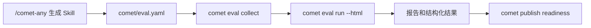

<Info>
  这是进阶内容。如果你只想快速跑通一次评估，先看[快速上手：评估一个 Skill](/zh/eval/quickstart)。
</Info>

`comet eval` 是 Comet 的通用 Skill 评估入口。它为 Skill 提供发布前证据：能评估 `/comet-any` 的生成物，也能对本地 Skill 目录做早期冒烟。

## 它解决什么问题

普通用户不需要理解 pytest、task registry、profile、treatment 或 Docker 细节。`comet eval` 封装了本地 eval harness 的启动路径、任务发现、profile 选择和报告生成，让你从项目根目录就能跑评估，而不是手工切到 `eval/` 目录拼命令行参数。

## 两套评估系统，不要混淆

Comet 有两套评估系统，名字相近但完全不同：

| 系统 | 命令 | 评估对象 | 是发布证据吗 |
| --- | --- | --- | --- |
| **创建期评估** | `comet eval run` | Skill 包或 `comet/eval.yaml` | **是** |
| **运行期评估** | `comet skill eval` | 某次 deterministic Engine Run | 否 |

`comet eval` 回答"这个 Skill 作为产品能力能不能通过评估"，通过共享 eval harness 执行真实模型任务。`comet skill eval` 回答"这次 Run 是否完整"，只检查 runtime checks，不跑模型。详见 [Runtime eval](/zh/eval/runtime)。

## 它在流程中的位置



`/comet-any` 负责创建或优化 Skill，`comet eval` 负责验证这个 Skill 是否能被 eval harness 发现、运行并产出报告。新版本的 `/comet-any` 还会把 eval 结果和项目级偏好证据一起放进 publish readiness：`preferenceHash`、组合方案、resolved Skill 证据和 Eval evidence 必须都能对应当前 draft。

完整链路：

```text
/comet-any 生成 Skill
  -> 产出 comet/eval.yaml
  -> comet eval collect 做发现预检查
  -> comet eval run --html 执行真实评估
  -> /comet-any 或 comet publish 读取评估结果并进入 readiness / review / publish / distribute
```

`comet eval` 不负责发布。发布仍然由 `/comet-any` 背后的 Bundle 后端处理，对普通用户暴露为 [comet publish](/zh/cli/publish)。eval 的职责是提供发布前证据。

## 两种入口

| 场景 | 命令 | 适合阶段 |
| --- | --- | --- |
| `/comet-any` 生成物 | `comet eval run --manifest ./skill/comet/eval.yaml --html` | 发布前完整评估 |
| 本地早期冒烟 | `comet eval run --skill-path ./my-skill --skill-name my-skill --quick` | 早期验证 |

`--manifest` 和 `--skill-path` 是**互斥**的，一次评估只能选一个入口。

## comet/eval.yaml 清单格式

`/comet-any` 生成的 Skill 包里，`comet/eval.yaml` 是评估清单。它的格式（由 harness 的 `manifests.py` 解析）：

```yaml
apiVersion: comet.eval/v1alpha1        # 必填，必须精确等于这个值
kind: SkillEvalManifest               # 必填，必须精确等于这个值
metadata:
  name: my-skill
  description: 一个 PR 评审助手
skill:
  name: my-skill
  source: ".."                         # 相对 eval.yaml 的 Skill 目录，默认 ".."
  profile: authoring-skill             # 可选，覆盖 profile
evaluation:
  recommendedTasks:                     # 推荐任务列表
    - authoring-skill-smoke
    - workflow-route-conformance
  requiredSkills: [writing-plans, requesting-code-review]
  expectedArtifacts:
    - reference/resolved-skills.json
    - reference/workflow-protocol.json
interaction:
  mode: none                           # none 或 auto_user，默认 none
  maxTurns: 8                          # 默认 12
  simulatorPrompt: ""                  # 可选
```

<Warning>
  <code>apiVersion</code> 和 <code>kind</code> 是强校验：不等于 <code>comet.eval/v1alpha1</code> / <code>comet.eval/SkillEvalManifest</code> 会直接报错。普通用户不需要手写这个文件，<code>/comet-any</code> 会生成。
</Warning>

`/comet-any` 生成的 eval.yaml 默认用 `authoring-skill` profile，推荐任务是 `authoring-skill-smoke` 和 `workflow-route-conformance`。

## Profile 体系

eval harness 内置三个 profile，每个决定 rubric 维度、默认交互模式和评分器：

| Profile | 维度数 | 默认交互 | 适合 |
| --- | --- | --- | --- |
| `generic` | 7 | `mode=none`, `maxTurns=12` | 通用 Skill 冒烟 |
| `comet-workflow` | 9 | `mode=auto_user`, `maxTurns=12` | 经典 `/comet` 五阶段评估 |
| `authoring-skill` | 8 | `mode=auto_user`, `maxTurns=8` | `/comet-any` 生成的 Skill |

Profile 解析优先级：`--profile` 覆盖 > manifest 的 `skill.profile` > task 的 `evaluation.profile` > `generic`。

<Info>
  <code>comet-*</code> 开头的任务或 <code>metadata.category=comet</code> 的任务会自动推断为 <code>comet-workflow</code> profile，并自动把交互模式切到 <code>auto_user</code>（模拟一个会批准合理计划的用户）。
</Info>

## Task 体系

eval harness 内置一组任务，每个任务是一个目录（含 `instruction.md`、`task.toml`、`environment/`、`validation/`）。常见任务：

| Task | 类别 | 说明 |
| --- | --- | --- |
| `generic-skill-smoke` | generic | 通用 Skill 冒烟，产出并校验 `result.md` |
| `authoring-skill-smoke` | generic | 生成 Skill 包冒烟，校验 Engine 包完整性 |
| `workflow-route-conformance` | - | 校验生成的 Skill 是否按预期 stage 顺序运行 |
| `comet-full-workflow` 等 | comet | 经典五阶段的不同维度评估 |

**`recommended`** 不是任务名，而是 CLI 的默认解析路径：用 `--manifest` 时读 manifest 的 `recommendedTasks`；没有 manifest 时跑每个 task 的 `default_treatments`。

## 推荐路径：评估 /comet-any 生成的 Skill

当 `/comet-any` 生成了 Skill 后，优先找这个文件：

```text
generated-skill/
  comet/
    eval.yaml
```

然后按两步跑：

```bash
comet eval collect --manifest ./generated-skill/comet/eval.yaml
comet eval run --manifest ./generated-skill/comet/eval.yaml --html
```

第一步 `collect` 只确认"能不能发现任务"，适合刚生成完 Skill 后做低成本预检查。第二步 `run --html` 才执行真实评估并生成可浏览报告。

## 只有本地 Skill 目录时怎么评估

如果你还没有 `comet/eval.yaml`，只有一个本地 Skill 目录，可以先做 quick smoke：

```bash
comet eval run --skill-path ./my-skill --skill-name my-skill --quick
```

这个路径适合早期验证：

- Skill 目录是否可读取
- eval harness 是否能把它当作动态 Skill 注入
- 通用 smoke task 是否能跑起来

当前 quick smoke 默认使用 `generic-skill-smoke`。这只是早期冒烟，**不等于**发布前完整证据。

## manifest 路径和 skill-path 路径怎么选

优先级很简单：

| 场景 | 推荐入口 |
| --- | --- |
| 有 `comet/eval.yaml` | `--manifest` |
| 只有本地目录、还在早期调试 | `--skill-path --quick` |
| 是 `/comet-any` 生成物 | `--manifest` |
| 要进入发布 readiness | `--manifest` |

<Warning>
  不要把 <code>--skill-path --quick</code> 当成最终发布评估。它只覆盖早期冒烟场景。
</Warning>

## 为什么先 collect

`collect` 是用户最便宜的排错入口。它只做发现和预检查，不执行模型或 Docker 任务，适合快速发现路径、manifest 和任务注册问题。

```bash
comet eval collect --manifest ./generated-skill/comet/eval.yaml
```

它主要回答：

- `comet/eval.yaml` 路径是否正确
- eval harness 是否能读到这个 manifest
- manifest 里的推荐任务是否能被发现
- 当前仓库的 eval 依赖路径是否可用

它不应该先跑完整模型评估，也不应该先消耗长时间任务。失败时，通常先修 manifest、路径或任务发现问题。

## Eval 结果如何进入 publish readiness

`/comet-any` 或后端在记录 Eval 结果后，会把它并入 publish readiness。用户需要知道的只有两点：

1. `comet eval` 产出的结果会成为 `Publish readiness:` 的证据来源。
2. 当前 hash 缺少 Eval 证据时，`User next steps:` 必须先指向补齐评估，而不是继续发布。

通常顺序是：

```bash
comet eval collect --manifest ./generated-skill/comet/eval.yaml
comet eval run --manifest ./generated-skill/comet/eval.yaml --html
comet publish review <name> --platform <reference-platform> --json
```

`comet publish review` 需要把 `Publish readiness:`、`User next steps:`、`Readiness:`、`Blockers:`、`Warnings:` 和 `Evidence:` 直接展示给用户。

## /comet-any 如何使用 eval 结果

从用户视角，eval 结束后把结果交回 `/comet-any` 继续推进即可。`/comet-any` 会把 eval 证据纳入 readiness：

| 情况 | 能否 publish |
| --- | --- |
| 没有 eval 证据 | 不能 |
| eval 失败 | 不能 |
| eval 证据对应旧 hash | 不能 |
| `.comet/skill-preferences.yaml` 变化且 strict 模式 | 不能，必须重新确认或重新生成 |
| eval 通过且 hash 匹配 | 可以进入 review / publish 判断 |

用户不需要手工编辑 Bundle 状态，也不应该手工把报告路径写进内部 JSON。`/comet-any` 会通过 Bundle 后端记录结构化证据。

## 用户最少需要记什么

1. `/comet-any` 生成物优先用 `comet/eval.yaml`。
2. 先 `collect`，再 `run --html`。
3. eval 结果是 `/comet-any` 发布 readiness 的证据，**不是发布动作本身**。
4. `comet eval`（创建期）和 `comet skill eval`（运行期）是两套系统，不要混用。

## 下一步

- [Eval harness](/zh/eval/harness) — 理解 collect 和 run 的内部机制、环境变量和报告生成
- [读取评估报告](/zh/eval/reports) — 学会看懂报告信号和失败归因
- [Runtime eval](/zh/eval/runtime) — 区分 `comet eval` 和 `comet skill eval`
- [comet eval 命令](/zh/cli/eval) — 完整选项和子命令参考
