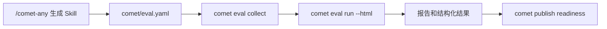

<Info>
  这是进阶内容。如果你只想快速跑通一次评估，先看[快速上手：评估一个 Skill](/zh/eval/quickstart)。
</Info>

`comet eval` 是 Comet 的通用 Skill 评估入口。它为 Skill 提供发布前证据：能评估 `/comet-any` 的生成物，也能对本地 Skill 目录做早期冒烟。

## 它解决什么问题

普通用户不需要理解 pytest、task registry、profile、treatment 或 Docker 细节。`comet eval` 封装了本地 eval harness 的启动路径、任务发现、profile 选择和报告生成，让你从项目根目录就能跑评估，而不是手工切到 `eval/` 目录拼命令行参数。

## 它在流程中的位置



`/comet-any` 负责创建或优化 Skill，`comet eval` 负责验证这个 Skill 是否能被 eval harness 发现、运行并产出报告。新版本的 `/comet-any` 还会把 eval 结果和项目级偏好证据一起放进 publish readiness：`preferenceHash`、组合方案、resolved Skill 证据和 Eval evidence 必须都能对应当前 draft。

完整链路可以这样理解：

```text
/comet-any 生成 Skill
  -> 产出 comet/eval.yaml
  -> comet eval collect 做发现预检查
  -> comet eval run --html 执行真实评估
  -> /comet-any 或 comet publish 读取评估结果并进入 readiness / review / publish / distribute
```

`comet eval` 不负责发布。发布仍然由 `/comet-any` 背后的 Bundle 后端处理，对普通用户暴露为 [comet publish](/zh/cli/publish)。eval 的职责是提供发布前证据。

## 两种入口

| 场景 | 命令 | 适合阶段 |
| --- | --- | --- |
| `/comet-any` 生成物 | `comet eval run --manifest ./skill/comet/eval.yaml --html` | 发布前完整评估 |
| 本地早期冒烟 | `comet eval run --skill-path ./my-skill --skill-name my-skill --quick` | 早期验证 |

`--manifest` 和 `--skill-path` 是互斥的，一次评估只能选一个入口。

## 推荐路径：评估 `/comet-any` 生成的 Skill

当 `/comet-any` 生成了 Skill 后，优先找这个文件：

```text
generated-skill/
  comet/
    eval.yaml
```

然后按两步跑：

```bash
comet eval collect --manifest ./generated-skill/comet/eval.yaml
comet eval run --manifest ./generated-skill/comet/eval.yaml --html
```

第一步 `collect` 只确认"能不能发现任务"，适合刚生成完 Skill 后做低成本预检查。第二步 `run --html` 才执行真实评估并生成可浏览报告。评估通过后，`/comet-any` 可以把这份结果作为发布前证据的一部分。

## 只有本地 Skill 目录时怎么评估

如果你还没有 `comet/eval.yaml`，只有一个本地 Skill 目录，可以先做 quick smoke：

```bash
comet eval run --skill-path ./my-skill --skill-name my-skill --quick
```

这个路径适合早期验证：

- Skill 目录是否可读取
- eval harness 是否能把它当作动态 Skill 注入
- 通用 smoke task 是否能跑起来

当前 quick smoke 默认使用 `generic-skill-smoke`。这只是早期冒烟，不等于发布前完整证据。准备发布时，仍推荐通过 `/comet-any` 生成 `comet/eval.yaml`，再走 manifest 路径。

## manifest 路径和 skill-path 路径怎么选

优先级很简单：

- 有 `comet/eval.yaml`：用 `--manifest`
- 只有本地目录、还在早期调试：用 `--skill-path --quick`
- 是 `/comet-any` 生成物：用 `--manifest`
- 要进入发布 readiness：用 `--manifest`

<Warning>
  不要把 `--skill-path --quick` 当成最终发布评估。它只覆盖早期冒烟场景。
</Warning>

## 为什么先 collect

`collect` 是用户最便宜的排错入口。它只做发现和预检查，不执行模型或 Docker 任务，适合快速发现路径、manifest 和任务注册问题。

```bash
comet eval collect --manifest ./generated-skill/comet/eval.yaml
```

它主要回答：

- `comet/eval.yaml` 路径是否正确
- eval harness 是否能读到这个 manifest
- manifest 里的推荐任务是否能被发现
- 当前仓库的 eval 依赖路径是否可用

它不应该先跑完整模型评估，也不应该先消耗长时间任务。失败时，通常先修 manifest、路径或任务发现问题。

## Eval 结果如何进入 publish readiness

`/comet-any` 或后端在记录 Eval 结果后，会把它并入 publish readiness。用户需要知道的只有两点：

1. `comet eval` 产出的结果会成为 `Publish readiness:` 的证据来源。
2. 当前 hash 缺少 Eval 证据时，`User next steps:` 必须先指向补齐评估，而不是继续发布。

通常顺序是：

```bash
comet eval collect --manifest ./generated-skill/comet/eval.yaml
comet eval run --manifest ./generated-skill/comet/eval.yaml --html
comet publish review <name> --platform <reference-platform> --json
```

`comet publish review` 需要把 `Publish readiness:`、`User next steps:`、`Readiness:`、`Blockers:`、`Warnings:` 和 `Evidence:` 直接展示给用户。

## `/comet-any` 如何使用 eval 结果

从用户视角，eval 结束后把结果交回 `/comet-any` 继续推进即可。`/comet-any` 会把 eval 证据纳入 readiness：

- 没有 eval 证据：不能 publish
- eval 失败：不能 publish
- eval 证据对应旧 hash：不能 publish
- `.comet/skill-preferences.yaml` 已变化且处于 strict 模式：不能 publish，必须重新确认或重新生成组合方案
- eval 通过且 hash 匹配：可以进入 review / publish 判断

用户不需要手工编辑 Bundle 状态，也不应该手工把报告路径写进内部 JSON。`/comet-any` 会通过 Bundle 后端记录结构化证据。

## 用户最少需要记什么

实际使用时只需要记三件事：

1. `/comet-any` 生成物优先用 `comet/eval.yaml`
2. 先 `collect`，再 `run --html`
3. eval 结果是 `/comet-any` 发布 readiness 的证据，不是发布动作本身

## 下一步

- [Eval harness](/zh/eval/harness) — 理解 collect 和 run 的内部机制
- [读取评估报告](/zh/eval/reports) — 学会看懂报告信号和失败归因
- [Runtime eval](/zh/eval/runtime) — 区分 `comet eval` 和 `comet skill eval`
- [comet eval 命令](/zh/cli/eval) — 完整选项和子命令参考
