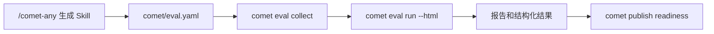

`comet eval` 为 Skill 提供发布前证据。它能评估 `/comet-any` 生成物，也能对本地 Skill 目录做 quick smoke。

## 它在流程中的位置



## 两种入口

| 场景 | 命令 |
| --- | --- |
| `/comet-any` 生成物 | `comet eval run --manifest ./skill/comet/eval.yaml --html` |
| 本地早期冒烟 | `comet eval run --skill-path ./my-skill --skill-name my-skill --quick` |

## 为什么先 collect

`collect` 只做发现和预检查，适合快速发现路径、manifest 和任务注册问题。

```bash
comet eval collect --manifest ./generated-skill/comet/eval.yaml
```

## 什么时候算发布证据

发布 readiness 通常要求：

- eval 成功。
- eval 结果绑定当前 draft hash。
- 报告可追溯。
- 没有阻塞性 failure attribution。
