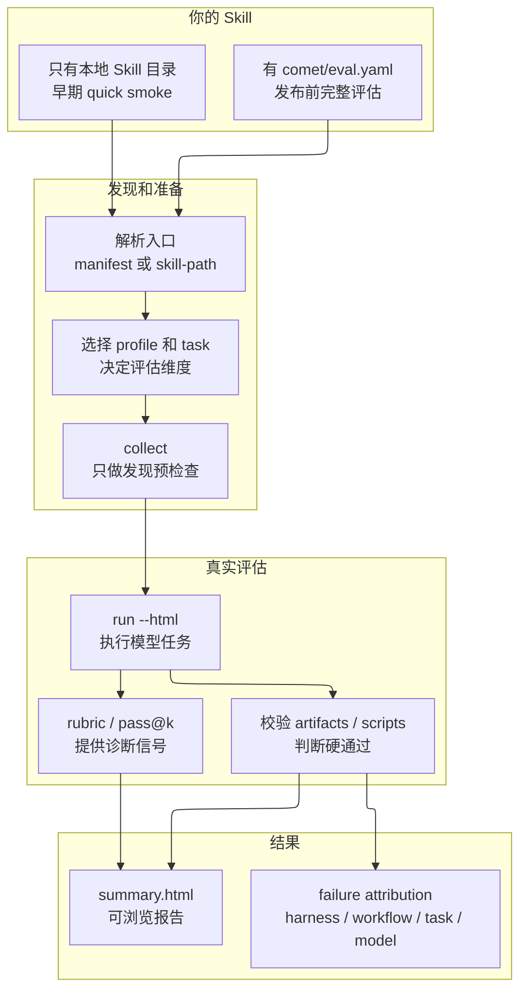
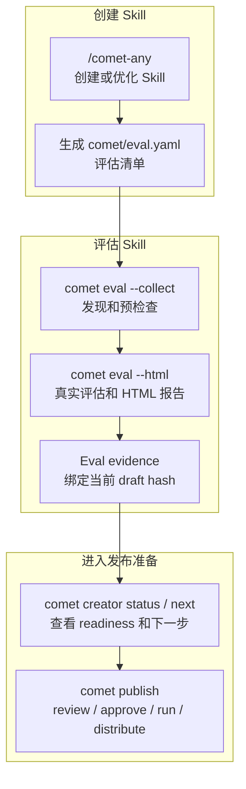

<Tip>
  这是进阶内容。如果你只想快速跑通一次评估，先看[快速上手：评估一个 Skill](/zh/eval/quickstart)。
</Tip>

`comet eval` 是 Comet 的通用 Skill 评估入口。它先回答一个问题：**你手里的 Skill，作为一个产品能力，能不能通过真实任务评估？**

这篇概览分两块：

1. 先看自己的 Skill 怎么被评估：入口、任务、评分、报告和失败归因。
2. 再看 `/comet-any` 如何把 eval 结果接入发布 readiness。

## 它解决什么问题

普通用户不需要理解 pytest、task registry、profile、treatment 或 Docker 细节。`comet eval` 封装了本地 eval harness 的启动路径、任务发现、profile 选择和报告生成，让你从项目根目录就能跑评估，而不是手工切到 `eval/` 目录拼命令行参数。

## 两套评估系统，不要混淆

Comet 有两套评估系统，名字相近但完全不同：

| 系统 | 命令 | 评估对象 | 是发布证据吗 |
| --- | --- | --- | --- |
| **创建期评估** | `comet eval` | Skill 包或 `comet/eval.yaml` | **是** |
| **运行期检查** | `comet skill check` | 某次 Skill 运行 | 否 |

`comet eval` 回答"这个 Skill 作为产品能力能不能通过评估"，通过共享 eval harness 执行真实模型任务。`comet skill check` 回答"这次 Skill 运行是否缺文件或状态"，只检查运行期检查项，不跑模型。详见 [Runtime check](/zh/eval/runtime)。

<p align="center">
  
</p>

<p align="center">`comet eval` 产出发布前证据，`comet skill check` 只检查某次 Skill 运行是否完整，两者不要混用</p>

## 第一块：自己的 Skill 怎么被评估

从用户视角，`comet eval` 做四件事：

1. 找到你的 Skill。
2. 找到应该跑哪些评估任务。
3. 在隔离环境里让模型执行任务，并用校验器检查结果。
4. 生成报告，告诉你通过、失败原因和下一步。



## 入口怎么选

| 场景 | 命令 | 适合阶段 |
| --- | --- | --- |
| 有 `comet/eval.yaml` 的 Skill | `comet eval ./skill/comet/eval.yaml --html` | 发布前完整评估 |
| 本地早期冒烟 | `comet eval ./my-skill --skill-name my-skill --quick` | 早期验证 |

`comet eval [target]` 会根据 target 判断是 manifest 还是本地 Skill。你也可以用 `--manifest` 或 `--skill-path` 显式指定入口；显式入口互斥。

优先级很简单：

| 场景 | 推荐入口 |
| --- | --- |
| 有 `comet/eval.yaml` | 直接传 eval.yaml 路径 |
| 只有本地目录、还在早期调试 | 直接传目录并加 `--quick` |
| 要进入发布 readiness | 直接传 `comet/eval.yaml` |

<Warning>
  不要把目录 quick smoke 当成最终发布评估。它只覆盖早期冒烟场景。
</Warning>

## 为什么先 collect

`collect` 是用户最便宜的排错入口。它只做发现和预检查，不执行模型或 Docker 任务，适合快速发现路径、manifest 和任务注册问题。

```bash
comet eval ./generated-skill/comet/eval.yaml --collect
```

它主要回答：

- `comet/eval.yaml` 路径是否正确
- eval harness 是否能读到这个 manifest
- manifest 里的推荐任务是否能被发现
- 当前仓库的 eval 依赖路径是否可用

它不应该先跑完整模型评估，也不应该先消耗长时间任务。失败时，通常先修 manifest、路径或任务发现问题。

## comet/eval.yaml 清单格式

`comet/eval.yaml` 是发布前完整评估的清单。它告诉 eval harness：Skill 在哪里、用哪个 profile、推荐跑哪些任务、期望哪些 evidence 和 artifacts。它的格式（由 harness 的 `manifests.py` 解析）：

```yaml
apiVersion: comet.eval/v1alpha1        # 必填，必须精确等于这个值
kind: SkillEvalManifest               # 必填，必须精确等于这个值
metadata:
  name: my-skill
  description: 一个 PR 评审助手
skill:
  name: my-skill
  source: ".."                         # 相对 eval.yaml 的 Skill 目录，默认 ".."
  profile: authoring-skill             # 可选，覆盖 profile
evaluation:
  recommendedTasks:                     # 推荐任务列表
    - authoring-skill-smoke
    - workflow-route-conformance
  baselineTreatments: [CONTROL]
  qualityGates:
    minWeightedScore: 0.8
    minPassAt1: 0.6
    maxInstabilityGap: 0.4
  requiredOutputSchemas: []
  expectedEvidence: []
  requiredSkills: [writing-plans, requesting-code-review]
  expectedArtifacts:
    - reference/resolved-skills.json
    - reference/workflow-protocol.json
interaction:
  mode: none                           # none 或 auto_user，默认 none
  maxTurns: 8                          # auto_user 下 subject/simulator 外层往返上限，默认 12
  simulatorPrompt: ""                  # 可选
```

<Warning>
  <code>apiVersion</code> 和 <code>kind</code> 是强校验：不等于 <code>comet.eval/v1alpha1</code> / <code>comet.eval/SkillEvalManifest</code> 会直接报错。普通用户通常不需要手写这个文件，<code>/comet-any</code> 会生成。
</Warning>

`/comet-any` 生成的 eval.yaml 默认用 `authoring-skill` profile。普通 workflow-kernel 会推荐 `generic-skill-smoke`、`authoring-skill-smoke` 和 `workflow-route-conformance`；基于 `/comet` 的 overlay 会额外推荐 `workflow-overlay-contract` 和经典 Comet workflow 任务，用来检查 Output Schema、预期 evidence 和 overlay 路由。

## Profile 体系

eval harness 内置三个 profile，每个决定 rubric 维度、默认交互模式和评分器：

| Profile | 维度数 | 默认交互 | 适合 |
| --- | --- | --- | --- |
| `generic` | 7 | `mode=none`, `maxTurns=12` | 通用 Skill 冒烟 |
| `comet-workflow` | 9 | `mode=auto_user`, `maxTurns=12` | 经典 `/comet` 五阶段评估 |
| `authoring-skill` | 11 | `mode=auto_user`, `maxTurns=8` | `/comet-any` 生成的 Skill |

Profile 解析优先级：`--profile` 覆盖 > manifest 的 `skill.profile` > task 的 `evaluation.profile` > `generic`。

<Info>
  <code>maxTurns</code> 不是 Agent 内部消息数或工具调用数。它只在 <code>auto_user</code> 模式下生效，限制"被测 Agent 跑到决策点 -> 用户模拟器回复 -> 被测 Agent 用 <code>--resume</code> 继续"这种外层往返最多发生多少次。
</Info>

<Info>
  <code>comet-*</code> 开头的任务或 <code>metadata.category=comet</code> 的任务会自动推断为 <code>comet-workflow</code> profile，并自动把交互模式切到 <code>auto_user</code>（<strong>两个 Agent 自动交互</strong>：一个跑被测 Skill，另一个模拟用户在决策点回复）。
</Info>

## 评分指标：rubric + pass@k/pass^k

eval 是**指标驱动**的评测，不只给通过/失败：

- **rubric 多维评分**：把 Skill 质量拆成多个维度（如五阶段的 main_flow/gate_guard、通用 Skill 的 safety_boundary），每维度 0.0–1.0，加权汇总成 `weighted_score`。**信息性**，用于诊断。
- **pass@k / pass^k**：区分**能力上限**（k 次里至少成功一次）和**可靠性下限**（k 次全部成功）。基于多次重复运行（`--count N`）算。**信息性**。
- **任务校验器通过/失败**：这次实现到底对不对（`target_artifacts` + `test_scripts`）。**这才是硬判定的 pass/fail**。

完整的维度细则、权重、公式、双 Agent 交互循环见[评分指标与双 Agent 评测](/zh/eval/scoring)。

## Task 体系

eval harness 内置一组任务，每个任务是一个目录（含 `instruction.md`、`task.toml`、`environment/`、`validation/`）。常见任务：

| Task | 类别 | 说明 |
| --- | --- | --- |
| `generic-skill-smoke` | generic | 通用 Skill 冒烟，产出并校验 `result.md` |
| `authoring-skill-smoke` | generic | 生成 Skill 包冒烟，校验 Engine 包完整性 |
| `workflow-route-conformance` | - | 校验生成的 Skill 是否按预期 stage 顺序运行 |
| `comet-full-workflow` 等 | comet | 经典五阶段的不同维度评估 |

**`recommended`** 不是任务名，而是 CLI 的默认解析路径：用 `--manifest` 时读 manifest 的 `recommendedTasks`；没有 manifest 时跑每个 task 的 `default_treatments`。

## 只有本地 Skill 目录时怎么评估

如果你还没有 `comet/eval.yaml`，只有一个本地 Skill 目录，可以先做 quick smoke：

```bash
comet eval ./my-skill --skill-name my-skill --quick
```

这个路径适合早期验证：

- Skill 目录是否可读取
- eval harness 是否能把它当作动态 Skill 注入
- 通用 smoke task 是否能跑起来

当前 quick smoke 默认使用 `generic-skill-smoke`。这只是早期冒烟，**不等于**发布前完整证据。

## 第二块：/comet-any 如何连接 eval

`/comet-any` 负责创建或优化 Skill，`comet eval` 负责验证这个 Skill 是否能被 eval harness 发现、运行并产出报告。两者的连接点是生成物里的 `comet/eval.yaml` 和评估后的 Eval evidence。



完整链路：

```text
/comet-any 生成 Skill
  -> 产出 comet/eval.yaml
  -> comet eval --collect 做发现预检查
  -> comet eval --html 执行真实评估
  -> comet creator 读取评估结果并进入 readiness / review / publish / distribute
```

`comet eval` 不负责发布。发布仍然由 creator / publish 命令处理：创建和恢复状态对普通用户暴露为 [comet creator](/zh/cli/creator)，发布和分发暴露为 [comet publish](/zh/cli/publish)。eval 的职责是提供发布前证据。

## 推荐路径：评估 /comet-any 生成的 Skill

当 `/comet-any` 生成了 Skill 后，优先找这个文件：

```text
generated-skill/
  comet/
    eval.yaml
```

然后按两步跑：

```bash
comet eval ./generated-skill/comet/eval.yaml --collect
comet eval ./generated-skill/comet/eval.yaml --html
```

第一步 `collect` 只确认"能不能发现任务"，适合刚生成完 Skill 后做低成本预检查。第二步 `run --html` 才执行真实评估并生成可浏览报告。

## Eval 结果如何进入 publish readiness

`/comet-any` 或 creator / publish 后端在记录 Eval 结果后，会把它并入 publish readiness。用户需要知道的只有两点：

1. `comet eval` 产出的结果会成为 `Publish readiness:` 的证据来源。
2. 当前 hash 缺少 Eval 证据时，`User next steps:` 必须先指向补齐评估，而不是继续发布。

通常顺序是：

```bash
comet eval ./generated-skill/comet/eval.yaml --collect
comet eval ./generated-skill/comet/eval.yaml --html
comet creator next <name> --json
```

`comet creator next` 只输出当前推荐的一步用户命令；`comet publish review` 会把 `Publish readiness:`、`User next steps:`、`Readiness:`、`Blockers:`、`Warnings:` 和 `Evidence:` 展示给用户。

## /comet-any 如何使用 eval 结果

从用户视角，eval 结束后把结果交回 `/comet-any` 继续推进即可。`/comet-any` 会把 eval 证据纳入 readiness：

| 情况 | 能否 publish |
| --- | --- |
| 没有 eval 证据 | 不能 |
| eval 失败 | 不能 |
| eval 证据对应旧 hash | 不能 |
| `.comet/skill-preferences.yaml` 变化且 strict 模式 | 不能，必须重新确认或重新生成 |
| eval 通过且 hash 匹配 | 可以进入 review / publish 判断 |

用户不需要手工编辑内部状态，也不应该手工把报告路径写进 JSON。`/comet-any` 会通过后端记录结构化证据。

## 用户最少需要记什么

1. `comet eval` 的核心问题是：这个 Skill 作为产品能力能不能通过真实任务评估。
2. 有 `comet/eval.yaml` 就用它做完整评估；只有本地目录时，只能先做 quick smoke。
3. 先 `collect`，再 `run --html`。
4. `/comet-any` 生成物会把 eval 结果接入发布 readiness，但 eval 本身不是发布动作。
5. `comet eval`（创建期）和 `comet skill check`（运行期）是两套系统，不要混用。

## 下一步

- [评分指标与双 Agent 评测](/zh/eval/scoring) — rubric 维度细则、pass@k/pass^k、双 Agent 交互循环
- [Eval harness](/zh/eval/harness) — 理解 collect 和 run 的内部机制、环境变量和报告生成
- [读取评估报告](/zh/eval/reports) — 学会看懂报告信号和失败归因
- [Runtime check](/zh/eval/runtime) — 区分 `comet eval` 和 `comet skill check`
- [comet eval 命令](/zh/cli/eval) — 完整选项和子命令参考
