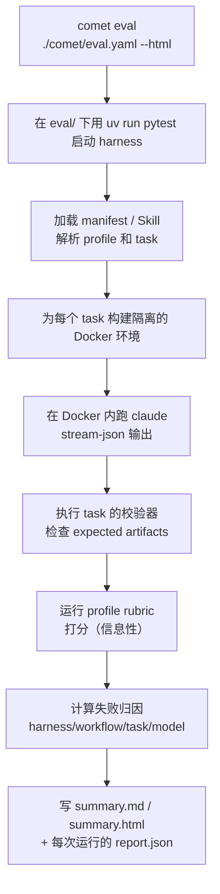

本页是评估 Skill 的最短上手路径：先准备好环境，再用两条命令跑通一次评估。想了解完整机制、失败归因和报告解读，再看[进阶内容](#进阶内容)。

## 评估解决什么问题

在发布一个 Skill 之前，你需要回答一个问题：**这个 Skill 作为产品能力，能不能通过真实任务的评估？** `comet eval` 就是回答这个问题的工具。它把底层细节（pytest、Docker、任务注册、profile、报告）封装起来，让你从项目根目录就能跑评估。

评估结果是 `/comet-any` 发布前的**强制证据**——没有通过评估的 Skill 不能发布。

## 你需要什么

- 已经通过 [`/comet-any`](/zh/skill-creator/getting-started) 生成了一个 Skill（产物里有 `comet/eval.yaml`）
- 或有一个本地 Skill 目录（用于早期冒烟）。

如果你还没有 Skill，先看[组合任意 Skill 快速上手](/zh/skill-creator/getting-started)。

## 运行前你需要准备什么

这些依赖不属于核心 Comet 运行时。只有在运行 `comet eval` 时，eval harness 才需要它们来启动真实模型任务。请先确认环境就绪；缺少 Docker、`claude` CLI 或模型凭证时，suite 通常会被**跳过**，而不是直接报错。

### 必需

| 依赖 | 说明 | 检查方式 |
| --- | --- | --- |
| **uv** | Python 包管理器，`comet eval` 内部用它驱动 pytest | `uv --version` |
| **Python 3.11+** | eval harness 的运行时 | `python --version` |
| **Docker** | 用来构建任务镜像、隔离运行 Claude 和校验器 | `docker info` |
| **`claude` CLI** | 在 PATH 上，harness 在 Docker 内调用它 | `claude --version` |
| **`ANTHROPIC_API_KEY`** 或 **`ANTHROPIC_AUTH_TOKEN`** | 模型调用凭证。两者都没有时整个 suite 会被跳过 | `echo $ANTHROPIC_API_KEY` |

<Tip>
  两者都没有 API key 时，harness 不会失败，而是<strong>跳过所有用例</strong>。如果你看到评估"瞬间通过"且没有真实运行，多半是环境没准备好。先确认上面四项都就绪。
</Tip>

### 安装 uv 和 Python

如果还没装 `uv`：

```bash
# macOS / Linux
curl -LsSf https://astral.sh/uv/install.sh | sh

# Windows (PowerShell)
powershell -ExecutionPolicy ByPass -c "irm https://astral.sh/uv/install.ps1 | iex"
```

`uv` 会自动管理 Python 版本。首次运行时它会在 `eval/` 下创建 `.venv` 并安装依赖（`pytest`、`pyyaml`、`pydantic` 等）。

### 配置 API key

```bash
# 推荐：直接设到环境
export ANTHROPIC_API_KEY=sk-ant-...

# 或用代理型凭证（BigModel / OpenRouter 等）
export ANTHROPIC_AUTH_TOKEN=...
```

也可以在 `eval/.env` 里配置（harness 会加载）：

```bash
# eval/.env
ANTHROPIC_API_KEY=sk-ant-...
```

<Warning>
  如果你用<strong>系统环境变量</strong>提供密钥，不要把 <code>.env.example</code> 里的 <code>ANTHROPIC_API_KEY=</code> 这类<strong>空赋值</strong>原样复制到 <code>.env</code>。空赋值在部分加载路径中会覆盖已有的系统环境变量，导致密钥"丢失"。录屏或演示时可以不创建 <code>.env</code>（或只创建一个完全空的文件），把密钥留在系统环境变量里。
</Warning>

### 可选

| 环境变量 | 作用 |
| --- | --- |
| `BENCH_CC_MODEL` | 覆盖 Claude 模型 |
| `BENCH_CC_VERSION` | Docker 镜像里的 Claude Code 版本（默认 `latest`） |
| `BENCH_LLM_JUDGE=1` | 启用可选的 LLM-as-judge 覆盖评分 |
| `BENCH_SIMULATOR_PROMPT_FILE` | 自定义用户模拟器提示词文件（默认 `eval/simulator-instruction.md`），覆盖 auto_user 评测里模拟用户的行为画像 |
| `COMET_EVAL_REPORT_CONFIG` | 报告输出配置路径（替代 `--report-config`） |

<Note>
  <strong>用 Anthropic 兼容代理？</strong>当 <code>ANTHROPIC_API_KEY</code> 未设置时，把 <code>ANTHROPIC_AUTH_TOKEN</code> + <code>ANTHROPIC_BASE_URL</code>（BigModel / mimo / OpenRouter 等）写进 <code>eval/.env</code>，harness 会让 Docker 内的 <code>claude</code> 用它们认证。完整变量表见 <a href="/zh/eval/harness#环境变量参考">Eval harness · 环境变量参考</a>。
</Note>

---

## 最短路径：两步评估

环境准备好后，评估只需要两步。

### 第一步：发现预检查（collect）

先确认 eval 能发现你的 Skill 和任务。这一步**不消耗模型调用**，成本最低：

```bash
comet eval ./generated-skill/comet/eval.yaml --collect
```

如果输出没有报错，说明 manifest、路径和任务都能被正确发现。

<Tip>
  只有本地 Skill 目录、还没有 <code>comet/eval.yaml</code>？用早期冒烟路径：
  ```bash
  comet eval ./my-skill --skill-name my-skill --quick
  ```
  这会用 <code>generic-skill-smoke</code> 任务做冒烟，<strong>不等于发布前证据</strong>。
</Tip>

### 第二步：执行真实评估（run）

确认发现没问题后，跑真实评估并生成可浏览的 HTML 报告：

```bash
comet eval ./generated-skill/comet/eval.yaml --html
```

运行后，CLI 会打印 `Report path`，指向生成的报告。打开它看结果是否通过。

<Info>
  不带 <code>--collect</code> 时会真正调用模型，会消耗 token 和时间。一次评估的耗时取决于任务数，以及 <code>auto_user</code> 模式下允许多少次"被测 Agent 到决策点、用户模拟器回复、被测 Agent 继续"的外层往返。<code>maxTurns</code> 限制的是这个往返上限，不是 Agent 内部工具调用数。先用 <code>--collect</code> 排错能避免浪费。
</Info>

<p align="center">
  
</p>

<p align="center">先用 `--collect` 排路径、manifest 和任务发现问题，再用 `--html` 执行真实评估并生成可浏览报告</p>

## 看报告只需要关注三点

1. **评估是否通过** — 报告顶部或 CLI 输出会明确告诉你。
2. **失败归因** — 如果没通过，看失败被归到 `harness`、`workflow`、`task` 还是 `model`，这决定了你该改什么。
3. **报告位置** — 通常是 `eval/local/logs/experiments/<experiment-id>/summary.html`。

报告的完整结构见[读取评估报告](/zh/eval/reports)。

## 评估通过后做什么

评估通过的结果会成为 `/comet-any` 发布前的证据。把结果交回 `/comet-any` 继续推进，或用 creator 命令检查 readiness：

```bash
comet creator status my-skill --project . --json
comet creator next my-skill --project . --json
```

详见[发布和分发 Skill](/zh/skill-creator/publishing)。

---

## 一次评估内部发生了什么

理解这一段能帮你判断评估结果是否可信。`comet eval ... --html` 内部做了这些事：



关键点：

- 模型在 **Docker 容器**里运行，和你的工作目录隔离，避免污染。
- **expected artifacts** 是硬校验——任务要求产出的文件必须存在。
- **rubric** 评分是**信息性**的（`[RUBRIC]` 行），不直接决定通过与否；真正的通过/失败由校验器和"required skill 是否被调用"决定。

## 常见问题

<AccordionGroup>
  <Accordion title="collect 报错说找不到 manifest">
    检查路径是否正确，确认 `comet/eval.yaml` 文件存在。如果你不在 Comet 仓库根目录，加上 `--project <dir>` 指向正确的根目录。
  </Accordion>

  <Accordion title="run 报错说找不到报告">
    看 CLI 输出的 `Experiment` 和 `Report path`。如果路径里有 `<experiment-id>`，用实际 experiment id 到 `eval/local/logs/experiments/` 目录查找。
  </Accordion>

  <Accordion title="评估瞬间&quot;通过&quot;但感觉没真跑">
    几乎肯定是环境没准备好：Docker 没起、没有 `ANTHROPIC_API_KEY`、或 `claude` CLI 不在 PATH。harness 在这些情况下会**跳过**而不是失败。先确认[运行前你需要准备什么](#运行前你需要准备什么)。
  </Accordion>

  <Accordion title="我应该用 comet eval 还是 comet skill check">
    评估一个 Skill 的产品能力能不能通过，用 `comet eval`。检查某次 Skill 运行是否缺 artifact 或状态，才用 `comet skill check`。发布前证据只需要 `comet eval`。详见[Runtime check](/zh/eval/runtime)。
  </Accordion>

  <Accordion title="为什么要在 Docker 里跑">
    为了隔离。每个任务有自己的 Dockerfile 和环境，Claude 在容器里产出文件，校验器也在容器里检查，不会污染你的工作目录。镜像每个 session 只构建一次。
  </Accordion>
</AccordionGroup>

## 进阶内容

基础路径到这里就结束了。如果你需要更深入地理解评估系统，看这些页面：

| 进阶主题 | 适合场景 |
| --- | --- |
| [评估系统概览](/zh/eval/overview) | 理解 eval 在 Skill 创建、验证、发布 readiness 中的位置 |
| [评分指标与双 Agent 评测](/zh/eval/scoring) | rubric 维度细则、pass@k/pass^k、双 Agent 自动交互 |
| [Eval harness](/zh/eval/harness) | 理解 collect/run 内部机制、profile、task 选择、环境变量 |
| [读取评估报告](/zh/eval/reports) | 完整的失败归因、报告信号、experiment id 和下一步判断 |
| [Runtime check](/zh/eval/runtime) | 区分 `comet eval` 和 `comet skill check` |
| [comet eval 命令](/zh/cli/eval) | 完整选项、参数和故障排查参考 |
