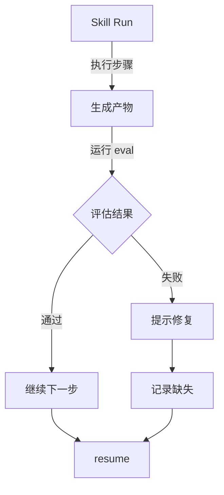

运行时评估是针对特定 Engine Run 的轻量级检查，用于验证执行过程中的状态和产物。它不同于共享评估框架的全面质量验证。

## 与共享评估的区别

| 方面 | 运行时评估 (`comet skill eval`) | 共享评估 (`comet eval run`) |
|---|---|---|
| 目标 | 特定 Engine Run | Skill 包或 manifest |
| 时机 | 执行过程中 | 执行前/后 |
| 复杂度 | 轻量 | 全面 |
| 耗时 | 秒级 | 分钟级 |
| 用途 | 进度检查、步骤验证 | 质量验证、发布评估 |

## 评估范围

运行时评估支持三种范围：

| 范围 | 说明 |
|---|---|
| `progress` | 检查当前步骤的进度 |
| `step` | 检查当前步骤是否完成 |
| `completion` | 检查整个 Run 是否完成 |

### progress 范围

检查当前步骤是否有进展：

```bash
comet skill eval --run-id run-001 --scope progress
```

```
Run: run-001
Scope: progress
PASS eval-progress: current step has pending action

All runtime evals passed.
```

### step 范围

检查当前步骤是否完成：

```bash
comet skill eval --run-id run-001 --scope step
```

```
Run: run-001
Scope: step
PASS eval-step-analyze: step completed
PASS eval-artifact-analysis: artifact exists at analysis.md

All runtime evals passed.
```

### completion 范围

检查整个 Run 是否完成：

```bash
comet skill eval --run-id run-001 --scope completion
```

```
Run: run-001
Scope: completion
PASS eval-artifact-report: artifact exists at report.md
PASS eval-state-done: state.status equals "completed"

All runtime evals passed.
```

## 评估类型

运行时评估基于 `comet/evals.yaml` 中定义的评估规则：

### artifact_exists

检查指定产物是否存在：

```yaml
evals:
  - id: eval-artifact-report
    scope: completion
    type: artifact_exists
    artifact: report.md
```

### state_equals

检查 Run 状态字段是否等于指定值：

```yaml
evals:
  - id: eval-state-done
    scope: completion
    type: state_equals
    field: status
    equals: "completed"
```

## 使用场景

### 1. 检查执行进度

在长时间运行的 Skill 中检查进度：

```bash
comet skill run my-skill --run-id run-001
# ... 执行中 ...
comet skill eval --run-id run-001 --scope progress
```

### 2. 验证步骤完成

在恢复 Run 前验证当前步骤：

```bash
comet skill eval --run-id run-001 --scope step
# 如果通过，继续
comet skill resume --run-id run-001
```

### 3. 验证最终结果

在发布前验证 Run 完成状态：

```bash
comet skill eval --run-id run-001 --scope completion
```

## 评估失败处理

如果评估失败，输出会包含下一步建议：

```
Run: run-001
Scope: completion
PASS eval-artifact-report: artifact exists at report.md
FAIL eval-state-done: state.status equals "running", expected "completed"

Next: record the missing artifact/state and rerun comet skill eval
```

### 常见失败原因

| 失败 | 原因 | 解决方案 |
|---|---|---|
| 产物不存在 | 步骤未完成或产物路径错误 | 完成步骤或检查路径 |
| 状态不匹配 | Run 仍在执行或已失败 | 等待完成或检查错误 |
| 引用缺失 | 依赖的 Skill 或工具不可用 | 安装依赖或修复引用 |

## 评估定义

在 `comet/evals.yaml` 中定义运行时评估：

```yaml
apiVersion: comet/v1alpha1
kind: RuntimeEvals
evals:
  - id: eval-progress
    scope: progress
    type: artifact_exists
    artifact: .comet/checkpoint.json

  - id: eval-step-analyze
    scope: step
    type: artifact_exists
    artifact: analysis.md

  - id: eval-step-complete
    scope: step
    type: state_equals
    field: currentStep
    equals: "analyze"
    next: "implement"

  - id: eval-completion
    scope: completion
    type: state_equals
    field: status
    equals: "completed"
```

## 与 Skill Run 集成

运行时评估与 Skill Run 紧密集成：



## 最佳实践

<AccordionGroup>
  <Accordion title="定义有意义的评估">
    评估应该验证真正重要的状态和产物，而不是形式化的检查。
  </Accordion>

  <Accordion title="在关键点运行评估">
    在步骤边界、恢复前和发布前运行评估。
  </Accordion>

  <Accordion title="处理评估失败">
    评估失败时，先理解失败原因，再决定是修复还是重试。
  </Accordion>

  <Accordion title="结合共享评估">
    运行时评估用于执行过程，共享评估用于发布前的全面验证。
  </Accordion>
</AccordionGroup>
