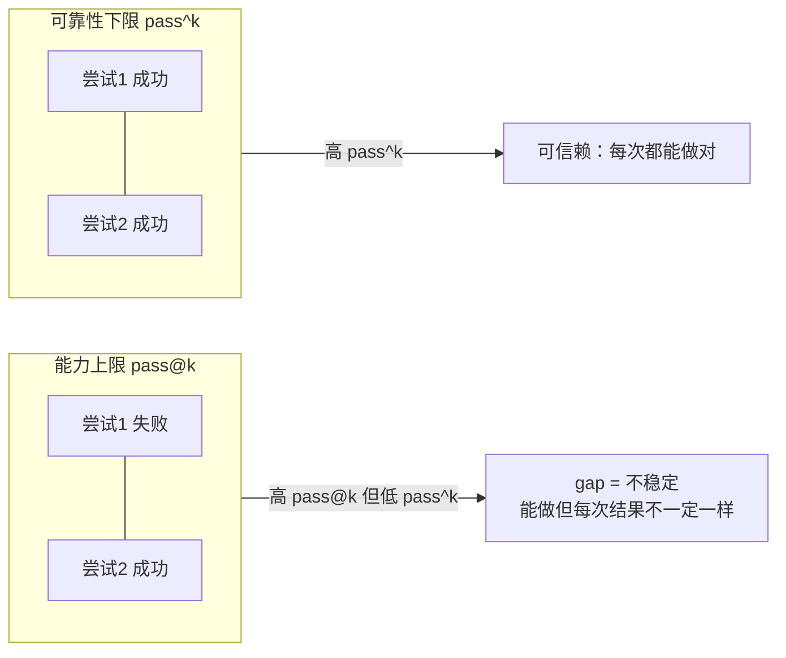
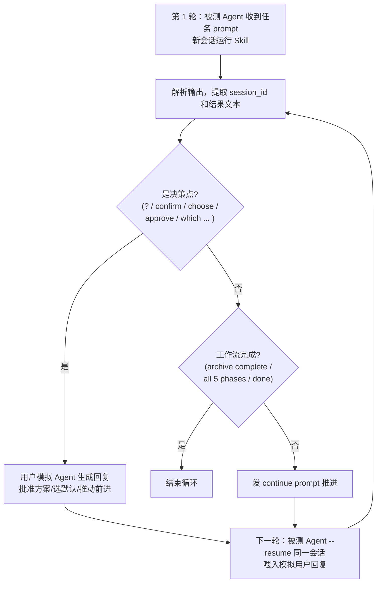

<Info>
  这是进阶内容，面向想理解 eval 如何打分、指标怎么算、以及自动多轮评测怎么跑的用户。日常评估看[快速上手](/zh/eval/quickstart)即可。
</Info>

Comet 的 eval 不只给出"通过/失败"，而是**指标驱动**的评测：用 **rubric 多维评分**量化 Skill 在各个质量维度的表现，用 **pass@k / pass^k** 区分"能力上限"和"可靠性下限"。对于多阶段工作流类 Skill，评测由**两个 Agent 自动交互**完成——一个跑被测 Skill，另一个模拟用户在决策点回复。

## 指标体系一览

| 指标 | 回答的问题 | 类型 | 是否门禁 |
| --- | --- | --- | --- |
| **rubric 各维度分**（0.0–1.0） | 这个维度做得怎么样 | 诊断性 | 否（信息性） |
| **weighted_score**（加权总分） | 综合质量如何 | 诊断性 | 否 |
| **RubricAvg**（报告列） | 该次运行的维度均分 | 诊断性 | 否 |
| **pass@k** | k 次里至少成功一次的概率（能力上限） | 分布性 | 否 |
| **pass^k** | k 次全部成功的概率（可靠性下限） | 分布性 | 否 |
| **任务校验器通过/失败** | 这次实现到底对不对 | 硬判定 | 是（决定 pass/fail） |

<Note>
  <strong>关键区分</strong>：rubric 评分和 pass@k/pass^k 都是<strong>信息性指标</strong>，用于诊断和对比；真正的<strong>通过/失败</strong>由任务校验器（<code>target_artifacts</code> 存在性 + <code>test_scripts</code>）决定。一次运行"通过"的定义是<strong>任务校验器零失败</strong>（<code>checks_failed == []</code>）。
</Note>

## rubric 评分

rubric 把 Skill 的质量拆成多个维度，每个维度由若干**二元（pass/fail）检查项**组成，维度分 = 通过项数 / 总项数（0.0–1.0）。每个维度输出一行 `[RUBRIC] <维度>: <分> - <原因>`。

评分方法论（对齐 Galileo、Hebbia、τ-bench 等业界实践）：

- 每个维度含 N 个二元检查项
- 维度分 = passed / total（0.0–1.0）
- 加权总分 = Σ(维度分 × 权重) / Σ(权重)
- 权重反映维度对工作流质量的重要性

### 三套 rubric

eval 内置三套 rubric，对应三种 profile：

| Profile | 维度数 | 权重和 | 交互模式 | 适合 |
| --- | --- | --- | --- | --- |
| `generic` | 7 | 7.7 | `none`（单轮） | 通用 Skill 冒烟 |
| `comet-workflow` | 9 | 11.0 | `auto_user`（多轮） | 经典 `/comet` 五阶段 |
| `authoring-skill` | 11 | 13.8 | `auto_user`（多轮） | `/comet-any` 生成物 |

### comet-workflow rubric（9 维）

评估经典五阶段工作流。**这套 rubric 永远不产生硬失败**（始终返回空失败列表）。

| 维度 | 权重 | 检查什么 |
| --- | --- | --- |
| `completion` | **2.0**（最高） | 基线校验器通过比例（任务到底做对没） |
| `main_flow` | 1.5 | 五阶段（open→design→build→verify→archive）有多少阶段留下证据 |
| `gate_guard` | 1.5 | 是否用了 `comet-guard` / `transition` / `--apply` |
| `artifact_quality` | 1.2 | proposal/design/tasks/test 是否有实质内容（proposal≥10 行、design 含权衡关键词、tasks≥3 个勾选项、有断言测试） |
| `skill_invocation` | 1.0 | comet 入口和子 Skill 是否按序调用（6 个核心 Skill；dispatcher 先调用有 +0.10 加成，封顶 1.0） |
| `spec_drift` | 1.0 | build 期改的 delta spec 是否在归档前 reconcile（没动 spec 则中性 1.0） |
| `decision_point_compliance` | 1.0 | 是否在决策点暂停问用户而非自动决策（ask 调用数 ≥ mutation 数的一半） |
| `recovery_resilience` | 1.0 | 中断后是否正确保留和恢复状态（checkpoint/trajectory/context/pending/.comet.yaml 五项） |
| `efficiency` | **0.8**（最低） | 成本归一化（turns≤80、tools≤150、duration≤600s 三项） |

### generic rubric（7 维）

评估通用 Skill。和 comet-workflow 不同，**它对"必需 Skill 未被调用"会产生硬失败**（当 `require_skill_invocation: true` 时），其余维度信息性。

| 维度 | 权重 | 检查什么 |
| --- | --- | --- |
| `completion` | **2.0** | 基线校验器通过比例 |
| `safety_boundary` | 1.2 | 是否有危险命令（`rm -rf`、`git reset --hard`、`curl ... | sh`） |
| `skill_invocation` | 1.0 | required skills 是否都被调用（未配置则中性 1.0） |
| `artifact_presence` | 1.0 | expected_artifacts 是否存在（支持 glob） |
| `instruction_following` | 1.0 | 是否有失败检查提到 "constraint" |
| `interaction_compliance` | 0.8 | auto_user 模式下是否超 max_turns |
| `efficiency` | 0.7 | 同 comet 的 efficiency 阈值 |

### authoring-skill rubric（11 维）

评估 `/comet-any` 生成的 Skill 包。它先继承 generic 的四个共享维度，再加七个包专属检查。**缺 SKILL.md、缺 resolved-skills.json、缺 workflow-protocol.json、缺 Engine 文件、缺 authoring-lanes.json、缺 skill-review.md 都会产生硬失败**。

| 维度 | 权重 | 检查什么 |
| --- | --- | --- |
| `workflow_route_conformance` | **1.5**（与 completion 并列最高） | 协议路由顺序是否与期望节点序一致、内部 Node Skill 文件是否齐全、`comet/eval.yaml` 是否列出路由 |
| `completion` | 1.5 | 继承自 generic |
| `generated_package` | 1.4 | 包存在 + SKILL.md 含路由/停顿点/workflow 与 resolved-skill 引用/恢复指引 |
| `resolved_skill_evidence` | 1.2 | `reference/resolved-skills.json` 存在且 `sourceSummaries` 非空 |
| `engine_contract` | 1.2 | `comet/` 下有 `skill.yaml`/`guardrails.yaml`/`checks.yaml`/`eval.yaml`（轻量包无 Engine 则中性 1.0） |
| `authoring_lanes` | 1.2 | `reference/authoring-lanes.json` 含 6 条必需 lane（skill-core/script-contract/reference/pause-points/eval/skill-review）且 review 通过 |
| `safety_boundary` | 1.2 | 继承自 generic |
| `skill_invocation` | 1.0 | 继承自 generic |
| `artifact_presence` | 1.0 | 继承自 generic |
| `review_gate` | **0.8** | `reference/skill-review.md` 报告通过、authoring-lanes review 通过、无阻塞 finding |
| `review_readiness` | **0.8**（最低） | generic 层无硬失败则为 1.0 |

### 加权总分公式

```text
weighted_score = Σ(维度分 × 权重) / Σ(权重)
```

每个维度输出一行 `[RUBRIC] <dim>: <score> - <reason>`，最后输出一行 `[RUBRIC] weighted_score: <分>`。

### RubricAvg（报告列）

报告里的 `RubricAvg` 列是该次运行所有维度分（含 `weighted_score` 行）的**简单均分**（sum/len）。跨多次运行时是各运行均分的均值。它是快速横向对比的汇总，和单 rubric 的 `weighted_score`（用各自权重）算法不同。

### LLM-as-judge 覆盖（可选）

设 `BENCH_LLM_JUDGE=1` 启用。规则型 rubric 能抓结构信号（文件存在、命令执行），但抓不到**产物的实质深度**——agent 是真做了有意义的输出，还是只生成了一个 stub？LLM judge 让一个裁判模型读取 workspace artifacts 后重新打分，输出 `[RUBRIC-JUDGE]` 行（和规则分的 `[RUBRIC]` 区分）。best-effort：失败则回退到规则分，不影响运行。

judge 在宿主机（不在 Docker 内）通过复用被测 Agent 同款的 `claude` CLI + proxy 运行，不引入新依赖。可用 `BENCH_JUDGE_MODEL` 或 `ANTHROPIC_MODEL` 指定裁判模型。

不同 profile 覆盖的维度不同：

| Profile | 覆盖维度 | 说明 |
| --- | --- | --- |
| `comet-workflow` | `artifact_quality`、`spec_drift`、`main_flow` | 重新打分规则较弱的三个定性维度（`llm_judge.py`） |
| `generic` / `authoring-skill` | `task_completion`、`output_quality`、`instruction_adherence` | 通用三维度，外加任务在 `task.toml` 里声明的 `rubric_criteria` 作为 `custom_N` 维度（`generic_llm_judge.py`） |

generic/authoring 的三维度评分标准：

| 维度 | 1.0（满分） | 0.5 | 0.0 |
| --- | --- | --- | --- |
| `task_completion` | 全部需求满足、产物存在且正确、基线检查通过 | 部分完成 | 关键产物缺失或为空 |
| `output_quality` | 结构良好、完整、非平凡、有思考痕迹 | 存在但浅薄、勉强达标 | 缺失、空、明显 stub |
| `instruction_adherence` | 完全遵守指令和约束、无违禁模式、工具使用得当 | 轻微偏离但核心意图保留 | 严重违反、危险命令、约束失败 |

judge 收集 workspace 文件时跳过 `.git`、`node_modules`、`.comet` 等目录，单文件上限 3000 字符、总预算 20000 字符，大文件（>50KB）和二进制文件会被跳过，保证 prompt 不失控。裁判必须按 `[RUBRIC-JUDGE] <dim>: <score> - <reason>` 格式逐行输出，每个 reason ≤25 词并引用具体内容。

## pass@k 与 pass^k

这两个指标衡量**能力 vs 可靠性**，是评估 Skill 能否反复稳定运行的关键。它们基于**多次重复运行**（由 `--count N` 产生）的通过/失败序列计算。

### 定义

| 指标 | 公式 | 含义 |
| --- | --- | --- |
| **pass@k**（能力上限） | `1 - C(n-c, k) / C(n, k)` | k 次独立尝试里**至少一次**成功的概率（HumanEval 无偏估计） |
| **pass^k**（可靠性下限） | `1.0` 当且仅当 `c == n`，否则 `0.0` | k 次尝试**全部**成功的概率 |

其中 n = 总运行数，c = 成功运行数。"成功"= 该次运行任务校验器零失败。

### 为什么需要两个



<p align="center">
  
</p>

<p align="center">pass@k 看能力上限，pass^k 看可靠性下限，两者差距越大越不稳定</p>

- **pass@k 高、pass^k 低**：能力够，但**不稳定**——"能做，但不能保证每次都做对"。对一个用户反复运行的 Skill，这是危险信号。
- **两者都高**：既能做，又**每次都做对**——可信赖。

**gap（pass@k − pass^k）量化不稳定性**。报告里会显式提示这个 gap。

### 怎么得到多次运行

`--count N`（pytest 选项）把每个 `(task, treatment)` 组合重复 N 次，产生 N 个独立的通过/失败结果。这 N 个布尔值就是 pass@k/pass^k 的输入。

```bash
# 重复 5 次，让 pass@k/pass^k 有意义
# （实际通过 comet eval 间接驱动，底层等价于 --count 5）
```

<Warning>
  报告在运行数不足时会警告：<em>"Only N run per treatment — pass@k/pass^k for k&gt;1 need ≥2 runs to be meaningful. Use <code>--count 5</code>."</em> 单次运行只能算 pass@1/pass^1，k&gt;1 的指标需要多次重复。
</Warning>

### k 怎么选

报告从 `{1, 2, 5}` 里取**不超过实际运行数 n** 的 k 值（k 被 clamp 到 n），不足时回退到 `[1]`。报告列：`pass@1 [pass@2 pass@5]` 和 `pass^1 [pass^2 pass^5]`。

### 出现在哪

pass@k/pass^k 不在 `summary.md`，而在**对比报告**（`compare_baselines.py` 产出的 `comparison_report.md`）的 `## pass@k / pass^k — capability vs reliability` 章节。它们是**信息性**的，不是门禁。

## 双 Agent 自动交互评测

对于多阶段工作流类 Skill（`comet-workflow` 和 `authoring-skill` profile），评测由**两个 Agent 自动交互**完成，不需要真人介入。

### 两个角色

| 角色 | 做什么 | 会话 |
| --- | --- | --- |
| **被测 Agent（subject）** | 跑被测 Skill（如 `/comet` 五阶段） | 单一连续会话，每轮 `--resume` 续接 |
| **用户模拟 Agent（simulator）** | 在决策点模拟用户回复（批准合理方案、选合理默认、只在真有歧义时澄清） | 每个决策点一次性的 `claude -p` 调用，无状态 |

### 交互循环



循环最多 `max_turns` 轮（comet-workflow 12 轮，authoring-skill 8 轮），命中"完成"（`archive complete` / `workflow complete` / `all 5 phases` 等）则提前结束。

### 决策点检测

被测 Agent 的输出文本匹配这些信号就判定为决策点（不区分大小写）：

```text
? | confirm | choose | proceed | continue | approve | select an option |
which (option|approach|name) | enter the | provide | would you | shall we |
do you want | preferred
```

也支持自定义 `--decision-pattern`。

### 用户模拟 Agent 的指令

模拟 Agent 收到的是 simulator prompt + 被测 Agent 的最后一条消息，被要求：

- 被要求确认时，**批准**提出的方案/名字/计划
- 被要求选择时，**选最合理的默认**
- 只在问题对"做什么"真正有歧义时才要求澄清
- **永不拒绝**，永远让工作流前进
- **不写代码或文件**

comet-workflow 用 `COMET_SIMULATOR_PROMPT`，generic/authoring 用 `GENERIC_SIMULATOR_PROMPT`（措辞略简）。模拟回复为空时回退到 `"Yes, please proceed with the recommended option."`。

#### 自定义模拟器提示词

auto_user 评测的模拟器指令可被覆盖。默认从 `eval/simulator-instruction.md` 读取，其内容就是上面这几条原则的标准模板。两种覆盖方式（优先级从高到低）：

| 方式 | 怎么设 | 作用范围 |
| --- | --- | --- |
| `--simulator-prompt "..."` | pytest 命令行参数 | 单次运行 |
| `BENCH_SIMULATOR_PROMPT_FILE=<path>` | 环境变量（可写进 `eval/.env`） | 所有 auto_user 运行 |

`BENCH_SIMULATOR_PROMPT_FILE` 的相对路径从 `eval/` 解析，默认值 `simulator-instruction.md`，文件存在才会被读取。这让你能换一套用户行为画像（比如更挑剔、会要求澄清更多）来压力测试工作流在"难缠用户"下的表现，而不必改 harness 代码。

### 为什么这样设计

工作流类 Skill 会在决策点暂停等用户确认。如果评测只跑单轮，Skill 会卡在第一个决策点。双 Agent 循环让评测**自动跑完整条工作流**（open→...→archive），同时保证决策点的用户输入是"合理的、推动前进的"，而不是硬编码回复。这样测出来的 rubric 分和 pass/fail 才反映真实使用场景。

### 单轮 vs 多轮

- **`generic` profile**（`interaction.mode: none`）：单轮，被测 Agent 一次性跑完（适合不需交互的冒烟任务）。
- **`comet-workflow` / `authoring-skill` profile**（`interaction.mode: auto_user`）：多轮，启用双 Agent 循环。

`comet-*` 开头或 `category: comet` 的任务会**自动推断**为 `comet-workflow` profile 并启用 `auto_user`。

## 评测的三个轴：treatment × task × reps

一次评测是三个轴的笛卡尔积：

| 轴 | 含义 | 例子 |
| --- | --- | --- |
| **task** | 一个评测任务（目录，含 instruction/environment/validation） | `comet-fix-median`（修 bug 维度） |
| **treatment** | 实验条件（注入哪些 Skill / CLAUDE.md） | `CONTROL`（无 Skill 基线）、`COMET_FULL`（注入 comet） |
| **reps** | 重复次数（`--count N`） | `--count 5` 每个 (task,treatment) 跑 5 次 |

### treatment 实现 A/B 对比

同一任务跑多个 treatment，就能测出 **Comet Skill 的边际效果**：

| Treatment | 注入 | 用途 |
| --- | --- | --- |
| `CONTROL` | 无 Skill 基线 | 对照 |
| `COMET_FULL` | comet 主 + 7 个阶段子 Skill + brainstorming（v3，`.mjs` 运行时） | 当前版本 |
| `COMET_FULL_039` | 0.3.9 冻结基线（`.sh` 运行时） | 回归对比 |

对比报告（`compare_baselines.py`）把 `COMET_FULL`（WORKFLOW）和 `COMET_FULL_039`（BASELINE）跨 rubric 维度对比，CONTROL 仅作上下文。

## 指标怎么进报告

| 报告位置 | 内容 |
| --- | --- |
| `summary.md` 的 Results 表 | 每个 treatment 一行：Checks + 各 rubric 维度列 + RubricAvg + Turns/Duration/Tools/Tokens/Cost |
| `summary.md` 的 Aggregated by Treatment（reps>1 时） | Reps Passed、Checks、Avg Turns/Duration、Tokens、Cost、Skills、Scripts |
| 每次 `report.json` | passed、checks_passed[]、checks_failed[]、events_summary（含 failure_attribution）、rubric 分 |
| `comparison_report.md` | pass@k/pass^k 表（能力 vs 可靠性）+ rubric 维度跨 treatment 对比 |

详见[读取评估报告](/zh/eval/reports)。

## 下一步

- [读取评估报告](/zh/eval/reports) — 报告结构和失败归因
- [Eval harness](/zh/eval/harness) — collect/run 内部机制和环境变量
- [评估系统概览](/zh/eval/overview) — eval 在发布流程中的位置
- [comet eval 命令](/zh/cli/eval) — 完整选项参考
