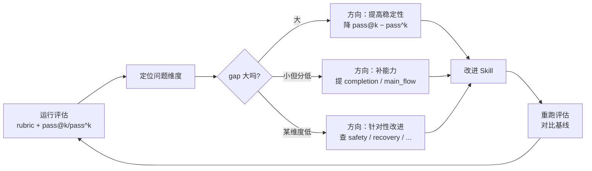

<Info>
  本页说明评估指标的用途。要直接运行评估，请阅读[快速上手](/zh/eval/quickstart)。
</Info>

## 凭手感评估的局限

一个 Skill 写出来后，需要回答的问题是它的质量是否达标。仅凭主观判断会带来几类常见问题：

- **单次成功不代表稳定**：大语言模型具有随机性，一次跑通不代表每次都能跑通。
- **产物"看起来对"不等于校验通过**：缺少文件、断言未写、混入危险命令等情况，仅靠人工检视难以发现。
- **缺乏基线对比**：没有基线，无法判断一次改动是改善、持平还是退步。
- **主观反馈无法归因**：反馈"不好用"时，无法区分是 Skill 设计问题、模型能力不足，还是环境问题。

这些问题的共同根源在于：没有可量化、可复现、可对比的评估，"质量"就没有可操作的定义。而质量定义缺失的 Skill，改进只能依靠经验判断，改动的效果无法度量，退步也无法定位。

因此，评估是 Skill 持续演化的前提，需要作为核心流程运行。

## 为什么评估应该被最优先建立

一个常见的顺序假设是：先做 Skill，积累到一定数量后再建立评估。这个顺序会导致前面所有设计决策都缺少反馈信号。

评估应当先于、或至少和第一批 Skill 同步建立，原因有三：

**1. 没有评估，无法判断设计决策是否成立。** Skill 平台的每个决策——路由策略、阶段守护、产物强制——都需要反馈信号来验证。如果评估最后才补，前期决策相当于在没有验证的情况下推进，后期返工成本高。Comet 自身的实践也印证了这一点：`/comet-any` 可以生成 Skill，但如果没有 `comet eval` 作为发布门禁，生成的 Skill 缺少客观质量底线，发布判断无法脱离主观经验。

**2. 评估指标塑造演进方向。** 评估指标定义了"好"的标准，而标准会反向影响 Skill 的设计取向。只看"能否跑通"，Skill 会向"勉强通过"演化；同时考察可靠性和安全性，Skill 才会向"稳定且不引入风险"演化。评估指标构成了 Skill 的选择压力——建立什么样的评估，决定了后续会得到什么样的 Skill。

**3. 评估是持续提供反馈的闭环。** Skill 平台会不断产出新的 Skill 和工作流。随着数量增长，唯一能横跨所有版本、持续反映"整体是在改善还是退化"的，是一套稳定的评估基线。它和传统软件中测试的角色类似：单个测试不改变功能，但缺少测试的代码库会逐步腐化。

<Note>
  Skill 平台的核心闭环是"造 → 评 → 发布"。评估是其中把主观判断转化为客观证据的环节。
</Note>

## 评估为什么需要 rubric

### "通过/失败"的信息量不足

最低限度的评估是跑一次、看任务是否通过。但"通过/失败"只携带一个比特的信息量——它说明结果是否正确，不说明质量高低、差距大小。

假设两个 Skill 都通过同一个任务：

| Skill | 通过 | turns | 工具调用 | 产物质量 | 安全边界 |
| --- | --- | --- | --- | --- | --- |
| Skill A | ✅ | 35 | 60 | 有断言、有设计文档 | 无危险命令 |
| Skill B | ✅ | 90 | 180 | 勉强生成、无测试 | 含 `rm -rf` |

按"通过/失败"，两者没有区别；但从产物质量、成本和安全角度看，两者的差距很大。rubric 的作用就是度量"通过"与"通过"之间的差异。

### rubric 把质量拆成可测量的维度

rubric 将 Skill 质量拆成若干维度，每个维度由若干二元（pass/fail）检查项组成，维度分 = 通过项数 ÷ 总项数（0.0–1.0），再按权重加权汇总。

这种拆分方式的依据在于：

- **可分解**。"质量"是模糊概念，但"是否调用了必需的 Skill""产物是否包含测试断言""是否执行了危险命令"是可以精确判定的。rubric 把模糊的质量分解为一组确定性检查。
- **可比**。两个 Skill 不再只比较一个布尔值，而是沿多个维度横向对比，可以定位各自强弱。
- **可归因**。某个维度分低，就指向对应的改进方向——`safety_boundary` 低对应检查危险命令，`recovery_resilience` 低对应检查中断恢复。

Comet 内置三套 rubric，对应不同类型的 Skill：

| Profile | 维度数 | 评估对象 | 几个关键维度 |
| --- | --- | --- | --- |
| `generic` | 7 | 任意 Skill | completion、safety_boundary、skill_invocation、efficiency |
| `comet-workflow` | 9 | 经典五阶段工作流 | main_flow、gate_guard、spec_drift、recovery_resilience |
| `authoring-skill` | 11 | `/comet-any` 生成包 | workflow_route_conformance、resolved_skill_evidence、review_gate |

每个维度有权重，反映其对工作流质量的重要性——例如 `completion`（任务是否正确完成）权重最高，`efficiency`（成本）权重较低。综合质量根据这些权重计算，反映各维度的实际影响。完整维度和权重见[评分指标](/zh/eval/scoring)。

<Note>
  rubric 评分用于诊断和对比，不决定一次运行是否通过。通过条件由任务校验器定义，包括期望产物存在和验证脚本零失败。
</Note>

### 为什么用二元检查项而非 0–100 打分

一种做法是让模型直接给出 0–100 的分数。这种方式的问题在于不可复现、不可解释：同一产物在不同 prompt 或模型下分数可能相差很大，且无法说明差距来源。

rubric 使用二元检查项并加权汇总。每个维度分都可以追溯到具体检查项（通过/未通过），依据包括文件是否存在、命令是否执行和断言是否成立。SWE-bench、τ-bench 和 HumanEval 等评测也采用可校验信号减少主观判断。

当确实需要主观判断时（如"产物的实质深度"），Comet 提供可选的 LLM-as-judge：让裁判模型读取产物后打分。judge 被约束在固定维度上（`task_completion` / `output_quality` / `instruction_adherence`），并要求每个评分理由引用具体内容，从而把主观判断限制在可审计的范围内。

## 为什么需要 pass@k 和 pass^k

### 单次通过率的局限

假设一个 Skill 跑 5 次，4 次通过、1 次失败，通过率为 80%。这个数字本身无法区分两种情况：

- **能力够，偶发失败**：改进方向是提高稳定性，通常成本较低。
- **部分任务不具备完成能力**：改进方向是补充能力，投入量级不同。

仅凭一个通过率，无法区分这两类性质不同的失败。pass@k 和 pass^k 的目的就是将它们分开。

### 两个指标分别回答不同问题

| 指标 | 公式 | 回答的问题 | 解读 |
| --- | --- | --- | --- |
| **pass@k**（能力上限） | `1 − C(n−c, k) / C(n, k)` | k 次尝试里至少一次成功的概率 | 衡量能力上限。接近 1.0 说明多次尝试里通常能成功一次 |
| **pass^k**（可靠性下限） | 全部成功才 1.0，否则 0.0 | k 次尝试全部成功的概率 | 衡量可靠性。只有每次都成功才是 1.0 |

其中 n = 总运行数，c = 成功数。pass@k 采用 HumanEval 的无偏估计器。

### 两者的差：不稳定性间隙

```
gap = pass@k − pass^k
```

这个 gap 量化 Skill 的不稳定性：

| 情况 | pass@k | pass^k | 含义 | 改进方向 |
| --- | --- | --- | --- | --- |
| 高能力、高可靠 | 高 | 高 | 能完成，且每次都正确 | 质量达标 |
| 高能力、低可靠 | 高 | 低 | 能完成，但不稳定 | 提高稳定性（降 gap）|
| 低能力 | 低 | 低 | 多次尝试也难以成功 | 补充能力 |

这个区分对工作流 Skill 尤为重要。工作流 Skill 是用户反复使用的工具——每天用、每个 PR 都用。对这类工具，可靠性比能力上限更关键，用户需要每次都得到正确结果。一个 `pass@5 = 1.0` 但 `pass^5 = 0` 的 Skill，意味着多次尝试中总存在成功的情况，但单次使用的结果不可预期，难以在实际中交付。

pass@k 和 pass^k 从能力和可靠性两个维度刻画 Skill，并明确指出下一步应投入的方向。

### 怎么得到多次运行

pass@k/pass^k 需要多次重复运行的数据。Comet 用 `--count N` 把每个任务重复 N 次，产生 N 个独立的通过/失败结果。报告在运行数不足（少于 2 次）时会提示用 `--count 5`。单次运行只能计算 pass@1/pass^1，k>1 的指标需要多次重复。

## 评估如何驱动 Skill 演进

把上述几部分结合起来，评估驱动演进的流程如下：



这套流程把 Skill 的改进变成有数据、有方向、可验证的循环：

1. **评估给出定位**：rubric 标识弱维度，pass@k/pass^k 区分能力问题与稳定性问题。
2. **改进有方向**：gap 大就提高稳定性，能力分低就补充核心能力，特定维度低就针对该维度改进。
3. **改进可验证**：重跑评估并对比基线，分数上升说明改进有效，持平或下降则需重新评估改动。
4. **回归有保障**：将合格版本作为基线（如 Comet 的 `COMET_FULL_039` 冻结基线），后续每次改动都与基线对比，退步会被及时发现。

Comet 的失败归因把每次失败分到四个类别，指明应改 Skill 还是改环境：

| 归因 | 含义 | 该改什么 |
| --- | --- | --- |
| `harness` | 评估环境、Docker、路径问题 | 改环境，不是 Skill |
| `workflow` | Skill 执行流程未达预期 | 改 Skill |
| `task` | 任务定义、验证条件问题 | 改任务，不是 Skill |
| `model` | 模型行为、工具使用不稳定 | 换模型或调 prompt |

没有归因机制，改进容易把环境或模型的问题误判为 Skill 问题。归因使评估反馈精确指向正确的改进对象，这是评估能驱动演进而非产生噪音的前提。

## 业界实践对照

Comet 的评估方法论并非凭空设计。Comet 评估系统开始设计时，下述文章尚未发布；在接近完成时，我们发现这些实践与国内一线团队的 Agent 评估方向高度一致。下面两篇文章可作为理解这套方法论在工业界落地的参考。

### 腾讯：大规模 Agent 评测的系统性工程

腾讯的评测实践强调，Agent 评测应作为系统工程对待，其核心观点与 Comet 的设计选择对应<sup>[1]</sup>：

- **评测需体系化、规模化**：单个 case 的成功不代表 Skill 可靠，需要足够的任务和重复运行才能得到可信结论——对应 pass@k/pass^k 需要多 runs 的要求。
- **任务设计是评测的根基**：任务的定义（instruction、环境、验证条件）直接决定评测有效性。Comet 用 `task.toml` + `validation/` 定义每个任务。
- **多维评分优于单一通过率**：只看"对/错"无法指导改进，需要将质量拆成多维度才能定位问题——对应 rubric 的设计。
- **需要可复现、可对比的基线**：评估的价值在于对比，需要稳定基线才能判断改动是改善还是退步——对应 treatment（如 `CONTROL` vs `COMET_FULL`）和冻结基线（`COMET_FULL_039`）。

### 阿里：用强 Agent 构建评测 Harness

阿里的方案核心是用一个强 Agent（如 Claude Code）构建评测 Harness，系统性评测一群业务 Agent，与 Comet 的设计思路一致<sup>[2]</sup>。

关键要点：

- **Harness 工程化**：评测本身需要工程化——环境隔离、任务调度、结果采集、报告生成。Comet 的 eval harness 用 Docker 隔离、pytest 驱动、自动生成 HTML 报告。
- **用 Agent 评测 Agent**：阿里用强 Agent 驱动评测流程，包括模拟用户交互、采集产物、判定结果。Comet 的双 Agent 自动交互评测（被测 Agent 跑 Skill，用户模拟 Agent 在决策点回复）采用相同理念——用 Agent 替代人工，使评测可以无人值守地跑完整条工作流。
- **评测应先于业务就绪**：评测 Harness 先搭好，业务 Agent 的迭代才有反馈闭环，否则业务 Agent 增长后会失控。这与本文强调的"评估优先建立"一致。

### Comet 和业界实践的对照

| 业界共识 | Comet 的对应实现 |
| --- | --- |
| 评测要体系化、规模化 | eval harness + `--count N` 重复运行 + 多 task/profile |
| 多维评分优于单一通过率 | 三套 rubric（7/9/11 维），加权汇总 |
| 区分能力与可靠性 | pass@k（能力上限）vs pass^k（可靠性下限） |
| 用 Agent 评测 Agent | 双 Agent 自动交互（被测 + 用户模拟） |
| 需要稳定基线做回归 | treatment 体系 + 冻结基线对比 |
| 评测要先于业务就绪 | eval 是 `/comet-any` 的发布门禁 |

## 小结

在 Skill 平台中，评估同时承担三个角色：用 rubric 把模糊的"质量"转化为可测量、可对比的维度；用 pass@k/pass^k 和失败归因指明改进方向；作为发布门禁阻止未达标 Skill 流入使用。这三项都无法仅凭主观判断完成。因此在 Comet 的能力体系中，评估被设计为最优先建立的能力——并非因为它最复杂，而是因为没有它，其他能力都缺少质量的定义，也就缺少持续改善的依据。

> 想亲手跑一次评估，看这些指标怎么产生，从[快速上手](/zh/eval/quickstart)开始。

## 参考文献

1. 腾讯技术工程. *AI Agent & Skill 测评方案及落地实践*. 微信公众平台, 2026. \[[原文链接](https://mp.weixin.qq.com/s/PUbGqheJhFMmb6hGj1ZtOw)\]

2. 阿里技术. *基于顶级 Agent（Claude Code）的 Harness 工程搭建式业务 Agent 评测方案*. 微信公众平台, 2026. \[[原文链接](https://mp.weixin.qq.com/s/n9zkbKTi3Q1j-L2vgmO1Vw)\]
