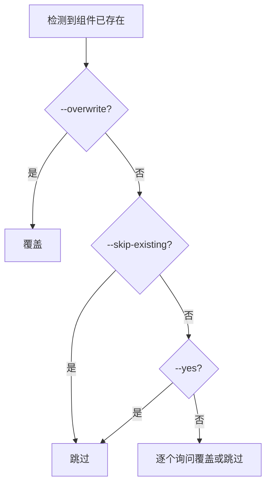
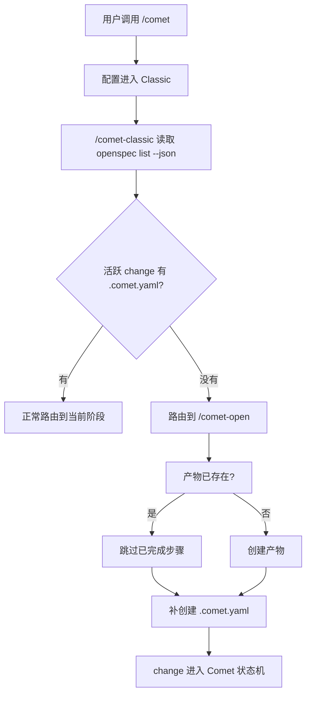

你的项目可能已经存在一段时间——有代码、有 Git 历史，甚至已经在用 OpenSpec 或 Superpowers。本页说明这种存量项目接入 Comet Classic 时的实际流程和注意事项。

## 最短路径

```bash
npm install -g @rpamis/comet
cd your-existing-project
comet init --workflow classic
```

然后在 AI 编码平台里输入 `/comet`，描述想做的变更。项目配置会让统一入口进入 Classic。

## Classic 初始化在存量项目里会做什么

`comet init --workflow classic` 不会问你“是否已经在用 OpenSpec/Superpowers”。它逐个检测每个组件，然后让你决定覆盖还是跳过。

### 组件检测

Classic 初始化检查以下三类组件是否已存在：

| 组件        | 检测方式                                                                                                                                        |
| ----------- | ----------------------------------------------------------------------------------------------------------------------------------------------- |
| OpenSpec    | 目标平台的 skills 目录里是否有 `openspec-*` 开头的 Skill                                                                                        |
| Superpowers | 是否存在 `brainstorming`、`writing-plans`、`test-driven-development` 等 Skill；也会检查插件缓存（Claude/Codex/OpenCode 插件安装的 Superpowers） |
| Comet       | 是否存在 `comet*` 开头的 Skill                                                                                                                  |

CLI 依赖单独检测（`openspec`、`codegraph` 是否在 PATH 上），已安装的默认不勾选，不会重复安装。

### 已存在组件的处理

当检测到已存在的组件时：



如果同一平台检测到多个已存在组件，先批量选择（全部覆盖/全部跳过/逐个选择），再逐个处理。

### init 会创建的目录和文件

项目级 Classic 安装时，`comet init --workflow classic` 会：

- 运行 `openspec init` 创建当前 Classic OpenSpec 根目录；新项目默认使用 `docs/openspec/`，已有根目录 `openspec/` 的项目保留 `legacy` 布局
- 安装 Comet Skill、rules 和 hooks 到目标平台目录
- 创建工作目录 `docs/superpowers/specs`、`docs/superpowers/plans`、`.comet/`
- 写入默认 `.comet/config.yaml`（如果不存在）

```yaml
# .comet/config.yaml（Classic-only，选择中文 Skill）
schema: comet.project.v1
default_workflow: classic
workflows:
  - classic
ambient_resume: true
classic:
  language: zh-CN
  context_compression: off
  review_mode: standard
  auto_transition: true
```

<Note>
  `.comet/config.yaml` 是项目级配置；每个 change 的 `.comet.yaml` 由 `/comet-open` 创建，不是 init
  创建的。`classic.language` 会在创建 change 时快照到 `.comet.yaml`，用于约束 OpenSpec 和
  Superpowers 产物的主语言。
</Note>

## 四种存量项目场景

<p align="center">
  
</p>

<p align="center">存量项目接入时，先检测已有组件，再决定覆盖、跳过、补装或更新</p>

### 场景一：纯代码库，没用过 OpenSpec/Superpowers

最常见的场景。Classic 初始化检测不到已有组件，全部安装：

```bash
comet init --workflow classic
```

然后用 `/comet` 开始第一个变更。

### 场景二：已经在用 OpenSpec

你已经有根目录 `openspec/` 和活跃 change。`comet init --workflow classic` 会把它识别为现有 Classic 的 `legacy` 布局，不会在升级时自动移动到 `docs/openspec/`；检测到 OpenSpec Skill 和 CLI 已存在时，会让你选择覆盖或跳过。推荐**跳过**已有组件，只补充 Comet 部分。

Classic 初始化运行的 `openspec init` 是幂等的——OpenSpec 会处理当前已配置的根目录，不会破坏已有 change。如果想从旧布局 `openspec/` 迁移到新布局 `docs/openspec/`，详见[迁移 Classic 布局](/zh/guides/classic-layout-migration)。

### 场景三：已经在用 Superpowers

你已经有 `brainstorming`、`writing-plans` 等 Skill（可能通过插件安装）。Classic 初始化检测到后同样让你选择。推荐**跳过**，避免覆盖你的自定义版本。

<Tip>
  如果你之前用的是旧版 Superpowers（低于 6.0.0），Superpowers 官方数据显示，6.0.0+ 的速度约为旧版的 2 倍、token 消耗少约 50%。升级时可选择覆盖 Superpowers 组件。
</Tip>

### 场景四：同时用 OpenSpec 和 Superpowers

两套组件都已存在。Classic 初始化会批量提示，选择“全部跳过”即可，它只补装 Comet Skill、规则、hooks 和工作目录。

## 历史 change：已有 OpenSpec change 但没有 .comet.yaml

这是存量项目接入时最容易踩的坑。

### 问题

如果你之前用原始 `/opsx:new` 创建了 OpenSpec change，这些 change **没有 `.comet.yaml`**。此时：

- `comet status` 会**静默跳过**它们（不报错，但也不显示）。
- `comet doctor` 同样**不检测**这类 change。
- 只有在 Agent 平台里调用 `/comet` 并进入 Classic 后，内部路由才会通过 `openspec list --json` 发现它们。

### 接管存量 OpenSpec change

Comet **没有** `comet adopt` 或 `comet import` 这样的接管命令。接管存量 OpenSpec change 靠的是 `/comet-open` 的幂等性：

1. 在 Agent 平台调用 `/comet`。
2. 项目配置进入 Classic，内部 `/comet-classic` 运行 `openspec list --json`，发现有活跃 change 但缺少 `.comet.yaml`。
3. 路由到 `/comet-open`。
4. `/comet-open` 发现 OpenSpec 产物已存在，跳过已完成的步骤，补创建 `.comet.yaml`。



<Warning>
  这个接管路径只在 change 还处于 open 阶段（或刚创建还没推进）时能顺利完成。如果一个 change 已经做到
  build 或 verify 但没有 `.comet.yaml`，就没有可靠的方式再补建 Comet 状态，需要重新开 change。
</Warning>

### 建议

- 存量 OpenSpec change 如果还没推进，直接用 `/comet` 让 Classic 接管。
- 如果已经推进到 build/verify，建议先完成当前工作，再用 `/comet` 开新 change；强行接管会破坏现有状态。
- 接入后，确认 `comet status` 能看到你的 change（说明 `.comet.yaml` 已补上）。

## 升级已有 Comet 安装

如果项目已经在用 Comet，只是想升级：

```bash
comet update --self-update
comet doctor
```

`comet update` 会刷新 Comet Skill、规则和脚本到已安装平台。`--yes` 在 init 里会把已存在组件解析为**跳过**，所以强制刷新要用 `--overwrite`。

## 接入后的检查清单

| 检查项           | 命令                      | 预期                                 |
| ---------------- | ------------------------- | ------------------------------------ |
| 安装完整性       | `comet doctor`            | 全部通过                             |
| 活跃 change 可见 | `comet status`            | 列出你的 change 和当前阶段           |
| 平台 Skill 就位  | `comet doctor`            | 检测到的平台目录有 Comet Skill       |
| 项目配置存在     | 查看 `.comet/config.yaml` | 存在共享入口字段与 `classic:` 配置块 |

## 常见问题

<Accordion title="Classic 初始化会覆盖我现有的 hooks 吗">
  不会。Comet 合并 hook 配置时不破坏现有内容：保留你已有的
  hooks，只替换它自己管理的命令。详见[支持的平台](/zh/platforms)。
</Accordion>

<Accordion title="我能只装 Comet 不装 OpenSpec/Superpowers 吗">
  不可以，Comet 依赖 OpenSpec 和 Superpowers。如已安装，可通过交互式提示的覆盖/跳过选择来控制，或靠检测自动跳过已安装的依赖。
</Accordion>

<Accordion title="接入后 comet status 看不到我的 change">
  这个 change 可能是原始 `/opsx:new` 创建的，缺少 `.comet.yaml`。用 `/comet` 进入
  Classic，让内部路由接管并补上状态文件。详见上文的“历史 change”。
</Accordion>

## 下一步

- [安装与更新](/zh/guides/install-and-update) — init/status/doctor 的基础用法
- [恢复中断的工作](/zh/guides/resuming-workflow) — 接入后如何恢复已有变更
- [项目文件结构](/zh/guides/project-structure) — Comet 创建哪些目录
