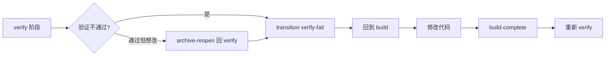
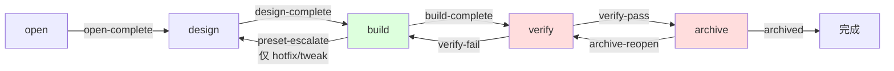

实际开发中,需求变化、代码不满意、验证失败都是常态。Comet 的工作流不是只能向前走——它提供了多条合法的修改和回退路径。本页讲清楚每个场景该怎么操作。

## 先理解:phase 不能手动改

`.comet.yaml` 的 `phase` 是 machine-owned。你不能直接 `set phase build` 回退——会被状态机硬拒绝。回退只能通过**合法的 transition 事件**,每个事件都有守卫检查。

唯一的手动逃逸口是 `COMET_FORCE_PHASE=1`(仅修复用,会输出 WARNING):

```bash
COMET_FORCE_PHASE=1 node "$COMET_STATE" set <name> phase verify
```

正常工作流不要用这个,用下面的合法路径。

## 可用的 transition 事件

| 事件 | 方向 | 触发场景 |
| --- | --- | --- |
| `open-complete` | 向前 open→design | open 产物完成 |
| `design-complete` | 向前 design→build | Design Doc 完成 |
| `build-complete` | 向前 build→verify | 代码完成 |
| `verify-pass` | 向前 verify→archive | 验证通过 |
| **`verify-fail`** | **回退 verify→build** | 验证不通过,用户选修复 |
| **`preset-escalate`** | **回退 build→design** | hotfix/tweak 范围扩大 |
| **`archive-reopen`** | **回退 archive→verify** | 归档前想重新验证 |
| `archived` | 终态 | 归档完成 |

<p align="center">
  
</p>

<p align="center">phase 不能手动改；回退必须走状态机允许的 transition 事件</p>

三个回退事件是关键。

## 场景一:build 阶段中途改 spec

delta spec 在 build 阶段是**活文档**,可以随时修改。按改动规模分三档:

| 规模 | 触发 | 怎么做 | 改 phase 吗 |
| --- | --- | --- | --- |
| 小 | 缺验收场景、边界情况 | 直接编辑 delta spec + 追加 tasks.md,提交时备注原因 | 否 |
| 中 | 接口变化、新组件、数据流变化 | 暂停确认 → 加载 `brainstorming` 更新 Design Doc + delta spec | 否 |
| 大 | 全新 capability | 暂停确认 → `/comet-open` 开新 change | 新 change 从 open 开始 |

<Note>
  小和中档修改<strong>不回退 phase</strong>——它们在 build 阶段原地处理。只有大档（开新 change）才会另起一个完整的 open→design→build 流程。full workflow <strong>没有</strong> build→design 的直接回退,设计问题在 build 阶段通过 brainstorming 原地更新 Design Doc 解决。
</Note>

### 50% 阈值

新增任务超过初始 tasks.md 的 50% 时,视为超出原始计划范围,必须暂停让你选择:拆新 change 或继续在当前 change。

### delta spec 什么时候同步到 main spec

**永远不在 build 阶段同步。** 所有 delta→main spec 合并统一在 archive 阶段完成。build 阶段只编辑 delta spec,不碰 main spec。

## 场景二:写了代码不满意,想回 build 重来

如果已经在 verify 阶段但想改代码:



### verify-fail 回退

验证不通过或你想主动回 build 修复:

```bash
node "$COMET_STATE" transition <change-name> verify-fail
```

**保留什么:**

| 字段 | verify-fail 后 |
| --- | --- |
| `branch_status` | **保留**（不重置） |
| `verification_report` | **保留** |
| `verify_result` | 改为 `fail` |
| `phase` | 改为 `build` |

这意味着如果第一次 verify 已经处理过分支,回到 build 修复后重新 verify 时,分支处理可以跳过（直接 `set branch_status handled`）。

## 场景三:验证通过但归档前想重新检查

verify 通过后进入 archive,但你在归档前确认时发现还想改:

```bash
node "$COMET_STATE" transition <change-name> archive-reopen
```

**保留什么:**

| 字段 | archive-reopen 后 |
| --- | --- |
| `branch_status` | **保留** |
| `verify_result` | 改为 `pending` |
| `phase` | 改为 `verify` |
| `verified_at` | 改为 `null` |

然后进入 `/comet-verify` 重新验证。如果发现问题,再 `verify-fail` 回 build。

## 场景四:hotfix/tweak 做到一半发现要深度设计

hotfix 或 tweak 执行过程中命中升级信号,你想升级到 full:

```bash
node "$COMET_STATE" transition <change-name> preset-escalate
```

原子操作:设 `workflow`/`classic_profile` 为 `full`、`phase` 回退到 `design`、清空 `design_doc`。然后加载 `comet-design` 补 Design Doc,走完整流程。

<Warning>
  <code>preset-escalate</code> 只对 hotfix/tweak 有效,full workflow 不能用。这是预设→full 升级的<strong>唯一合法通道</strong>。
</Warning>

## 场景五:design 阶段修改了 delta spec

design 阶段 brainstorming 时可能需要写 Spec Patch（补充验收场景、修正描述、加边界用例）。写完后**必须重新生成 handoff 更新 hash**:

```bash
node "$COMET_HANDOFF" <change-name> design --write
```

否则 guard 在离开 design 时会发现 hash 漂移而 FATAL。

## 场景六:恢复时发现工作区有未提交改动

每次 `/comet` 恢复时,如果工作区有未提交改动,按 dirty-worktree 协议处理:

| 归因 | 处理 |
| --- | --- |
| 属于当前 change | 折叠进当前任务,不重复编辑 |
| 不属于当前 change（用户改动） | 暂停询问:折叠进当前 change / 拆新 change / 保留不动 / 授权丢弃 |
| 来源不确定 | 暂停,报告文件列表和推理,不推进 phase |

<Warning>
  未提交改动只代表代码事实,<strong>不会自动推进 phase 或勾选 tasks.md</strong>。必须完成归因、验证、同步文档、过 guard 后才推进。
</Warning>

## 场景七:build_pause 卡住了

`build_pause: plan-ready` 是计划生成后的暂停点。恢复时:

| 状态 | 恢复行为 |
| --- | --- |
| isolation/build_mode 已设但 build_pause 还在 | stale pause,自动清除,继续执行 |
| isolation/build_mode 未设 | 回到 plan-ready 恢复点让你选择（不重新生成计划） |
| plan 文件缺失 | 回到 `/comet-build` 处理损坏或重新生成 |
| 所有任务已完成 | 清除 build_pause,走 guard 到 verify |

## 回退路径速查

| 你想做的 | 操作 | 到哪个阶段 | 保留 |
| --- | --- | --- | --- |
| 改 delta spec（小改） | 直接编辑,不回退 | build（不变） | 全部 |
| 改 Design Doc（中改） | 暂停 + brainstorming 原地更新 | build（不变） | 全部 |
| 改代码 | `verify-fail` → build | build | branch_status, verification_report |
| 归档前重新验证 | `archive-reopen` | verify | branch_status |
| hotfix/tweak 升级 full | `preset-escalate` | design | 无（清空 design_doc） |
| 修复紧急状态 | `COMET_FORCE_PHASE=1 set phase` | 任意 | 无（WARNING） |

## 完整回退关系图



红色（verify/archive）是有回退出口的阶段。绿色（build）是可以原地改 spec 的阶段。

## 常见问题

<AccordionGroup>
  <Accordion title="我能直接编辑 .comet.yaml 改 phase 吗">
    不能。phase 是 machine-owned,直接改会被拒绝。用 `transition` 事件回退,或用 `COMET_FORCE_PHASE=1`（仅修复,会 WARNING）。
  </Accordion>
  <Accordion title="full workflow 能从 build 回到 design 吗">
    不能直接回。full workflow 的设计问题在 build 阶段通过 brainstorming 原地更新 Design Doc 解决,不回退 phase。只有 hotfix/tweak 能用 `preset-escalate` 回 design。
  </Accordion>
  <Accordion title="verify-fail 后 branch_status 被重置了吗">
    没有。verify-fail 保留 branch_status 和 verification_report。这意味着第一次 verify 如果已经处理过分支,修复后重新 verify 不用再做分支处理。
  </Accordion>
  <Accordion title="build 阶段改了 delta spec,要同步 main spec 吗">
    不要。delta→main spec 合并统一在 archive 阶段完成。build 阶段只编辑 delta spec。
  </Accordion>
</AccordionGroup>

## 下一步

- [自动推进机制](/zh/concepts/auto-transition) — transition 事件和 next 命令
- [状态与配置](/zh/concepts/state-management) — 状态机硬约束
- [恢复中断的工作](/zh/guides/resuming-workflow) — stale pause 和 dirty worktree 恢复
- [build 阶段](/zh/phases/build) — spec 增量更新三档
- [verify 阶段](/zh/phases/verify) — verify-fail 决策
