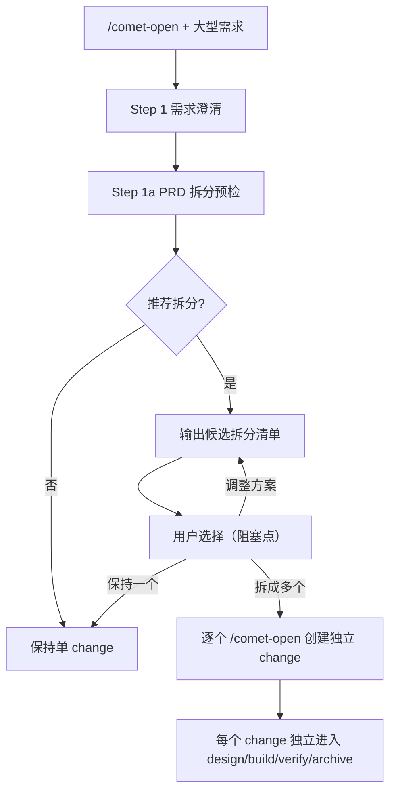

现实需求开发经常从一份大型 PRD、产品路线图或完整方案开始。直接塞进一个 change 会导致任务膨胀、delta spec 混乱、一个部分失败阻塞整体。Comet 的 PRD 拆分（open 阶段）在创建 artifacts 前就帮你把大需求拆成多个可独立流转的 change。

## 它解决什么问题

| 问题 | 不拆分 | 拆分后 |
| --- | --- | --- |
| 任务数量 | 一个 change 塞几十个任务，恢复成本高 | 每个 change 任务聚焦，恢复快 |
| delta spec | 多个能力混在一个 delta，范围模糊 | 每个 change 一个清晰 delta |
| 交付节奏 | 必须整体完成才能归档 | 各 change 独立设计、验证、归档 |
| 失败隔离 | 一部分延期阻塞全部 | 各部分独立推进 |
| 团队协作 | 所有人挤在一个 change | 不同人/小组并行不同 change |

## 什么时候触发拆分

PRD 拆分预检在 `/comet-open` 的 **Step 1a** 触发，条件是输入属于以下任一情况：

- 大型 PRD、路线图、完整产品方案
- 澄清摘要包含多个**独立**能力、模块、用户路径或里程碑

满足以下**任一**信号时，Comet 会推荐拆分：

| 信号 | 含义 |
| --- | --- |
| 多个可独立设计/构建/验证/归档的 capability | 这些能力互不依赖，没必要绑在一起 |
| 多个模块或用户路径，且其中一部分可独立交付 | 比如后端 API 和前端页面可以分开上 |
| 存在明显分阶段里程碑 | 比如 MVP → 增强 → 优化 |
| 预计产生多个 delta spec 或超过 3 个大任务 | 说明范围已经超出单个 change |
| 任一部分失败/延期不应阻塞其他部分 | 团队需要按优先级分批交付 |

## 拆分流程



<p align="center">
  
</p>

<p align="center">大型 PRD 先拆成独立 change，范围、依赖和验收都写清楚后再逐个推进</p>

### 候选拆分清单

推荐拆分时，Comet 会为每个候选项列出：

- 建议 change 名称
- 目标与范围边界
- 明确非目标
- 依赖关系或推荐执行顺序
- 对应的核心验收场景

### 用户的三选一（阻塞点）

在创建任何 proposal/design/tasks **之前**，Comet 必须暂停让你选择：

1. **创建多个 OpenSpec changes** — 按候选拆分逐个创建独立 change。
2. **保持为一个 change** — 继续单 change 流程，并在 proposal/design/tasks 里记录不拆分的原因。
3. **调整拆分方案** — 说明调整方向后，重新输出候选拆分清单并再次确认。

<Warning>
  拆分确认前不会创建 proposal.md、design.md 或 tasks.md。选"保持一个"时，Comet 会记录不拆分原因，方便后续追溯。
</Warning>

## 每个 change 如何创建

选择拆分后，每个被接受的拆分项都通过独立的 `/comet-open` 创建。这里禁止使用 `/opsx:new`，原因如下：

- `/comet-open` 同时创建 OpenSpec artifacts **和** `.comet.yaml`，确保每个 change 都进入 Comet 状态机。
- `/opsx:new` 只创建 OpenSpec artifacts，change 会落在状态机之外，无法用 `/comet` 恢复和守卫。

批量拆分模式下：

- 进入每个拆分项时标注"已确认拆分项"，携带该拆分项的目标、范围、非目标和验收场景。
- 已确认拆分项默认跳过 PRD 拆分预检（除非该拆分项本身仍明显包含多个独立 capability）。
- **单个拆分项完成 open 阶段后不会自动流转到 `/comet-design`**。拆分完毕后暂停，让你选择开始哪一个 change。

## 拆分后怎么推进

拆分产生多个 active change。推进方式：


- 每个 change 独立走 design → build → verify → archive。
- 一个 change 归档后，用 `/comet` 选择下一个 active change 继续。
- 各 change 之间可以有依赖顺序（候选拆分清单里会标注），但 Comet 不强制串行——你可以并行推进独立的部分。

## 中断了怎么恢复

批量拆分不新增专用状态文件，靠现有 active changes 做最小断点恢复：

- 拆分过程中断后，恢复时先检查已创建的 active changes。
- 已存在且包含 `.comet.yaml` 的拆分项**不会重复创建**。
- 未创建的拆分项按你已确认的拆分清单继续通过 `/comet-open` 创建。
- 如果对话里已确认的拆分清单不可恢复，Comet 会重新向你确认拆分清单再继续。

## 真实场景示例

### 场景一：用户系统重构

输入一份 PRD，包含"用户注册登录、个人资料、权限管理、操作审计"四个模块。

```
你：/comet 帮我实现完整的用户系统，包含注册登录、个人资料、权限管理、操作审计
```

Comet 完成需求澄清后，Step 1a 判断这是 4 个独立 capability，推荐拆分：

| 候选 change | 目标 | 非目标 | 依赖 |
| --- | --- | --- | --- |
| `user-auth` | 注册、登录、token 刷新 | 权限模型、审计 | 无 |
| `user-profile` | 个人资料 CRUD、头像上传 | 认证逻辑 | `user-auth` |
| `user-rbac` | 角色和权限分配 | 资料编辑 | `user-auth` |
| `user-audit` | 操作审计日志记录和查询 | 业务逻辑实现 | `user-auth` |

你选择"创建多个 changes"。Comet 逐个创建 `user-auth`、`user-profile`、`user-rbac`、`user-audit`，每个都是独立 active change。

推进时先从 `user-auth`（无依赖）开始：

```
/comet
```

Comet 列出 4 个 active change，你选 `user-auth`，走完 design → build → verify → archive。然后继续 `user-profile`。

### 场景二：平台迁移

输入一份迁移方案，包含"替换数据库、重写数据访问层、迁移 API、更新前端适配"。

```
你：我们要把项目从 MySQL 迁移到 PostgreSQL，包括 ORM 替换、API 层改造和前端字段适配
```

Comet 判断这有明显的分阶段里程碑（后端先行，前端跟进），推荐拆分：

| 候选 change | 目标 | 推荐顺序 |
| --- | --- | --- |
| `db-migrate-postgres` | 数据库 schema 迁移、数据搬迁脚本 | 1 |
| `rewrite-data-access` | ORM/数据访问层重写 | 2（依赖 1） |
| `api-layer-adapt` | API 层字段和类型适配 | 3（依赖 2） |
| `frontend-field-adapt` | 前端字段和类型适配 | 4（依赖 3） |

这里依赖是强串行的，候选拆分清单标注了推荐执行顺序。你按 1→2→3→4 依次推进。

### 场景三：不需要拆分

输入一个聚焦需求："给现有笔记模块加一个富文本编辑器和图片粘贴功能"。

Comet 澄清后判断这是一个 capability（笔记编辑增强），不满足拆分信号（没有多个独立 capability、没有分阶段里程碑），**不推荐拆分**，直接进入单 change 流程。

如果 Comet 推荐拆分但你判断这次就该一起做（比如前端和后端改动必须同步上线），你选"保持为一个 change"，Comet 会在 proposal 里记录不拆分原因。

## 拆分和轻量预设的关系

PRD 拆分发生在 **full workflow 的 open 阶段**。hotfix 和 tweak 预设不涉及拆分——它们本身就是单个小改动。如果一个 hotfix 过程中发现范围扩大（跨模块、新 API、schema 变更），应升级到 full，再由 full 的 open 阶段判断是否需要拆分。

详见[轻量预设](/zh/presets/hotfix)。

## 下一步

- [工作流概念](/zh/concepts/workflow) — 理解 open 阶段在整个五阶段中的位置
- [open 阶段](/zh/phases/open) — open 阶段的完整步骤和产物
- [项目文件结构](/zh/guides/project-structure) — 拆分后多个 change 的目录结构
