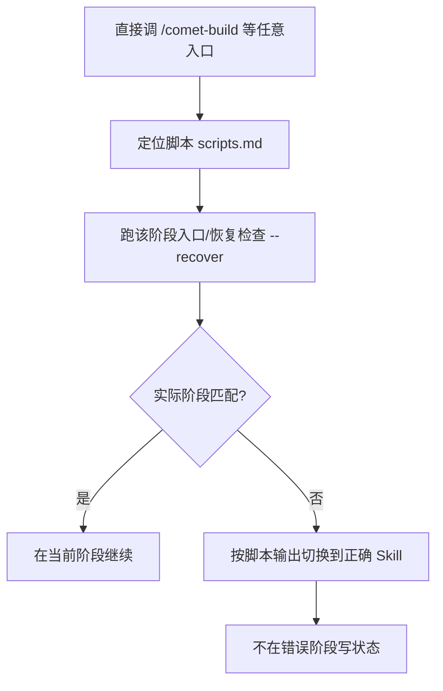

会话中断、上下文压缩或换设备后，输入 `/comet 继续`。Comet 先读取项目配置，进入 `/comet-native` 或 `/comet-classic`，再由对应工作流读取磁盘状态。两套工作流分别管理自己的 change。

## 最短路径

在 Agent 平台里输入：

```text
/comet 继续
```

Comet 不依赖对话历史：Classic 重读项目配置、OpenSpec、`.comet.yaml` 与运行证据。

<Tip>
  <strong>
    恢复不需要先跑 <code>comet status</code> 或 <code>comet doctor</code>。
  </strong>
  那两个是诊断命令，只在<strong>看起来有问题</strong>时才用（CLI/Skill
  装坏了、change 不路由、证据对不上）。正常恢复就是 <code>/comet</code>{" "}
  一步到位。
</Tip>

## 也可以直接说“继续”

0.4.0-beta.4 起，`comet init` 和 `comet update` 会把一段 Comet 恢复说明合并进项目的 `AGENTS.md` 和 `CLAUDE.md`。长程任务经过上下文压缩、跨会话或跨设备继续时，Agent 可能已经忘记当前请求原本属于 Comet，而用户也未再次输入 `/comet`。此时 Agent 可以先运行只读的 `comet resume-probe`，判断“继续刚才的登录重构”是否对应现有 change，再决定是否重新进入工作流。

| 场景                                                | 探测结果                                 |
| --------------------------------------------------- | ---------------------------------------- |
| 默认工作流只有一个明确目标，状态允许恢复            | 返回 `auto_resume`，进入对应永久入口     |
| 有多个候选、状态损坏或需要用户选择                  | 返回 `ask_user`，只问一个问题            |
| 只是问问题、明确不走 Comet，或当前已在 Comet 流程内 | 返回 `out_of_scope`，不重复进入 workflow |
| 没有 active Comet change                            | 返回 `none`，不执行恢复                  |

这段说明只约束 Comet 的恢复探测，并会保留文件中已有的用户规则。探测命令先解析配置，再只检查一套工作流；配置损坏时不会回退。`.comet/config.yaml` 中的 `ambient_resume: false` 可以关闭普通请求触发的自动检查。它不会影响显式 `/comet`，也不会绕过已有决策点。

详见[恢复探测命令](/zh/cli/resume-probe)。

## Classic 如何恢复

<Note>
  这一节同样是 <strong>后台原理</strong>：解释 <code>/comet-classic</code>{" "}
  内部重读哪些文件、按什么规则路由到下一个阶段。你只需要输入{" "}
  <code>/comet 继续</code>，下面的路由由 Comet 自动完成。
</Note>

`/comet-classic` 的恢复能力依赖几点机制：

| 机制                         | 说明                                                                                                                                      |
| ---------------------------- | ----------------------------------------------------------------------------------------------------------------------------------------- |
| **重读文件状态，不依赖对话** | 每次恢复都重新执行发现活跃 change + 读 `.comet.yaml`，不靠聊天历史猜阶段                                                                  |
| **文件状态优先，自动修正元数据** | 如果 `.comet.yaml` 和实际文件冲突，以文件为准，Comet 自动修正 `.comet.yaml` 后继续                                                        |
| **按阶段固定规则路由**       | 根据 `phase`/`workflow`/`verify_result` 等字段，路由到对应的阶段 Skill（含预设：build 阶段 hotfix→`/comet-hotfix`、tweak→`/comet-tweak`） |

恢复时的路由（命中即停，以文件状态为准）：

| 当前状态                                  | `/comet-classic` 路由到                                        |
| ----------------------------------------- | -------------------------------------------------------------- |
| `archived: true`                          | 流程已完成                                                     |
| `verify_result: pass`                     | `/comet-archive`（先做归档前确认）                             |
| `verify_result: fail`                     | 验证失败暂停点（需要你选修复或接受偏差）                       |
| `phase: verify` 或 tasks 全勾             | `/comet-verify`                                                |
| `phase: build`                            | 按 workflow：`/comet-hotfix` / `/comet-tweak` / `/comet-build` |
| `phase: design` 或有 change 无 Design Doc | `/comet-design`                                                |
| `phase: open` 或 `.comet.yaml` 缺失       | `/comet-open`                                                  |
| 无活跃 change                             | `/comet-open`                                                  |

只要有**一个**活跃 Classic change，`/comet-classic` 会自动选中它；有**多个**时列出清单让你选一个。

如果通过自然语言恢复，有多个 active change 时 Comet 不会替你自动选定；恢复探测会返回 `ask_user`，等待你点名目标。

### Classic Change 的工作区复用

创建或恢复 Classic change 时，Comet 会先读取 change 记录的分支和 worktree 绑定。匹配的已登记 worktree 会直接复用；找不到匹配 worktree 但分支仍存在时，恢复流程会重建它。当前目录、分支和 worktree 不匹配时，Comet 会暂停等待选择，不会静默改用另一个工作区。

从目标项目目录输入 `/comet` 或 `/comet 继续`。如果有多个 active change，先选择目标，再继续 Classic；不要手工复制 change 目录来恢复工作。

## 换设备/换平台也能恢复

可跨设备恢复的 Classic 状态保存在仓库文件里：`.comet/config.yaml`、OpenSpec 产物根（新项目为 `docs/openspec/`）、change 的 `.comet.yaml` 和运行证据、`docs/superpowers/`。所以在另一台设备或另一个 Agent 平台打开同一个仓库，`/comet` 能从对应文件恢复。Native change 的跨设备恢复见[恢复手册](/zh/native/recovery-playbook)。

<Note>
  唯一的注意点：未提交的工作区改动不会跟着 <code>git push</code>{" "}
  走。跨设备前先把改动 commit 推上去，否则新设备上会是干净工作区的恢复（
  <code>tasks.md</code> 的勾选状态仍然有效）。
</Note>

### 跨设备零上下文恢复断点

下图展示跨设备的断点恢复：只要仓库一致，不管在哪台设备、哪个平台，`/comet` 都能从文件状态重建断点继续，无需额外操作或上下文传递。


## 上下文压缩后怎么办

如果 Classic change 所在的 Agent 平台自动压缩了上下文，重新输入 `/comet`。项目配置会再次进入 Classic，内部 `/comet-classic` 按恢复协议重载状态；必要时读取 `brainstorm-summary.md`、handoff 交接包和 `.comet/subagent-progress.md`。你不需要手动操作这些文件。

## 从任意阶段入口恢复

Classic 正常恢复使用 `/comet`。阶段和预设入口只用于手动控制或调试：`/comet-open`、`/comet-design`、`/comet-build`、`/comet-verify`、`/comet-archive`、`/comet-hotfix`、`/comet-tweak`。

这里有一条确定性保证：每个阶段 Skill 进入时都会先定位自己的脚本，再执行该阶段的**入口检查或恢复检查**；阶段始终以当前文件状态为准。

```bash
comet state check <change-name> <phase> --recover
```

- 如果检查发现实际的 phase、workflow 或证据属于**另一个** Skill，按脚本输出和 `/comet-classic` 路由规则切换，**不要在错误的阶段里继续写状态**。
- 如果工作树有未提交改动，先用 `comet/reference/dirty-worktree.md` 的规则归因。



<Tip>
  已知当前阶段时，可以跳过统一入口和 Classic 内部路由，直接进入对应阶段。入口检查会拦截与文件状态不匹配的调用。
</Tip>

## build 阶段恢复的特殊情况

build 阶段的恢复最复杂，但大多数情况 `/comet-classic` 也能自动处理：

| 情况                                                                     | 行为                                                                |
| ------------------------------------------------------------------------ | ------------------------------------------------------------------- |
| `build_pause: plan-ready` 且配置齐全                                    | 重新发起同一次联合决策确认，你确认后清除暂停标记并继续            |
| `build_pause: plan-ready` 且 plan 存在，但执行配置未设                   | 回到 plan-ready 联合决策，**让你补选**执行方式、TDD 和审查模式（不重新生成 plan） |
| `build_pause: plan-ready` 但 plan 文件缺失                               | 状态损坏，回 `/comet-build` 修复或重新生成 plan                     |
| `isolation`/`build_mode`/`tdd_mode` 未设                                 | 回 `/comet-build` 对应步骤**让你补选**                              |
| 都已设，有未完成任务                                                     | 读 tasks.md 下一个未勾选任务继续执行                                |

subagent 模式（`build_mode: subagent-driven-development`）恢复时，主会话**不会**直接执行任务，而是重新按后台子代理调度规则推进，只负责协调。

## 有未提交改动时

如果工作区有未提交改动，Comet 会自动做**归因**，不需要你先解释改了什么：

- 改动属于当前 change → 折叠进去继续
- 和当前 change 无关 → 暂停问你怎么处理（并入 / 拆新 change / 保留 / 丢弃）
- 来源不确定 → 暂停汇报文件列表和判断依据

构建产物（`node_modules/`、`dist/` 等 `.gitignore` 的）会自动排除，不视为用户改动。

<Warning>
  未提交改动（dirty worktree）只代表代码事实，<strong>不会自动推进</strong>{" "}
  <code>.comet.yaml</code> 的 <code>phase</code> 或勾选 <code>tasks.md</code>
  ，只有完成归因、验证、过阶段 guard 后才推进状态。
</Warning>

## 需要你介入的情况

`/comet-classic` 能自动推进无歧义的衔接，但**决策点**必须等你明确选择。恢复时常见的需要你介入的情况：

- **验证失败**（`verify_result: fail`）：需要你决定修复还是接受偏差
- **plan-ready 暂停**：需要你选择隔离和执行方式
- **build 决策缺失**：需要你补选 `isolation`/`build_mode`/`tdd_mode`
- **无法归因的未提交改动**：需要你说明改动归属
- **多个活跃 change**：需要你选择恢复哪个

其余是各阶段固有的停顿点（见[五阶段停顿点](/zh/concepts/decision-points)）。这些之外，`/comet-classic` 都会自动推进。

## 什么时候才用 comet status / comet doctor

这两个是**诊断工具**，不是恢复的必经步骤：

| 命令           | 什么时候用                                                                          |
| -------------- | ----------------------------------------------------------------------------------- |
| `comet status` | 想看“我在哪个阶段、声明的产物是否都还在”：`/comet-classic` 路由不对、或证据对不上时 |
| `comet doctor` | 环境或安装出问题：CLI/Skill 缺失、`.comet.yaml` 格式坏掉、`/comet-classic` 起不来时 |

```bash
comet status        # 看活跃 change 的 phase/任务/runtime_eval
comet doctor        # 诊断安装、环境、Skill 完整性
```

`runtime_eval` 会告诉你声明的步骤证据是否真在磁盘上，失败时会提示 `run <命令> or restore missing evidence`。

## 下一步

- [恢复探测命令](/zh/cli/resume-probe) — 了解自然语言恢复前的只读探测
- [状态损坏与恢复](/zh/guides/state-recovery) — `/comet-classic` 路由不对或状态坏了怎么办
- [项目文件结构](/zh/guides/project-structure) — 状态都存在哪些文件里
- [自动推进机制](/zh/concepts/auto-transition) — 恢复后的自动衔接
- [五阶段停顿点和用户选择点](/zh/concepts/decision-points) — 哪些地方需要你介入
