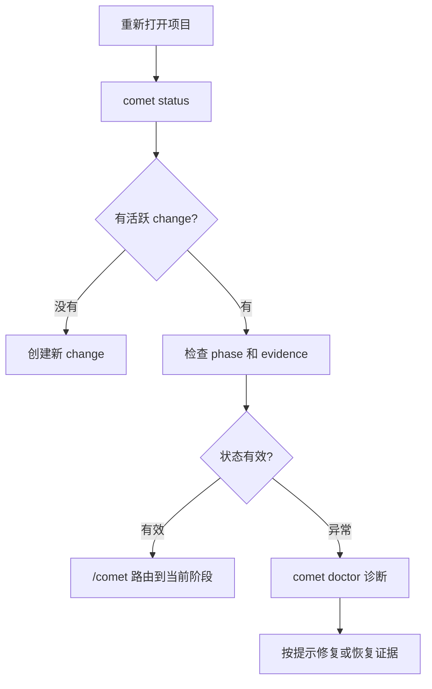

恢复时先不要让 Agent 猜。让 Comet 重新读取文件化状态。

## 最短路径

```bash
comet status
```

然后在 Agent 平台里输入：

```text
/comet
```

如果 `status` 显示诊断问题，再运行：

```bash
comet doctor
```

## 恢复判定顺序



## build 阶段恢复

如果 `phase: build`，重点看：

- `build_pause`
- `plan`
- `build_mode`
- `isolation`
- `subagent_dispatch`
- 未完成的 `tasks.md` 项

`build_pause: plan-ready` 表示计划已生成，下一步是选择隔离方式和执行方式。

## verify 失败恢复

如果 `verify_result: fail`，不要直接归档。先决定修复还是接受偏差。选择修复后回到 build。

## 有未提交改动时

Comet 会把未提交改动当作恢复风险。先检查这些改动属于当前 change、用户改动还是无关改动，再继续。
