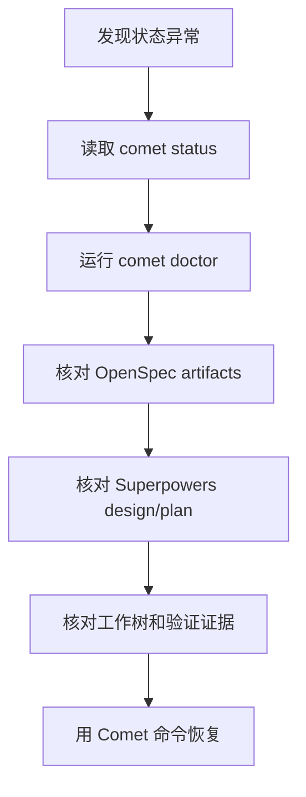

状态损坏时，目标是恢复真实事实，而不是强行改字段让流程继续。

## 常见症状

| 症状 | 可能原因 | 先做什么 |
| --- | --- | --- |
| `comet status` 没有下一步 | `.comet.yaml` 缺失或格式异常 | 运行 `comet doctor` |
| build 无法进入 verify | 缺少 `build_mode`、`isolation` 或 `tdd_mode` | 回到 build 选择 |
| verify 通过但不能 archive | 缺验证报告或分支状态未处理 | 补验证报告 |
| archive 后仍显示 active | 手工移动目录或状态没同步 | 用 OpenSpec 状态核对 |

## 诊断命令

```bash
comet status --json
comet doctor --json
```

JSON 输出适合给 Agent 或自动化工具读取。普通用户可以先看文本输出。

## 恢复原则

- 以 OpenSpec 文件、Design Doc、Plan、测试结果和实际工作树为证据。
- 不要手工写 machine-owned Run 字段。
- 不要把 `build_pause` 当成 `build_mode`。
- 不要跳过 verify 失败决策点。
- 不要手工伪造 archive 状态。

## 推荐处理流程


