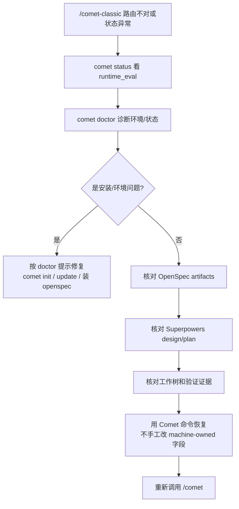

Classic 正常恢复只需要统一入口 `/comet`（见[恢复中断的工作](/zh/guides/resuming-workflow)）。配置进入 Classic 后，内部 `/comet-classic` 会读取文件状态并选择阶段；本页只处理该内部路由异常或状态损坏。

状态损坏时，目标是**恢复真实事实**，而不是强行改字段让流程继续。

<p align="center">
  
</p>

<p align="center">状态恢复先诊断真实文件证据，再按提示修复；不要为了推进流程手工伪造状态</p>

## 先判断：是状态坏了，还是只是中断

| 情况                               | 这算什么                   | 怎么办                                                            |
| ---------------------------------- | -------------------------- | ----------------------------------------------------------------- |
| 会话断了、上下文压缩了、换了设备   | 正常中断                   | 直接 `/comet`（见[恢复中断的工作](/zh/guides/resuming-workflow)） |
| 自然语言请求命中多个 active change | 需要确认目标，不是状态损坏 | 查看恢复探测结果中的 `reason`，点名要恢复的 change                |
| 工作树有未提交改动                 | 需要先归因，不是状态损坏   | 确认改动属于哪个 change，再继续                                   |
| `/comet-classic` 路由到的阶段不对  | 可能元数据和文件冲突       | `/comet-classic` 会以文件为准自愈；若仍不对，跑诊断               |
| `.comet.yaml` 缺失或格式异常       | 状态损坏                   | `comet doctor` 诊断                                               |
| 声明的产物/证据在磁盘上找不到      | 证据缺失                   | `comet status` 看 `runtime_eval`                                  |

## 诊断命令

```bash
comet resume-probe . --utterance "继续刚才的工作"  # 只读判断是否应恢复
comet status        # 看活跃 change 的 phase、任务完成度、runtime_eval
comet doctor        # 诊断安装、环境、Skill 完整性、.comet.yaml 有效性
```

加 `--json` 适合给 Agent 或自动化工具读；普通用户先看文本输出。

恢复探测只负责进入 workflow 前的判断。它返回 `ask_user` 时通常代表多个 change、未提交改动或用户决策点，不等于状态已经损坏。详见[恢复探测命令](/zh/cli/resume-probe)。

### comet status 看什么

每个活跃 change 报告：`phase`、任务 `done/total`、`workflow | build_mode`、`run_step`、`runtime_mode`、`runtime_eval`（声明的步骤证据是否真在磁盘上）、`design`、`plan`、`verify_result`，以及 `next:` 提示。

`runtime_eval` 失败时会提示 `run <命令> or restore missing evidence (...)`——按提示补证据或恢复。

### comet doctor 看什么

检查 Comet CLI 版本、openspec CLI、Superpowers、工作目录（`docs/superpowers/specs`、`docs/superpowers/plans`）、各平台 Skill 完整性、脚本是否存在、CodeGraph，以及每个 change 的 `.comet.yaml` 有效性和 `runtime_eval`。常见修复提示：`npm install -g @fission-ai/openspec@latest`、`run: comet init`、`run: comet update --scope ...`。

## 常见症状和处理

| 症状                                       | 可能原因                               | 先做什么                                                                  |
| ------------------------------------------ | -------------------------------------- | ------------------------------------------------------------------------- |
| `comet status` 没有下一步                  | `.comet.yaml` 缺失或格式异常           | `comet doctor`                                                            |
| build 无法进入 verify                      | 缺 `build_mode`/`isolation`/`tdd_mode` | 重新调用 `/comet`，让 Classic 路由回 build 补选                           |
| verify 通过但不能 archive                  | 缺验证报告、分支绑定漂移或状态异常     | 补验证报告、切回绑定分支，并让 verify guard 保持 `branch_status: pending` |
| archive 后仍显示 active                    | 手工移动目录或状态没同步               | 用 `openspec status` 核对，用归档脚本重跑（可恢复）                       |
| `/comet-classic` 报 `.comet.yaml` 格式异常 | 文件被手工改坏                         | `comet doctor`；严重时从 git 恢复 `.comet.yaml`                           |

## 恢复原则

- **以文件为证据**：OpenSpec artifacts、Design Doc、Plan、测试结果、实际工作树是事实来源。
- **不要手工写 machine-owned Run 字段**（`.comet/run-state.json` 等）。
- **不要把 `build_pause` 当成 `build_mode`**——它们是不同字段。
- **不要跳过 verify 失败决策点**——必须由你选修复或接受偏差。
- **不要手工伪造 archive 状态**——归档由 `/comet-archive` 或 `comet archive` 完成。
- **不要手工编辑 `.comet.yaml` 推进 phase**——用 `comet guard --apply` 或 `comet state transition`。

## .comet.yaml 缺失或坏了怎么办

`/comet-classic` 对坏状态有兼容路径：

- `.comet.yaml` 缺失时，回退到 `openspec status --json` + `tasks.md` + `docs/superpowers/` 文件检查重建状态。
- 格式异常时，以文件状态为准，用 `comet state set` 修正后继续。
- `phase: open` 但 proposal/design/tasks 已完整时，先 guard `--apply` 修正状态再判定。

如果 `/comet-classic` 自己修不了（比如文件被严重改坏），从 git 恢复 `.comet.yaml`，再跑 `comet doctor` 确认。

## 推荐处理流程



## 下一步

- [恢复探测命令](/zh/cli/resume-probe) — 区分可自动恢复、需要确认和不应进入 workflow 的请求
- [恢复中断的工作](/zh/guides/resuming-workflow) — Classic 正常中断只需 `/comet`
- [项目文件结构](/zh/guides/project-structure) — 状态都存在哪些文件里
- [状态管理](/zh/concepts/state-management) — `.comet.yaml` 字段和状态守卫
