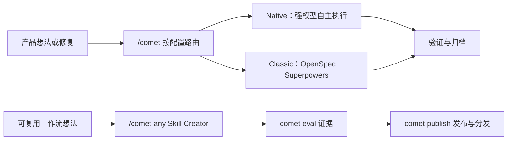

Comet 是面向 AI 编码的可恢复工作流与 Skill 平台。它提供两套独立需求工作流：
- 面向 Fable 5、GPT-5.6 等强模型的自包含 Native模式
- 面向较低能力档模型、组合 OpenSpec 与 Superpowers 的 Classic模式

两者与 Skill Creator、Eval 和发布门禁共同组成一套从需求到归档、再到 Skill 分发的工具链。

  

Comet 把想法、状态、证据和 Skill 分发收拢到同一个可恢复工作台

## 你可以用 Comet 做什么

- 用 `/comet` 按项目配置进入 Native 或 Classic，把一次产品或代码变更从想法推进到归档。
- 用 `/comet-any` 把自己的工作流整理成可复用 Skill。
- 用 `comet eval` 为 Skill 生成发布前证据。
- 用 `comet publish` 审核、批准、发布并分发 `/comet-any` 产物。
- 用 `comet status` 和 `comet doctor` 看清当前阶段、下一步和恢复建议。

## 与普通提示词不同的地方

普通提示词依赖对话历史。Comet 依赖文件化状态和可检查证据。

| 关心点         | 没有 Comet                                                 | 使用 Comet                                                                                                                                                                           |
| -------------- | ---------------------------------------------------------- | ------------------------------------------------------------------------------------------------------------------------------------------------------------------------------------ |
| 中断恢复       | 需要 Agent 回忆上下文，还没有开始写代码就花费大量 Token    | 从 `.comet/config.yaml`、Native/Classic 各自状态和运行证据恢复，不依赖原对话猜现场                                                                                                   |
| 阶段边界       | Agent 容易跳过需求或验证，如代码实现完毕但文档未打勾、在不该写代码的阶段直接写代码               | Native 约束 Shape/Build/Verify/Archive 的结果与证据；Classic 提供五阶段流程有明确质量门禁，**不在对应阶段完成任务无法退出当前阶段**，强制Agent对应阶段做完所有事情                                                                                                |
| 自动推进       | 需要人工记忆大量 Skill 顺序并逐步接管                      | **自动推进**，Comet会自动推进核心Skill流程，**除必要HITL交互点以外，无需用户接管**                                                                                                            |
| 约束强度       | 同一套流程很难同时适配不同能力档模型                       | 强模型使用轻方法约束的 Native；较低能力档模型使用 Classic，另有 hotfix/tweak 轻量预设                                                                                                |
| Skill 产物形态 | 只是一个 `SKILL.md` 单文件，没法组合、没法带依赖、没法分发 | `/comet-any` 生成稳定**组合 Skill Bundle**——可拼装 rule、hook、Engine 元数据；**可评审**，**可分发**（像 `comet init` 一样通过 `comet publish distribute` 落地到 33 个 AI 编码平台） |
| Skill 质量验证 | 靠手感，Agent 跑一遍没报错就算通过                         | `comet eval` 跑出**可浏览的评估报告**，eval/review/approval/readiness 全部**绑定当前 hash**，证据可追溯                                                                              |

  

Comet 不靠对话记忆猜现场，而是从文件化状态和证据链恢复工作

## 主要入口

做项目变更时统一调用 `/comet`；它会读取项目配置并进入下面的 Native 或 Classic 工作流。工作流专用 Skill 是内部永久入口，也可用于高级调试，但不是日常必记命令。

<CardGroup cols={2}>
  <Card title="Native 工作流" icon="meteor" href="/zh/concepts/native-workflow">
    面向 Fable 5、GPT-5.6 等强模型，保留需求、状态和证据，把实现方法交给模型自主选择。
  </Card>
  <Card title="经典 Spec 工作流" icon="signature" href="/zh/concepts/workflow">
    面向 Fable 5、GPT-5.6 以下且需要更细阶段指导的模型，使用 OpenSpec + Superpowers 强约束。
  </Card>
  <Card title="CLI 操作台" icon="terminal" href="/zh/cli/quickstart">
    适合安装、诊断、更新、Skill 管理、评估和发布。
  </Card>
  <Card title="/comet-any Skill Creator" icon="blackberry" href="/zh/skill-creator/getting-started">
    适合创建、优化或组合可复用 Skill。
  </Card>
  <Card title="Skill 评估系统" icon="vial-circle-check" href="/zh/eval/quickstart">
    适合用可浏览报告验证 Skill 行为，并作为发布证据。
  </Card>
</CardGroup>

## 推荐阅读—Comet 与业界实践对照

<Danger title="🏆 Comet 与业界实践对照" icon="scale-balanced">
  想了解 Comet 的做法和业界哪些实践对应？这篇文章按维度列出 Comet 在评估方法论、运行时与工作流、Skill 创作与分发上的每项做法，标注它对应 SkillsBench、LangChain、腾讯、阿里等哪些业界参考。如果你关心"Comet 为什么这么做、业界是怎么做的"，从这里开始。

**[阅读全文 →](/zh/tech-blog/comet-vs-industry)**

</Danger>

## 安装后你会得到什么

`comet init` 会把 Comet Skill、Rules、Hook、脚本和平台适配文件安装到你选择的项目级或全局位置。

Comet 0.4.0-beta.1 的运行时只依赖 Node.js。内置状态、守卫、交接和归档脚本都通过 Node 入口执行，不再把 Bash、Git Bash 或 WSL 当作工作流前提。

<Tip>
  如果你只想开始一次项目变更，先读 [快速开始](/zh/quickstart)。如果你想创建可复用 Skill，直接看
  [组合任意 Skill 快速上手](/zh/skill-creator/getting-started)。
</Tip>
