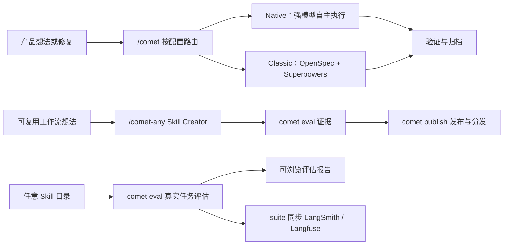

Comet 为 AI 编码任务提供可恢复的开发工作流，并提供 Skill 创建、评估和发布工具。项目可以选择两套相互独立的工作流：

- **Native** 面向 Fable 5、GPT-5.6 及同档模型。它约束需求、状态和验收结果，由模型选择实现方法。
- **Classic** 面向需要明确过程约束的模型。它组合 OpenSpec 与 Superpowers，按五个阶段推进变更。

  

项目配置、change 文档和验证证据共同保存任务状态

## 你可以用 Comet 做什么

- 用 `/comet` 按项目配置进入 Native 或 Classic，创建、实现、验证并归档一次变更。
- 用 `/comet-any` 把自己的工作流整理成可复用 Skill。
- 用 `comet eval` 在真实任务中评估本地 Skill。
- 用 [`comet dashboard`](/zh/dashboard/overview) 查看 Classic、Native 和 Supervisor Change 的阶段、任务、验收、风险、产物与 Git 信息。Dashboard 是只读界面。
- 用 `comet publish` 审核、批准、发布并分发 `/comet-any` 产物。
- 用 `comet status` 和 `comet doctor` 查看当前阶段、下一步和诊断结果。

## Comet 保存哪些状态

Comet 将需求、工作流状态和验证结果写入项目文件。恢复任务时，Agent 重新读取这些文件，不需要依赖上一轮对话内容。

| 场景 | Comet 的处理方式 |
| --- | --- |
| 中断恢复 | 从 `.comet/config.yaml`、change 状态和已有证据确定恢复位置 |
| 阶段控制 | Native 检查 Shape、Build、Verify、Archive 的结果；Classic 使用五阶段 Guard |
| 工作区管理 | 记录 change 与分支或 worktree 的绑定；目录不匹配时暂停 |
| 并行任务 | Supervisor Change 按依赖准备子任务工作区，并在集成后统一验收 |
| 个人记忆 | 保存用户明确要求长期沿用的偏好，并支持查看、纠正、遗忘和回滚 |
| 项目知识 | 保存带来源和适用范围的项目记录；来源变化后重新判断有效性 |
| Skill 评估 | 在隔离环境运行任务，保存检查结果、rubric、`pass@k`、`pass^k` 和失败归因 |

  

Comet 根据项目文件恢复 change，而非依赖上一轮对话

## 主要入口

做项目变更时调用 `/comet`。它读取项目配置并进入 Native 或 Classic。工作流专用 Skill 主要用于内部路由和高级排障。

<CardGroup cols={2}>
  <Card title="Native 工作流" icon="meteor" href="/zh/concepts/native-workflow">
    面向 Fable 5、GPT-5.6 及同档模型，保存需求、状态和证据，由模型选择实现方法。
  </Card>
  <Card title="经典 Spec 工作流" icon="signature" href="/zh/concepts/workflow">
    面向需要明确阶段指导的模型，使用 OpenSpec 与 Superpowers 推进五阶段流程。
  </Card>
  <Card title="CLI 操作台" icon="terminal" href="/zh/guides/install-and-update">
    适合安装、诊断、更新、Skill 管理、评估和发布。
  </Card>
  <Card title="/comet-any Skill Creator" icon="blackberry" href="/zh/skill-creator/getting-started">
    适合创建、优化或组合可复用 Skill。
  </Card>
  <Card title="Skill 评估系统" icon="vial-circle-check" href="/zh/eval/quickstart">
    适合用可浏览报告验证 Skill 行为，并作为发布证据。
  </Card>
</CardGroup>

## 相关设计资料

<Info title="Comet 与业界实践对照" icon="scale-balanced">
  [Comet 与业界实践对照](/zh/tech-blog/comet-vs-industry)，查看Comet评估、运行时、工作流和 Skill 分发采用的业界主流技术。

</Info>

## 安装后你会得到什么

`comet init` 会把 Comet Skill、Rule、Hook、运行时资产和平台适配文件安装到所选的项目级或全局位置。

<Tip>
  要开始一次项目变更，请阅读[快速开始](/zh/quickstart)。要创建可复用 Skill，请阅读
  [组合任意 Skill 快速上手](/zh/skill-creator/getting-started)。
</Tip>
