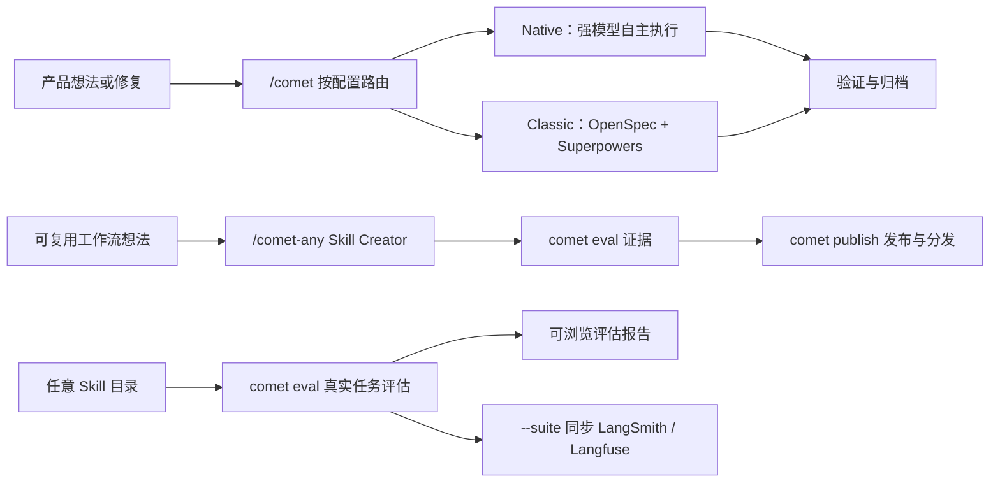

Comet 为 AI 编码任务提供可恢复的开发工作流，并提供 Skill 创建、评估和发布工具。项目可以选择两套相互独立的工作流：

- **Native** 面向 Fable 5、GPT-5.6 及同档模型。它约束需求、状态和验收结果，由模型选择实现方法。
- **Classic** 面向需要明确过程约束的模型。它组合 OpenSpec 与 Superpowers，按五个阶段推进变更。

  

项目配置、change 文档和验证证据共同保存任务状态

## 你可以用 Comet 做什么

- 用 `/comet` 按项目配置进入 Native 或 Classic，创建、实现、验证并归档一次变更。
- 用 `/comet-any` 把自己的工作流整理成可复用 Skill。
- 用 `comet eval` 在真实任务中评估本地 Skill。
- 用 [`comet dashboard`](/zh/dashboard/overview) 查看 Classic、Native 和 Supervisor Change 的阶段、任务、验收、风险、产物与 Git 信息。Dashboard 是只读界面。
- 用 `comet publish` 审核、批准、发布并分发 `/comet-any` 产物。
- 用 `comet status` 和 `comet doctor` 查看当前阶段、下一步和诊断结果。

## 使用 Comet vs 不使用 Comet

| 特性         | 没有 Comet                                                 | 使用 Comet                                                                                                                                                                           |
| -------------- | ---------------------------------------------------------- | ------------------------------------------------------------------------------------------------------------------------------------------------------------------------------------ |
| 中断恢复       | 需要 Agent 回忆上下文，还没有开始写代码就花费大量 Token    | 从 `.comet/config.yaml`、Native/Classic 各自 change 状态和运行证据恢复，不依赖原对话上下文                                                                                                 |
| 阶段控制       | Agent 容易跳过需求或验证，如代码实现完毕但文档未打勾、在不该写代码的阶段直接写代码               | Native 约束 Loop 结果与证据；Classic 提供五阶段流程有明确质量门禁，**不在对应阶段完成任务无法退出当前阶段**，强制 Agent 对应阶段做完所有事情                                                                                                |
| 自动推进       | 需要人工记忆大量 Skill 顺序并逐步接管                      | **自动推进**，Comet 会自动推进核心 Skill 流程，**除必要 HITL 交互点以外，无需用户接管**                                                                                                            |
| 工作区管理     | 开发者需要手动创建、切换并记住每项工作对应的分支和 worktree | 创建 change 时选择 `current`、`branch` 或 `worktree`；Comet **创建或复用工作区、记录分支绑定，并在恢复时定位正确目录** |
| 并行协作       | 开发者需要自己拆任务、判断依赖、分配工作目录、跟踪完成状态并合并结果 | Supervisor Change **自动化 DAG，分析子任务依赖**，为每个子任务准备**独立 worktree**，并在集成后统一验收 |
| 个人记忆       | 用户需要在不同任务中反复说明语言偏好、沟通方式和协作习惯   | **保存未来任务仍有帮助的用户偏好和个人协作经验**，按当前任务筛选后注入；用户可以查看、纠正、遗忘和回滚，不必让 Agent 每次重新了解你 |
| 项目知识       | 每个 Agent 都要重新探索项目结构、依赖、决策、流程和约束，重复消耗时间与 Token | **沉淀有来源的项目事实和项目经验**，按任务检索相关内容 |
| 约束强度       | 同一套 Skill 流程很难同时适配不同能力档模型                       | 强模型使用轻方法约束的 Native；较低能力档模型使用 Classic，另有 hotfix/tweak 轻量预设                                                                                                |
| 组合 Skill | 只是一个 `SKILL.md` 单文件，没法组合、没法带依赖、没法分发 | `/comet-any` 生成稳定**组合 Skill Bundle**——可拼装 rule、hook、Engine 元数据；**可评审**，**可分发**（像 `comet init` 一样通过 `comet publish distribute` 落地到 37 个 AI 编码平台） |
| Skill 评估 | 靠手感，Agent 跑一遍没报错就算通过                         | `comet eval` 在隔离环境跑**真实任务**，用多维 rubric 评分和 `pass@k` / `pass^k` **量化**能力与可靠性，失败时自动**归因**该改哪里——每轮迭代与基线数据对比，改进有没有效一目了然，Skill 演进靠科学评分不靠感觉                                                                              |

  

Comet 根据项目文件恢复 change，而非依赖上一轮对话

## 主要入口

做项目变更时调用 `/comet`。它读取项目配置并进入 Native 或 Classic。工作流专用 Skill 主要用于内部路由和高级排障。

<CardGroup cols={2}>
  <Card title="Native 工作流" icon="meteor" href="/zh/concepts/native-workflow">
    面向 Fable 5、GPT-5.6 及同档模型，保存需求、状态和证据，由模型选择实现方法。
  </Card>
  <Card title="经典 Spec 工作流" icon="signature" href="/zh/concepts/workflow">
    面向需要明确阶段指导的模型，使用 OpenSpec 与 Superpowers 推进五阶段流程。
  </Card>
  <Card title="CLI 操作台" icon="terminal" href="/zh/guides/install-and-update">
    适合安装、诊断、更新、Skill 管理、评估和发布。
  </Card>
  <Card title="/comet-any Skill Creator" icon="blackberry" href="/zh/skill-creator/getting-started">
    适合创建、优化或组合可复用 Skill。
  </Card>
  <Card title="Skill 评估系统" icon="vial-circle-check" href="/zh/eval/quickstart">
    适合用可浏览报告验证 Skill 行为，并作为发布证据。
  </Card>
</CardGroup>

## 相关设计资料

<Info title="Comet 与业界实践对照" icon="scale-balanced">
  [Comet 与业界实践对照](/zh/tech-blog/comet-vs-industry)，查看Comet评估、运行时、工作流和 Skill 分发采用的业界主流技术。

</Info>

## 安装后你会得到什么

`comet init` 会把 Comet Skill、Rule、Hook、运行时资产和平台适配文件安装到所选的项目级或全局位置。

<Tip>
  要开始一次项目变更，请阅读[快速开始](/zh/quickstart)。要创建可复用 Skill，请阅读
  [组合任意 Skill 快速上手](/zh/skill-creator/getting-started)。
</Tip>
