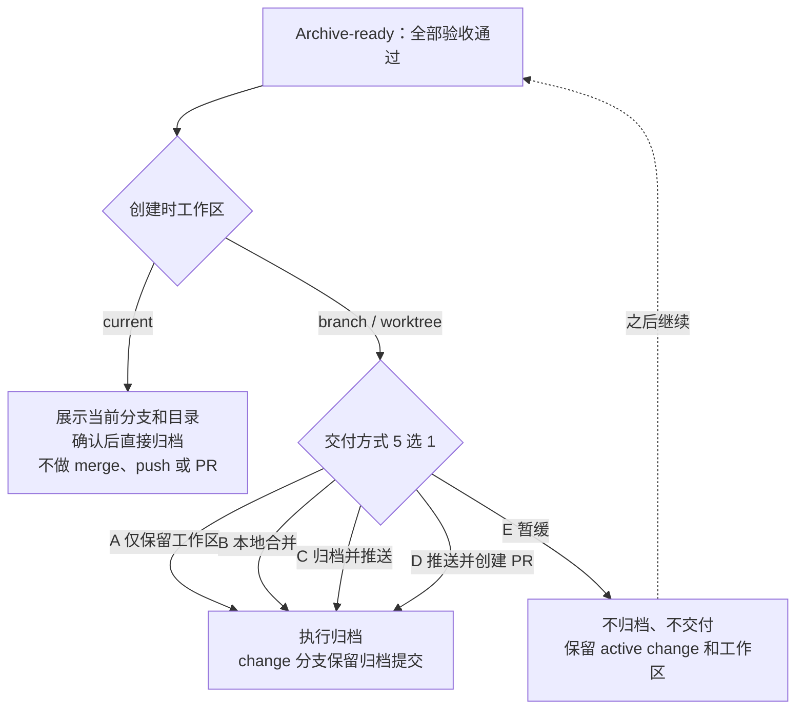

所有验收项通过、change 停在 Archive-ready 后，你会遇到完成前唯一一个决定时刻：确认这次归档如何交付。要不要做这个决定、有哪些选项，取决于你创建 change 时选择的工作区。Comet 会先展示当前分支、目标分支、目录和每个选项的实际影响，再由你确认或暂缓。

## 工作区选择决定这里问不问你

创建 change 时，你可以继续使用当前目录，也可以让 Comet 创建分支或 worktree。进入 Archive 时，交付方式取决于这次选择：

- **current 工作区**：change 直接在当前分支和目录里完成，归档时不需要选择交付方式。Comet 会展示当前分支和目录，说明归档**不做任何 merge、push 或 PR**；你确认后直接完成归档。
- **branch / worktree 隔离**：change 运行在独立的分支和目录里，归档后是否要合并进目标分支、推送到远端或创建 PR，需要由你决定。Comet 会展示实际的 change 分支、目标分支和目录，把下面五个互斥选项作为一次决策提供。

## 五个交付选项

| 选项 | 命令 | 实际效果 |
| --- | --- | --- |
| A 仅保留工作区 | `keep` | 完成归档并在 change 分支创建归档提交；不合并、不推送、不建 PR，保留当前分支和目录 |
| B 本地合并 | `merge` | 完成归档并创建归档提交，然后把 change 分支本地合并进目标分支；不推送、不建 PR |
| C 归档并推送 | `push` | 完成归档并创建归档提交，然后推送 change 分支；不合并进目标分支、不建 PR |
| D 推送并创建 PR | `pull-request` | 完成归档并创建归档提交，推送 change 分支，然后以目标分支为 base 创建 PR |
| E 暂缓归档 | — | 不执行归档和交付，保留 active change 和工作区，稍后再来 |

选择 A–D 时，Comet 用对应参数执行归档命令（`--finish keep|merge|push|pull-request`）；选 E 则到此为止。整个决策路径如下：

## 每种选项执行后的 Git 状态

A–D 都会完成归档，并在 change 分支创建归档提交；区别在于归档提交之后的处理：

- **A 仅保留工作区**：change 分支多一个归档提交，目标分支不变，分支和目录原样保留。本次归档不会移除保留的 worktree。
- **B 本地合并**：change 分支上的归档提交本地合并进目标分支，远端不受影响。
- **C 归档并推送**：归档提交随 change 分支一起推送到远端，目标分支不合并、不建 PR。
- **D 推送并创建 PR**：推送 change 分支后，以目标分支为 base 创建 PR，之后的合并走 PR 流程。
- **E 暂缓归档**：归档和交付都不执行，Git 侧没有任何改动。

选 A 保留的 worktree 不会在本次归档中移除；执行归档的 B、C、D 三个选项归档后，如果 worktree 没有未提交改动，Comet 会提议清理 worktree，由你确认。

## 确认门禁：何时需要 `--confirmed`

归档前是否需要额外一次明确决定，由 `native.archive_confirmation` 控制，默认是 `automatic`：

- `automatic`：最终 Verify 通过后，Runtime 可以直接继续完成归档。自动归档不替你决定交付方式——使用 branch 或 worktree 时，你仍要在 A–E 里选一个。
- `required`：最终 Verify 通过后，Runtime 会停在最终 Archive 候选上，等你就这一次归档做明确决定。中间修复轮次不会触发这个确认；选择暂不归档也会保留当前 active change。

设置见[Native 配置 · 归档确认](/zh/native/configuration#归档确认)。

`required` 生效时，最终 Archive 候选上会多一道门禁：你明确决定后，用 `--confirmed` 执行真实归档；`--dry-run` 只做预览，不要求也不写入最终确认。`--confirmed` 只在该 change 确实停在等待最终确认的 Archive-ready 时才有意义——中间修复轮次不会触发归档确认；等待期间需求或验收标准被修改，change 会先返回 Shape，旧的验证结果和归档批准不再生效。拿不准时先运行 `--dry-run`，让 Runtime 返回当前的下一步。

## 选择暂缓之后如何再回来

选 E 之后，change 保持 active，工作区和所有已通过的结果继续保留。下次让 Agent 继续当前 change 时，Runtime 会读回已记录的状态和下一步，把 change 带回 Archive-ready，再展示一次同样的决定。

如果等待期间你修改了可见需求或验收标准，change 会先返回 Shape，重新确认并取得新的验证结果，再回到 Archive。旧的验证结果和归档批准不会沿用。

## 中断与并发冲突

Archive 事务中途中断时，Runtime 会保留事务记录和可执行状态，从已经完成的步骤继续。具体恢复规则见[恢复手册](/zh/native/recovery-playbook)。

多个 active change 声明同一份 Spec 时，Archive 会先要求确定归档顺序，再进入这里的交付选择。排序规则见[多 Change 并行与冲突控制](/zh/native/multi-change-and-conflicts)。

继续阅读：[Native 产物与状态](/zh/native/artifacts-and-state)、[多 Change 并行与冲突控制](/zh/native/multi-change-and-conflicts) 和 [恢复手册](/zh/native/recovery-playbook)。
