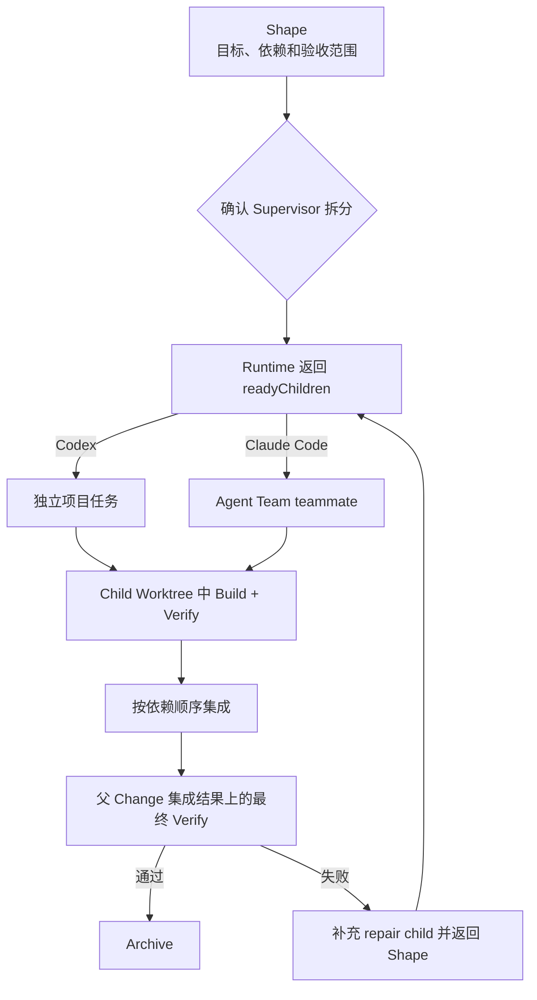

Supervisor Change 是 Native 用来管理大型、可拆分需求的协作模式。它把一个整体目标保留为父 Change，再把可以独立实现和验收的结果拆成 child。父 Change 负责目标、依赖、集成和最终验收；child 负责各自的实现和局部验证。

它适合存在真实并行价值的需求，例如权限 API、权限配置页面和审计日志可以分别实现和验证。仅仅因为需求描述很长，或任务数量较多，并不足以证明需要拆分。

## 用户能看到什么

Supervisor Change 在 Shape 阶段展示：

- 父目标和完整验收范围；
- child 的名称、依赖关系和覆盖的验收项；
- 当前可以执行的 `readyChildren`；
- 每个 child 的 worktree、执行状态和验证结果；
- 已完成 child 的集成顺序；
- 父 Change 最终 Verify 的结果和下一步动作。

确认拆分之前，不会创建 child、worktree 或独立会话。确认之后，Runtime 只会推进当前依赖已经满足的 child。

## 生命周期



<p align="center">
  
</p>

每个 child 都是完整的 Native Change。它有自己的任务包、`runId`、验收范围和独立 worktree。父会话不直接修改 child 的文件，也不把 child 的口头完成报告当作最终结果。最终是否完成，以 Runtime 的 child 状态、集成状态和父 Change Verify 为准。

## 在 Codex 中使用

在 Codex 中，先从统一入口描述整体目标：

```text
/comet-native 为管理后台增加权限 API、权限配置页面和审计日志，并分别验证这三个结果。
```

Shape 会展示候选 child 和依赖。选择多会话协作后，当前会话只负责协调、处理阻塞、集成和最终 Verify。Comet 为每个当前可执行的 child 创建用户可见的独立项目任务，并把 Runtime 已经创建的 Child Worktree、任务包、基线提交、`runId` 和验收范围传给该任务。

Codex 的独立项目任务不是父会话中的普通并行文本。它们各自拥有会话上下文，但写入位置仍由 Native Runtime 指定。父会话通过任务状态和 Runtime 状态检查进展；独立任务报告完成后，还要等待 child Verify 和集成结果。

查看父 Change 的详细状态：

```bash
comet native status <supervisor-change> --details --json
```

如果宿主无法创建用户可见的独立任务，Comet 会退化为独立 subagent，再退化为单会话串行执行。拆分范围、依赖和验收语义保持不变。

## 在 Claude Code 中使用

Claude Code 的 Agent Teams 需要在交互式会话中启用：

```bash
$env:CLAUDE_CODE_EXPERIMENTAL_AGENT_TEAMS="1"
```

在其他 shell 中设置等价的环境变量后，仍从 `/comet-native` 描述完整目标，并在 Shape 阶段确认多会话协作。当前会话作为 team lead，每个 `readyChildren` 对应一个有明确名称的 teammate。

Comet 会向 teammate 提供：

- Child Worktree 路径；
- child 任务包和 `runId`；
- 验收范围和依赖条件；
- 不得集成父分支、不得领取未 ready child 的停止条件。

Agent Teams 不会自动替 Comet 创建 Native Child Worktree。所有写入型 teammate 都必须使用 Runtime 指定的目录。teammate 不能创建嵌套团队，也不能把自己的判断当作父 Change 的最终验收。

Agent Teams 不可用、不是交互式会话，或恢复时原来的团队已经消失时，Comet 会重新读取 Native Runtime。系统不会只相信旧的团队状态；在需要重新选择执行模式时，会等待用户确认。

## 集成与最终验证

child 完成后，Runtime 按依赖顺序将已经通过验证的结果集成到 Supervisor Change 分支。所有 child 都进入 `integrated` 后，父 Change 立即进入最终 Verify。这个 Verify 在集成 worktree 中检查完整父验收范围，并且不能由某一个 child 的 Builder 自行替代。

最终 Verify 通过后，按 Native 原有 Archive 流程完成。最终 Verify 失败时，已经归档或已经集成的 child 不会被重新打开。Runtime 会根据失败的验收项创建 repair child，补充父级验收索引，重新经过 Shape 确认后继续。

需要限制并发时，可以让 Runtime 串行推进：

```bash
comet native next <supervisor-change> --max-parallel 1
```

这只改变执行并发度，不改变 child 的依赖和父级最终验收。

## 适用边界

Supervisor Change 适合以下条件同时成立的需求：

1. 至少有两个结果可以独立实现和验证；
2. 这些结果属于同一个整体目标，需要统一的最终验收；
3. child 之间的依赖可以被明确表达；
4. 每个 child 都能在独立 worktree 中工作。

如果几个目标没有共同的整体验收，应创建多个独立 Change。多个会话不能作为绕过依赖、共享未提交文件或提前集成的理由。父 Change、child、Runtime 和宿主团队的职责保持分离，恢复时始终以 Native Runtime 的持久化状态为准。

继续阅读：[Native 工作流](/zh/concepts/native-workflow)、[多 Change 与规格冲突](/zh/native/multi-change-and-conflicts) 和 [Native 快速开始](/zh/native/quickstart)。
