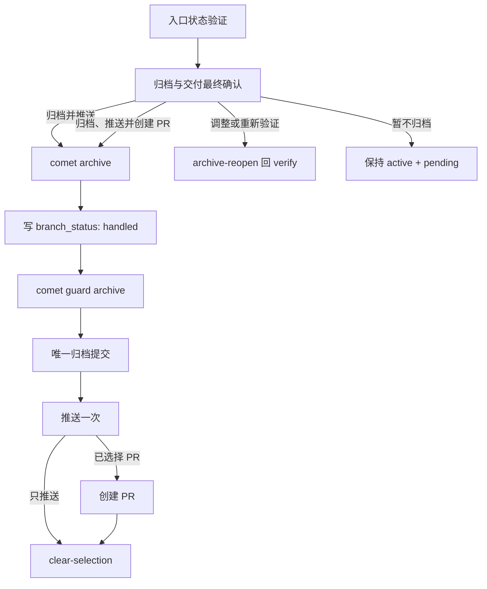

archive 阶段把通过验证的 change 合并到 OpenSpec 主 spec，标注产物，并移动到 archive 目录。它是不可逆的收尾动作，因此 Comet 会在执行前同时确认归档和远端交付方式。

<Tip>
  正常情况下只需调用 <code>/comet</code>。配置选择 Classic 后，内部 <code>/comet-classic</code> 会在
  verify 通过后路由到 <code>/comet-archive</code>。
</Tip>

## 前置条件

- `phase: archive`
- `verify_result: pass`
- `branch_status: pending`
- 当前分支与 change 的 `bound_branch` 一致

Verify 只负责记录验证证据。`branch_status` 会一直保持 `pending`，直到用户在本阶段确认立即远端交付。

## 流程



## 归档与交付最终确认

确认前，Comet 会展示 change、验证报告、当前绑定分支、已有未提交改动的归属，以及即将执行的不可逆归档动作。

| 选项                            | 结果                                                                                              |
| ------------------------------- | ------------------------------------------------------------------------------------------------- |
| **确认归档并立即推送**          | 归档、创建唯一完整提交并推送当前绑定分支                                                          |
| **确认归档、立即推送并创建 PR** | 归档、推送唯一完整提交，然后创建 PR                                                               |
| **需要调整或重新验证**          | `archive-reopen` 回到 verify，再调用 `/comet-verify`                                              |
| **暂不归档**                    | 不执行 `archive-confirm` 或归档；保持 active change、`phase: archive` 和 `branch_status: pending` |

只有前两个选项会执行：

```bash
comet state transition <change-name> archive-confirm
```

`archive_confirmation` 是 machine-owned 字段，不能手工编辑。

## 执行归档

```bash
comet archive "<change-name>"
```

命令会写入可恢复 checkpoint，调用 OpenSpec 合并 delta、移动 change、校验主 spec、标注 Design Doc 和 Plan，并在实际归档目录中写入 `archived: true`。

归档前可以只读预览：

```bash
comet archive "<change-name>" --dry-run
```

## 把最终状态放入唯一归档提交

归档完成后，Comet 在提交前运行：

```bash
comet state set <change-name> branch_status handled
comet guard <change-name> archive
```

这里的 `handled` 表示**远端交付方式已经确认**，不表示 push 或 PR 创建已经成功。guard 必须在提交前通过，确保 `.comet.yaml` 中的 `archived: true` 和 `branch_status: handled` 一起进入唯一归档提交。

Comet 只暂存能归因于当前 change 的路径：

- 原 active change 路径和实际 archive 路径
- 本次 delta 更新的 main specs
- Design Doc / Plan 的归档元数据
- 归档目录中最终的 `.comet.yaml`

检查 staged diff 后提交：

```bash
git add -- <逐项核对后的归档路径...>
git diff --cached --stat
git commit -m "chore: archive <change-name>"
```

不得使用 `git add -A`，也不得混入用户已有改动。

## 远端交付与完成

归档提交成功后，Comet 只执行确认时选择的方式：

- 推送当前绑定分支一次；或
- 推送一次，然后创建 PR。

归档阶段不再加载 Superpowers `finishing-a-development-branch`，也不会在归档后再询问本地合并、保留分支或暂不推送。需要推迟交付时，应在不可逆归档前选择“暂不归档”。

只有所选远端操作全部成功后，Comet 才运行：

```bash
comet state clear-selection
```

此时远端归档状态为 `handled`，本地工作区没有 Comet 遗留的未提交 `.comet.yaml`。

## 失败处理

- archive、状态写入、guard 或 commit 失败：停止，不执行远端操作。
- push 失败：完整归档提交已在本地，当前任务只重试同一个 push。
- PR 创建失败：分支已推送，当前任务只重试创建 PR。
- 失败时不清除 current selection，也不宣告 workflow 完成。

本流程不承诺用户脱离任务、自行切换、删除、变基或改写分支后的自动恢复。

## 下一步

- [open 阶段](/zh/phases/open)
- [五阶段停顿点和用户选择点](/zh/concepts/decision-points)
- [comet archive 脚本](/zh/scripts/comet-archive)
- [状态与配置](/zh/concepts/state-management)
