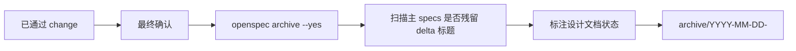

archive 阶段把通过验证的 change 合并到 OpenSpec 主规格，并移动到 archive 目录。

## 何时进入

- `verify_result: pass`
- 验证报告存在
- 分支处理完成或有明确决策
- 用户完成归档前最终确认

## 归档做什么



## 不要手工 transition 归档

归档应由 `/comet-archive` 或归档脚本完成。OpenSpec 会把 change 移到带日期前缀的 archive 目录。不要手工运行类似 `transition <archive-name> archived` 的步骤。

## 归档后你会看到

```text
openspec/changes/archive/YYYY-MM-DD-<name>/
```

活跃 change 列表中不再包含这个 change。后续如果需要继续改动，创建新的 change。
