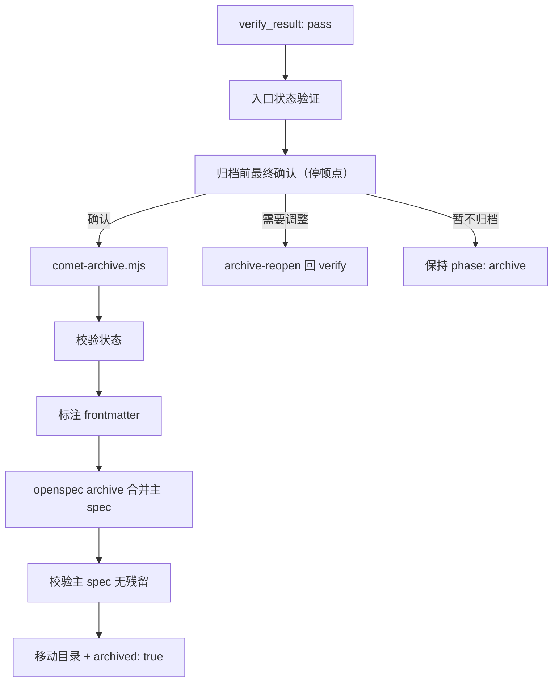

archive 阶段把通过验证的 change 合并到 OpenSpec 主 spec，标注产物，并移动到 archive 目录。它关闭整个 spec 生命周期。

## 调用的 skill

**archive 阶段不通过 Skill 工具加载任何 skill。** 所有工作由脚本完成：`comet-state.mjs`、`comet-archive.mjs`、`comet-guard.mjs`。归档脚本内部调用 OpenSpec archive 能力做 delta→主 spec 语义合并。

## 完整步骤

### Step 0：入口状态验证

```bash
node "$COMET_STATE" check <name> archive
```

### Step 1：归档前最终确认（停顿点）

展示摘要（change 名、验证报告、分支状态、即将执行的操作），等待用户确认。详见[五阶段停顿点和用户选择点](/zh/concepts/decision-points)。

### Step 2：执行归档

```bash
node "$COMET_ARCHIVE" "<change-name>"
```

脚本按顺序执行：

| 步骤 | 内容 |
| --- | --- |
| 1 | 校验入口状态（`phase: archive`、`verify_result: pass`、`archived: false`） |
| 2 | 标注 Design Doc frontmatter（`archived-with`、`status: final`） |
| 3 | 标注 Plan frontmatter（`archived-with`） |
| 4 | 调用 `openspec archive --yes`，按 ADDED/MODIFIED/REMOVED/RENAMED 合并 delta 到主 spec 并移动目录 |
| 5 | 校验主 spec 无 delta-only 标题残留（有残留 FATAL） |
| 6 | 更新归档状态（`archived: true`） |

可以用 `--dry-run` 预览不执行。

### Step 3：生命周期闭合

spec 生命周期完成：

```text
brainstorming → delta spec → 实施 → 验证 → 主 spec 合并 → design doc 标注 → 归档
```

## 产物

| 产物 | 说明 |
| --- | --- |
| 归档目录 | `openspec/changes/archive/YYYY-MM-DD-<name>/` |
| 主 spec 更新 | delta 按 ADDED/MODIFIED/REMOVED/RENAMED 合并 |
| Design Doc 标注 | `archived-with` + `status: final`（如有偏差则 `status: superseded-by-main-spec`） |
| Plan 标注 | `archived-with` |

## 归档流程图



## 何时进入

- `verify_result: pass`
- 分支已处理（`branch_status: handled`）

<Warning>
  归档成功后<strong>不要</strong>再跑 <code>comet-guard &lt;name&gt; archive</code>——活跃目录已不存在，guard 会报错。归档完整性由脚本退出码和归档目录状态判断。
</Warning>

## 不要手工归档

归档应由 `/comet-archive` 或归档脚本完成。OpenSpec 会把 change 移到带日期前缀的 archive 目录。手工 transition 容易造成状态和文件位置不一致。

## 归档后

```text
openspec/changes/archive/YYYY-MM-DD-<name>/
```

活跃 change 列表中不再包含这个 change。后续需要改动时创建新 change。

## 下一步

- [open 阶段](/zh/phases/open) — 归档后开始新 change
- [五阶段停顿点和用户选择点](/zh/concepts/decision-points) — archive 的停顿点
- [comet-archive](/zh/scripts/comet-archive) — 归档脚本细节
- [工作流中间产物](/zh/concepts/intermediate-artifacts) — 归档标注产物
