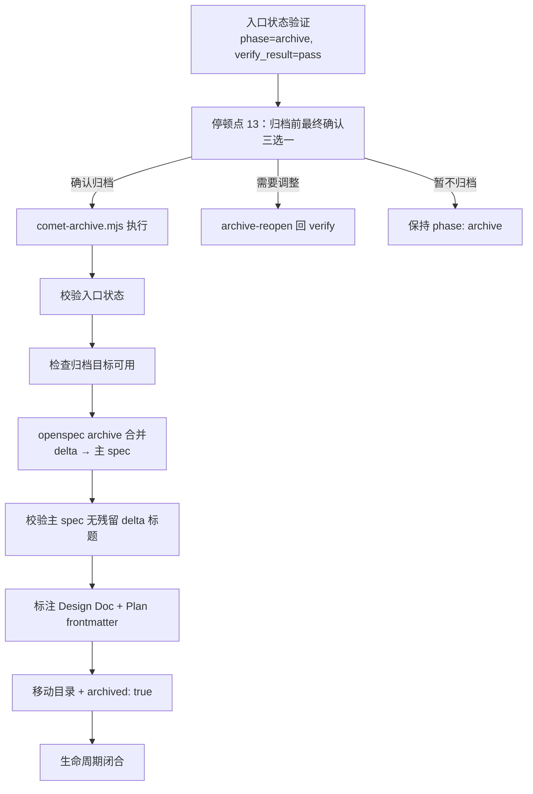

archive 阶段把通过验证的 change 合并到 OpenSpec 主 spec，标注产物，并移动到 archive 目录。它**关闭整个 spec 生命周期**。从你的角度看，这是一个**不可逆的收尾动作**——Comet 会先给你看清楚要做什么，等你确认才执行。

<Tip>
  <strong>正常情况下你只需要 <code>/comet</code>。</strong>verify 通过后，<code>/comet</code> 会自动衔接调用 <code>/comet-archive</code>。本文描述的 <code>/comet-archive</code> 是它内部调用的阶段 Skill——只有当你想<strong>手动控制</strong>（例如关闭了 <code>auto_transition</code>、或想只跑这一个阶段）时，才需要直接输入 <code>/comet-archive</code>。详见<a href="#本阶段如何触发">本阶段如何触发</a>。
</Tip>

## 本阶段如何触发

`/comet-archive` 通常**不是你手敲的命令**，而是 `/comet` 自动衔接的结果。

### 默认：用 /comet 自动衔接

verify 阶段通过后（`verify_result: pass`），`/comet` 会先做归档前确认，确认后自动衔接调用 `/comet-archive`。下一次调用 `/comet` 时，如果检测到 `verify_result: pass`，也会路由到 archive。archive 不受 workflow 类型影响，始终返回标准 Skill。详见[自动推进机制](/zh/concepts/auto-transition)。

### 手动：什么时候才需要直接 /comet-archive

- 关闭了自动衔接（`auto_transition: false`）——verify 通过后 `/comet` 会停下并打印 HINT。
- 只想单独跑 archive（恢复一个 `phase: archive` 的 change 完成归档）。

**自动推进开着就用 `/comet`，关了才需要手动用各阶段命令。**

---

## 前置条件

进入 archive 需要：验证已通过（`verify_result: pass`）、分支已处理（`branch_status: handled`）。

## 你会经历什么



### Step 0：入口状态验证

```bash
node "$COMET_STATE" check <name> archive
```

要求 `phase: archive`、`verify_result: pass`、`archived != true`。

### 停顿点 13：归档前最终确认

Comet **暂停等你确认**——不会因为验证通过就自动归档。它给你看清楚：

- change 名称
- 验证报告路径和结论
- 分支处理状态
- 本次将执行的**不可逆动作**：按 delta 语义合并主 spec、标注 design doc/plan、移动 change 到 archive 目录

然后让你**三选一**：

| 选项 | 含义 |
| --- | --- |
| **确认归档** | 立即执行归档脚本，完成 spec 合并和 change 移动 |
| **需要调整或重新验证** | 不执行；`comet-state transition <name> archive-reopen` 回 `phase: verify`，再调 `/comet-verify` |
| **暂不归档** | 不执行，保留 `phase: archive`，等你稍后再调 `/comet-archive` |

只有"确认归档"才执行脚本。"需要调整"必须用 `archive-reopen`（**不能手工编辑 `.comet.yaml`**），它会设 `verify_result: pending`、`phase: verify`、清 `verified_at`。

### Step 2：执行归档

```bash
node "$COMET_ARCHIVE" "<change-name>"
```

脚本按顺序执行（每步打印 `[OK]`/`[FAIL]`）：

| 步骤 | 内容 |
| --- | --- |
| 1 | 校验入口状态（`phase: archive`、`verify_result: pass`、`archived: false`） |
| 2 | 检查归档目标可用（`openspec/changes/archive/YYYY-MM-DD-<name>` 不能已存在） |
| 3 | 写 pending checkpoint（支持中断恢复），调用 `openspec archive --yes` 按 ADDED/MODIFIED/REMOVED/RENAMED 合并 delta 到主 spec 并移动目录 |
| 4 | 校验主 spec 无 delta-only 标题残留（有残留 **FATAL**） |
| 5 | 标注 Design Doc frontmatter（`archived-with` + `status: final`） |
| 6 | 标注 Plan frontmatter（`archived-with`） |
| 7 | 更新归档状态（`archived: true`，Run 转 `completed`） |

可以用 `--dry-run` 预览不执行：

```bash
node "$COMET_ARCHIVE" "<change-name>" --dry-run
```

dry-run 跑前两步，OpenSpec archive 和标注只打印 `[DRY-RUN]` 不执行，最后给 `Dry run complete. X/Y steps would succeed.`

<Note>
  delta → 主 spec 的合并由 <strong>OpenSpec CLI</strong> 执行（<code>openspec archive &lt;change&gt; --yes</code>），Comet 只调用它然后校验结果。如果 OpenSpec CLI 找不到，会 <code>FATAL: OpenSpec CLI not found</code>——装 OpenSpec 或设 <code>COMET_OPENSPEC</code>。
</Note>

### Step 3：生命周期闭合

```text
brainstorming → delta spec → 实施 → 验证 → 主 spec 合并 → design doc 标注 → 归档
```

流程全部完成。活跃 change 列表不再包含它，后续改动需要创建新 change。

---

## 调用的 skill

**archive 阶段不通过 Skill 工具加载任何 skill。** 所有工作由脚本完成：`comet-state.mjs`、`comet-archive.mjs`、`comet-guard.mjs`。归档脚本内部调用 OpenSpec archive 能力做 delta→主 spec 语义合并。

## 产物

| 产物 | 说明 |
| --- | --- |
| 归档目录 | `openspec/changes/archive/YYYY-MM-DD-<name>/`（日期取 UTC） |
| 主 spec 更新 | delta 按 ADDED/MODIFIED/REMOVED/RENAMED 合并 |
| Design Doc 标注 | `archived-with` + `status: final` |
| Plan 标注 | `archived-with` |

这样归档后检索 Design Doc/Plan 时，能直接从 frontmatter 知道它属于哪次归档、是否已结案，不必反查 `.comet.yaml`。

## 何时进入

正常情况下由 `/comet` 在 verify 通过后自动衔接进入（见[本阶段如何触发](#本阶段如何触发)）。前置条件：`verify_result: pass` 且分支已处理（`branch_status: handled`）。

<Warning>
  归档应由 <code>/comet-archive</code> 或归档脚本完成，<strong>不要手工 transition</strong>。OpenSpec 会把 change 移到带日期前缀的 archive 目录，手工 transition 容易造成状态和文件位置不一致。且归档成功后<strong>不要</strong>再跑 <code>comet-guard &lt;name&gt; archive</code>——活跃目录已不存在，guard 会报错。归档完整性以脚本退出码和归档目录状态判断。
</Warning>

## 恢复（中断后可继续）

归档脚本是**可恢复**的。执行 OpenSpec archive 前会写 pending checkpoint（`classic-archive:<change>`）。如果中断后重新调用：

- 活跃目录已不在但 archive 目录存在 → `findArchiveDir` 恢复，跳过重跑 OpenSpec archive（幂等），重校验主 spec 干净，必要时重新标注，最后写 `archived: true`。
- 上下文压缩后：如果 `archived: true` 且 archive 目录存在，归档已完成，**不重复执行**。

## 归档后

```text
openspec/changes/archive/YYYY-MM-DD-<change-name>/
```

活跃 change 列表中不再包含这个 change。要开始新工作，用 `/comet` 或 `/comet-open`。

## 下一步

- [open 阶段](/zh/phases/open) — 归档后开始新 change
- [五阶段停顿点和用户选择点](/zh/concepts/decision-points) — archive 的停顿点
- [comet-archive](/zh/scripts/comet-archive) — 归档脚本细节
- [工作流中间产物](/zh/concepts/intermediate-artifacts) — 归档标注产物
