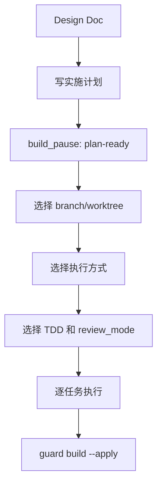

build 阶段把设计变成代码。它先写实施计划，然后选择如何执行。

## 关键选择

| 选择 | 常见值 | 说明 |
| --- | --- | --- |
| 隔离方式 | `branch`、`worktree` | 控制改动放在当前分支还是独立 worktree |
| 执行方式 | `subagent-driven-development`、`executing-plans` | 控制任务执行模式 |
| TDD 模式 | `tdd`、`direct` | full workflow 离开 build 前必须选择 |
| review 模式 | `off`、`standard`、`thorough` | 控制自动代码审查强度 |

## build_pause

`build_pause: plan-ready` 表示计划已经写好，但还没有选择隔离方式和执行方式。它是可恢复暂停点，不是执行方式。

## 推荐路径

## 离开 build 前必须满足

- `isolation` 已选择。
- `build_mode` 已选择。
- full workflow 的 `tdd_mode` 已选择。
- full workflow 的 `review_mode` 已选择。
- 如果使用 `subagent-driven-development`，`subagent_dispatch` 必须是 `confirmed`。
- full workflow 使用 direct 模式时，需要 `direct_override: true`。

<Tip>
  对多人协作或高风险改动，优先用 worktree 和 `review_mode: thorough`。对小型明确改动，可以用 branch 和 `standard`。
</Tip>
