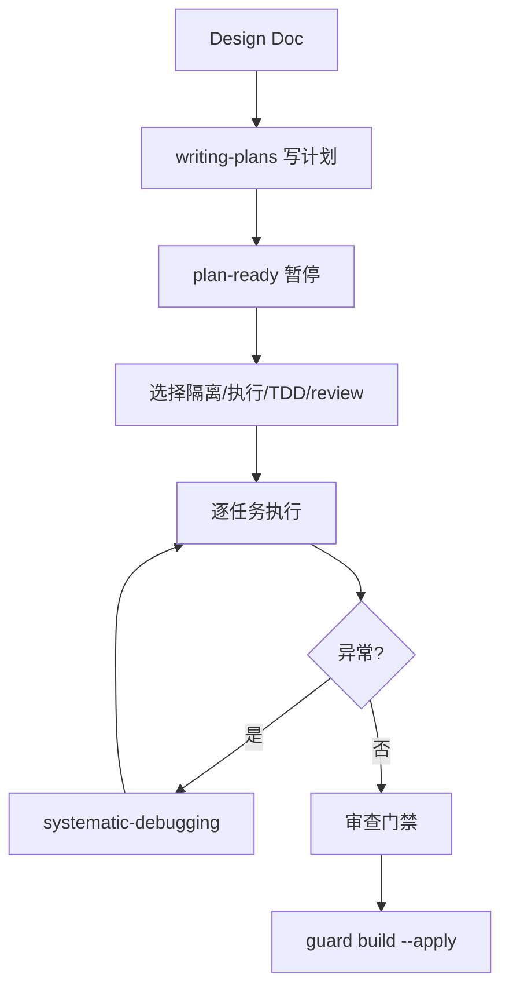

build 阶段把设计变成代码。它先写实施计划，选择隔离方式和执行方式，然后逐任务执行。

## 调用的 skill

| Skill | 用途 | 何时调用 |
| --- | --- | --- |
| `writing-plans` | 生成实施计划 | Step 1，子代理执行，失败回退主会话 |
| `using-git-worktrees` | 创建隔离 worktree | Step 3，选择 worktree 隔离时 |
| `executing-plans` | 轻量执行计划 | Step 3，`build_mode: executing-plans` |
| `subagent-driven-development` | 子代理驱动执行 | Step 3，`build_mode: subagent-driven-development` |
| `test-driven-development` | 强制 TDD | Step 3，`tdd_mode: tdd` 时 |
| `requesting-code-review` | 代码审查门禁 | Step 3，`review_mode: standard`/`thorough` + `executing-plans` 时 |
| `systematic-debugging` | 异常调试 | Step 3b，崩溃/测试失败/构建失败时强制加载 |
| `brainstorming` | 中等规模 spec 更新 | Step 4，发现接口/组件/数据流变化时 |

## 产物

| 产物 | 位置 | 说明 |
| --- | --- | --- |
| 实施计划 | `docs/superpowers/plans/YYYY-MM-DD-<feature>.md` | 含 `change`/`design-doc`/`base-ref` frontmatter |
| subagent-progress.md | `.comet/subagent-progress.md` | 子代理调度检查点（仅 subagent 模式） |
| tasks.md 勾选 | `tasks.md` | `- [ ]` → `- [x]` |
| 代码改动 | 仓库代码 | 提交到隔离分支/worktree |

## 完整步骤

### Step 0：入口状态验证

```bash
node "$COMET_STATE" check <name> build
```

读取 `base-ref`，`grep` 找第一个未完成任务。

### Step 1：创建实施计划

子代理加载 `writing-plans`，读 Design Doc 和 tasks.md，生成计划。计划 frontmatter 必须含：

```yaml
---
change: <change-name>
design-doc: docs/superpowers/specs/...-design.md
base-ref: <git rev-parse HEAD>
---
```

`base-ref` 是实现前的 commit SHA，verify 用它计算变更规模。子代理失败时回退到主会话内联加载。

### Step 2：plan-ready 暂停（停顿点）

```bash
node "$COMET_STATE" set <name> plan <path>
```

让你选择继续执行还是暂停切换模型。详见[五阶段停顿点和用户选择点](/zh/concepts/decision-points)。

### Step 3：选择工作模式（停顿点）

一次性询问四项选择：

#### 隔离方式（isolation）

| 选项 | 说明 | 推荐 |
| --- | --- | --- |
| branch | 当前仓库创建分支，简单快速 | 少于 3 个文件 |
| worktree | 独立工作区，可并行开发 | 并行开发或当前分支有未提交改动 |

分支命名：`feature/YYYYMMDD/<name>`（full）、`hotfix/...`（hotfix）、`tweak/...`（tweak）。

#### 执行方式（build_mode）

| 选项 | 说明 | 推荐 |
| --- | --- | --- |
| `subagent-driven-development` | 主会话只协调，后台子代理实现，双阶段审查 | 3+ 任务、高复杂度 |
| `executing-plans` | 轻量执行，不需子代理环境 | 2 任务以下、无跨模块依赖 |
| `direct` | 直接实现 | 仅 hotfix/tweak；full 需要 `direct_override: true` |

<Warning>
  <code>subagent-driven-development</code> 需要 <code>subagent_dispatch: confirmed</code>——必须确认平台有真实后台调度能力，否则暂停让你改选 <code>executing-plans</code>。
</Warning>

#### TDD 模式（tdd_mode）

| 选项 | 说明 |
| --- | --- |
| `tdd` | 每个任务先写失败测试，Red-Green-Refactor |
| `direct` | 直接实现，不强制 TDD（hotfix/tweak 默认） |

#### 审查模式（review_mode）

| 选项 | 说明 |
| --- | --- |
| `off` | 不做自动审查 |
| `standard` | 全部任务后一次轻量审查，最多一轮自动修复 |
| `thorough` | 按批次/风险边界审查 + 最终完整审查 |

详见[代码审查机制](/zh/concepts/review-mode)。

### Step 3b：异常调试协议

执行过程中出现崩溃、测试失败、构建失败时，**强制加载** `systematic-debugging`，完成根因调查后才能修复。

### Step 4：spec 增量更新

执行中发现需要改 spec 时：

| 规模 | 处理 |
| --- | --- |
| 小 | 直接编辑 delta spec + 追加任务 |
| 中 | 暂停确认后加载 `brainstorming` 更新 Design Doc + delta spec |
| 大 | 暂停确认后通过 `/comet-open` 开新 change |
| 超过 50% 初始任务 | 强制拆分决策（停顿点） |

### Step 5：逐任务执行与提交

每个任务：按 `build_mode` 执行 → 按 `review_mode` 审查（如适用）→ 勾选 tasks.md → 提交。

subagent 模式下，协调会话维护 `subagent-progress.md` 检查点，子代理不能勾选任务——只有协调会话在双审查通过后勾选。

### 退出

```bash
node "$COMET_GUARD" <change-name> build --apply
```

推进到 `phase: verify`，设 `verify_result: pending`。

## 退出条件（guard 检查）

- tasks.md 全部勾选
- 代码已提交
- 显式运行项目 build/test 命令并通过
- `isolation` 是 `branch` 或 `worktree`
- `build_mode` 已选择（subagent 模式需 `subagent_dispatch: confirmed`）
- `tdd_mode` 已选择
- `review_mode` 已选择（standard/thorough 需审查完成，CRITICAL 已修复）

## 推荐路径



<Tip>
  多人协作或高风险改动优先用 worktree + `review_mode: thorough`。小型明确改动用 branch + `standard`。
</Tip>

## 下一步

- [verify 阶段](/zh/phases/verify) — build 完成后进入验证
- [代码审查机制](/zh/concepts/review-mode) — review_mode 详解
- [状态与配置](/zh/concepts/state-management) — build_mode/isolation/tdd_mode 字段
- [五阶段停顿点和用户选择点](/zh/concepts/decision-points) — build 的停顿点
