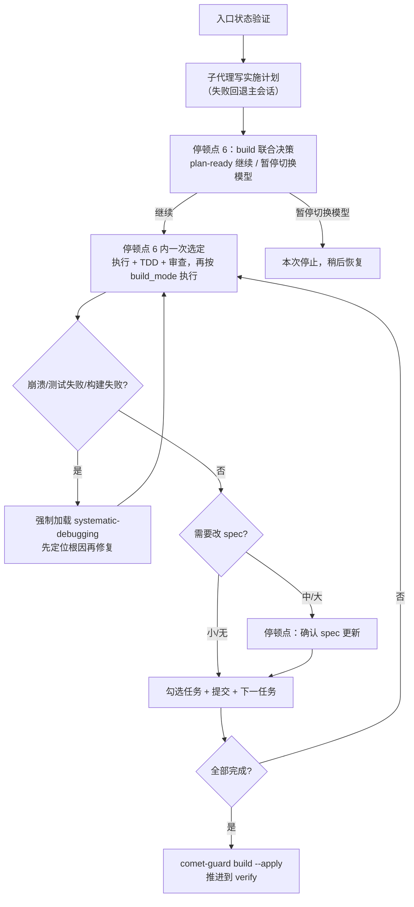

build 阶段先生成实施计划，再由用户选择执行、TDD 和审查方式。流程随后按任务实现、检查并提交改动，同时记录 spec 增量更新和调试结果。

<Tip>
  正常情况下你只需要 <code>/comet</code>。 配置选择 Classic 后，内部{" "}
  <code>/comet-classic</code> 会读取状态，并在 design 完成后自动调用{" "}
  <code>/comet-build</code>。本文描述的是内部阶段 Skill；只有想
  <strong>手动控制</strong>
  时才需要直接输入。详见<a href="#本阶段如何触发">本阶段如何触发</a>。
</Tip>

## 本阶段如何触发

`/comet-build` 通常由 `/comet-classic` 自动衔接。

### 默认：用 /comet 自动衔接

design 阶段退出后（`phase: build`），`/comet-classic` 会自动衔接调用 `/comet-build`。下一次调用 `/comet-classic` 时，如果检测到 `phase: build` 或有 Design Doc 但执行未完成，也会路由到 build：hotfix 走 `/comet-hotfix`、tweak 走 `/comet-tweak`、full 走 `/comet-build`。详见[自动推进机制](/zh/concepts/auto-transition)。

### 手动：什么时候才需要直接 /comet-build

- 关闭了自动衔接（`auto_transition: false`）：design 完成后 `/comet-classic` 会停下并打印 HINT。
- 只想单独跑 build（恢复一个 `phase: build` 的 change 继续执行）。
- verify 失败后通过 `comet-state transition verify-fail` 回滚，需要重新进入 build 修复。

**正常使用统一入口 `/comet`；只有手动控制阶段时才直接调用阶段命令。**

---

## 你会经历什么

build 阶段有 2 个停顿点（全局编号 6-7，整个五阶段工作流共 10 个，见[五阶段停顿点和用户选择点](/zh/concepts/decision-points)）。下面按发生顺序讲。



<p align="center">
  
</p>

<p align="center">
  build 阶段把计划拆成任务卡片，逐张执行、排错、勾选并留下提交证据
</p>

### Step 0：入口状态验证

```bash
node "$COMET_STATE" check <name> build
```

读取 plan 头部的 `base-ref`，`grep` 找第一个未完成任务。幂等：已提交的任务不会重复提交。

### Step 1：创建实施计划

Comet **派子代理**加载 `writing-plans` 写计划（这样不占主会话上下文），子代理失败时回退到主会话内联加载。计划 frontmatter 必须含：

```yaml
---
change: <change-name>
design-doc: docs/superpowers/specs/...-design.md
base-ref: <git rev-parse HEAD> # 实现前的 commit，verify 用它算变更规模
---
```

### 停顿点 6：build 联合决策

计划写好后，Comet **暂停等你选**：

| 选项               | 行为                                                                                                                |
| ------------------ | ------------------------------------------------------------------------------------------------------------------- |
| **A 继续执行**     | 保持在当前模型，接着在下方一次选定执行方式、TDD 和审查模式                                                                |
| **B 暂停切换模型** | 记录 `build_pause: plan-ready`，本次 `/comet-build` 停止；换模型后正常用 `/comet` 恢复，也可手动调用 `/comet-build` |

<Tip>
  选项 B 的用途是<strong>换模型</strong>
  ，比如用一个模型写计划、换一个更强的编码模型执行。恢复时 Comet 会检测到{" "}
  <code>build_pause: plan-ready</code> 且 plan 存在，告诉你停在
  plan-ready，你确认继续后清除暂停标志，<strong>不会重新生成 plan</strong>
  ，直接进入工作模式选择。
</Tip>

#### 同一次决策里再选三种工作模式

选 A 继续后，Comet 在**同一次联合决策**里让你一次选定执行方式、TDD 模式和审查模式。工作区隔离不在这里。它已在 open 阶段的工作区决策（停顿点 3）确定：选择结果写入 `isolation`，实际执行目录的当前分支记录为 `bound_branch`，build 阶段只验证目录与分支匹配，不会静默换目录。选择 `branch` 时的分支名在 open 阶段一并确认（hotfix/tweak 预设默认 `hotfix/YYYYMMDD/<name>`、`tweak/YYYYMMDD/<name>`）。

#### 1. 执行方式（build_mode）

| 选项                                | 说明                                                                                        | 推荐                                                      |
| ----------------------------------- | ------------------------------------------------------------------------------------------- | --------------------------------------------------------- |
| **A `subagent-driven-development`** | 主会话只协调，后台子代理实现；每个任务在隔离的实现者子代理里运行，审查由 `review_mode` 驱动 | 任务数 ≥ 3、复杂度高                                      |
| **B `executing-plans`**             | 轻量执行，不需子代理环境                                                                    | 任务 ≤ 2、无跨模块依赖；来自 hotfix 路径                  |
| `direct`                            | 直接实现                                                                                    | 仅 hotfix/tweak 默认；full 需显式 `direct_override: true` |

<Warning>
  选 <code>subagent-driven-development</code> 需要平台有真实后台调度能力，否则
  Comet 会暂停让你改选 <code>executing-plans</code>。full workflow 默认不能用{" "}
  <code>direct</code>，除非你显式设 <code>direct_override: true</code>。
</Warning>

#### 2. TDD 模式（tdd_mode）

| 选项      | 说明                                                                          |
| --------- | ----------------------------------------------------------------------------- |
| **`tdd`** | 每个任务先写失败测试，Red-Green-Refactor（**推荐**，涉及业务逻辑/新功能/API） |
| `direct`  | 直接实现，不强制 TDD（hotfix/tweak 默认）                                     |

#### 3. 审查模式（review_mode）

| 选项           | 说明                                                                             | 推荐                           |
| -------------- | -------------------------------------------------------------------------------- | ------------------------------ |
| `off`          | 不自动审查                                                                       | 文档、配置、文案、小范围低风险 |
| **`standard`** | 默认不逐任务派 reviewer。命中风险信号时才派。最终综合审查在 verify 阶段 | **默认推荐**，大多数普通改动   |
| `thorough`     | 每个任务都派 reviewer（spec + 质量）；最终综合审查在 verify 阶段                   | 高风险、多模块、架构/安全      |

详见[代码审查机制](/zh/concepts/review-mode)。

### Step 3：逐任务执行

选定后，按 `build_mode` 执行。**两种执行方式的体验不同**：

| 维度     | `executing-plans`                                                                     | `subagent-driven-development`                                                      |
| -------- | ------------------------------------------------------------------------------------- | ---------------------------------------------------------------------------------- |
| 谁写代码 | 主会话直接做                                                                          | 主会话**只协调**，后台子代理实现（禁止主会话直接写代码）                           |
| 任务推进 | 顺序执行，逐个勾选                                                                    | 每个任务派新子代理，通过验收后立即派下一个，**不停下问你要不要继续**               |
| 审查     | 强度随 `review_mode` 调整。standard 不做 build 内整变更审查；thorough 每 3 个任务做分段审查。最终综合审查在 verify | 按 review_mode 派任务级 reviewer + 修复 agent（thorough=每任务；standard=仅风险任务） |
| 模型选择 | 主会话直接执行                                                                        | **每次派发必须显式指定模型**（实现者/修复者/reviewer 分别指定）                       |
| 进度可见 | 对话里直接看到                                                                        | 维护 `.comet/subagent-progress.md` 检查点                                          |

<Tip>
  <code>subagent-driven-development</code> 下，每个 task 通过验收并被勾选后会
  <strong>立即派发下一个 task</strong>
  ，不会停下来总结或问你。只有四种情况会暂停：审查修复轮数耗尽（BLOCKED）、遇到真实歧义、平台无后台调度、你明确要求暂停。审查强度由{" "}
  <code>review_mode</code>{" "}
  决定（thorough=每任务审查；standard=仅风险任务审查）。
</Tip>

<Note>
  子代理（implementer）<strong>不能自己勾选任务</strong>
  ，只有主会话在双阶段验收通过后才勾选。reviewer 拿到的是完整任务 + 实现
  commit/diff + RED/GREEN 证据（TDD 时），
  <strong>不能只看实现者摘要就下结论</strong>。
</Note>

### Step 3b：异常调试协议（强制）

执行中出现**崩溃、测试失败、构建失败或异常行为**时，Comet **强制加载** `systematic-debugging`：

1. **先定位根因**：读完整错误、查最近改动、追数据流。**根因调查完成前不得提任何修复。**
2. 根因是源码 bug 时，先加一个最小失败测试复现，再修源码。
3. 修完跑失败测试、相关测试、项目构建/验证命令确认全过。
4. 失败测试、源码修复和 tasks.md 勾选都保留在当前 change 内，不要另开“写测试用例”change 替代当前验证循环。

#### 多失败的并行排查

进入四阶段流程前，先做一个**失败独立性评估**，决定串行还是并行：

| 情况                                                       | 处理                                                                                |
| ---------------------------------------------------------- | ----------------------------------------------------------------------------------- |
| **串行**（沿用 `systematic-debugging`）                    | 失败 ≤ 2 个；失败相关（修一个可能修另一个）；共享状态；会动同一批文件；独立性未确立 |
| **并行**（加载 Superpowers `dispatching-parallel-agents`） | **≥ 3 个失败来自不同问题域**（不同测试文件、不同根因、不同子系统独立损坏）          |

满足并行条件时：

1. 用 Skill 工具加载 Superpowers `dispatching-parallel-agents`。
2. **每个独立失败派一个后台排查 agent**（按问题域分组，全部派发放在**同一条响应**里并发执行）。每个 prompt 都包含完整上下文（具体失败、错误信息、允许排查范围、禁止动其他问题域代码）。
3. 所有 agent 仍受“根因定位前不得改源码”约束。它们只**定位根因并返回发现**，不直接提交修复。
4. 所有排查返回后，主会话**串行**汇总发现并修复；修复仍走当前 `review_mode` 的验证和审查循环。

<Warning>
  <strong>并行只用于排查，不用于修复。</strong>修复始终串行，避免多个 agent
  同时改同一批文件冲突。这与 <code>subagent-driven-development</code>
  “不要并行派发多个实现子代理”的红线一致。即使 <code>review_mode: off</code>
  ，异常调试协议也
  <strong>不跳过</strong>，<code>off</code>{" "}
  只跳过代码审查，不跳过真实问题的调试。
</Warning>

### Step 4：spec 增量更新

执行中发现需要改 spec 时，按规模处理：

| 规模   | 触发条件                       | 做法                                                                       |
| ------ | ------------------------------ | -------------------------------------------------------------------------- |
| 小     | 遗漏验收场景、边界条件         | 直接编辑 delta spec + design.md，追加 tasks 任务                           |
| 中     | 接口变更、新增组件、数据流变化 | **暂停等你确认**，加载 `brainstorming` 更新 Design Doc + delta spec        |
| 大     | 全新 capability                | **暂停等你确认拆分**，通过 `/comet-open` 开新 change（不能用 `/opsx:new`） |
| 超 50% | 新增任务数超初始任务总数一半   | **停顿点 7**：拆分为新 change / 继续在当前 change 内完成                   |

### Step 5：勾选 + 提交

每个任务：按 `build_mode` 执行 → 按 `review_mode` 审查（如适用）→ **主会话**勾选 tasks.md → 提交。勾选用定向验证：

```bash
node "$COMET_STATE" task-checkoff "$PLAN_FILE" "$PLAN_TASK_TEXT"
```

任务文本必须唯一出现且已勾选，验证失败不得进入下一个任务。可用 `grep -c '\- \[ \]' tasks.md` 查剩余未勾选数。

### 退出

```bash
node "$COMET_GUARD" <change-name> build --apply
```

推进到 `phase: verify`，设 `verify_result: pending`。

---

## 调用的 skill

| Skill                         | 用途               | 何时调用                                                                                                                 |
| ----------------------------- | ------------------ | ------------------------------------------------------------------------------------------------------------------------ |
| `writing-plans`               | 生成实施计划       | Step 1，子代理执行，失败回退主会话                                                                                       |
| `executing-plans`             | 轻量执行计划       | Step 3，`build_mode: executing-plans`                                                                                    |
| `subagent-driven-development` | 子代理驱动执行     | Step 3，`build_mode: subagent-driven-development`                                                                        |
| `test-driven-development`     | 强制 TDD           | Step 3，`tdd_mode: tdd` 时                                                                                               |
| `requesting-code-review`      | 代码审查门禁       | Step 3，`review_mode: standard`/`thorough` 时（executing-plans 随 review_mode 调整强度；subagent 模式按任务/风险派 reviewer） |
| `systematic-debugging`        | 异常调试           | Step 3b，崩溃/测试失败/构建失败时强制加载                                                                                |
| `dispatching-parallel-agents` | 多失败并行排查     | Step 3b，≥ 3 个独立失败时加载（仅排查，修复串行）                                                                        |
| `brainstorming`               | 中等规模 spec 更新 | Step 4，发现接口/组件/数据流变化时                                                                                       |

## 产物

| 产物                 | 位置                                             | 说明                                            |
| -------------------- | ------------------------------------------------ | ----------------------------------------------- |
| 实施计划             | `docs/superpowers/plans/YYYY-MM-DD-<feature>.md` | 含 `change`/`design-doc`/`base-ref` frontmatter |
| subagent-progress.md | `.comet/subagent-progress.md`                    | 子代理调度检查点（仅 subagent 模式）            |
| tasks.md 勾选        | `tasks.md`                                       | `- [ ]` → `- [x]`                               |
| 代码改动             | 仓库代码                                         | 提交到隔离分支/worktree                         |

## 退出条件（阶段守卫检查）

- tasks.md 全部勾选
- 代码已提交
- **显式运行**项目 build/test 命令并通过（不要只依赖 guard 自动猜测）
- `isolation` 是 `current`、`branch` 或 `worktree`，且当前 Git 分支与 `bound_branch` 一致
- `build_mode` 已选（subagent 模式需 `subagent_dispatch: confirmed`）
- `tdd_mode` 已选
- `review_mode` 已选（thorough 已按每 3 个任务完成分段审查并修复 CRITICAL/IMPORTANT，或记录非 CRITICAL 接受原因；standard/off 已记录对应原因）

guard 会自动识别项目构建入口（例如 `npm run build`、Maven 或 Cargo）并把失败输出作为证据。`.comet.yaml` 和仓库根配置不再支持 `build_command` / `verify_command`；需要固定团队级验证流程时，请把它放进项目自己的构建脚本。

## 恢复

build 阶段幂等。恢复时 `grep -n '\- \[ \]' tasks.md | head -1` 找第一个未完成任务继续。`build_pause: plan-ready` 的恢复见[停顿点 6](#停顿点-6-build-联合决策plan-ready)。上下文压缩后用 `comet-state check <name> build --recover` 拿恢复上下文；subagent 模式重读 `.comet/subagent-progress.md` 恢复当前任务和审查轮数，**不能在主会话直接执行任务**。`full` workflow 如果停在 plan-ready，恢复动作必须先确认已有的工作区绑定，再补齐或确认三个执行选择：`build_mode`、`tdd_mode` 和 `review_mode`。

## 推荐路径

<Tip>
  多人协作或高风险改动优先用 worktree + <code>review_mode: thorough</code>
  。小型明确改动用 branch + <code>standard</code>。
</Tip>

## 下一步

- [verify 阶段](/zh/phases/verify) — build 完成后进入验证
- [代码审查机制](/zh/concepts/review-mode) — review_mode 详解
- [状态管理](/zh/concepts/state-management) — build_mode/isolation/tdd_mode 字段
- [五阶段停顿点和用户选择点](/zh/concepts/decision-points) — build 的停顿点
