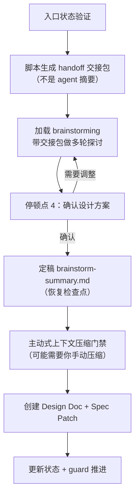

design 阶段做**深度技术设计**。它先用脚本把 open 阶段的 OpenSpec artifacts 打包成交接包，再交给 Superpowers `brainstorming`，带你做多轮方案探讨，最后产出 Design Doc。从你的角度看，这是一段**真正的头脑风暴**——Comet 会反复和你探讨实现方案、权衡、风险，确认方案后才会写文档。

<Tip>
  <strong>正常情况下你只需要 <code>/comet</code>。</strong>open 阶段完成后，<code>/comet</code> 会自动衔接调用 <code>/comet-design</code>。本文描述的 <code>/comet-design</code> 是它内部调用的阶段 Skill——只有当你想<strong>手动控制</strong>（例如关闭了 <code>auto_transition</code>、或想只跑这一个阶段）时，才需要直接输入 <code>/comet-design</code>。详见<a href="#本阶段如何触发">本阶段如何触发</a>。
</Tip>

## 本阶段如何触发

`/comet-design` 通常**不是你手敲的命令**，而是 `/comet` 自动衔接的结果。

### 默认：用 /comet 自动衔接

open 阶段退出后（`comet guard <name> open --apply` 推进 `phase: design`），`/comet` 会自动衔接调用 `/comet-design`——你不需要在 open 完成后手动输入下一个阶段命令。下一次调用 `/comet` 时，如果检测到 `phase: design` 或有 change 但缺 Design Doc，也会路由到 design。详见[自动推进机制](/zh/concepts/auto-transition)。

### 手动：什么时候才需要直接 /comet-design

- 关闭了自动衔接（`auto_transition: false`）——open 完成后 `/comet` 会停下并打印 HINT，你需要手动调用 `/comet-design`。
- 只想单独跑 design（恢复一个已有 change 但缺 Design Doc，或想重新做技术设计）。
- hotfix/tweak 命中质变升级信号，回退到 design 补完整设计。

**自动推进开着就用 `/comet`，关了才需要手动用各阶段命令。**

---

## 你会经历什么

design 阶段的核心是一段**基于真实上下文的 brainstorming**。关键在于：喂给 brainstorming 的不是 Agent 临场写的摘要，而是脚本从 open 阶段 artifacts 机器生成的**交接包**——这保证了设计基于真实需求，而不是 Agent 的记忆或转述。



### Step 0：入口状态验证

```bash
comet state check <name> design
```

如果 `handoff_context` 和 `handoff_hash` 已存在，先确认它们是否匹配当前 artifacts，再决定是否重新生成。

### Step 1a：生成 handoff 交接包

**必须由脚本生成，不允许 agent 临场手写摘要代替。** 这是 design 阶段可靠性的核心。

```bash
comet handoff <change-name> design --write
```

交接包形态取决于 `context_compression` 配置：

| 模式 | 产出 | 内容 |
| --- | --- | --- |
| `off`（默认） | `design-context.json` + `.md` | 完整摘要，每文件带 sha256，超 80 行截断（保留完整源路径） |
| `beta` | `spec-context.json` + `.md` | delta spec verbatim 投影，其他文件 hash 引用（省约 25–30% token） |

同时把 `handoff_context` 和 `handoff_hash` 写入 `.comet.yaml`。需要完整上下文时加 `--full`。

交接包的来源是 open 阶段的四个 artifacts：`proposal.md`（目标动机范围）、`design.md`（高层架构）、`tasks.md`（任务边界）、`specs/*/spec.md`（delta spec）。

<p align="center">
  
</p>

<p align="center">handoff 交接包来自脚本读取真实 artifacts，而不是 Agent 临场复述</p>

### Step 1b：执行 brainstorming（带真实上下文）

加载 Superpowers `brainstorming`，以交接包为上下文做深度技术设计。Comet **不会**因为"上下文冗余"就跳过 brainstorming 的澄清流程——它会：

- 探讨**实现方案、技术风险、测试策略、边界条件**
- 如果目标/范围/非目标/验收场景/关键约束还不清楚，**继续提问**
- **不得只做一轮 Q&A 就创建 Design Doc**——要走完澄清 → 2-3 个候选方案 → 逐步确认的完整流程
- 设计过程中会**增量更新** `brainstorm-summary.md`（恢复检查点，不是 Design Doc），把确认的事实、约束、候选方案、权衡、Spec Patch 候选记下来，未确认项标"待确认"或"候选"

<Warning>
  Comet 不能在 Design Doc 里写<strong>第二份需求 spec</strong>。如果 delta spec 缺验收场景，只能写 <strong>Spec Patch</strong>（回写到 OpenSpec delta spec）——仅限补充验收场景、修正模糊措辞、加边界条件。结构或范围的实质性变更必须作为设计发现返回 brainstorming 确认。
</Warning>

<Note>
  如果 <code>brainstorming</code> skill 不可用，Comet 会停下提示你安装/启用 Superpowers，<strong>不会</strong>用普通对话代替。
</Note>

### 停顿点 4：确认设计方案

brainstorming 产出方案后，Comet 暂停**等你明确确认**。确认前不会创建 Design Doc、不会写 `design_doc`、不会跑 design guard、不会进 `/comet-build`。它展示的摘要包括：

- 采用的技术方案
- 关键取舍与风险
- 测试策略
- 如有 Spec Patch，列出将回写的 delta spec 变更

你确认 → 继续；你要调整 → 回到 1b 继续探讨，直到你确认。

### Step 1d：定稿 brainstorm-summary.md

确认后、创建 Design Doc 前，Comet 把已确认的方案写入 `brainstorm-summary.md`，结构是：确认的技术方案 / 关键取舍与风险 / 测试策略 / Spec Patch。这是**上下文压缩后的恢复锚点**。

### Step 1e：主动式上下文压缩门禁

创建 Design Doc 前，Comet 会**主动触发一次上下文压缩**（因为这时 handoff + brainstorming 决策 + 待办项都已落盘）：

- 如果平台有原生压缩机制（compact/compaction 命令或 UI），Comet 触发它一次——**不会**用 shell 脚本假装压缩。
- 如果平台无法程序化压缩，Comet **暂停告诉你**手动运行平台的压缩，你确认后（或说"没有压缩 / 继续"）才进入 Step 2。

这是一个**面向用户的停顿点**：你可能被要求手动压缩，或确认"没有压缩机制/请继续"。

### Step 2：创建 Design Doc

在主会话用完整 brainstorming 上下文创建 Design Doc，带最小 frontmatter：

```yaml
---
comet_change: <change-name>
role: technical-design
canonical_spec: openspec
---
```

写在 `docs/superpowers/specs/YYYY-MM-DD-<topic>-design.md`。如果有 Spec Patch，编辑对应 `specs/*/spec.md`。

### Step 3：更新状态 + 推进

```bash
comet state set <name> design_doc <path>
# 如果 delta spec 改了，重新生成 handoff 更新 hash
comet handoff <change-name> design --write
# 阶段 guard 推进
comet guard <change-name> design --apply
```

如果没改 delta spec，跳过 handoff 重新生成。推进到 `phase: build`。

---

## 调用的 skill

| Skill | 用途 | 何时调用 |
| --- | --- | --- |
| `brainstorming` | 深度技术设计（方案、风险、测试策略） | Step 1b，立即执行，不可跳过 |
| `brainstorming`（再次） | 中等规模 spec 更新时重新设计 | build 阶段发现接口/组件/数据流变化时 |

design 阶段不调用 OpenSpec skill——OpenSpec artifacts 已在 open 阶段创建。

## 产物

| 产物 | 位置 | 说明 |
| --- | --- | --- |
| Design Doc | `docs/superpowers/specs/YYYY-MM-DD-<topic>-design.md` | 最终技术设计文档 |
| handoff 交接包 | `.comet/handoff/design-context.json` + `.md` | OpenSpec→Superpowers 交接上下文 |
| brainstorm-summary.md | `.comet/handoff/brainstorm-summary.md` | 上下文压缩恢复检查点 |

## 退出条件（guard 检查）

guard 在离开 design 时检查：

- Design Doc 已创建
- frontmatter 含 `comet_change`、`role: technical-design`、`canonical_spec: openspec`
- `handoff_context` 和 `handoff_hash` 已写入 `.comet.yaml`
- `handoff_hash` 匹配当前 OpenSpec artifacts（**漂移会 FATAL**）
- markdown 交接包带可追溯标记（源路径、mode、sha256）
- beta 模式下 `spec-context.json` 结构有效

## 何时进入

正常情况下由 `/comet` 在 open 完成后自动衔接进入（见[本阶段如何触发](#本阶段如何触发)）。手动场景：hotfix/tweak 命中质变升级信号需要补完整设计，或恢复时发现已有 change 但缺 Design Doc。

<Warning>
  full workflow 不应跳过 design。hotfix 和 tweak 可以跳过，但一旦范围变质，就应升级回 full。
</Warning>

## 恢复

design 阶段幂等，可安全重复。`brainstorm-summary.md` 是持久化的恢复检查点——上下文压缩后，重载它 + 两个交接包文件就能继续。如果还没确认设计方案，回到 1b/1c；已确认则创建 Design Doc。

## 下一步

- [build 阶段](/zh/phases/build) — design 完成后进入计划与执行
- [上下文压缩机制](/zh/concepts/context-compression) — handoff 交接包的 off/beta 模式详解
- [工作流中间产物](/zh/concepts/intermediate-artifacts) — brainstorm-summary 等产物
- [五阶段停顿点和用户选择点](/zh/concepts/decision-points) — design 的停顿点
