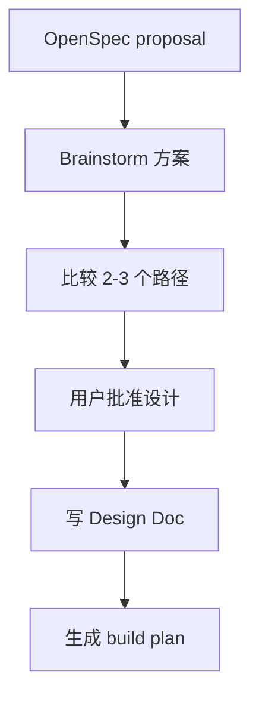

design 阶段回答“怎么做”。它补足 open 阶段没有展开的架构、边界、数据流、错误处理和验证策略。

## 何时进入

- full workflow 完成 open 后。
- hotfix/tweak 命中升级信号，需要补完整设计。
- 恢复时发现已有 change 但缺 Design Doc。

## 产物

```text
docs/superpowers/specs/YYYY-MM-DD-<topic>-design.md
```

Design Doc 会关联当前 OpenSpec change，并成为 build 阶段写计划的输入。

## 好的设计应该包含什么

- 用户目标和非目标。
- 受影响的模块和文件。
- 关键数据流或状态流。
- 错误处理和恢复方式。
- 测试和验证策略。
- 需要用户决策的风险点。



<Warning>
  full workflow 不应跳过 design。hotfix 和 tweak 可以跳过，但一旦范围变质，就应升级回 full。
</Warning>
