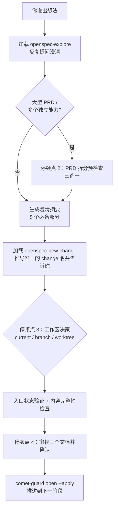

open 阶段会把你的想法变成一个可执行的 change：探索需求、澄清范围、创建 proposal/design/tasks，并初始化 Comet 状态。你会经历一段**引导式对话**。Comet 会反复提问，确认理解一致后再写文档。

<Tip>
  正常使用时只要运行 <code>/comet</code>。
  项目配置为 Classic 后，请求会转发到 <code>/comet-classic</code>，再根据文件状态判断当前阶段并调用{' '}
  <code>/comet-open</code>。
  本文介绍的是内部阶段 Skill。只有你想<strong>手动控制</strong>
  阶段时，才需要直接输入。详见
  <a href="#本阶段如何触发">本阶段如何触发</a>。
</Tip>

## 本阶段如何触发

`/comet-open` 通常由 `/comet` 进入 Classic 后自动路由。内部 `/comet-classic` 会读取 active change 列表与文件状态，整理路由上下文，再由运行时评分决定路由到哪个阶段。

### 默认：用 /comet 自动识别

`/comet-classic` 每次调用都重新读取文件状态（不依赖对话历史），按以下条件路由到 open 阶段：

| 触发条件                                                     | 行为                                        |
| ------------------------------------------------------------ | ------------------------------------------- |
| route 为 `full` 且项目里没有活跃 change                      | 自动调用 `/comet-open`                      |
| route 为 `full`，但已有 active change 且用户没有指定         | 暂停询问：继续已有 change 还是创建新 change |
| active change 的 `.comet.yaml` 缺失                          | 自动调用 `/comet-open` 补齐状态             |
| 置信度不足、多个 active change 或 hotfix/tweak/full 信号冲突 | 暂停询问，不自动创建                        |

输入 `/comet` 并描述想做什么即可。配置选择 Classic 后，内部 `/comet-classic` 会判断是否需要新建 change，并在 open 完成后自动衔接 design。详见[自动推进机制](/zh/concepts/auto-transition)。

### 手动：什么时候才需要直接 /comet-open

- 关闭了自动衔接（`auto_transition: false`）时，`/comet-classic` 推进完一个阶段会停下。你需要手动调用下一个阶段 Skill。
- 只想单独跑 open 阶段（调试、或在阶段之间插入人工审核）。

**正常使用统一入口 `/comet`；只有手动控制阶段时才直接调用阶段命令。**

### 创建 Change 时选择工作区

创建 Classic change 时，Comet 会在生成 OpenSpec 产物和状态文件之前确认工作区：

- `current`：在当前分支串行工作；
- `branch`：创建独立分支，但仍使用当前目录；
- `worktree`：创建或复用独立 worktree，适合并行工作或当前目录已有改动。

如果已有登记且分支匹配的 worktree，Comet 会直接复用。分支仍存在但 worktree 缺失时，会在恢复过程中重建。你按 `/comet` 的提示选择即可，不要手工复制 change 目录。

---

## 你会经历什么

open 阶段通过**多轮对话 + 多个停顿点**逐步生成文档。全程用你触发工作流时用的语言提问和产出文档。



<p align="center">
  
</p>

<p align="center">open 阶段把模糊想法过滤成三份可执行的 OpenSpec 产物</p>

### 第一步：探索想法与澄清需求

Comet 加载 `openspec-explore`，**围绕你的想法持续提问**，直到能整理出一份完整的**澄清摘要**。它不会把一次问答当成“够了”。会一直问到这五个部分都清楚：

| 澄清摘要的五个必备部分 | 你要想清楚的事                      |
| ---------------------- | ----------------------------------- |
| **目标**               | 真正要解决的问题、期望的结果        |
| **非目标**             | 明确不做什么                        |
| **范围边界**           | 涉及/不涉及的模块、用户、平台、数据 |
| **关键未知项**         | 假设、风险、依赖                    |
| **验收场景草案**       | 核心成功场景 + 关键边界场景         |

### 停顿点 2：PRD 拆分预检查（条件触发）

如果你的输入是一个**大型 PRD、路线图或完整产品计划**，或者澄清摘要里出现了**多个独立能力**，Comet 会在这里暂停，给你一份**候选拆分清单**（每个拆分项含建议名称、目标范围、非目标、依赖顺序、核心验收场景），然后让你三选一：

| 选项                          | 含义                                                            |
| ----------------------------- | --------------------------------------------------------------- |
| **创建多个 OpenSpec changes** | 按拆分清单创建多个独立 change（每个都要用自己的 `/comet-open`） |
| **保持为一个 change**         | 不拆，继续单 change 流程，把不拆的原因记进文档                  |
| **调整拆分方案后继续**        | 你描述调整，Comet 重新出清单再问一次                            |

<Tip>
  拆分后 Comet <strong>不会</strong>自动推进任何单个 change 到
  design。它会暂停问你想先做哪一个，只推进你选的那个，其余保持活跃，之后用{" "}
  <code>/comet</code> 恢复。
</Tip>

### 停顿点 3：工作区决策

创建产物和 `.comet.yaml` 之前，Comet 让你确定工作区隔离方式（这一步不能推迟到 build）：

| 选项       | 说明                                         |
| ---------- | -------------------------------------------- |
| `current`  | 在当前分支直接工作，如实绑定当前 Git 分支    |
| `branch`   | 在当前仓库创建新分支，并确认分支名           |
| `worktree` | 独立工作区，可并行开发（你明确要并行时直接用） |

选择结果写入 `isolation`，实际目录的当前分支记录为 `bound_branch`，后续入口检查会阻止意外切换分支。hotfix/tweak 预设默认 `current`。

需求澄清和命名是**非阻塞**的：范围和命名都明确时，Comet 从需求推导**唯一的 kebab-case 英文名**（如 `refine-requirements-doc`）并直接展示；只有存在会改变范围或 change 身份的互斥选择、或名字与已有 change 冲突时才单独询问。确认前不会创建 proposal/design/tasks，也不会用 `openspec-propose` 一次性生成。

### 第二步：创建 change 结构

加载 `openspec-new-change`。完整工作流**默认不加载** `openspec-propose`（一次性生成全部），只有你明确要求时才允许。Comet 用**标准产物循环**逐个生成 proposal → design → tasks：

1. 刷新状态：`openspec status --change "<name>" --json`
2. 获取指令：`openspec instructions proposal|design|tasks --change "<name>" --json`
3. 读取 `dependencies`、遵循 `template` 和 `instruction`、应用 `context`/`rules` 约束（**不复制到文档内容里**）、写入 `resolvedOutputPath`
4. 每个 artifact 后再刷新状态确认

<Warning>
  如果 <code>openspec instructions</code> 失败、返回无效 JSON、或没提供可用的{" "}
  <code>resolvedOutputPath</code>，Comet 会<strong>立即停止</strong>并报告
  OpenSpec 错误，
  <strong>不会</strong>回退成硬编码文档结构——那会绕过项目规则。change
  名必须是你确认过的 kebab-case 名，Comet 不会自作主张扩大或缩小范围。
</Warning>

### 第三步：入口状态验证 + 内容完整性检查

```bash
node "$COMET_STATE" check <name> open
```

然后逐个确认三个文件存在且非空：proposal（背景/目标/范围）、design（架构决策/选型/数据流）、tasks（任务描述）。任何一个缺失或为空，Comet 都不会继续，而是回到创建步骤。

### 停顿点 4：审视三个文档并确认

Comet 把三个文档的摘要摆给你看（proposal 的背景目标范围、design 的架构决策选型、tasks 的任务数和关键任务），然后让你**二选一**：

| 选项                   | 含义                                       |
| ---------------------- | ------------------------------------------ |
| **确认，继续下一阶段** | 文档符合预期，运行阶段 guard 推进          |
| **需要调整**           | 你给修改意见，Comet 改完相关文件再请求确认 |

### 退出：推进到下一阶段

```bash
node "$COMET_GUARD" <change-name> open --apply
```

`--apply` 是必须的——没有它 `.comet.yaml` 会停在 `phase: open`，下一阶段的入口检查会失败。full workflow 推进到 `phase: design`；hotfix/tweak 直接跳到 `phase: build`（跳过 design）。

---

## 调用的 skill

| Skill                 | 用途                   | 何时调用                   |
| --------------------- | ---------------------- | -------------------------- |
| `openspec-explore`    | 探索问题空间、澄清需求 | Step 1，立即执行，不可跳过 |
| `openspec-new-change` | 创建 change 骨架       | Step 2，立即执行，不可跳过 |

<Warning>
  完整工作流默认<strong>不加载</strong> <code>openspec-propose</code>
  （一次性生成全部产物）。只有用户明确要求时才允许。
</Warning>

## 产物

下图用 `<classic-root>` 表示当前 Classic OpenSpec 根目录：新项目默认是 `docs/openspec/`，保留旧布局的项目是 `openspec/`。实际位置由 `.comet/config.yaml` 中的 `classic.artifact_layout` 决定。

<Tree>
  <Tree.Folder name="<classic-root>/changes/<name>/" defaultOpen>
    <Tree.File name=".openspec.yaml" />
    <Tree.File name=".comet.yaml" />
    <Tree.File name="proposal.md" />
    <Tree.File name="design.md" />
    <Tree.File name="tasks.md" />
    <Tree.Folder name="specs/<capability>/">
      <Tree.File name="spec.md" />
    </Tree.Folder>
  </Tree.Folder>
</Tree>

初始化 Comet 状态：

```bash
node "$COMET_STATE" init <name> full
```

## 幂等性：可以安全重复

open 阶段所有操作都可以安全重复执行。如果 `.comet.yaml` 已经在 `phase: open` 且三个产物都已存在，Comet 会**跳过已完成步骤**，从第一个缺失的步骤继续。这让你在中断后重新调用 `/comet` 也不会搞乱状态。

## 停顿点一览

open 阶段有 3 个停顿点（全局编号 2-4，整个五阶段工作流共 10 个，见[五阶段停顿点和用户选择点](/zh/concepts/decision-points)）：

| 停顿点          | 何时出现                                | 你要做什么                              |
| --------------- | --------------------------------------- | --------------------------------------- |
| 2 PRD 拆分      | 输入是大 PRD 或多个独立能力             | 拆分 / 不拆 / 调整方案                  |
| 3 工作区决策    | 创建产物和 `.comet.yaml` 前             | current / branch / worktree             |
| 4 文档审视      | proposal/design/tasks 生成后            | 确认名称、范围和三个文档 / 要调整       |

需求澄清和命名默认**非阻塞**：范围和命名都明确时直接继续，Comet 从需求推导唯一的 kebab-case 英文名并直接展示；只有存在会改变范围或 change 身份的互斥选择时才单独询问。

所有停顿点都遵循[决策点协议](/zh/concepts/decision-points)——Comet 不能用推荐规则、默认值或"用户应该会同意"来代替你的明确选择。

## 常见问题

<AccordionGroup>
  <Accordion title=".comet.yaml 缺失怎么办">
    不要用 `/opsx:new` 绕过。它只创建 OpenSpec artifacts，不会创建 `.comet.yaml`，change 会落在 Comet 状态机之外。重新运行 `/comet`；配置进入 Classic 后会通过 `/comet-open` 补齐状态。
  </Accordion>

<Accordion title="change 名称有什么限制">
  必须是 kebab-case 英文（小写字母、数字、连字符）。中文或非合规名称会被转换成
  kebab-case；只有一个名字时直接使用并展示，存在多个候选或与已有 change 冲突时才报告让你选择。
</Accordion>

<Accordion title="openspec instructions 失败了怎么办">
  Comet 会立即停止 artifact 创建并报告 OpenSpec
  错误，不会回退为硬编码文档结构。检查 OpenSpec CLI
  是否正常、`template`/`instruction`/`dependencies` 是否满足。
</Accordion>

  <Accordion title="大型 PRD 一定要拆吗">
    不一定。拆分预检查会给你三选一（拆分 / 保持一个 / 调整方案），你可以选择保持为一个 change，但要把不拆的原因记进文档。
  </Accordion>
</AccordionGroup>

## 下一步

- [design 阶段](/zh/phases/design) — open 完成后进入深度设计
- [五阶段停顿点和用户选择点](/zh/concepts/decision-points) — open 的停顿点详解
- [大型 PRD 拆分](/zh/guides/prd-splitting) — 拆分预检查的完整机制
- [自动推进机制](/zh/concepts/auto-transition) — open 完成后如何自动衔接 design
