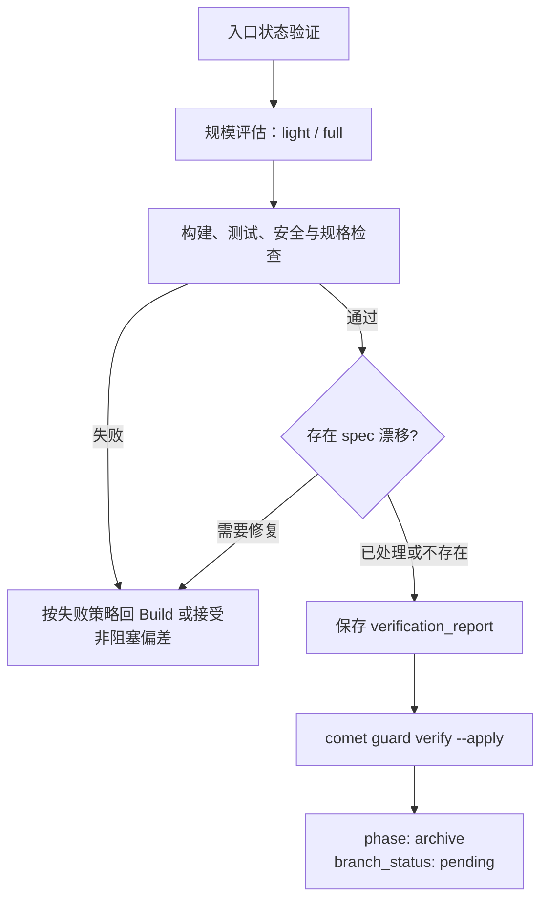

verify 阶段确认实现符合 Design Doc、OpenSpec spec 和任务清单，并把结论保存为可复查的验证报告。它只负责验证证据，不处理、合并、推送或丢弃分支。

<Tip>
  正常情况下只需调用 <code>/comet</code>。配置选择 Classic 后，内部 <code>/comet-classic</code> 会在
  build 完成后路由到 <code>/comet-verify</code>。
</Tip>

## 前置条件

- build 已完成
- tasks.md 全部完成
- `isolation` 和 `bound_branch` 与当前工作区一致
- full workflow 已确定执行、TDD 和 review 模式

## 流程



## 验证强度

Comet 根据任务数、delta spec 数和改动文件数选择 `light` 或 `full`：

- **Light**：任务完成度、改动归属、构建、相关测试、安全检查，以及配置要求的代码审查。
- **Full**：在 Light 基础上检查 proposal、OpenSpec design、Design Doc、验收场景和 spec 漂移。

Full 验证会使用 `openspec-verify-change` 检查规格覆盖。代码审查按 `review_mode` 执行，但分支交付始终留给 Archive。

## 失败处理

- 客观可修复的构建、测试、安全或验收失败会通过 `verify-fail` 回到 Build。
- WARNING/SUGGESTION 只有在存在真实权衡时才让用户选择修复或接受，并把理由写入验证报告。
- CRITICAL/IMPORTANT 不可豁免。
- `verify-fail` 会保留现有字段值，但正常流程在 Verify 中的 `branch_status` 应始终是 `pending`。

## 保存验证证据

验证通过后，把报告路径写入状态：

```bash
comet state set <change-name> verification_report docs/superpowers/reports/YYYY-MM-DD-<name>-verify.md
```

不要在 Verify 写入 `branch_status: handled`，也不要手工设置 `verify_result: pass`。

随后运行：

```bash
comet guard <change-name> verify --apply
```

guard 要求验证报告真实存在，然后推进到 `phase: archive`、写入 `verify_result: pass` 和 `verified_at`。`branch_status` 继续保持 `pending`，由 Archive 在用户确认立即远端交付后处理。

## Spec 漂移

Full 验证发现 delta spec 与 Design Doc 不一致时，用户可以：

- 在 Design Doc 记录 Implementation Divergence；
- 通过 `verify-fail` 回 Build 重新对齐设计与实现；
- 接受非阻塞偏差，并在归档时让主 spec 成为最终事实。

## 下一步

- [archive 阶段](/zh/phases/archive)
- [五阶段停顿点和用户选择点](/zh/concepts/decision-points)
- [代码审查机制](/zh/concepts/review-mode)
- [状态与配置](/zh/concepts/state-management)
