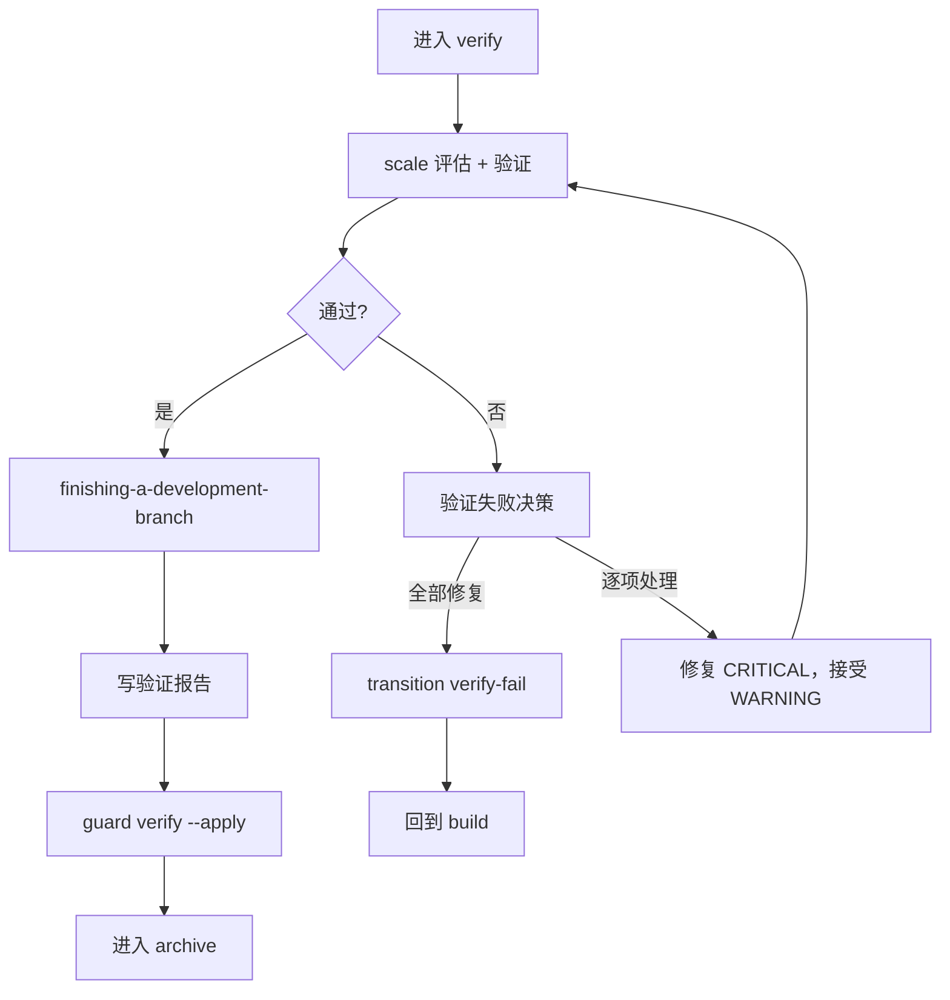

verify 阶段确认实现符合 Design Doc、OpenSpec spec 和任务清单。它不是"跑一下测试"，而是产出可复查的证据。

<Tip>
  <strong>正常情况下你只需要 <code>/comet</code>。</strong>build 阶段完成后，<code>/comet</code> 会自动衔接调用 <code>/comet-verify</code>。本文描述的 <code>/comet-verify</code> 是它内部调用的阶段 Skill——只有当你想<strong>手动控制</strong>（例如关闭了 <code>auto_transition</code>、或想只跑这一个阶段）时，才需要直接输入 <code>/comet-verify</code>。详见<a href="#本阶段如何触发">本阶段如何触发</a>。
</Tip>

## 本阶段如何触发

`/comet-verify` 通常**不是你手敲的命令**，而是 `/comet` 自动衔接的结果。

### 默认：用 /comet，自动衔接

build 阶段退出后（`phase: verify, verify_result: pending`），`/comet` 会自动衔接调用 `/comet-verify`。下一次调用 `/comet` 时，如果检测到 `phase: verify` 或 tasks 全部勾选，也会路由到 verify。verify 和 archive 不受 workflow 类型影响，始终返回标准 Skill。详见[自动推进机制](/zh/concepts/auto-transition)。

### 手动：什么时候才需要直接 /comet-verify

- 关闭了自动衔接（`auto_transition: false`）——build 完成后 `/comet` 会停下并打印 HINT，你需要手动调用 `/comet-verify`。
- 只想单独跑 verify 阶段（例如恢复一个 `phase: verify` 的 change 继续验证）。

**自动推进开着就用 `/comet`，关了才需要手动用各阶段命令。**

## 调用的 skill

| Skill | 用途 | 何时调用 |
| --- | --- | --- |
| `verification-before-completion` | 执行验证检查 | Step 2，立即执行，不可跳过 |
| `requesting-code-review` | 轻量代码审查 | Step 2a（light 第 6 项），`review_mode: standard`/`thorough` 时 |
| `openspec-verify-change` | OpenSpec spec 对齐验证 | Step 2b（full 模式） |
| `finishing-a-development-branch` | 分支收尾处理 | Step 3，立即执行 |
| `brainstorming` | spec 漂移修复 | Step 2b，用户选 option B 时 |

## 验证模式：light vs full

`comet-state scale` 自动评估变更规模，决定 light 或 full：

| 触发条件（任一） | 模式 |
| --- | --- |
| 任务超过 3 个 | full |
| delta spec 能力超过 1 个 | full |
| 改动文件超过 8 个 | full |
| 其他 | light |

可以用 `comet-state set <name> verify_mode <light|full>` 手动覆盖。

## light 验证（6 项检查）

| 检查项 | 内容 |
| --- | --- |
| 1 | tasks.md 全部勾选 |
| 2 | 改动文件与 tasks.md 一致 |
| 3 | 编译通过 |
| 4 | 相关测试通过 |
| 5 | 无明显安全问题 |
| 6 | 代码审查（standard/thorough 时加载 `requesting-code-review`，查正确性/安全/边界；off 时跳过并记录原因） |

light 不检查：spec 场景覆盖、Design Doc 深度对比、delta spec 与 Design Doc 漂移。

## full 验证（7 项检查）

加载 `openspec-verify-change`：

| 检查项 | 内容 |
| --- | --- |
| 1 | tasks.md 全部勾选 |
| 2 | 实现符合 OpenSpec `design.md` 高层设计 |
| 3 | 实现符合 Superpowers Design Doc |
| 4 | 能力 spec 场景全部通过 |
| 5 | proposal.md 目标满足 |
| 6 | delta spec 与 Design Doc 无矛盾 |
| 7 | 关联 Design Doc 可定位 |

## 完整步骤

### Step 0：入口状态验证

```bash
node "$COMET_STATE" check <change-name> verify
```

幂等：`verify_result: pass` 且 `branch_status: handled` 时直接走 guard 转换。

### Step 1：变更规模评估

```bash
node "$COMET_STATE" scale <change-name>
```

自动设 `verify_mode`。如果 build 按任务提交，工作区 diff 可能低估规模——读 plan `base-ref`，用 `git diff --stat "$BASE_REF"...HEAD` 重新计算。

### Step 1b：验证失败决策（停顿点）

验证不通过时暂停。详见[五阶段停顿点和用户选择点](/zh/concepts/decision-points)。

### Step 2：加载证据并验证

按 `handoff_hash` 判断是否需要全文重读（hash 一致可省略 tasks.md 全文重读，proposal/design 仍读）。加载 `verification-before-completion`，按 verify_mode 分支执行 light 或 full 检查。

### Step 2b：spec 漂移处理（停顿点，仅 full 检查 6）

delta spec 与 Design Doc 矛盾时，让你三选一（A/B/C）。详见[五阶段停顿点和用户选择点](/zh/concepts/decision-points)。

### Step 3：分支收尾

加载 `finishing-a-development-branch`，让你选择分支处理方式（停顿点）：

1. 本地合并到主分支
2. 推送并创建 PR
3. 保持分支（稍后处理）
4. 丢弃工作

### Step 4：记录验证证据

验证报告写盘：

```bash
node "$COMET_STATE" set <change-name> verification_report <path>
node "$COMET_STATE" set <change-name> branch_status handled
```

不要手动设 `verify_result: pass`——guard `--apply` 推进它。

### 退出

```bash
node "$COMET_GUARD" <change-name> verify --apply
```

推进到 `phase: archive`，设 `verify_result: pass`、`verified_at`。

## verify 失败 → build 恢复循环



用户确认修复后：`comet-state transition verify-fail` → 调用 `/comet-build`。`branch_status` 在 verify-fail 回滚时不重置。

## 退出条件（guard 检查）

- 验证报告通过
- 分支已处理（`branch_status: handled`）
- `verification_report` 指向已存在的文件
- `branch_status: handled`

## 下一步

- [archive 阶段](/zh/phases/archive) — verify 通过后进入归档
- [五阶段停顿点和用户选择点](/zh/concepts/decision-points) — verify 的 3 个停顿点
- [代码审查机制](/zh/concepts/review-mode) — verify 中的审查检查
- [状态与配置](/zh/concepts/state-management) — verify_mode/verify_result 字段
