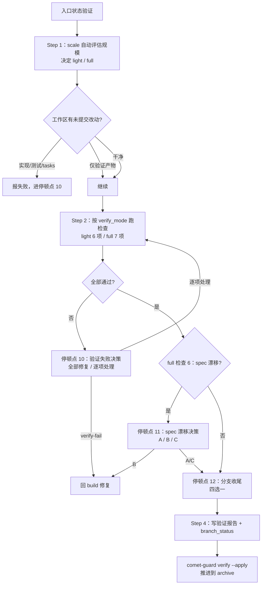

verify 阶段确认实现真的符合 Design Doc、OpenSpec spec 和任务清单。它**不是"跑一下测试"**，而是产出可复查的证据。从你的角度看，Comet 会先**自动评估变更规模**决定验证强度（轻量还是完整），跑检查，然后在失败、spec 漂移、分支收尾三个地方停下来让你决策。

<Tip>
  <strong>正常情况下你只需要 <code>/comet</code>。</strong>build 阶段完成后，<code>/comet</code> 会自动衔接调用 <code>/comet-verify</code>。本文描述的 <code>/comet-verify</code> 是它内部调用的阶段 Skill——只有当你想<strong>手动控制</strong>（例如关闭了 <code>auto_transition</code>、或想只跑这一个阶段）时，才需要直接输入 <code>/comet-verify</code>。详见<a href="#本阶段如何触发">本阶段如何触发</a>。
</Tip>

## 本阶段如何触发

`/comet-verify` 通常**不是你手敲的命令**，而是 `/comet` 自动衔接的结果。

### 默认：用 /comet 自动衔接

build 阶段退出后（`phase: verify, verify_result: pending`），`/comet` 会自动衔接调用 `/comet-verify`。下一次调用 `/comet` 时，如果检测到 `phase: verify` 或 tasks 全部勾选，也会路由到 verify。verify 和 archive 不受 workflow 类型影响，始终返回标准 Skill。详见[自动推进机制](/zh/concepts/auto-transition)。

### 手动：什么时候才需要直接 /comet-verify

- 关闭了自动衔接（`auto_transition: false`）——build 完成后 `/comet` 会停下并打印 HINT。
- 只想单独跑 verify（恢复一个 `phase: verify` 的 change 继续验证）。

**自动推进开着就用 `/comet`，关了才需要手动用各阶段命令。**

---

## 前置条件

进入 verify 需要：代码已提交（build 完成）、tasks.md 全部完成。

## 你会经历什么



<p align="center">
  
</p>

<p align="center">verify 阶段不只是跑测试，而是把检查结果、漂移判断和验证报告放进证据链</p>

### Step 0：入口状态验证

```bash
node "$COMET_STATE" check <change-name> verify
```

幂等：`verify_result: pass` 且 `branch_status: handled` 时直接走 guard 流转，不重跑检查。

### Step 1：变更规模评估（自动）

```bash
node "$COMET_STATE" scale <change-name>
```

Comet 自动算三项，**任一超阈值就走 full**：

| 指标 | 阈值 | 怎么数 |
| --- | --- | --- |
| 任务数 | `> 3` | tasks.md 里 `- [` 开头的行 |
| delta spec 能力数 | `> 1` | `specs/` 下含 spec.md 的子目录 |
| 改动文件数 | `> 8` | `git diff --name-only <base-ref>...HEAD` |

你会看到类似输出：

```text
=== Scale Assessment: <name> ===
  Tasks: 5 (threshold: 3)
  Delta specs: 1 capabilities (threshold: 1)
  Changed files: 10 (threshold: 8)
  → Result: full
[SCALE] verify_mode=full
```

<Note>
  如果你 build 时每个任务都提交了，工作区 diff 可能<strong>低估</strong>改动规模。Comet 会读 plan 头的 <code>base-ref</code> 用提交区间复核。你也可以随时手动覆盖：把 change 名传给 <code>comet-state set ... verify_mode full</code>。
</Note>

### 脏工作区处理

验证前会检查未提交改动（按 `dirty-worktree.md`）：

| 情况 | 处理 |
| --- | --- |
| 改动属于当前 change 且触及实现/测试/tasks/delta spec/design doc | **不在 verify 修**，报失败进停顿点 10 |
| 改动只是验证产物（报告草稿、分支处理笔记） | 可继续 |
| 有实现但 tasks.md 没勾选 | 当"build 状态滞后"，报失败进停顿点 10 |

### Step 2：按 verify_mode 跑检查

先用 handoff hash 判断是否要全文重读 OpenSpec artifacts（hash 一致可省略 tasks.md 全文，proposal/design 仍读）。

#### light 验证（6 项）

| 检查项 | 内容 |
| --- | --- |
| 1 | tasks.md 全部勾选 `[x]` |
| 2 | 改动文件与 tasks.md 描述一致 |
| 3 | 编译通过（项目构建命令） |
| 4 | 相关测试通过 |
| 5 | 无明显安全问题（无硬编码密钥、无新增 unsafe） |
| 6 | 代码审查（standard/thorough 时加载 `requesting-code-review`，只查正确性/安全/边界；off 时跳过并记录原因） |

light 跳过：spec 场景覆盖、Design Doc 一致性深度比对、delta spec 与 Design Doc 漂移检测。

#### full 验证（7 项）

**必须先加载** `openspec-verify-change`：

| 检查项 | 内容 |
| --- | --- |
| 1 | tasks.md 全部勾选 |
| 2 | 实现符合 OpenSpec `design.md` 高层设计 |
| 3 | 实现符合 Superpowers Design Doc |
| 4 | 能力 spec 场景全部通过 |
| 5 | proposal.md 目标满足 |
| 6 | delta spec 与 Design Doc 无矛盾（**漂移检测，触发停顿点 11**） |
| 7 | 关联 Design Doc 可定位 |

### 停顿点 10：验证失败决策

任何检查失败时，Comet **暂停等你决定**（不能自动 verify-fail 或自动调 `/comet-build`）。它会列出失败项、严重程度（CRITICAL/IMPORTANT/WARNING/SUGGESTION）和推荐处理方式。

<Note>
  严重程度拿不准时<strong>降级处理</strong>（SUGGESTION &gt; WARNING &gt; CRITICAL）。只有构建失败、测试失败、安全问题用 CRITICAL；模糊问题标 WARNING 或 SUGGESTION。
</Note>

你的两种响应方式：

| 方式 | 含义 |
| --- | --- |
| **全部修复** | `comet-state transition <name> verify-fail`，然后调 `/comet-build` 修 |
| **逐项处理** | CRITICAL/IMPORTANT 必须修；WARNING/SUGGESTION 可接受偏差但必须在报告记原因。**有 CRITICAL/IMPORTANT 就不能直接全接受** |

verify-fail 回滚到 build 时，`branch_status` **不重置**——如果你之前已处理过分支，修复后再进 verify 可跳过分支处理，直接 `comet-state set <name> branch_status handled` 保留结果。

<Note>
  <code>verify-fail</code> 转移会把 <code>phase</code> 回退到 <code>build</code>（不是停在 verify），随后进入 <code>/comet-build</code> 修复，修完重新过 build→verify guard。连续 3 次失败后 Comet 会要求你在"接受偏差"或"继续修"之间明确选择，不会无限重试。
</Note>

### 停顿点 11：spec 漂移决策（仅 full 检查 6）

delta spec 有内容但 Design Doc 没反映时，Comet **暂停让你三选一**（单选，不能自动选）：

| 选项 | 适用场景 | 之后 |
| --- | --- | --- |
| **A** | 偏差合理但 Design Doc 漏记，想留个说明 | Design Doc 追加 "Implementation Divergence" 段，记录原因；继续验证 |
| **B** | 偏差较大，设计没跟上 | `verify-fail` 回 build，加载 `brainstorming` 重新对齐 Design Doc + delta spec（回到[停顿点 11](#停顿点-11-spec-漂移决策仅-full-检查-6)） |
| **C** | 偏差可接受，不想补 | 确认接受继续验证（归档时 Design Doc 让位给主 spec） |

判断口径：说明性问题（Design Doc 漏记，实现没问题）选 A；设计性问题（Design Doc 跟不上现实）选 B；无关紧要不值得回头补选 C。

### 停顿点 12：分支收尾

加载 `finishing-a-development-branch`，**暂停让你选**分支处理方式（不能按推荐/默认/当前分支状态自动选）：

| 选项 | 行为 |
| --- | --- |
| 1 | 本地合并到主分支（跑测试、清理 worktree、删分支） |
| 2 | 推送并创建 PR（保留 worktree 供 PR 迭代） |
| 3 | 保持分支稍后处理 |
| 4 | 丢弃工作（需输入 `discard` 确认，列出将删的提交） |

<Note>
  skill 会先跑测试套件，失败就停。worktree 清理只对选项 1 和 4 生效，且只清理 <code>.worktrees/</code> 或 <code>worktrees/</code> 下的（harness 管理的 worktree 不删）。detached HEAD 场景下没有"本地合并"选项，只有 3 个选项。
</Note>

### Step 4：记录验证证据

```bash
node "$COMET_STATE" set <change-name> verification_report docs/superpowers/reports/YYYY-MM-DD-<name>-verify.md
node "$COMET_STATE" set <change-name> branch_status handled
```

**不要手动设 `verify_result: pass`**——guard 推进它。

### 退出

```bash
node "$COMET_GUARD" <change-name> verify --apply
```

guard 校验 `verification_report` 指向存在的文件、`branch_status: handled`，然后推进到 `phase: archive`、设 `verify_result: pass`、`verified_at`。

<Warning>
  无论自动衔接还是手动，<code>/comet-archive</code> 进去后<strong>必须先执行归档前最终确认</strong>，等你选「确认归档」才允许跑归档脚本。验证通过不等于自动归档。
</Warning>

---

## 调用的 skill

| Skill | 用途 | 何时调用 |
| --- | --- | --- |
| `verification-before-completion` | 执行验证检查 | Step 2，立即执行，不可跳过 |
| `requesting-code-review` | 轻量代码审查 | Step 2 light 第 6 项，`review_mode: standard`/`thorough` 时 |
| `openspec-verify-change` | OpenSpec spec 对齐验证 | Step 2b（full 模式，必须加载） |
| `finishing-a-development-branch` | 分支收尾处理 | Step 3，立即执行 |
| `brainstorming` | spec 漂移修复 | 停顿点 11 选 B 时 |

## verify_mode 覆盖

随时可手动覆盖自动评估：

```bash
node "$COMET_STATE" set <change-name> verify_mode <light|full>
```

## 三个停顿点一览

verify 阶段有 3 个停顿点（全局编号 10-12，整个五阶段工作流共 13 个，见[五阶段停顿点和用户选择点](/zh/concepts/decision-points)）：

| 停顿点 | 何时出现 | 你要做什么 |
| --- | --- | --- |
| 10 验证失败 | 任何检查失败 | 全部修复回 build / 逐项处理（CRITICAL 必修） |
| 11 spec 漂移 | full 检查 6 发现矛盾 | A 追加说明 / B 回 build 重设计 / C 接受偏差 |
| 12 分支收尾 | 验证通过后 | 合并 / PR / 保持 / 丢弃 |

## 下一步

- [archive 阶段](/zh/phases/archive) — verify 通过后进入归档
- [五阶段停顿点和用户选择点](/zh/concepts/decision-points) — verify 的 3 个停顿点
- [代码审查机制](/zh/concepts/review-mode) — verify 中的审查检查
- [状态与配置](/zh/concepts/state-management) — verify_mode/verify_result 字段
