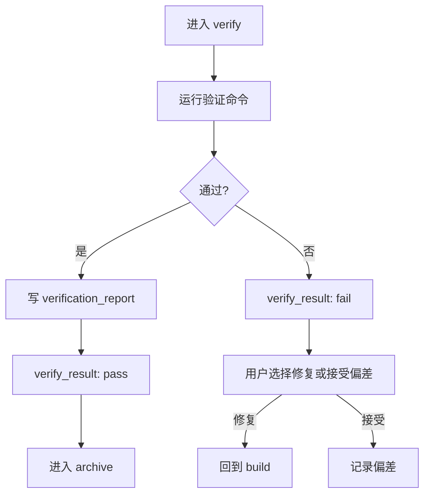

verify 阶段确认实现符合 Design Doc、OpenSpec delta 和任务清单。它不是“跑一下测试”这么简单，而是要给出可以复查的证据。

## 验证内容

- 任务是否全部完成。
- 实现是否符合 spec 和设计。
- 构建、测试、lint 或项目指定验证命令是否通过。
- 是否存在未处理的分支或工作区风险。
- 是否需要代码审查或最终修复。

## 失败时怎么处理

`verify_result: fail` 是阻塞点。Comet 会暂停，让用户选择：

- 返回 build 修复。
- 接受偏差，并记录原因。

## 推荐做法

<Steps>
  <Step title="先运行项目验证">
    使用项目已有测试、构建和 lint。若 `.comet.yaml` 有 `verify_command`，优先执行它。
  </Step>
  <Step title="检查 spec 对齐">
    对照 OpenSpec delta 和 Design Doc，确认没有遗漏需求。
  </Step>
  <Step title="生成验证报告">
    写清楚命令、结果、失败处理和剩余风险。
  </Step>
</Steps>
