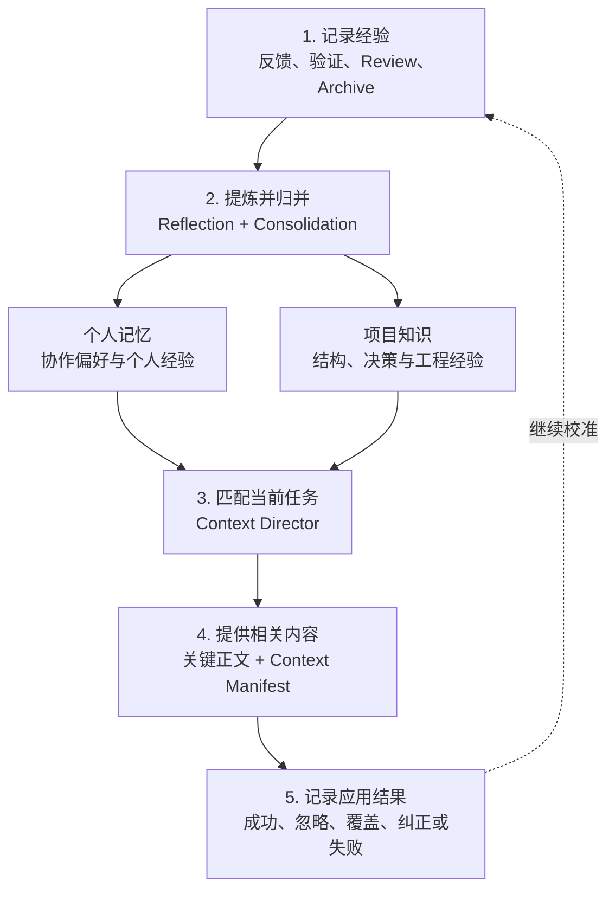

Agent Learning Loop 是 Comet 为个人记忆和项目知识提供的学习机制。它将用户反馈、任务结果和项目证据整理成可复用上下文，并在后续任务中按需提供给 Agent。

两类插件分别保存不同内容：

- **个人记忆**保留你的语言、表达和协作偏好；
- **项目知识**保留项目结构、设计依据、改动关系和已验证的工程经验。

## 常见场景的处理方式

| 场景 | 处理方式 |
| --- | --- |
| 用户明确要求长期沿用某项偏好 | 保存为个人记忆，并记录所有者和适用范围 |
| Review 或验证确认项目规律 | 保存带来源和复验状态的项目记录 |
| 来源文件发生变化 | 将相关记录标记为待复核或失效 |
| 候选内容较长 | 先提供 Context Manifest，需要时按记录 ID 展开 |
| 插件处理失败 | 保留当前任务，记录失败并允许稍后重放 |

Comet 的目标是为 Agent 提供更好的任务起点。当前代码、配置、测试和 Runtime 状态仍是执行任务时的直接依据。

## 业界实践与 Comet 的取舍

主流 Coding Agent 通常从三个方向补充跨会话上下文：

| 能力     | 代表做法                                                                            | 适合解决的问题                     | 使用边界                                       |
| -------- | ----------------------------------------------------------------------------------- | ---------------------------------- | ---------------------------------------------- |
| 项目指令 | 各平台支持的 Rule 载体，如 Codex `AGENTS.md`、Claude Code `CLAUDE.md`、Cursor Rules | 持续提供团队明确写下的行为要求     | 依赖人工维护；自然语言指令不具备确定性检查能力 |
| 自动记忆 | Claude Code Auto Memory、Cursor Memories 历史方案、GitHub Copilot Memory            | 保留用户偏好和历史协作信息         | 需要明确所有者、作用域、纠正方式和失效条件     |
| 项目知识 | Qoder Knowledge Engine、代码索引和仓库知识层                                        | 理解项目结构、工程约定和跨文件关系 | 检索结果需要回到当前仓库验证                   |

[Claude Code](https://code.claude.com/docs/en/memory) 区分人工维护的 `CLAUDE.md` 与自动形成的记忆；[GitHub Copilot Memory](https://docs.github.com/en/copilot/concepts/agents/copilot-memory) 区分 repository facts 与 user preferences；[Cursor Rules](https://cursor.com/docs/rules) 通过路径和相关性控制指令加载；[Qoder Knowledge Engine](https://qoder.com/en/blog/qoder-knowledge-engine) 将项目理解组织为面向 Agent 的知识层。

每条长期记录包含所有者、来源、适用范围、来源状态和应用结果，用于查看、纠正和追踪内容。

## 职责分层

| 层                | 核心职责                         | 典型内容                               | 所有者或执行方 |
| ----------------- | -------------------------------- | -------------------------------------- | -------------- |
| 个人记忆          | 描述你偏好的协作方式             | 语言、表达、个人工作习惯和可复用经历   | 当前用户       |
| 项目知识          | 描述项目结构、设计依据和工程经验 | 模块、依赖、决策、流程、约束和故障解法 | 当前项目       |
| Rule / Agent 指令 | 规定 Agent 在当前范围内的行为    | 目标平台支持的 Rule 文件或规则目录     | 仓库或宿主     |
| Hook / 检查       | 观察、阻断或验证工程约束           | Hook、linter、test、build、CI          | 执行环境       |

> 项目知识帮助 Agent 理解项目，Rule 提供团队指令，Hook 和工程检查负责以确定性方式执行约束。

## 关键概念

| 概念                             | 产品含义                                                 |
| -------------------------------- | -------------------------------------------------------- |
| Experience（经验记录）           | 一次用户反馈、任务结果或验证结果的紧凑记录               |
| Reflection（经验提炼）           | 从经验记录中识别具有长期价值的结论                       |
| Consolidation（内容归并）        | 合并近义内容、补充证据并处理失效记录                     |
| Provider（数据提供方）           | 保存和查询个人记忆或项目知识的统一接口                   |
| Context Director（上下文调度器） | 根据当前项目、路径、任务和阶段选择相关内容               |
| Context Manifest（上下文清单）   | 包含摘要、应用原因和稳定 ID 的精简索引，支持按需展开详情 |

## 从经验到任务上下文

### 1. 记录范围明确的经验

Classic、Native、Hotfix 和 Tweak 将结构化事件交给同一条学习通道。有效信号包括：

- 用户明确要求记住、纠正或遗忘；
- 任务完成后的实际结果；
- 成功或失败的验证；
- 已处理的 Review 结论；
- 已完成根因确认、修复和复验的故障；
- Change 归档后的最终决策；
- 某条上下文被应用后的结果。

Experience 仅保留情境、动作摘要、结果和证据引用。完整对话、完整 diff、原始日志、工具输出和隐藏推理不进入长期记录。

### 2. 提炼可复用结论

明确的长期要求按固定规则直接生效。例如，你提出“以后默认用中文回答”，个人记忆可以立即生效。

需要归纳总结的经验由 Reflection 在后台处理。例如，Review 确认某类修改必须同步更新注册表后，系统会核对结论是否已接受、修改是否完成以及验证是否成功，再决定是否形成项目策略。

Consolidation 负责合并近义内容、补充新证据、收紧适用范围，并让失效记录退出后续任务。

### 3. 匹配当前任务

Context Director 根据当前项目、路径、任务、操作和阶段筛选候选。关键画像和少量已验证策略可以完整提供，其他相关内容进入 Context Manifest。

每个 Manifest 项包含稳定 ID、标题、来源类型和 `whyApplied`。`whyApplied` 说明该内容命中当前任务的具体条件。Agent 需要完整正文、来源或验证方式时，再按稳定 ID 展开。

### 4. 记录应用结果

内容进入任务后，Comet 记录以下结果：

| 结果                     | 含义                     |
| ------------------------ | ------------------------ |
| `used-successfully`      | 内容已帮助任务完成       |
| `ignored`                | 内容已提供，但本次未使用 |
| `overridden`             | 内容被更高优先级要求覆盖 |
| `corrected`              | 内容需要纠正或替代       |
| `contributed-to-failure` | 内容参与导致了失败       |

应用结果会影响后续排序、状态晋升、内容改写或替代。Comet 同时关注匹配相关性和实际任务效果。

## 证据与生命周期

自动形成的内容需要经过验证和复用，才能获得更高优先级。Comet 为记录保留以下状态：

| 状态         | 产品含义                                             |
| ------------ | ---------------------------------------------------- |
| `trial`      | 具备初步依据，以较低优先级参与相关任务               |
| `proven`     | 来自明确要求、可直接核对的事实或成功复用的稳定内容         |
| `enforced`   | 已关联当前存在且成功执行的确定性验证，仅用于项目策略 |
| `superseded` | 已被纠正、来源失效或被更高优先级内容替代             |

遗忘操作使用独立的 tombstone（遗忘标记）。系统重放历史事件时会识别该标记，防止已遗忘内容重新生效。

## 失败隔离

显式新增、纠正、遗忘和展开属于用户正在等待的操作。操作失败时，Comet 返回实际错误并保持原状态。

后台采集、Reflection、检索或某个 Learner 失败时，Comet 记录诊断并继续当前工作流。个人记忆与项目知识使用独立的 Provider、存储和作用域，单个插件故障不会中断另一类长期上下文。

## 产品边界

Agent Learning Loop 形成的是可查看、可纠正、可追溯的外部上下文。它不训练或微调模型，并遵守以下边界：

- 不保存完整聊天、完整任务轨迹或隐藏推理；
- 不将个人项目习惯自动发布为团队知识；
- 不覆盖 `AGENTS.md`、Rule、Skill 或项目配置；
- 不为未知技术栈自动生成 linter、test、build 或 CI 配置；
- 不扩大提交、推送、删除和发布等操作权限。

## 后续阅读

- [个人记忆：让协作偏好持续生效](/zh/plugins/personal-memory)
- [个人记忆原理：从用户信号到任务上下文](/zh/plugins/personal-memory-principles)
- [项目知识：在任务中沉淀可复用的项目理解](/zh/plugins/project-rules)
- [项目知识原理：从项目证据到任务上下文](/zh/plugins/project-knowledge-principles)
