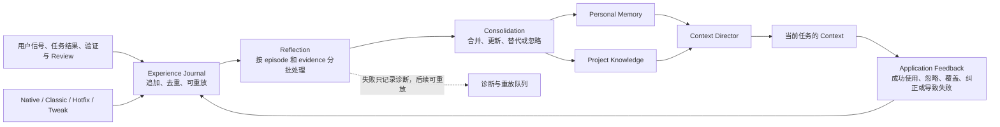

Agent Learning Loop 是 Comet 用来处理工作经验的一条确定性流程。它接收用户信号、工作流结果、验证结果、Review 结论和 Archive 结果，再把其中具有长期复用价值的部分交给 Personal Memory 或 Project Knowledge。

它不等同于模型训练，也不保存完整对话。任务日志、工具输出、完整 diff、隐藏推理和能够从仓库重新找到的普通事实，都不属于学习内容。

## 它解决什么问题

同一种协作方式如果只存在于一次对话里，下一次任务仍然要重新说明。完全自动保存又会把临时要求、偶然错误和项目事实混在一起。Agent Learning Loop 把这两个问题拆开处理：先记录有边界的经验，再根据证据决定是否形成可复用记录。

例如，用户明确要求“以后用中文回答”，这是直接信号，可以立即写入个人记忆。一次 Review 发现某类文件必须运行固定检查，则需要结合修复和成功复验，才可能形成项目策略。一次任务中临时使用的命令不会因为被记录就变成长期规则。

## 用户能看到什么

- 明确的记住、纠正和遗忘操作会立即返回结果。
- 工作流结束后，后台可以整理成功、纠正和失败经验；后台处理不会阻塞当前任务。
- 下一次任务只接收与当前项目、路径、操作和阶段有关的内容。
- 相关内容过长时，Agent 先看到摘要和稳定 ID，需要正文时再展开。
- 经验来源、应用原因和最近一次使用结果可以在对应的 Dashboard 中查看。
- 学习或语义 Reflection 失败时，当前 Native、Classic、Hotfix 或 Tweak 流程继续运行，诊断会保留供后续处理。

## 一次经验如何流动



## 内部机制

### 1. Runtime 先记录事件

工作流 Runtime 通过版本化的 `comet.agent-experience.v1` 事件传递经验。事件包含稳定的 event ID 和 episode ID、作用域、项目身份、任务上下文、用户信号、最小证据和结果。相同事件重试时按 ID 去重；同一 episode 在恢复、重新验证和跨会话继续时可以合并。

Experience Journal 是追加式状态。它先完成快速写入，再由 Reflection 处理较慢的语义归纳。Personal Memory 和 Project Knowledge 共享事件入口，但使用各自的记录格式、存储和检索规则，不互相复制记录。

### 2. Reflection 只产生候选变化

Reflection 的输出是结构化 Learning Delta，动作包括 `create`、`update`、`supersede`、`forget` 和 `noop`。它需要带上记录归属、适用范围和证据。输入过大时按 episode 和 evidence 分批处理，不因为单个 Review Packet 过长就丢弃有效事件。

语义服务不可用时，明确的用户信号、确定性项目事实和真实验证结果仍可以通过确定性路径处理；需要语义泛化的部分留在待处理队列中。

### 3. 记录有明确的生命周期

| 状态         | 含义                                                            |
| ------------ | --------------------------------------------------------------- |
| `trial`      | 有依据的推断，允许低优先级使用，但还没有充分复用证据            |
| `proven`     | 用户明确确认、确定性事实或成功复用支持的稳定内容                |
| `enforced`   | 绑定了当前存在且成功执行的确定性验证入口，仅用于 Project Policy |
| `superseded` | 来源失效、被纠正或被更高优先级内容替代，不再注入                |

遗忘使用独立的 tombstone。这样，旧事件在重放时也不会把已经遗忘的记录重新恢复。

## 如何控制范围

项目配置可以分别控制个人记忆是否学习和是否注入任务上下文：

```yaml
memory:
  learning: true
  retrieval: true
```

关闭 `learning` 不会删除已有记录；关闭 `retrieval` 不影响 Dashboard 中的管理操作。Project Knowledge 使用自己的 Provider 配置，具体见[项目规则](/zh/plugins/project-rules)。

当前用户要求和系统约束始终优先于学习结果。个人记忆不能授权提交、推送、删除或发布；Project Policy 也不会静默改写仓库中的 `AGENTS.md`、Rule、配置、测试或检查。

## 适合记住的内容

- 用户明确确认的长期语言、沟通和输出偏好；
- 有明确来源和复验结果的项目决策、操作流程或失败解决方式；
- 多次任务中稳定出现、且对未来任务仍有帮助的协作经验。

不适合记住的内容包括一次性任务要求、临时调试输出、完整会话、完整 diff、模型隐藏推理和可直接从当前仓库读取的普通事实。

继续阅读：[个人记忆](/zh/plugins/personal-memory)、[项目规则](/zh/plugins/project-rules) 和 [Native 工作流](/zh/concepts/native-workflow)。
