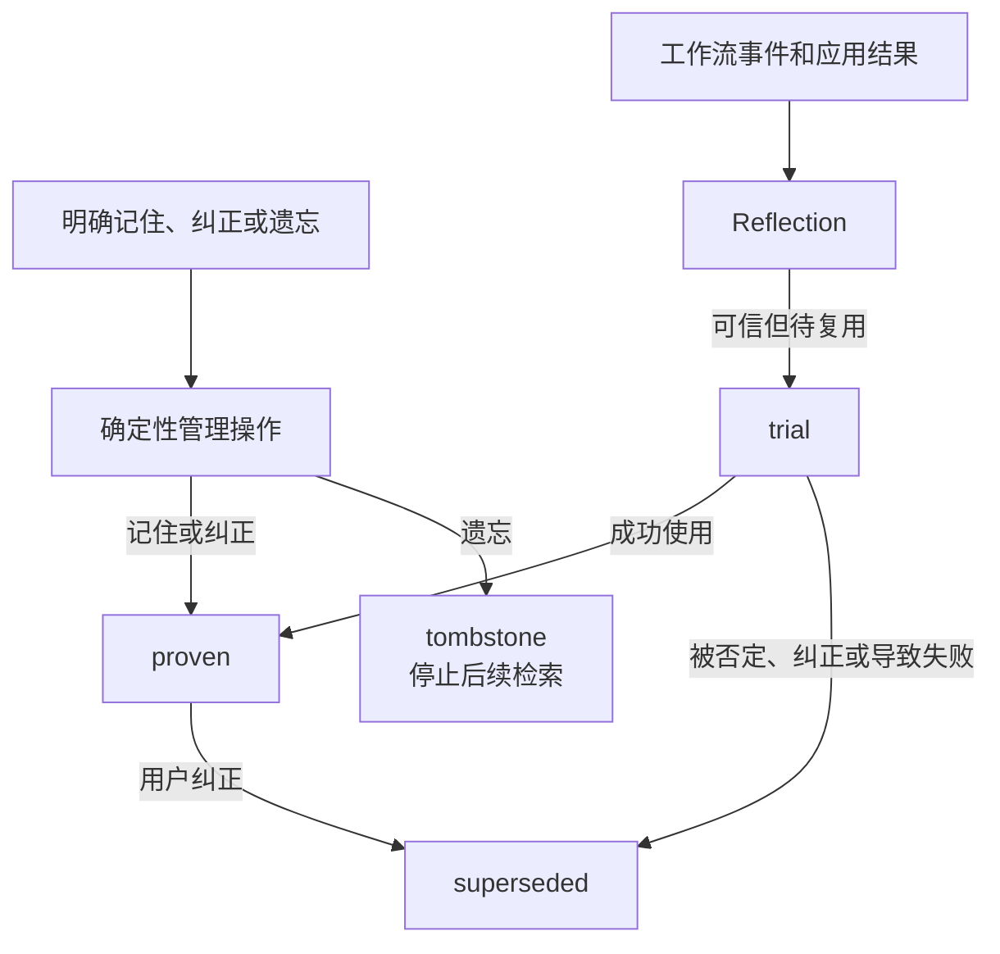
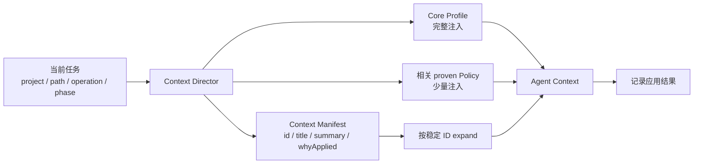

Personal Memory 是 Comet 的第一方用户级插件。它保存未来任务仍有帮助的用户偏好和个人协作方式，不保存仓库公共事实，也不会自动变成团队规则。

个人记忆可以独立停用或卸载。插件不可用时，Native、Classic、Hotfix 和 Tweak 仍按原有工作流继续运行。

## 三类内容

| 类型                 | 保存内容                                     | 典型范围             |
| -------------------- | -------------------------------------------- | -------------------- |
| Core Profile         | 语言、角色、技术背景、沟通和输出偏好         | 全局或用户级         |
| Collaboration Policy | 个人在特定项目、路径、操作或阶段中的工作方式 | 项目、路径或任务条件 |
| Personal Episode     | 一次成功、纠正或失败的紧凑情景记录           | 供后台复盘或按需展开 |

Personal Episode 只保留 `situation`、`action summary`、`outcome` 和 `lesson` 等必要内容，不保存完整对话或工具日志。

## 明确要求与自动形成

用户明确说“记住”“以后都这样”、直接纠正已有内容或明确要求遗忘时，操作会立即生效。这样的记录可以直接进入 `proven`。

只针对“这次”或“当前任务”的要求不会写入长期记忆。Agent 从多次工作结果中推断出的可复用经验先进入 `trial`，成功使用后才可能晋升为 `proven`。被否定、纠正或导致失败的内容会被改写或标记为 `superseded`。



<p align="center">
  
</p>

## Agent 如何使用

任务开始时，Context Director 会根据项目身份、任务、路径、操作和阶段筛选记录。完整 Core Profile 和少量直接相关的 `proven` 协作策略可以常驻上下文；其他记录先以 Context Manifest 形式出现。

Manifest 项包含稳定 ID、标题、摘要、来源类型和真实的 `whyApplied`。Agent 需要正文、来源或验证方式时，再按 ID 展开。这样可以让任务先获得必要信息，同时避免把所有历史记录一次性放进上下文。



同一 session 中，如果任务路径、操作或阶段发生变化，系统会重新选择上下文，但不会重复投递没有变化的内容。应用结果至少区分 `used-successfully`、`ignored`、`overridden`、`corrected` 和 `contributed-to-failure`，这些结果会影响后续排序和生命周期。

## CLI 管理

CLI、Dashboard、Skill 和 Hook 使用同一份个人记忆状态。常用操作如下：

```bash
comet memory list .
comet memory retrieve . --task "实现新的 CLI 命令"
comet memory remember . --text "默认用中文回答" --scope global
comet memory correct . --id <记忆标识> --text "改为简洁的中文回答"
comet memory forget . --id <记忆标识>
comet memory rollback . --id <记忆标识>
comet memory status .
```

`remember` 适合用户明确要求长期保存的内容。`observe` 只适合记录 Agent 发现的稳定协作方式，不应写入任务摘要、进度、命令输出或测试结果。`forget` 默认保留回滚能力；永久删除需要显式使用 `--permanent`。

## Provider、配置和存储

个人记忆可以使用本地 Provider，也可以配置 Remote Provider。两者在同一时间严格二选一；Remote 请求失败时不会静默切回 Local。

项目级配置控制自动学习和检索：

```yaml
memory:
  learning: true
  retrieval: true
```

用户级配置可以选择 Provider，并设置一次任务注入预算：

```yaml
personal_memory:
  provider: local
  profile_char_limit: 2000
  task_context_char_limit: 6000
```

字符预算只限制一次 Agent Context 中常驻的正文数量。超过预算的相关内容进入 Manifest，不会拒绝保存、截断权威记录或被当作记忆总容量。

Local Provider 保留可读的 `profile.md` 和项目投影，机器状态可以在升级时重建。主工作区和同一仓库的 linked worktree 共享稳定的项目身份，不同仓库保持隔离。Remote Provider 只通过固定协议传输受限请求，令牌放在环境变量中。

## 优先级与边界

当前用户要求和系统约束始终高于个人记忆。更具体的项目或路径选择器高于宽泛的全局内容；明确内容高于自动推断；Project Policy 高于个人项目习惯。

个人记忆不会自动写入 Project Knowledge，不会修改项目规则，不会替用户提交、推送、删除或发布。显式新增、纠正、遗忘、回滚和配置失败会返回真实错误并保持原状态；后台采集、Reflection、反馈或检索失败只记录诊断，当前工作流继续。

在 Dashboard 的“插件中心”中，可以查看记录状态、来源摘要、应用原因、最近应用结果和完整历史，并执行新增、纠正、遗忘、回滚和按需展开。

继续阅读：[Agent Learning Loop](/zh/plugins/agent-learning-loop)、[项目规则](/zh/plugins/project-rules) 和 [Dashboard 概览](/zh/dashboard/overview)。
