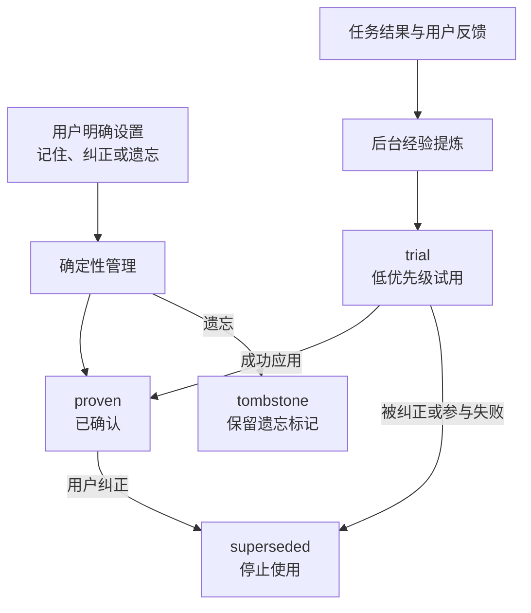

Personal Memory（个人记忆）是 Comet 的第一方用户级插件。它保存你希望长期沿用的协作偏好，并在相关任务中提供给 Agent。语言、表达方式、验证习惯和交付要求都可以跨任务延续，无需在每次会话中重复说明。

个人记忆归当前用户所有。你可以让一条记录在所有项目中生效，也可以将它限定在某个项目内。

## 适合保存的内容

| 你表达的内容                     | Comet 的处理方式             | 判断依据                             |
| -------------------------------- | ---------------------------- | ------------------------------------ |
| “以后默认用中文回答”             | 保存为全局个人记忆           | 这是跨任务、跨项目稳定的表达偏好     |
| “在这个仓库里先运行最小相关测试” | 保存为项目范围的个人协作策略 | 这是你在当前项目中的工作习惯         |
| “这次先不要提交”                 | 仅作用于当前请求             | 一次性授予的权限不应扩展为长期默认行为 |
| “`domains` 不能直接访问文件系统” | 交给项目知识或仓库 Rule 承载 | 这是团队共享的项目约束               |

这套分类保留了内容的所有权：项目范围的个人习惯仍属于你；团队共享知识需要项目证据或明确的共享操作。

## 产品定位

新的 Agent 会话通常从新的上下文窗口开始。个人记忆提供一层独立于对话历史的用户上下文，重点管理四项信息：

- **所有权**：记录属于当前用户；
- **作用域**：记录在全局或指定项目中生效；
- **权威级别**：区分用户明确设置和系统推断；
- **生命周期**：支持试用、确认、纠正、遗忘和回滚。

[Claude Code Auto Memory](https://code.claude.com/docs/en/memory) 会记录构建命令、调试经验和用户偏好；Cursor 的 [Memories 历史资料](https://docs.cursor.com/en/context/memories) 记录了从对话形成项目范围记忆的方案；[GitHub Copilot Memory](https://docs.github.com/en/copilot/concepts/agents/copilot-memory) 区分 repository-level facts 与 user-level preferences。

Comet 在跨会话记忆的基础上增加了可追溯治理。你可以查看一条记忆的来源、适用范围、当前状态、应用原因和最近结果，也可以直接纠正或遗忘它。

## 三类个人记忆

### Core Profile：稳定的用户画像

Core Profile（核心画像）保存跨任务长期有效的信息：

- 语言和表达偏好；
- 角色与技术背景；
- 输出格式和证据习惯；
- 稳定的沟通边界。

这些内容通常不依赖具体文件或工作流阶段。任务开始时，少量关键画像可以直接进入上下文。

### Collaboration Policy：有条件的协作策略

Collaboration Policy（协作策略）描述你希望 Agent 在特定条件下采用的工作方式：

- 在某个项目中优先执行最小相关测试；
- 修改指定路径前核对生成物同步范围；
- Review 时按严重度列出可复现问题；
- Archive 前核对工作区与远端状态。

协作策略可以限定项目、路径、任务、操作或阶段。具体范围能够减少无关任务中的错误匹配。

### Personal Episode：可复盘的个人经历

Personal Episode（个人经历）保存一次成功、纠正或失败的紧凑记录：

- 当时的任务情境；
- 已采取的动作；
- 实际结果；
- 可以复用的经验。

个人经历主要用于后台提炼或按需查看。它只保留必要的证据引用，不保存完整会话、完整工具日志或模型隐藏推理。

<p align="center">
  
</p>

## 两种形成方式

### 用户明确设置

当你提出“记住”“以后都这样”，或者直接纠正、遗忘一条记录时，Comet 按固定规则直接写入。明确的长期要求可以直接进入 `proven`（已确认）状态，并在下一次相关任务中生效。

“这次”“当前任务”“先临时”等一次性要求只约束当前请求，不写入长期记忆。

### 从任务结果形成候选

Agent Learning Loop 可以从多次协作结果中提取可复用经验。系统推断的内容先进入 `trial`（试用）状态，以较低优先级参与相关任务。一次成功应用后，它可以晋升为 `proven`。被否定、纠正或参与导致失败的内容会被改写，或者进入 `superseded`（已替代）状态。



## 任务匹配与上下文提供

任务开始时，Context Director（上下文调度器）根据当前项目、路径、任务、操作和阶段筛选记录。

- 关键 Core Profile 和少量直接相关的稳定策略可以完整提供；
- 其他相关候选进入 Context Manifest（上下文清单）；
- 上下文清单只包含摘要、应用原因和稳定 ID；
- Agent 需要正文、来源或验证方式时，再按 ID 展开；
- 路径、操作或阶段变化时，系统会重新选择相关内容；
- 同一会话中没有变化的内容不会重复提供。

每条被选中的内容都带有 `whyApplied`。该字段记录实际命中的项目、路径或任务条件，便于你核对内容进入当前任务的原因。应用结果还会影响后续排序和生命周期。

## 与项目知识的分工

个人记忆和项目知识都服务于 Agent 上下文，但拥有不同的所有者和数据来源：

| 内容                             | 个人记忆               | 项目知识                       |
| -------------------------------- | ---------------------- | ------------------------------ |
| “我希望默认用中文回答”           | 全局个人偏好           | 不适用                         |
| “我在当前项目倾向先跑最小测试”   | 项目范围的个人协作策略 | 不适用                         |
| “认证模块由三个包共同组成”       | 不适用                 | Project Model（项目模型）      |
| “修改 Provider 必须同步契约测试” | 不适用                 | Project Policy（项目策略）     |
| 一次成功或失败经历               | Personal Episode       | 有项目证据时可形成故障解决经验 |

个人项目习惯不会自动转换为团队知识。共享过程需要由用户明确发起，移除个人信息，并重新核对当前项目来源。

## 管理入口

Dashboard 的**个人记忆**页面会显示记录类型、作用范围、来源摘要、状态、应用原因和最近结果。你可以新增、纠正、遗忘、回滚或展开完整信息。

CLI、Dashboard、Skill 和 Hook 读写同一份状态：

```bash
comet memory status .
comet memory list .
comet memory retrieve . --task "实现新的 CLI 命令"
comet memory remember . --text "默认用中文回答" --scope global
comet memory correct . --id <记忆标识> --text "改为简洁的中文回答"
comet memory forget . --id <记忆标识>
comet memory rollback . --id <记忆标识>

# 跨设备同步与暂停
comet memory remote . --set <你的记忆仓库 Git 地址>
comet memory sync .
comet memory pause . --project <项目key> --learning
comet memory pause . --resume
```

`remember` 用于明确的长期保存要求。`observe` 用于记录 Agent 发现的稳定协作方式，不应写入任务摘要、进度、命令输出或测试结果。`forget` 默认保留回滚能力；永久删除需要显式使用 `--permanent`。

**跨设备同步**：个人记忆默认保存在本机。换设备使用时，先用 `comet memory remote --set <Git 地址>` 绑定一个专用记忆仓库，之后在每台设备上运行 `comet memory sync` 拉取并推送最新记忆。

**暂停**：`comet memory pause --learning` 暂停学习（不再写入新记录）、`--retrieval` 暂停检索（不再注入上下文），`--resume` 恢复。只想对某个项目暂停时加 `--project <key>`。

**默认状态**：Comet 初始化后个人记忆默认启用，无需额外配置。

## 召回诊断

诊断一次记忆使用时，依次检查三个环节：

1. **保存状态**：使用 `comet memory list .` 或 Dashboard 查看记录；
2. **匹配条件**：检查 scope、project、path、operation 和 phase；
3. **应用依据**：查看 `whyApplied`、delivery 和 application outcome。

```bash
comet memory status .
comet memory retrieve . --task "修改身份验证模块"
comet task . --task "修改身份验证模块" --path src/auth --phase build --json
```

## Provider 与工作流边界

Provider（数据提供方）负责保存和查询个人记忆。Personal Memory 支持 Local 和 Remote 两种 Provider，配置时选择其中一种。Remote 请求失败时，系统返回实际状态，不会改为读取 Local 数据。

Local Provider 保留用户可读的画像和项目记录。主工作区与同一仓库的 linked worktree 共享稳定项目身份，不同仓库相互隔离。一次任务的字符预算只限制当前注入的上下文，不限制已经保存的记忆总量。

不需要记忆参与时，用 `comet memory pause` 按项目暂停学习或检索，或在 Dashboard 插件中心停用个人记忆。插件不可用、后台经验提炼失败或检索失败时，Native、Classic、Hotfix 和 Tweak 继续运行。显式新增、纠正、遗忘和回滚失败时，Comet 返回实际错误并保持原状态。

## 权限和隐私边界

个人记忆只提供协作上下文。当前用户要求和系统约束始终具有更高优先级，并遵守以下边界：

- 不自动转换为团队项目知识或仓库 Rule；
- 不保存完整聊天、完整 diff、工具日志和隐藏推理；
- 不记录可以从当前仓库直接获取的普通项目事实；
- 不会替你执行提交、推送、删除或发布；
- 不自动修改项目源码、配置、测试或 Skill。

继续阅读[个人记忆原理：从用户信号到任务上下文](/zh/plugins/personal-memory-principles)，了解记录形成、任务匹配和失效处理。

相关内容：[Agent Learning Loop](/zh/plugins/agent-learning-loop)、[项目知识](/zh/plugins/project-rules) 和 [Dashboard 概览](/zh/dashboard/overview)。
