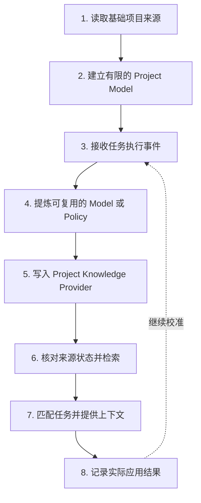

Project Knowledge 使用两类输入建立项目理解：一类是 manifest、配置、目录结构和指定文档等基础项目来源；另一类是 Review、验证、故障复验、Change Archive 和应用结果等任务执行事件。

系统只将有来源、有适用范围并且对后续任务有帮助的内容保存为 Project Knowledge Record。它不接管用户编写的 Rule，也不生成覆盖整个仓库的项目 Wiki。

## 核心组件

| 组件                             | 职责                                               |
| -------------------------------- | -------------------------------------------------- |
| Corpus（项目语料）               | 定义系统可以读取和建立索引的项目来源集合           |
| Project Model Builder            | 从确定性项目结构中生成拓扑、事实和依赖记录         |
| Project Policy Learner           | 从已接受决策、验证结果和故障处理记录中提炼项目策略 |
| Project Knowledge Record         | 保存正文、作用域、来源、验证方式、关系和生命周期   |
| Project Knowledge Provider       | 提供 Local 或 Remote 的统一保存与查询接口          |
| Context Director（上下文调度器） | 根据当前任务执行第二层筛选和上下文预算控制         |
| Context Manifest（上下文清单）   | 提供摘要、应用原因和稳定 ID，支持按需展开完整记录  |

## 整体数据路径



数据链中的三类对象承担不同职责：

- **项目证据**包括当前仓库中的源码、配置、测试、文档和验证结果，是项目事实的直接来源；
- **Project Knowledge Record** 是从证据建立的规范化项目模型或项目策略；
- **SQLite FTS 索引**是可重建的检索读模型，用于提高候选召回效率。

Rule 由用户或团队维护，并由宿主按作用域加载。Project Knowledge 可以在来源配置允许时引用 Rule 的依据，但不会写入、替换或接管 Rule。项目 Wiki 属于面向人的完整项目文档，也不在这条自动学习链中。

## Corpus：项目语料范围

Corpus（项目语料）定义 Local Provider 可以读取、拆分和建立索引的来源。默认来源包括：

- Native 当前 Spec 与 Archive；
- Classic 当前 Spec 与 Archive；
- Comet 支持的工作流产物；
- 可确定识别的项目结构、manifest 和配置；
- 配置中明确加入的 Markdown 路径。

你可以使用 `knowledge.local.include` 扩展语料范围：

```yaml
knowledge:
  provider: local
  local:
    include:
      - docs/**/*.md
      - packages/*/README.md
      - architecture/**/decisions-*.md
```

`include` 使用相对项目根目录的 glob。系统会将文档拆分为带路径和 section（章节）信息的来源单元，供检索和来源状态检查使用。

默认语料范围只包含 Comet 可以明确识别的来源。目标平台支持的 Rule 文件或规则目录由宿主管理；需要将其中的 Markdown 同时作为知识语料时，请通过 `include` 明确加入。

Corpus 规定允许读取的来源范围，不代表 Comet 会把其中全部内容转换为长期知识。Builder 只选择能够形成项目模型、项目策略或后续任务线索的内容。

## 形成逻辑：基础模型与执行沉淀

### Project Model Builder

项目首次使用时，Project Model Builder 从 manifest、配置、目录结构、有限源码关系和自定义 Markdown 中建立基础项目模型。后续 `repository.changed`、`verification.completed` 和 `change.archived` 事件会更新这些记录。

Project Model 只保存可以确定提取的结构信息：

- `topology`：目录、模块和工作区拓扑；
- `fact`：可以从当前项目核对的事实；
- `dependency`：模块、包和组件关系。

确定性提取的 Project Model 可以直接进入 `proven`（已确认）状态，并保留来源供任务使用前复核。它由结构化知识记录组成，不生成目录式或章节式的完整项目 Wiki。

### Project Policy Learner

Project Policy Learner 在任务执行过程中处理已经形成项目意义的工程经验：

| 事件                     | 可以形成的策略                             |
| ------------------------ | ------------------------------------------ |
| Review 结论已接受并处理  | `decision` 或 `constraint`                 |
| 故障已完成根因分析与复验 | `failure-resolution`                       |
| 验证已成功执行           | 将实际命令连接为 verification              |
| Change 已归档            | 最终 decision、pattern、procedure 和废弃项 |
| Context outcome          | 强化、改写或替代 `trial` Policy            |

需要语义归纳且尚未经过复用的候选先进入 `trial`（试用）状态。用户明确提出的项目约定、已有项目指令、确定性项目事实和经过成功复验的执行结果可以进入 `proven`。`trial` 成功帮助后续任务后也可以晋升为 `proven`。

## Record：可追溯知识单元

Project Knowledge Record（项目知识记录）至少包含以下信息：

| 字段                                   | 产品作用                                       |
| -------------------------------------- | ---------------------------------------------- |
| 稳定 ID 与 project ID                  | 绑定当前仓库并支持历史追踪                     |
| type 与 family                         | 区分 Project Model 和 Project Policy           |
| title 与 summary                       | 用于列表和 Context Manifest                    |
| applicable paths / operations / phases | 限定适用路径、操作和阶段                       |
| conclusions                            | 保存可以核对的结构化结论                       |
| relations                              | 描述 contains、depends-on、consumes 等有限关系 |
| sources 与 source versions             | 指向项目相对路径、anchor（位置锚点）和来源版本 |
| verification                           | 连接实际项目命令和预期结果                     |
| authority                              | 区分 automatic、user 和 repository             |
| lifecycle                              | 表示 `trial / proven / enforced / superseded`  |
| application statistics                 | 记录使用次数以及成功、忽略、纠正和失败结果     |

系统使用语义 identity（内容身份）识别同一知识单元。新证据会更新已有 Record 并保留版本关系，减少近义重复。用户明确纠正的正文具有更高权威，自动提炼只能补充证据或形成待确认版本。

## Policy Compiler：策略激活

Policy Compiler（策略编译器）根据内容确定性和使用方式，为 Project Policy 选择以下激活形式：

1. **Context**：decision、pattern、procedure 或 constraint 需要 Agent 结合任务判断，以完整策略或 Context Manifest 提供；
2. **Verification**：constraint 已绑定可运行、可判断成功或失败的项目命令，作为验证策略提供；
3. **Skill candidate**：procedure 跨任务稳定、包含多步且可以组合时，生成带证据的 Skill 候选摘要。

策略编译阶段只生成上下文、验证关联或候选摘要。Skill、linter、compiler、build 和 CI 仍由用户与项目现有流程维护。

只有 Project Policy 可以进入 `enforced`，并且需要绑定当前存在、已经成功执行的确定性验证入口。`enforced` 表示该策略具备可运行的验证关联，不扩大模型权限或系统权限。

## 混合检索

项目任务包含多种检索信号：

- 精确路径、命令、错误码和标识符适合强字符串匹配；
- 中文描述、章节标题和工程语义适合全文检索；
- 模块职责和跨文件影响适合结构过滤与有限关系扩展；
- 当前分支变化和来源失效需要现场核对。

Local Provider 将这些通道组合为一条有界检索链：

```text
project / path / operation / phase / type / state 过滤
  → FTS section 候选
  → 有限 ripgrep 强匹配与变化文件补充
  → 受控关系扩展
  → 来源状态与 application feedback 排序
```

SQLite FTS5 提供 section 级全文索引和排序；有限 ripgrep 保留精确匹配、变化文件补充和故障回退能力。SQLite 索引损坏、锁冲突或 FTS 不可用时，系统可以重建读模型或使用有界源码搜索。

混合检索同时兼顾语义召回和精确工程证据，减少广域探索，并提高完整修改范围的覆盖率。

## 来源有效性检查

记录进入上下文前，系统会核对 project-relative source（项目相对来源）、anchor、digest（内容摘要）或版本：

1. 来源存在且内容一致时，记录继续参与检索；
2. 来源发生变化时，旧记录停止作为当前结论使用；
3. 来源删除、selector 失效或验证命令消失时，记录进入 `superseded`；
4. 新证据形成新版本，并保留与旧版本的替代关系。

来源检查将项目知识绑定到当前仓库状态，降低过时结论进入任务的风险。

## Context Director：任务上下文控制

Provider 查询返回候选集合。Context Director 再执行第二层选择：

- 过滤与当前 project、path、task、operation、phase 不匹配的候选；
- 排除 `superseded`；
- 将 `proven` 和 `enforced` 排在 `trial` 之前；
- 将 repository 和用户明确权威排在自动推断之前；
- 提高具体范围和最近成功应用内容的排序；
- 降低被纠正或参与失败内容的排序。

少量关键 Project Policy 可以完整提供。Project Model、`trial` Policy、长 Procedure 和 evidence 通常进入 Context Manifest。

Manifest 使用稳定 ID，并携带：

- 标题和摘要；
- 知识类型和生命周期；
- 来源类型；
- `whyApplied`；
- application ID。

Agent 通过 `expand` 获取完整正文、来源和 verification。单次字符预算只限制当前任务的常驻内容，不限制 Provider 的记录总量。

## 主工作区与 linked worktree

Local Provider 使用稳定 repository identity（仓库身份）区分项目：

- 主工作区与同一仓库的 linked worktree 共享规范化 Record；
- 文档 section 和全文索引按 workspace 隔离；
- 分支或 worktree 中的文件变化只影响对应 workspace 的来源快照；
- 不同仓库相互隔离。

这种设计允许同一仓库复用稳定项目知识，同时保持检索结果与当前工作区文件一致。

## Local 与 Remote Provider

Project Knowledge 领域通过统一的 `status / query / apply` 契约访问 Provider。

### Local Provider

- 使用用户数据目录中按 repository ID 隔离的 SQLite；
- Record 保存规范化机器状态；
- section 和 FTS 索引可以重建；
- 有限 ripgrep 负责强匹配、变化文件补充和故障回退。

### Remote Provider

- 配置启用 Remote 后，不再同时读取 Local；
- 查询只发送有界的 task、path、phase、operation 和 ID selector；
- apply 只发送规范化 Record 与 evidence；
- 完整仓库、完整 diff、日志、个人记忆和凭据不会进入请求；
- Remote 失败时返回实际状态，不切换到 Local。

```yaml
knowledge:
  provider: remote
  remote:
    endpoint: https://knowledge.example.com/provider
    token_env: COMET_KNOWLEDGE_TOKEN
    scope: team-project
    timeout_ms: 5000
```

## 与 Rule、Hook 和工程检查的执行边界

| 层                         | 进入模型上下文的方式          | 确定性执行能力                          | 典型内容                         |
| -------------------------- | ----------------------------- | --------------------------------------- | -------------------------------- |
| Project Model / Policy     | 按任务完整提供或进入 Manifest | 绑定验证的 Policy 可以标记为 `enforced` | 架构、依赖、决策、流程、故障解法 |
| 平台 Rule 文件或规则目录   | 由宿主按作用域加载            | 依赖 Agent 解释与遵循                   | 团队指令和行为要求               |
| Hook / Guard               | 作为运行时事件或命令执行      | 可以观察、阻断或调整流程                | 权限、安全、工作流边界           |
| linter / test / build / CI | 提供诊断或验证结果            | 使用退出码和项目规则判断结果            | 可自动判断的工程约束             |

你可以继续通过目标平台支持的 Rule 载体编写项目约束，宿主仍负责加载。Codex 的 `AGENTS.md`、Claude Code 的 `CLAUDE.md` 和 Cursor 的 `.cursor/rules` 都只是具体示例。Comet 复用这些 Rule 和项目现有检查；项目知识记录约束存在的依据、适用路径和验证命令，确定性判断仍由对应执行器完成。

## 失败行为

| 失败位置       | 产品行为                                            |
| -------------- | --------------------------------------------------- |
| 查询或检索     | 当前任务继续，不提供失败内容                        |
| 来源不可读     | 停止使用相关记录并报告诊断                          |
| FTS 索引损坏   | 重建读模型或使用有限 ripgrep                        |
| 后台学习       | 保留 Journal，允许稍后重放                          |
| 纠正或废弃     | 返回实际错误并保持原状态                            |
| 插件停用或卸载 | 停止学习、查询、策略验证、SQLite 访问和 Remote 请求 |

## 召回诊断

诊断一次项目知识召回时，按照 `Provider → Record → Query → Context` 的顺序检查：

```bash
comet knowledge status .
comet knowledge list . --state proven
comet knowledge query . --task "修改身份验证模块" --path src/auth --phase build --operation edit
comet knowledge get . --id <记录标识>
```

重点核对以下信息：

1. 来源已经进入默认 Corpus 或 `knowledge.local.include`；
2. Record 的 project、path、operation、phase 和 lifecycle 与任务匹配；
3. 来源版本仍然有效；
4. Query 已返回相关候选；
5. Context Manifest 中的 `whyApplied` 和 application history 符合预期。

返回[项目知识](/zh/plugins/project-rules)，或继续阅读[Agent Learning Loop](/zh/plugins/agent-learning-loop)。
