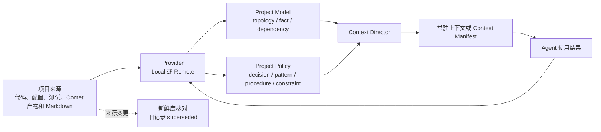

Comet 的项目规则能力由 Project Knowledge 承载。它让 Agent 能够检索项目结构、事实、依赖、决策、模式、流程、约束和失败解决方式。Dashboard 中的入口使用“项目知识”和“项目规则”两个相关名称：前者描述知识内容，后者强调它对当前项目行为的作用范围。

项目规则不是第二套 `AGENTS.md` 或 Rule 文件系统。仓库中的规则、源代码、配置、测试和检查仍然是更高优先级证据。Comet 建立的是可检索模型和 activation，不会静默改写这些文件。

## 两种记录

### Project Model

Project Model 描述项目是什么，包含：

- `topology`：目录、模块和工作区结构；
- `fact`：可以从项目文件核对的事实；
- `dependency`：模块、包和组件之间的关系。

### Project Policy

Project Policy 描述项目以后怎样做，包含：

- `decision`：已经接受的技术或产品决定；
- `pattern`：稳定的实现方式；
- `procedure`：可重复的操作流程；
- `constraint`：必须遵守的项目约束；
- `failure-resolution`：有根因、修复和成功复验的故障解决方式。

两类内容使用相同的生命周期。`enforced` 只用于已经绑定并成功执行确定性验证命令的 Project Policy，不表示 Comet 会替换仓库规则。

## 来源和新鲜度

本地 Provider 会读取 Comet 管理的 Native、Classic 和归档产物、确定性的项目结构，以及配置中额外指定的 Markdown 文件。额外来源使用相对项目根目录的 glob：

```yaml
knowledge:
  provider: local
  local:
    include:
      - docs/**/*.md
      - packages/*/README.md
      - architecture/**/decisions-*.md
```

每次注入前，系统会重新检查来源。文件被修改、删除或 selector 失效时，旧记录会进入 `superseded`，新的证据形成新的记录版本。这样，项目知识不会因为旧文档仍留在索引中就继续影响任务。



## Agent 如何使用

任务开始时，Context Director 按项目身份、任务、路径、操作、阶段、类型和状态筛选候选，再结合全文搜索、关系、来源新鲜度和应用反馈排序。少量关键的 `proven` 或 `enforced` Project Policy 可以完整注入；Project Model、`trial` 策略、长流程和证据默认进入 Context Manifest。

Manifest 中每项包含稳定 ID、标题、摘要、来源类型和真实的 `whyApplied`。Agent 需要完整正文、来源文件或验证方式时，按 ID 展开，不需要重新加载整个项目知识库。

```bash
comet task . --task "修改身份验证模块" --path src/auth --operation edit --phase build --session <id> --json
comet task . --task "修改身份验证模块" --session <同一id> --expand-context <id> --json
```

项目知识的检索结果只提供上下文，不改变当前用户要求、系统约束、宿主 Rule、Skill 或工作流状态。

## 本地与 Remote Provider

Local Provider 使用与项目仓库无关的 SQLite 存储。主工作区和同一仓库的 linked worktree 共享稳定的 repository identity，具体文档 section 和全文搜索索引按 workspace 隔离且可以重建。索引损坏或刷新超时会保留权威记录，并报告诊断。

Remote Provider 适合需要团队范围项目知识的场景。它只接收有界的 task、path、phase、operation、规范化 Record 和 evidence，不发送完整仓库、完整 diff、日志、个人记忆或凭据。Remote 请求失败不会静默回退到 Local。

Provider 配置示例：

```yaml
knowledge:
  provider: remote
  remote:
    endpoint: https://knowledge.example.com/provider
    token_env: COMET_KNOWLEDGE_TOKEN
    scope: team-project
    timeout_ms: 5000
```

## Dashboard 与 CLI

项目规则中心按“项目模型”和“项目策略”展示记录。详情包含生命周期、作用范围、来源、验证方式、`whyApplied`、最近应用结果和完整历史，也可以预览当前任务的 Context Manifest。

```bash
comet knowledge status .
comet knowledge query . --task "修改身份验证模块" --path src/auth --phase build --operation edit
comet knowledge list . --state proven
comet knowledge get . --id <记录标识>
comet knowledge correct . --id <记录标识> --text <新说明>
comet knowledge forget . --id <记录标识>
comet knowledge feedback . --id <记录标识> --outcome used-successfully
comet knowledge rebuild .
```

用户可以在 Dashboard 中手动新增、纠正、废弃、展开来源和刷新。首屏使用缓存快照，后台索引和学习不会阻塞页面。

## 优先级与边界

项目规则的优先级从高到低通常遵循：当前用户要求和系统约束、仓库现有 Rule 与确定性检查、当前项目中更具体且已验证的 Project Policy、一般性的 Project Model 和 `trial` 推断。发生冲突时，Project Policy 不会覆盖高优先级证据。

插件停用或卸载后，不会继续学习、查询、运行策略验证、打开 SQLite 或发送网络请求。查询和后台学习失败时，当前任务继续且不会注入失败内容；纠正或废弃失败时保持原状态。

继续阅读：[个人记忆](/zh/plugins/personal-memory)、[Agent Learning Loop](/zh/plugins/agent-learning-loop) 和 [Dashboard 概览](/zh/dashboard/overview)。
