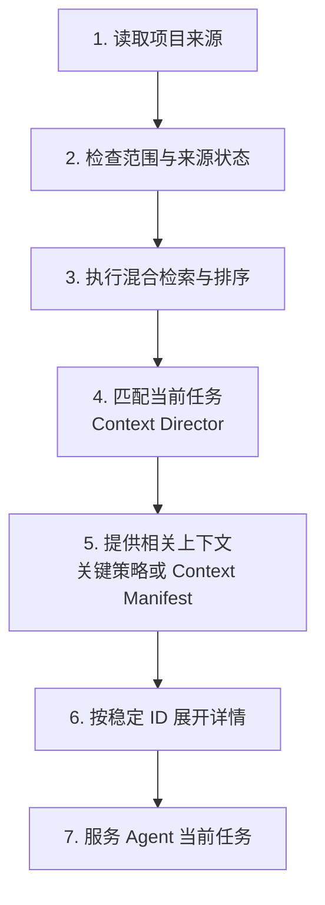

Project Knowledge（项目知识）是 Comet 的第一方项目级插件。它在 Agent 执行任务的过程中发现具有复用价值的项目信息，并将这些信息整理为带来源、适用范围和验证记录的项目知识。

首次使用时，Comet 会从 manifest、配置、目录结构、Comet 产物和你明确加入的 Markdown 中建立有限的基础项目模型。后续任务中的 Review、验证、故障复验、Change Archive 和实际应用结果会继续补充项目策略。Agent 因此能够复用已经确认的项目理解，同时仍以当前源码、配置和测试为直接依据。

## 与 Rule 和项目 Wiki 的边界

### Rule 仍是显式约束入口

项目知识不替代 Rule。你可以继续通过目标平台支持的 Rule 文件或规则目录编写团队指令和行为约束，例如 Codex 的 `AGENTS.md`、Claude Code 的 `CLAUDE.md`、Cursor 的 `.cursor/rules`，以及其他平台提供的 Rule 载体。宿主仍按自己的作用域规则加载这些内容。

Comet 不接管 Rule 的编写和加载，也不会静默改写 Rule。Rule 被配置为知识来源时，项目知识可以引用其中的依据和适用范围；原始 Rule 仍是更高优先级的项目证据。

### 项目知识按任务沉淀，不生成完整 Wiki

项目知识不提供“一键生成项目全部 Wiki”的能力。Comet 不要求扫描并解释仓库中的每个目录、文件和实现细节，也不承诺生成覆盖完整项目的人类文档。

项目知识以 Agent 的后续任务为使用场景，只保存能够帮助定位入口、补全改动范围、理解决策或选择验证方式的记录。缺少可靠来源、只对当前任务有效或可以直接从源码读取的普通细节，不会为了填充知识库而长期保存。

## 核心能力

| 能力         | Comet 提供的上下文                   | 对任务的帮助                       |
| ------------ | ------------------------------------ | ---------------------------------- |
| 项目定位     | 目录、模块、工作区和组件职责         | 缩小源码搜索范围                   |
| 影响范围分析 | 模块依赖、注册关系、配置与生成物关系 | 提前补全实现、测试、配置和文档范围 |
| 设计理解     | 已接受的技术决策、产品决策和实现模式 | 理解当前实现的约束与依据           |
| 流程复用     | 稳定操作步骤和实际验证命令           | 沿用项目已经验证的工作方式         |
| 故障处理     | 根因、修复方案和成功复验记录         | 减少同类问题的重复排查             |

项目知识的核心目标是提高首次定位质量和改动范围完整度。检索速度是实现手段，实际效果取决于 Agent 能否更早找到正确入口、关联文件和验证路径。

## 业界实践与 Comet 的定位

业界通常通过三类能力向 Agent 提供项目上下文：

1. **项目指令**：[Codex](https://openai.com/index/unrolling-the-codex-agent-loop/) 使用 `AGENTS.md`，[Claude Code](https://code.claude.com/docs/en/memory) 使用 `CLAUDE.md` 和 path-scoped rules，[Cursor](https://cursor.com/docs/rules) 使用 Project Rules。它们适合保存团队明确写下的行为要求。
2. **代码索引**：[Sourcegraph Cody](https://sourcegraph.com/docs/cody/core-concepts/local-indexing) 等工具建立代码索引，帮助 Agent 查找符号和相关片段。
3. **Agent 知识层**：[Qoder Knowledge Engine](https://qoder.com/en/blog/qoder-knowledge-engine) 将架构、工程约定和跨文件关系组织为可复用的项目理解。

[OpenAI 的 Harness Engineering 实践](https://openai.com/index/harness-engineering/)建议使用简短的 `AGENTS.md` 指向结构化仓库知识。简短指令便于保持重点，详细知识则可以按任务加载和单独维护。

Comet 将这三类能力进一步分工：

- 仓库 Rule 保存团队明确的 Agent 指令；
- 项目知识保存带来源、适用范围和生命周期的工程理解；
- 全文检索与源码搜索负责召回相关候选；
- Hook、linter、test、build 和 CI 负责实际的规则检查与强制执行。

在这套分层中，Comet 增加了来源有效性检查、渐进式上下文和应用反馈。项目知识可以随仓库变化更新，并根据实际任务效果持续校准。

## 项目知识的记录范围

进入规范化 Project Knowledge Record 的内容需要有来源、可以限定适用范围，并且能够帮助后续任务：

- 目录、模块和工作区拓扑；
- 可以从当前仓库核对的事实；
- 模块、包和组件之间的依赖；
- 已接受的设计与产品决策；
- 稳定实现模式和操作流程；
- 项目约束与故障解决经验。

用户入口统一使用**项目知识**。Project Policy（项目策略）是项目知识内部的一类记录，用于描述项目中的决策、流程和约束。它不是新的 Rule 文件格式。

## 两类项目知识

### Project Model：项目模型

Project Model（项目模型）保存可以从当前项目证据中核对的结构与事实：

| 类型         | 产品含义               | 示例                                         |
| ------------ | ---------------------- | -------------------------------------------- |
| `topology`   | 目录、模块和工作区结构 | CLI 入口位于 `app/`，领域逻辑位于 `domains/` |
| `fact`       | 当前项目事实           | Runtime 生成物由指定构建命令同步             |
| `dependency` | 模块、包和组件关系     | Dashboard 通过 Plugin Host 读取插件状态      |

### Project Policy：项目策略

Project Policy（项目策略）保存沉淀下来的工程做法：

| 类型                 | 产品含义                 | 示例                                 |
| -------------------- | ------------------------ | ------------------------------------ |
| `decision`           | 已接受的技术或产品决定   | Native 与 Classic 保持独立状态机     |
| `pattern`            | 稳定实现模式             | 新平台能力从统一 registry 派生       |
| `procedure`          | 可重复执行的操作流程     | 修改 Runtime 后重新生成并核对资产    |
| `constraint`         | 需要遵守的项目约束       | domain 不直接散落平台路径逻辑        |
| `failure-resolution` | 已完成复验的故障解决方案 | 构建资产过期时先重建再运行浏览器测试 |

Project Policy 只有在关联的验证命令当前存在且已成功执行后，才能进入 `enforced`（已验证约束）状态。该状态表示项目已有工具能够检查这条策略，自然语言正文仍作为上下文提供给 Agent。

<p align="center">
  
</p>

## 与 Rule、Hook 和工程检查的关系

| 层                | 核心职责                             | 典型载体                                | 执行方                   |
| ----------------- | ------------------------------------ | --------------------------------------- | ------------------------ |
| 项目知识          | 提供结构、依据、关系、流程和工程经验 | Project Model、Project Policy、来源记录 | Comet 检索并提供给 Agent |
| Rule / Agent 指令 | 规定 Agent 在当前作用域内的行为      | 目标平台支持的 Rule 文件或规则目录      | 宿主加载并提供给 Agent   |
| Hook / Guard      | 在动作发生时观察、阻断或调整流程     | Hook、权限规则、Comet Guard             | 宿主或 Runtime           |
| 确定性检查        | 判断当前实现是否满足项目要求         | compiler、linter、test、build、CI       | 项目现有工具             |

> 项目知识提供理解，Rule 提供指令，Hook 和工程检查负责强制执行。

仓库 Rule、源码、配置、测试和检查始终是更高优先级证据。Comet 读取并关联这些来源，不静默改写它们。

## 项目知识的形成方式

### 建立基础项目模型

Local Provider 使用三类来源建立有限的 Project Model：

- Comet 管理的 Native、Classic 和 Archive 产物；
- 可确定识别的项目结构、manifest 和配置；
- 通过 `knowledge.local.include` 指定的 Markdown 文档。

```yaml
knowledge:
  provider: local
  local:
    include:
      - docs/**/*.md
      - packages/*/README.md
      - architecture/**/decisions-*.md
```

额外路径均相对于项目根目录解析。默认语料范围不会自动包含目标平台的所有 Rule 文件或规则目录。需要将其中的 Markdown 同时作为知识来源时，请通过 `include` 明确加入。

### 从执行结果中沉淀项目策略

Agent 执行任务时，Project Policy Learner 会处理以下已完成事件：

- 已接受并完成处理的 Review 结论；
- 已确认根因、完成修复并成功复验的故障；
- 已成功执行的验证及其实际命令；
- Change Archive 中的最终决策、稳定模式、操作流程和废弃项；
- 项目知识在后续任务中的成功、忽略、纠正或失败结果。

Comet 从这些事件中提取候选记录，并在写入前重新核对来源。需要语义归纳且尚未经过复用的候选先进入 `trial`；来源可直接核对或已成功复验的内容可以直接进入 `proven`。`trial` 成功帮助后续任务后也可以晋升为 `proven`。因此，项目知识随实际工作逐步积累，不依赖一次性生成完整项目说明。

## 来源有效性检查

每条记录保留项目身份、来源路径、适用范围、来源版本和验证信息。内容进入任务前，Comet 会执行以下检查：

- 来源内容一致时，记录继续参与检索；
- 来源变化时，旧结论停止作为当前内容使用；
- 来源删除或 selector（适用条件）失效时，记录进入 `superseded`；
- 验证命令消失时，原有 `enforced` 状态失效；
- 新证据形成新版本，并保留与旧版本的替代关系。

项目知识为 Agent 提供有依据的任务线索。Agent 仍会读取当前代码、配置和测试，确认本次修改的实际情况。

## 任务召回与提供

Context Director（上下文调度器）会按当前 project、path、task、operation、phase、类型和状态过滤候选，再结合全文检索、有限源码搜索、项目关系、来源状态和应用结果进行排序。



少量关键的 `proven`（已确认）或 `enforced` Project Policy 可以完整提供。Project Model、`trial` Policy、较长 Procedure 和 evidence 通常先进入 Context Manifest（上下文清单）。清单只携带摘要、应用原因和稳定 ID，Agent 按需展开完整正文、来源和验证方式。

Agent 使用后的成功、忽略、覆盖、纠正或失败结果会反向影响后续排序和生命周期。

## 管理入口

Dashboard 的**项目知识**页面区分项目模型与项目策略，并展示作用范围、来源、验证方式、状态、`whyApplied`、最近应用结果和完整历史。

CLI 访问同一份状态：

```bash
comet knowledge status .
comet knowledge query . --task "修改身份验证模块" --path src/auth --phase build --operation edit
comet knowledge list . --state proven
comet knowledge get . --id <记录标识>
comet knowledge correct . --id <记录标识> --text <新说明>
comet knowledge forget . --id <记录标识>
comet knowledge feedback . --id <记录标识> --outcome used-successfully
comet knowledge rebuild .
```

你可以手动新增或纠正知识、废弃旧记录、展开来源并刷新索引。后台学习与索引刷新不会阻塞 Dashboard 首屏。

## 产品边界

项目知识服务于 Agent 的项目理解，并遵守以下边界：

- 当前源码、配置、测试和 Runtime 状态始终优先；
- 宿主继续使用原有 Rule 文件和加载机制；
- 个人记忆只有经过用户明确共享、个人信息移除和来源复核后才能形成团队知识；
- linter、compiler、test、build 和 CI 继续由项目现有工具维护；
- 项目知识不授予提交、推送、删除或发布权限；
- 插件停用后停止学习、查询、策略验证和 Remote 请求。

继续阅读[项目知识原理：从项目证据到任务上下文](/zh/plugins/project-knowledge-principles)，了解语料、记录、混合检索和 Provider 的内部协作。

相关内容：[Agent Learning Loop](/zh/plugins/agent-learning-loop)、[个人记忆](/zh/plugins/personal-memory) 和 [Dashboard 概览](/zh/dashboard/overview)。
