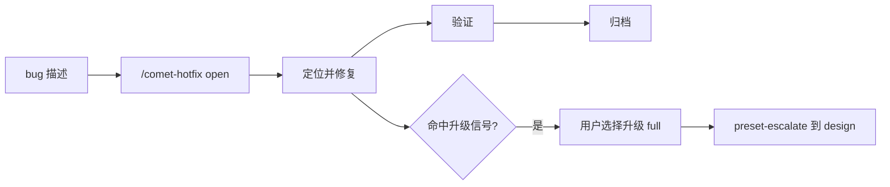

hotfix 适合修复明确 bug。它跳过完整 brainstorming 和完整 plan，但仍保留 OpenSpec 状态、验证和归档。

## 适合使用

- 复现路径明确。
- 修改范围小。
- 不新增 public API。
- 不改变架构或数据模型。
- 能用测试或命令证明修复。

## 不适合使用

- 需要跨模块重新设计。
- 需要数据库 schema 变更。
- 引入新的 capability。
- 需要产品方案讨论。
- 修复过程中发现需求不清晰。

## 流程

<Tip>
  hotfix 不是“无流程”。它只是减少前期设计成本，同时保留恢复、验证和归档。
</Tip>
