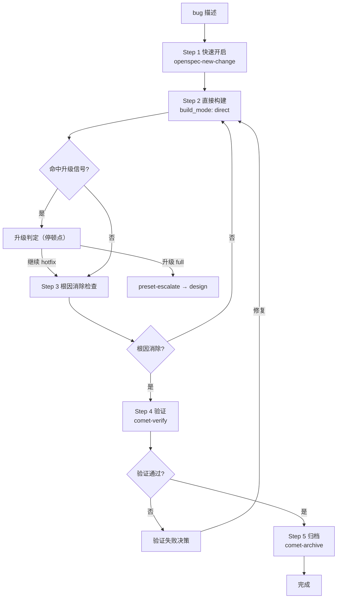

hotfix 是 Comet 的轻量预设之一,适合修复明确的 bug。它跳过完整 brainstorming 和完整 plan,走 `open → build → verify → archive` 四步,但仍保留 OpenSpec 状态、验证和归档。

## 调用的 skill

| Skill | 用途 | 何时调用 |
| --- | --- | --- |
| `openspec-new-change` | 创建精简 change | Step 1 快速开启 |
| `systematic-debugging` | 异常调试 | build 过程中出现崩溃/测试失败/构建失败时强制加载 |
| `comet-verify` | 验证 | Step 4 |
| `comet-archive` | 归档 | Step 5 |

hotfix **不调用** `openspec-explore`（不做长探索）、`brainstorming`（不做深度设计）、`writing-plans`（不做完整 plan,除非任务超过 3 个）。

## 适用条件（必须全部满足）

- 修复已有功能的 bug,不新增 capability
- 不涉及接口变更或架构调整
- 改动范围可预估（文件数仅作提示,不是硬性升级条件）

## 不适合使用

- 需要跨模块重新设计
- 需要数据库 schema 变更
- 引入新的 capability 或 public API
- 需要产品方案讨论
- 修复过程中发现需求不清晰

<Note>
  如果修复过程中命中升级信号（见下文"升级判定"）,Comet 会暂停让你选择继续 hotfix 还是升级 full。
</Note>

## 完整流程

### Step 1：快速开启（preset open）

加载 `openspec-new-change` 创建精简版产物（不做 `openspec-explore` 长探索）：

| 产物 | 内容 |
| --- | --- |
| proposal.md | 问题描述 + 根因分析 + 修复目标（无需方案对比） |
| design.md | 修复方案（1 个即可,无需多方案对比） |
| tasks.md | 修复任务清单 |
| delta spec | **通常不需要**（除非修复改变了已有 spec 的验收场景） |

初始化 hotfix 状态：

```bash
node "$COMET_STATE" init <name> hotfix
node "$COMET_STATE" check <name> open
node "$COMET_GUARD" <change-name> open --apply
```

### Step 2：直接构建（preset build）

使用 hotfix 默认值：`build_mode: direct`、`review_mode: off`。跳过 `brainstorming` 和 `writing-plans`。

逐任务执行：

1. 读取 tasks.md 未完成任务
2. 对每个任务：改代码 → 格式化 → 跑测试 → 勾选 `- [x]` → 提交（`fix: <简述修复>`）
3. 全部完成后显式运行项目测试和构建命令

<Warning>
  执行过程中出现崩溃、测试失败、构建失败时,<strong>强制加载</strong> <code>systematic-debugging</code>。根因调查完成前不得修复源码。详见 <a href="/zh/concepts/decision-points">异常调试协议</a>。
</Warning>

**任务超过 3 个**时转入 `/comet-build` 的计划与执行方式选择（注意这不触发 full 升级,只切换执行方式）。

**修复影响已有 spec 验收场景**时,创建 delta spec（仅 `## MODIFIED Requirements` 部分）。

### Step 3：根因消除检查

build guard 之前执行,确保修复确实消除问题根因：

1. 读 proposal.md 的 bug 描述和根因
2. 搜索验证问题代码不再存在
3. 根因未消除 → 回 Step 2 继续修复（仍在 build 阶段,无需状态回退）

```bash
node "$COMET_GUARD" <change-name> build --apply
```

### Step 4：验证（preset verify）

加载 `comet-verify`,由规模评估决定 light 或 full：

| 场景 | 验证路径 |
| --- | --- |
| 无 delta spec 的小范围 hotfix | 通常 light（6 项检查,review_mode: off 不自动审查） |
| 创建了 delta spec | 按规模评估规则进入 full |

想增加审查可在验证前手动设置：

```bash
node "$COMET_STATE" set <name> review_mode standard
```

### Step 5：归档（preset archive）

加载 `comet-archive`。要求 `verify_result: pass`,并等待归档前最终确认。如有 delta spec,同步到 main spec。

## 流程图



## 升级判定

hotfix 的范围判定采用三层分工,避免"用纯文件数当硬性升级条件"误杀正常 bug 修复：

### 1. 质变信号（命中任一即暂停）

| 质变信号 | 说明 |
| --- | --- |
| 跨模块协调修改 | 需要跨组件、跨层协同改动 |
| 需要新增 capability | 修复引入了新能力 |
| 数据库 schema 变更 | 结构性调整 |
| 引入新的 public API | 修复产生了新的对外接口 |
| 触及深层架构问题 | 根因消除检查发现需架构层面方案 |

### 2. 文件数 tripwire（用户拍板）

改动文件数超提示阈值（如超过 4 个）时暂停交用户决定。文件数是提示触发器,不是硬性升级条件——文件多不等于有质变。

### 3. 验证级别（scale 脚本判定）

`comet-state scale` 只决定 `verify_mode`,不卡流程、不触发升级。

### 升级决策（停顿点）

| 选项 | 结果 |
| --- | --- |
| A：继续 hotfix | 用户确认范围可控,继续 open→build→verify→archive |
| B：升级 full | 用户认为需要深度设计 |

选 B 后用合法升级通道：

```bash
node "$COMET_STATE" transition <name> preset-escalate
```

原子地设 `workflow`/`classic_profile` 为 `full`、`phase` 回退到 `design`、清空 `design_doc`,然后加载 `comet-design` 补 Design Doc,走完整流程。

## 连续执行模式

hotfix 默认**一次性连续执行**——调用 `/comet-hotfix` 后自动推进,不主动停顿。

例外情况（无论 `auto_transition` 取何值都必须暂停）：

1. 命中升级判定信号
2. 任务超过 3 个转入 `/comet-build` 时的工作区和执行方式选择
3. 验证阶段的验证失败决策和分支处理
4. 归档前最终确认

`auto_transition: false` 时降级为逐阶段手动推进。

<Tip>
  hotfix 不是"无流程"。它只是减少前期设计成本,同时保留恢复、验证和归档。
</Tip>

## 和 full workflow 的区别

| 维度 | hotfix | full |
| --- | --- | --- |
| 流程 | open→build→verify→archive | open→design→build→verify→archive |
| brainstorming | 跳过 | 必须做 |
| plan | 跳过（除非任务超过 3 个） | 必须做 |
| build_mode | 默认 direct | 需选择（subagent/executing-plans/direct） |
| review_mode | 默认 off | 需选择（off/standard/thorough） |
| delta spec | 通常不需要 | 按 PRD 拆分 |
| handoff | 不需要 | design 阶段必须生成 |

## 退出条件

- Bug 已修复,测试通过
- change 已归档
- 如有 spec 变更,已同步到 main spec

## 下一步

- [tweak 预设](/zh/presets/tweak) — 另一个轻量预设
- [自动推进机制](/zh/concepts/auto-transition) — preset 的连续执行和升级
- [五阶段停顿点和用户选择点](/zh/concepts/decision-points) — hotfix 的停顿点
- [verify 阶段](/zh/phases/verify) — hotfix 复用的验证流程
