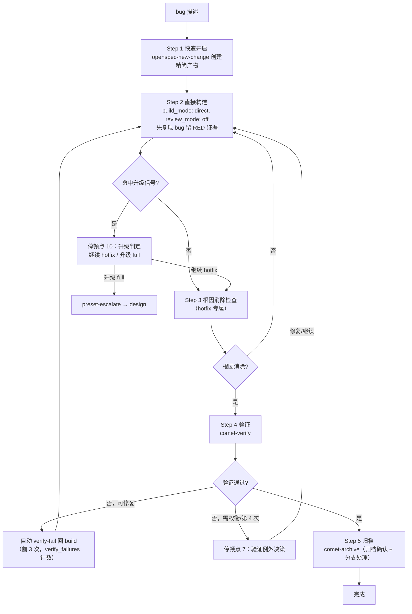

hotfix 是 Comet 的轻量预设之一，适合**修复明确的 bug**。它跳过完整 brainstorming 和完整 plan，走 `open → build → verify → archive` 四步，但仍保留 OpenSpec 状态、**根因消除检查**、验证和归档。

hotfix 不是"无流程"——它只是减少前期设计成本，同时保留恢复、验证和归档。

<p align="center">
  
</p>

<p align="center">hotfix 快在前期设计成本更低，但根因、验证和归档仍然保留</p>

<Tip>
  <strong>正常情况下你只需要 <code>/comet</code>。</strong>当你描述的是<strong>已有异常、回归或错误行为的修复</strong>时，<code>/comet</code> 的<strong>意图识别会优先命中 hotfix 预设</strong>，自动调用 <code>/comet-hotfix</code>。只有想手动控制时才直接输入 <code>/comet-hotfix</code>。详见<a href="#怎么触发">怎么触发</a>。
</Tip>

## 怎么触发

hotfix 通常**不是你手敲的命令**。`/comet` 的 Step 0 会**优先做预设检测**（优先级高于列活跃 change）：

| 你的描述 | 路由 |
| --- | --- |
| 已有异常/回归/错误行为修复 + 满足 hotfix 条件（不新增 capability、不需要完整设计） | 自动 `/comet-hotfix` |
| 可收敛为单一 OpenSpec change 的轻量/中等变更，需通过 OpenSpec apply 执行，不需要完整深度设计/plan | 自动 `/comet-tweak`（见 [tweak 预设](/zh/presets/tweak)） |
| 未命中预设 | 按活跃 change 走 full `/comet` |

你也可以直接输入 `/comet-hotfix`。中断后用 `/comet` 恢复时，`/comet` 会读 `.comet.yaml` 的 `workflow` 字段，在 `phase: build` 时自动路由回 `/comet-hotfix`。

---

## 适合什么场景

**适用条件（必须全部满足）：**

- 修复已有功能的 bug，**不新增 capability**
- 不涉及接口变更或架构调整
- 改动范围可预估（文件数仅作提示，不是硬性升级条件）

**不适合：** 需要跨模块重新设计、数据库 schema 变更、引入新 capability 或 public API、需要产品方案讨论。如果修复过程命中升级信号，Comet 会暂停让你选择继续 hotfix 还是升级 full。

## 和 full、tweak 的关系

| 维度 | hotfix | full | tweak |
| --- | --- | --- | --- |
| 目标 | 修 bug | 新功能/架构/大需求 | 调整行为或内容 |
| 流程 | open→build→verify→archive | open→design→build→verify→archive | open→build→verify→archive |
| brainstorming | 跳过 | 必须做 | 跳过 |
| Design Doc | 不需要 | 必须做 | 不需要 |
| delta spec | **例外**（仅当修复改变已有 spec 验收场景） | 按 PRD 拆分 | **一等产物**（需要 delta spec 不构成升级理由） |
| build 方式 | 手动 tasks 循环（`build_mode: direct`） | 需选择 | OpenSpec apply（`build_mode: direct`） |

如果你不确定用 hotfix 还是 full，先用 hotfix——命中质变信号时 Comet 会暂停让你升级，不会走错。

---

## 你会经历什么



### Step 1：快速开启（预设 open）

加载 `openspec-new-change`（**不做** `openspec-explore` 长探索），创建精简版产物：

| 产物 | 内容 |
| --- | --- |
| proposal.md | 问题描述 + 根因分析 + 修复目标（无需方案对比） |
| design.md | 修复方案（1 个即可，无需多方案对比） |
| tasks.md | 修复任务清单 |
| delta spec | **通常不需要**（除非修复改变了已有 spec 的验收场景，且只用 `## MODIFIED Requirements`） |

初始化 hotfix 状态（`init` 写入的默认值见下表）：

```bash
comet state init <name> hotfix
comet state select <name>
comet state check <name> open
comet guard <change-name> open --apply
```

open guard 对 hotfix **不要求** `design.md`（只对 full 要求），所以 open 完成后直接跳到 build，**跳过 design 阶段**。

### hotfix 初始化的默认值

`init <name> hotfix` 写入 `.comet.yaml` 的默认值（和 tweak 完全一样，都跳过设计阶段）：

| 字段 | hotfix/tweak 默认 | （full 默认） |
| --- | --- | --- |
| `build_mode` | `direct` | `null`（build 时选） |
| `tdd_mode` | `direct` | `null`（build 时选） |
| `review_mode` | `off` | 来自项目配置/env（可能 null） |
| `isolation` | `null`（入口时选） | `null`（build 时选） |
| `verify_mode` | `light` | `null`（verify 时 scale 定） |

hotfix 会在入口暂停一次，让你显式选择当前分支、创建分支或创建 worktree；不会静默默认 `current`。确认后，`isolation` 和 `bound_branch` 会记录实际执行工作区，后续意外切换分支会被阻止。其余 build 字段使用预设值，guard 对预设工作流**豁免** `review_mode`/`tdd_mode` 选择检查。`build_mode: direct` 默认只允许 hotfix/tweak，full 必须显式设 `direct_override: true`。`tdd_mode: direct` 不做 Red-Green-Refactor，但仍要求相关测试和 bug 回归证据。

### Step 2：直接构建（预设 build）

使用默认值 `build_mode: direct`、`tdd_mode: direct`、`review_mode: off`，并沿用入口时已确认的 `isolation`。`direct` 跳过完整 plan/TDD 编排，**绝不跳过复现、回归覆盖和验证**。跳过 `brainstorming` 和 `writing-plans`；**任务数量本身不路由到 `/comet-build`**。

实现前**先复现 bug 并记录失败证据**：

1. 用最小可重复步骤确认报的旧行为，记录命令、输入和实际结果
2. 可自动化时，加一个能为此 bug 失败的回归测试，确认失败由 bug 而非环境或测试本身导致
3. 暂时无法自动化时，把原因加上可重复的手动失败证据记进 proposal/验证报告；没有证据不得改代码

有了 RED 证据后，逐任务执行：

1. 读 tasks.md 未完成任务
2. 每个任务：改代码 → 格式化 → 先重跑新增的失败回归测试确认转绿，再跑相关测试 → 勾选 `- [x]` → 提交（`fix: <简述修复>`）
3. 全部完成后显式运行项目测试和构建命令

<Warning>
  执行中出现崩溃、测试失败、构建失败时，<strong>强制加载</strong> <code>systematic-debugging</code>——根因调查完成前不得修复源码。先加最小失败测试复现，再修源码，跑相关测试和构建确认。这是 build/hotfix/tweak 共享的<a href="/zh/concepts/decision-points">异常调试协议</a>。
</Warning>

**任务超过 3 个**时转入 `/comet-build` 的计划与执行方式选择（注意：这**不触发 full 升级**，只切换执行方式，`workflow` 仍是 `hotfix`）。**修复影响已有 spec 验收场景**时，创建 delta spec（仅 `## MODIFIED Requirements`）。

### Step 3：根因消除检查（hotfix 专属）

**这是 hotfix 独有的步骤**（tweak 没有），在 build guard 之前执行，确保修复确实消除了问题根因：

1. 读 proposal.md 的 bug 描述和根因
2. 搜索验证问题代码不再存在
3. 根因未消除 → 回 Step 2 继续修复（仍在 build 阶段，无需状态回退）

这一步本身也是升级信号来源：根因消除检查发现**深层架构问题**，或修复需要**额外接口变更**，命中质变信号，暂停交你决定。

```bash
comet guard <change-name> build --apply
```

### Step 4：验证（预设 verify）

复用 `/comet-verify`，由规模评估决定 light 或 full：

| 场景 | 验证路径 |
| --- | --- |
| 无 delta spec 的小范围 hotfix | 通常 light（6 项检查，`review_mode: off` 不自动审查） |
| 创建了 delta spec | 按规模评估规则进入 full |

想增加审查可在验证前手动设置：

```bash
comet state set <name> review_mode standard
```

### Step 5：归档（预设 archive）

复用 `/comet-archive`。要求 `verify_result: pass`，并等待**归档前最终确认**。如有 delta spec，同步到 main spec。

---

## 升级判定（三层分工）

hotfix 的范围判定采用三层分工，避免"用纯文件数当硬性升级条件"误杀正常 bug 修复：

### 1. 质变信号（命中任一即暂停）

| 质变信号 | 说明 |
| --- | --- |
| 跨模块协调修改 | 需要跨组件、跨层协同改动 |
| 需要新增 capability | 修复引入了新能力 |
| 数据库 schema 变更 | 结构性调整 |
| 引入新的 public API | 修复产生了新的对外接口 |
| 触及深层架构问题 | 根因消除检查发现需架构层面方案 |

### 2. 文件数 tripwire（用户拍板）

改动文件数超过提示阈值（**如超过 4 个**）时暂停交你决定。文件数是**提示触发器**，不是硬性升级条件——文件多不等于有质变。

### 3. 验证级别（scale 脚本判定）

`comet state scale` 只决定 `verify_mode`，不卡流程、不触发升级。

### 升级决策（停顿点）

命中信号或 tripwire 时，Comet **暂停让你二选一**（不能自行升级或自行判定可继续）：

| 选项 | 结果 |
| --- | --- |
| **A 继续 hotfix** | 你确认范围可控，继续 open→build→verify→archive |
| **B 升级 full** | 你认为需要深度设计 |

选 B 后用合法升级通道（**不能手工编辑 `.comet.yaml`**）：

```bash
comet state transition <name> preset-escalate
```

它**原子地**设 `workflow: full`、`classic_profile: full`、`phase` 回退到 `design`、清空 `design_doc`，并清除预设专属的轻量执行设置，然后加载 `/comet-design` 补 Design Doc。已完成的代码、tasks 和 OpenSpec artifacts 都保留——你只补一个 Design Doc，不是从头来。升级到 full 后会在 Design Doc 之后的联合决策里重新选择完整工作流配置。`preset-escalate` 只能从 `phase: build` 的 hotfix/tweak 触发，其他情况会报错。

## 连续执行和必停点

hotfix 默认**一次性连续执行**——调用后自动推进，不主动停顿。但无论 `auto_transition` 取何值，以下真正的用户决策**必须暂停**等你确认：

1. 命中升级判定信号（停顿点 10）
2. 验证阶段接受 WARNING/SUGGESTION 偏差、spec 漂移处理，或第 4 次失败后的策略选择（停顿点 7）——前 3 次可修复失败自动回 build
3. 归档前最终确认（停顿点 8）和归档提交后的分支处理（停顿点 9）

`auto_transition: false` 时，每个阶段边界结束当前调用并交还控制权（打印 HINT），由你稍后运行下一阶段——这是手动交接，不是新的确认点，不会问"是否继续"。

<Tip>
  升级后绝不会自动归档——无论自动衔接还是手动，<code>/comet-archive</code> 都会先做归档前最终确认。
</Tip>

## 退出条件

- Bug 已修复，测试通过
- change 已归档
- 如有 spec 变更，已同步到 main spec
- 阶段守卫：build→verify 前 `comet guard <name> build --apply`，verify→archive 前 `comet guard <name> verify --apply`（分支处理在 archive 内完成）

## 恢复

hotfix 幂等。中断后用 `/comet` 恢复——它读 `.comet.yaml` 的 `workflow` 字段，在 `phase: build` 时自动路由回 `/comet-hotfix`。`comet state check <name> build --recover` 给出恢复上下文，从 tasks.md 第一个未完成任务继续。

## 下一步

- [tweak 预设](/zh/presets/tweak) — 另一个轻量预设（调整行为或内容）
- [自动推进机制](/zh/concepts/auto-transition) — 预设的连续执行、升级和 `preset-escalate`
- [五阶段停顿点和用户选择点](/zh/concepts/decision-points) — hotfix 的停顿点
- [verify 阶段](/zh/phases/verify) — hotfix 复用的验证流程
