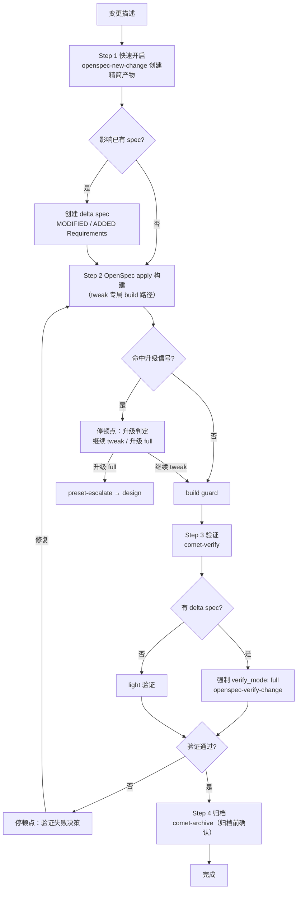

tweak 是 Comet 串联 OpenSpec 的轻量预设。它走 `open → build → verify → archive` 四步，跳过 brainstorming 和完整 plan，但把 **delta spec 当作一等产物**——并通过 OpenSpec 原生的 apply action 构建。

<p align="center">
  
</p>

<p align="center">tweak 不是随手小改；它用 delta spec 和 OpenSpec apply 承接可收敛的中等调整</p>

不少用户反馈 full 流程对配置调整、文档优化、行为微调这类变更太重。tweak 就是为这类场景设计的：保留 OpenSpec 的 spec 生命周期和归档，去掉前期深度设计成本。

<Tip>
  正常情况下你只需要 <code>/comet</code>。 项目配置选择 Classic 后，内部 <code>/comet-classic</code>{' '}
  会识别可收敛为单一 OpenSpec change、无需完整设计的轻中量修改，优先命中 tweak 并自动调用{' '}
  <code>/comet-tweak</code>
  。只有想手动控制时才直接输入预设命令。详见<a href="#怎么触发">怎么触发</a>。
</Tip>

## 怎么触发

tweak 通常**不是你手敲的命令**。用户调用 `/comet` 并进入 Classic 后，内部 `/comet-classic` 会在 Step 0 **优先做预设检测**：

| 你的描述                                                                                          | 路由                                                         |
| ------------------------------------------------------------------------------------------------- | ------------------------------------------------------------ |
| 可收敛为单一 OpenSpec change 的轻量/中等变更，需通过 OpenSpec apply 执行，不需要完整深度设计/plan | 自动 `/comet-tweak`                                          |
| 已有异常/回归/错误行为修复 + 满足 hotfix 条件（不新增 capability、不需要完整设计）                | 自动 `/comet-hotfix`（见 [hotfix 预设](/zh/presets/hotfix)） |
| 未命中预设                                                                                        | 按活跃 change 走 full `/comet-classic`                       |

你也可以直接输入 `/comet-tweak`。正常恢复仍使用 `/comet`；配置进入 Classic 后，内部 `/comet-classic` 会读取 `.comet.yaml` 的 `workflow` 字段，并在 `phase: build` 时路由回 `/comet-tweak`。

---

## 适合什么场景

**适用条件（必须全部满足）：**

- 可收敛为**单一 OpenSpec change**
- 不需要 Superpowers Design Doc 和完整 plan 才能澄清方案
- 不涉及跨模块、跨层级的架构协调
- 任务规模可预估（文件数和任务数仅作提示，不是硬性升级条件）

**典型场景：**

| 场景                             | 为什么用 tweak                                    |
| -------------------------------- | ------------------------------------------------- |
| 配置调整                         | 改配置值/规则，需记录变更动机，但不需架构设计     |
| 文档或 prompt 优化               | 改文案/prompt，需要 spec 驱动的验收，但 full 太重 |
| 行为微调                         | 调整已有行为参数/逻辑，触及多个文件但没有质变     |
| 需 delta spec 的 brownfield 改动 | 修改已有 spec 的验收场景，delta spec 是核心产物   |

<Tip>
  如果你不确定用 tweak 还是 full，先用 tweak。命中质变信号时 Comet 会暂停让你升级，不会走错。
</Tip>

## 和 full、hotfix 的关系

| 维度            | tweak                                                          | full                             | hotfix                    |
| --------------- | -------------------------------------------------------------- | -------------------------------- | ------------------------- |
| 目标            | 调整行为或内容                                                 | 新功能/架构/大需求               | 修 bug                    |
| 流程            | open→build→verify→archive                                      | open→design→build→verify→archive | open→build→verify→archive |
| build 方式      | **OpenSpec apply**（`openspec-apply-change`，tweak 专属）      | writing-plans + 执行方式选择     | 手动 tasks 循环           |
| delta spec      | **一等产物**（`## MODIFIED`/`## ADDED`；需要它不构成升级理由） | 按 PRD 拆分                      | 例外（仅 `## MODIFIED`）  |
| 根因消除检查    | 无                                                             | 无                               | **有**（hotfix 专属）     |
| commit 前缀     | `tweak:`                                                       | 按 commit 规范                   | `fix:`                    |
| 文件数 tripwire | 超过 6 个                                                      | —                                | 超过 4 个                 |

<Note>
  <strong>关键区别是 delta spec 的地位</strong>：hotfix 把 delta spec 当例外，tweak 把它当正常产物——
  <strong>需要 delta spec 本身不构成升级理由</strong>。如果你的变更天然需要修改 spec，tweak
  是正确选择。另一个关键区别是 build 方式：tweak 用 OpenSpec 原生 apply 路径（只属于 tweak，full
  不得套用）。
</Note>

---

## 你会经历什么



### Step 1：快速开启（预设 open）

加载 `openspec-new-change`（**不做** `openspec-explore` 长探索），创建精简版产物：

| 产物        | 内容                                                                                                                                                        |
| ----------- | ----------------------------------------------------------------------------------------------------------------------------------------------------------- |
| proposal.md | 变更动机 + 目标 + 范围                                                                                                                                      |
| design.md   | 简短实现说明（无需方案对比）                                                                                                                                |
| tasks.md    | 任务清单                                                                                                                                                    |
| delta spec  | **可选但常见**——若变更影响已有 spec 验收场景，作为正常产物创建（`## MODIFIED Requirements` 或 `## ADDED Requirements`）。需要 delta spec 本身不构成升级理由 |

初始化 tweak 状态：

```bash
node "$COMET_STATE" init <name> tweak
node "$COMET_STATE" check <name> open
node "$COMET_GUARD" <change-name> open --apply
```

open guard 对 tweak **不要求** `design.md`（只对 full 要求），所以 open 完成后直接跳到 build，**跳过 design 阶段**。`init` 写入和 hotfix 相同的轻量执行默认值（`build_mode: direct`、`tdd_mode: direct`、`review_mode: off`、`verify_mode: light`），但 `isolation` 保持 `null`，入口会让你显式选择当前分支、创建分支或创建 worktree。确认后记录 `isolation` 和 `bound_branch`，后续意外切换分支会被阻止。详见 [hotfix 预设 · 初始化的默认值](/zh/presets/hotfix#hotfix-初始化的默认值)。

### Step 2：OpenSpec apply 构建（tweak 专属 build）

**这是 tweak 和 hotfix 最大的区别。** tweak 不用手动跑 tasks 循环，而是用 OpenSpec 原生的 `openspec-apply-change` 执行任务：

使用默认值 `build_mode: direct`，跳过 Superpowers `brainstorming` 和 `writing-plans`。apply 流程：

1. 运行 `openspec status --change "<name>" --json`，确认 schema 和任务 artifact
2. 运行 `openspec instructions apply --change "<name>" --json`，读取 apply 指令、`contextFiles`、任务进度和动态 instruction
3. **读取 apply 指令列出的所有 context files**（不得只凭旧对话或手写 tasks 循环实现）
4. 按 apply 指令逐个完成未勾选任务，保持改动最小且聚焦
5. 每完成一个任务后：格式化 → 跑相关测试 → 按 `openspec-apply-change` 规则勾选 → 提交（`tweak: <简述变更>`）
6. 全部任务完成后，显式运行项目相关测试和构建命令
7. 运行 build guard 完成 build→verify 过渡

<Warning>
  这条 apply 路径<strong>只属于 tweak</strong>。完整 <code>/comet-classic</code> 或{' '}
  <code>workflow: full</code> <strong>不得套用</strong> tweak 的 <code>openspec-apply-change</code>{' '}
  构建路径——full 仍必须先通过 <code>/comet-design</code> 生成 Design Doc，再由{' '}
  <code>/comet-build</code> 走 Superpowers 计划和执行。
</Warning>

执行中出现崩溃、测试失败、构建失败时，强制加载 `systematic-debugging`（共享的异常调试协议）。build 全程持续判断升级信号，并在 build→verify guard 前做集中复核。

### Step 3：验证（预设 verify，按 delta spec 分流）

复用 `/comet-verify`，**验证路径取决于是否有 delta spec**：

| 场景          | 验证路径                                                                                 |
| ------------- | ---------------------------------------------------------------------------------------- |
| 有 delta spec | **强制 full**（`verify_mode: full`），走 `openspec-verify-change` 覆盖 delta spec 一致性 |
| 无 delta spec | 通常 light（6 项检查）                                                                   |

有 delta spec 时显式设置：

```bash
node "$COMET_STATE" set <change-name> verify_mode full
```

想增加审查可在验证前手动设置：

```bash
node "$COMET_STATE" set <name> review_mode standard
```

### Step 4：归档（预设 archive）

复用 `/comet-archive`。要求 `verify_result: pass`，等待**归档前最终确认**。如有 delta spec，按 `ADDED/MODIFIED/REMOVED/RENAMED` 语义同步到 main spec。

---

## 升级判定（三层分工）

和 hotfix 一样的三层分工，但**文件数 tripwire 阈值更高**（超过 6 个文件，因为 tweak 本身可能触及更多文件）：

### 1. 质变信号（命中任一即暂停）

| 质变信号                        | 说明                                           |
| ------------------------------- | ---------------------------------------------- |
| 跨模块协调修改                  | 需要跨组件、跨层协同改动                       |
| 需要拆分为多个 OpenSpec changes | 单一 change 已无法承载，需拆多个能力或交付单元 |
| 数据库 schema 变更              | 结构性调整                                     |
| 引入新的 public API             | 产生新的对外接口                               |
| 触及深层架构问题                | 需要架构层面方案，非局部改动                   |

<Note>
  注意 tweak 的第二个信号是「需要拆分为多个 OpenSpec changes」，而 hotfix 是「需要新增
  capability」——这反映了两者适用条件的差异（tweak 要求单一 change）。
</Note>

### 2. 文件数 tripwire（用户拍板）

改动文件数超过 **6 个**时暂停交你决定。文件数是**提示触发器**，不是硬性升级条件——文件多不等于有质变。

### 3. 验证级别（scale 脚本判定）

`comet-state scale` 只决定 `verify_mode`，不卡流程、不触发升级。

### 升级决策（停顿点）

命中信号或 tripwire 时，Comet **暂停让你二选一**（不能自行升级或自行判定可继续）：

| 选项             | 结果                                           |
| ---------------- | ---------------------------------------------- |
| **A 继续 tweak** | 你确认范围可控，继续 open→build→verify→archive |
| **B 升级 full**  | 你认为需要深度设计                             |

选 B 后用合法升级通道（**不能手工编辑 `.comet.yaml`**）：

```bash
node "$COMET_STATE" transition <name> preset-escalate
```

它**原子地**设 `workflow: full`、`classic_profile: full`、`phase` 回退到 `design`、清空 `design_doc`，然后加载 `/comet-design` 补 Design Doc。已完成的代码、tasks 和 OpenSpec artifacts 都保留——你只补一个 Design Doc。`preset-escalate` 只能从 `phase: build` 的 hotfix/tweak 触发。

## 连续执行和必停点

tweak 默认**一次性连续执行**——调用后自动推进，不主动停顿。但无论 `auto_transition` 取何值，以下情况**必须暂停**等你确认：

1. 命中升级判定信号
2. 验证阶段的验证失败决策，以及 Archive 阶段的归档与交付确认
3. 归档前最终确认

（tweak 没有 hotfix 那个"任务超过 3 个转入 /comet-build"的停顿点——因为它始终用 OpenSpec apply，不切换执行方式。）

`auto_transition: false` 时降级为逐阶段手动推进。

## 退出条件

- 变更已完成，测试通过
- change 已归档
- 如有 spec 变更，已同步到 main spec
- 阶段守卫：build→verify 前 `comet-guard <name> build --apply`，verify→archive 前 `comet-guard <name> verify --apply`

## 恢复

tweak 幂等。中断后用 `/comet` 恢复；配置进入 Classic 后，内部 `/comet-classic` 读取 `.comet.yaml` 的 `workflow` 字段，并在 `phase: build` 时路由回 `/comet-tweak`。`comet-state check <name> build --recover` 给出恢复上下文，从 tasks.md 第一个未勾选任务继续。

## 下一步

- [hotfix 预设](/zh/presets/hotfix) — 另一个轻量预设（修 bug）
- [自动推进机制](/zh/concepts/auto-transition) — 预设的连续执行、升级和 `preset-escalate`
- [五阶段停顿点和用户选择点](/zh/concepts/decision-points) — tweak 的停顿点
- [verify 阶段](/zh/phases/verify) — tweak 复用的验证流程
